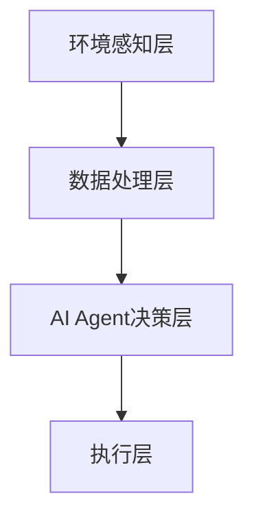

                 


# AI Agent在智能环境保护中的实践

> 关键词：AI Agent，智能环境保护，机器学习，深度学习，环境监测，污染治理

> 摘要：AI Agent作为一种智能体，在环境保护领域发挥着越来越重要的作用。通过机器学习、深度学习、自然语言处理和强化学习等技术，AI Agent能够实现环境监测、污染治理、资源优化配置等任务，从而提升环境保护的智能化水平。本文将从AI Agent的核心概念、技术基础、系统架构设计、项目实战等方面，详细探讨AI Agent在智能环境保护中的实践与应用。

---

# 第一部分: AI Agent与智能环境保护的背景与概念

## 第1章: AI Agent与智能环境保护的背景

### 1.1 AI Agent的基本概念

AI Agent（人工智能代理）是一种能够感知环境、做出决策并执行操作的智能实体。它可以是一个软件程序、一个机器人，或者是嵌入在系统中的算法模块。AI Agent的核心特征包括：

1. **自主性**：能够在没有外部干预的情况下自主运行。
2. **反应性**：能够实时感知环境变化并做出反应。
3. **目标导向**：基于预设的目标或任务进行决策和行动。
4. **学习能力**：通过数据和经验不断优化自身的性能。

AI Agent与传统自动化系统的主要区别在于其智能化和自主决策能力。传统自动化系统通常基于固定的规则和程序运行，而AI Agent能够根据环境反馈动态调整行为。

### 1.2 智能环境保护的核心概念

环境保护是一个复杂的系统工程，涉及环境监测、污染治理、资源管理等多个方面。随着技术的发展，环境保护的智能化需求日益增长。AI Agent在环境保护中的应用，主要体现在以下几个方面：

1. **环境监测**：通过传感器网络实时采集环境数据，如空气质量、水质、噪声等，并通过AI Agent进行分析和预警。
2. **污染治理**：AI Agent可以根据环境数据动态调整污染治理设备的运行参数，优化治理效果。
3. **资源优化**：通过智能调度和优化算法，实现能源、水资源等资源的高效利用。

智能环境保护的核心目标是通过AI Agent实现环境的动态监测、智能决策和自主优化，从而提高环境保护的效率和效果。

### 1.3 本章小结

本章介绍了AI Agent的基本概念及其在智能环境保护中的重要性。通过对比传统自动化系统，突出了AI Agent的智能化和自主性特点。同时，还阐述了智能环境保护的核心概念和应用场景。

---

# 第二部分: AI Agent的核心概念与技术基础

## 第2章: AI Agent的核心原理与技术基础

### 2.1 AI Agent的核心原理

AI Agent的核心原理可以概括为感知、决策和执行三个主要环节：

1. **感知**：通过传感器或其他数据源获取环境信息。
2. **决策**：基于感知到的信息，结合预设的目标和算法模型，做出决策。
3. **执行**：根据决策结果，通过执行器或控制系统实现具体操作。

AI Agent的决策过程通常依赖于机器学习算法，如Q-learning、深度强化学习等。这些算法能够帮助AI Agent在复杂的环境中找到最优解决方案。

### 2.2 AI Agent的关键技术

AI Agent的核心技术包括：

1. **机器学习与深度学习**：用于环境数据的分析和模式识别。
2. **自然语言处理**：用于处理和理解非结构化环境数据（如文本报告）。
3. **强化学习与博弈论**：用于多智能体协作与优化。

### 2.3 AI Agent的数学模型与算法框架

AI Agent的决策过程通常基于强化学习算法。以Q-learning为例，其数学模型如下：

$$ Q(s, a) = r + \gamma \max_{a'} Q(s', a') $$

其中，$s$表示当前状态，$a$表示当前动作，$r$表示奖励，$\gamma$表示折扣因子，$s'$表示下一个状态。

### 2.4 本章小结

本章详细介绍了AI Agent的核心原理和技术基础，包括感知、决策和执行三个主要环节，以及机器学习、深度学习等关键技术。通过数学公式和算法模型，阐述了AI Agent的决策机制。

---

# 第三部分: AI Agent在环境保护中的系统分析与架构设计

## 第3章: 智能环境保护系统的系统分析与架构设计

### 3.1 系统问题场景介绍

智能环境保护系统需要解决的主要问题包括：

1. **环境数据的实时监测与分析**。
2. **污染治理设备的动态优化**。
3. **资源的高效配置与调度**。

### 3.2 系统功能设计

智能环境保护系统的功能设计主要分为以下几个模块：

1. **环境数据采集与处理模块**：通过传感器采集环境数据，并进行预处理和特征提取。
2. **AI Agent决策模块**：基于环境数据，通过机器学习算法生成决策。
3. **系统执行与反馈模块**：根据决策结果，执行具体操作，并收集反馈数据。

### 3.3 系统架构设计

智能环境保护系统的架构设计如下：



---

# 第四部分: AI Agent在环境保护中的项目实战

## 第4章: 项目实战

### 4.1 环境配置与安装

首先，需要安装必要的开发工具和库，如Python、TensorFlow、Keras等。

### 4.2 核心代码实现

以下是AI Agent的核心代码实现：

```python
import numpy as np
import random

class AI_Agent:
    def __init__(self, state_space, action_space):
        self.state_space = state_space
        self.action_space = action_space
        self.Q = np.zeros((state_space, action_space))
    
    def感知(self, 状态):
        # 感知当前状态
        return 状态
    
    def 决策(self, 状态):
        # 基于Q-learning算法做出决策
        if random.uniform(0, 1) < 0.1:
            动作 = random.randint(0, self.action_space - 1)
        else:
            动作 = np.argmax(self.Q[状态])
        return 动作
    
    def 执行(self, 动作):
        # 根据动作执行操作
        pass
    
    def 反馈(self, 奖励, 状态, 动作):
        # 更新Q值
        self.Q[状态, 动作] = self.Q[状态, 动作] + 0.1 * (奖励 + 0.9 * np.max(self.Q[状态]))
```

### 4.3 案例分析与结果解读

以空气质量监测为例，AI Agent可以通过传感器实时采集空气质量数据，并根据Q-learning算法动态调整净化设备的运行参数，从而实现最优的净化效果。

---

# 第五部分: 总结与展望

## 第5章: 总结与展望

### 5.1 总结

本文详细探讨了AI Agent在智能环境保护中的实践与应用，从核心概念到技术基础，再到系统设计和项目实战，为读者提供了全面的视角。

### 5.2 未来展望

随着AI技术的不断发展，AI Agent在环境保护中的应用将更加广泛和深入。未来的研究方向包括：

1. **多智能体协作优化**：通过强化学习实现多个AI Agent的协作与协调。
2. **边缘计算与实时反馈**：结合边缘计算技术，实现环境数据的实时处理和反馈优化。
3. **可持续性与可扩展性**：研究AI Agent在大规模环境监测网络中的应用。

### 5.3 最佳实践 tips

- 在实际应用中，建议结合具体场景选择合适的AI算法。
- 确保环境数据的实时性和准确性，以提高AI Agent的决策效果。
- 定期更新和优化AI模型，以应对环境变化和新的挑战。

---

# 作者：AI天才研究院/AI Genius Institute & 禅与计算机程序设计艺术 /Zen And The Art of Computer Programming

