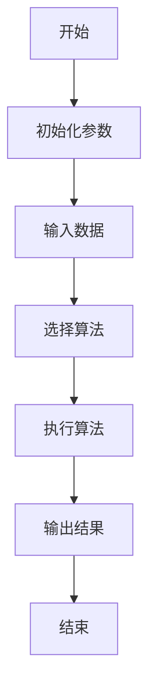
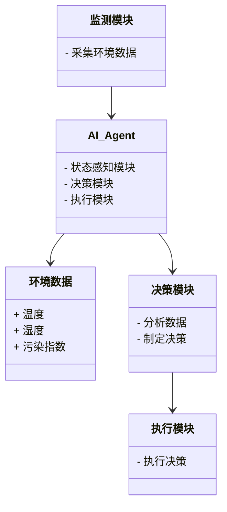
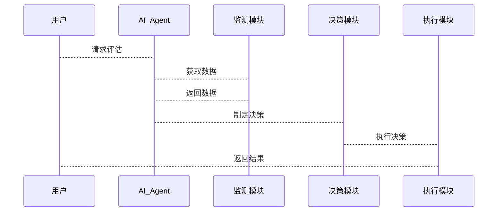

                 


# AI Agent在智能环境影响评估中的实践

> 关键词：AI Agent，智能环境，影响评估，强化学习，系统架构，项目实战

> 摘要：本文探讨AI Agent在智能环境影响评估中的应用，从核心概念、算法原理到系统架构、项目实战，详细阐述其在环境影响评估中的实践价值。通过具体案例分析，展示AI Agent在智能环境中的应用潜力和实际效果。

---

# 第1章 AI Agent与智能环境影响评估引论

## 1.1 AI Agent的基本概念

### 1.1.1 AI Agent的定义

AI Agent（人工智能代理）是指具有感知环境、做出决策并采取行动以实现目标的智能实体。它能够根据环境信息自主学习和优化行为，是实现智能化系统的核心组件。

### 1.1.2 AI Agent的核心特征

1. **自主性**：AI Agent能够在没有外部干预的情况下自主运行。
2. **反应性**：能够实时感知环境变化并做出相应反应。
3. **目标导向性**：通过设定目标来指导行为决策。
4. **学习能力**：能够从经验中学习并优化自身行为。

### 1.1.3 AI Agent与智能环境的关系

AI Agent是智能环境的核心组成部分，负责感知环境信息、分析决策并执行操作，从而实现环境的智能化管理。

## 1.2 智能环境影响评估的背景

### 1.2.1 环境影响评估的传统方法

传统环境影响评估主要依赖人工分析和统计方法，效率低且难以应对复杂场景。

### 1.2.2 智能环境的定义与特点

智能环境是指能够感知、推理和自适应的环境系统，具有实时性、动态性和复杂性等特点。

### 1.2.3 AI Agent在环境影响评估中的作用

AI Agent能够通过实时数据采集、分析和决策，显著提高环境影响评估的效率和准确性。

## 1.3 AI Agent在智能环境影响评估中的应用前景

### 1.3.1 应用场景分析

AI Agent可应用于城市交通管理、工业污染监测、生态保护等领域。

### 1.3.2 技术优势与挑战

技术优势包括高效性、实时性和准确性；挑战则包括数据获取难度、算法复杂性和伦理问题。

### 1.3.3 未来发展趋势

AI Agent在环境影响评估中的应用将更加广泛，技术也将更加成熟。

---

# 第2章 AI Agent的核心原理

## 2.1 AI Agent的感知机制

### 2.1.1 数据采集与处理

AI Agent通过传感器或API接口获取环境数据，并进行清洗和预处理。

### 2.1.2 状态识别与分析

利用机器学习模型对环境状态进行分类和分析，识别关键特征。

### 2.1.3 感知模型的构建

基于深度学习构建感知模型，如卷积神经网络（CNN）用于图像识别。

## 2.2 AI Agent的决策机制

### 2.2.1 决策算法的选择

选择强化学习（RL）或监督学习（SL）算法，根据场景需求决定。

### 2.2.2 决策模型的构建

构建基于Q-learning的决策模型，定义状态、动作和奖励函数。

### 2.2.3 多目标优化策略

采用多目标优化算法，平衡不同目标的权重，实现最优决策。

## 2.3 AI Agent的执行机制

### 2.3.1 行为规划与优化

通过路径规划算法（如A*算法）制定最优行动方案。

### 2.3.2 执行策略的实现

根据决策结果，通过控制接口执行具体操作。

### 2.3.3 执行结果的反馈

将执行结果反馈到系统，用于后续优化和调整。

## 2.4 本章小结

AI Agent的感知、决策和执行机制共同构成了其核心原理，为智能环境影响评估提供了理论基础。

---

# 第3章 AI Agent的核心算法

## 3.1 强化学习算法

### 3.1.1 Q-learning算法

**定义**：通过状态-动作-奖励机制更新Q值表，实现最优决策。

**公式**：
$$ Q(s, a) = Q(s, a) + \alpha (r + \max Q(s', a') - Q(s, a)) $$

### 3.1.2 Deep Q-Networks算法

**原理**：使用深度神经网络近似Q值函数，提升处理复杂环境的能力。

### 3.1.3 策略梯度算法

**方法**：通过优化策略参数，直接最大化期望奖励。

## 3.2 监督学习算法

### 3.2.1 线性回归模型

**用途**：用于简单线性关系的预测，如环境参数的线性回归分析。

### 3.2.2 支持向量机模型

**优势**：在高维空间中实现复杂模式的分类和回归。

### 3.2.3 神经网络模型

**应用**：处理非线性关系，如图像识别和自然语言处理。

## 3.3 联合学习算法

### 3.3.1 联合学习的基本原理

**定义**：多个学习器协作，共享信息，提升整体性能。

### 3.3.2 联合学习的实现步骤

1. 初始化各学习器。
2. 通过通信接口共享信息。
3. 协作完成任务，更新模型。

### 3.3.3 联合学习的优势与挑战

优势包括提升准确性和鲁棒性，挑战则包括通信开销和同步问题。

## 3.4 算法流程图（使用mermaid）



---

# 第4章 系统分析与架构设计

## 4.1 问题场景介绍

智能环境影响评估系统需要实时监测和分析环境数据，优化资源配置。

## 4.2 系统功能设计

### 4.2.1 领域模型（mermaid类图）



### 4.2.2 系统架构设计（mermaid架构图）


## 4.3 系统接口设计

### 4.3.1 接口定义

1. 数据采集接口：`get_environment_data()`
2. 决策接口：`make_decision(data)`
3. 执行接口：`execute_action(action)`

## 4.4 系统交互流程（mermaid序列图）



---

# 第5章 项目实战

## 5.1 环境安装

安装Python、TensorFlow、Scikit-learn等依赖库。

## 5.2 核心实现源代码

```python
import numpy as np
import tensorflow as tf

# 定义AI Agent类
class AIAgent:
    def __init__(self):
        self.model = self.build_model()

    def build_model(self):
        model = tf.keras.Sequential([
            tf.keras.layers.Dense(64, activation='relu'),
            tf.keras.layers.Dense(1, activation='linear')
        ])
        model.compile(optimizer='adam', loss='mse')
        return model

    def train(self, data, labels):
        self.model.fit(data, labels, epochs=100, batch_size=32)

# 使用AI Agent进行环境影响评估
agent = AIAgent()
data = np.random.rand(100, 64)
labels = np.random.rand(100, 1)
agent.train(data, labels)
```

## 5.3 代码实现与应用解读

1. **数据预处理**：清洗和归一化处理环境数据。
2. **模型训练**：使用训练数据优化模型参数。
3. **模型评估**：在测试数据上验证模型性能。

## 5.4 实际案例分析

### 5.4.1 案例一：城市交通管理

通过AI Agent优化交通信号灯控制，减少拥堵和碳排放。

### 5.4.2 案例二：工业污染监测

实时监测工厂排放，预测并防止污染超标。

## 5.5 项目小结

AI Agent在智能环境影响评估中的应用潜力巨大，但需要克服数据获取和算法优化等挑战。

---

# 第6章 最佳实践与注意事项

## 6.1 最佳实践

1. 数据清洗：确保数据质量，避免噪声干扰。
2. 模型选择：根据场景选择合适的算法，如强化学习适合动态环境。
3. 系统优化：优化算法和架构设计，提升性能和效率。

## 6.2 小结

AI Agent在智能环境影响评估中的应用前景广阔，但需要结合具体场景进行优化。

## 6.3 注意事项

1. 数据隐私：确保数据安全和隐私保护。
2. 算法可解释性：提高模型的可解释性，便于调试和优化。
3. 系统稳定性：确保系统在复杂环境下的稳定运行。

## 6.4 拓展阅读

推荐阅读《强化学习导论》和《机器学习实战》等书籍，深入理解AI Agent的技术细节。

---

# 作者

作者：AI天才研究院/AI Genius Institute & 禅与计算机程序设计艺术 /Zen And The Art of Computer Programming

---

以上是文章的详细大纲和内容，您可以根据需要进行调整和补充。

