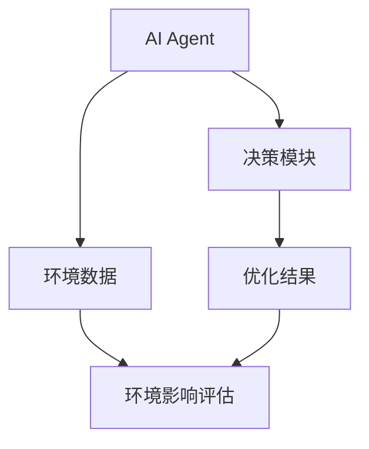
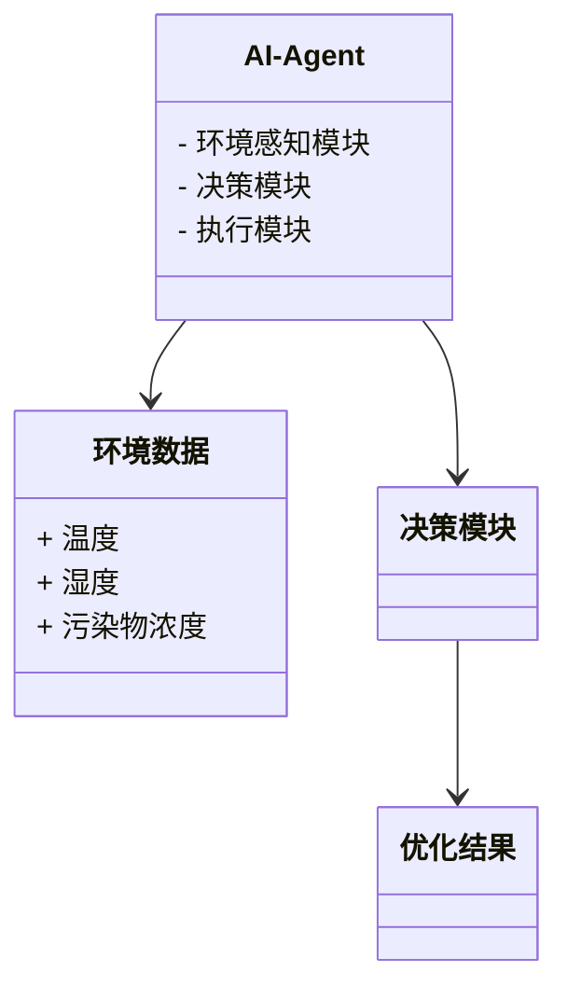
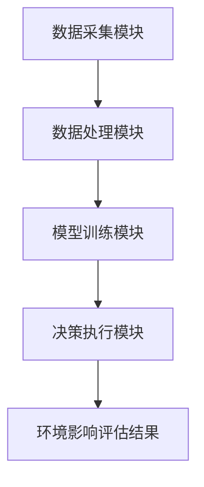

                 


# AI Agent在智能环境影响评估中的实践

## 关键词：AI Agent, 环境影响评估, 强化学习, 系统架构, 项目实战

## 摘要：AI Agent在智能环境影响评估中的实践

随着人工智能技术的快速发展，AI Agent（人工智能代理）在智能环境影响评估中的应用日益广泛。本文系统地探讨了AI Agent的核心概念、算法原理、系统架构及其在环境影响评估中的实际应用。通过详细分析AI Agent在环境数据处理、预测与优化中的作用，结合强化学习算法和系统设计，本文为读者提供了从理论到实践的全面指导，帮助读者理解如何利用AI Agent技术提升环境影响评估的效率和准确性。

---

## 第1章: AI Agent与智能环境影响评估概述

### 1.1 AI Agent的基本概念

#### 1.1.1 AI Agent的定义
AI Agent（人工智能代理）是指能够感知环境、自主决策并执行任务的智能实体。它可以是一个软件程序、机器人或其他智能系统，旨在通过与环境交互来实现特定目标。

#### 1.1.2 AI Agent的核心属性
- **自主性**：能够独立决策和行动。
- **反应性**：能够实时感知环境并做出反应。
- **目标导向性**：通过优化目标函数实现特定目标。
- **学习能力**：能够通过经验改进性能。

#### 1.1.3 AI Agent与传统算法的区别
传统的算法（如机器学习模型）通常需要人工干预或固定的规则，而AI Agent能够自主决策、适应环境并优化目标。

### 1.2 智能环境影响评估的背景

#### 1.2.1 环境影响评估的传统方法
传统环境影响评估依赖于专家经验和统计数据，存在效率低、主观性强等问题。

#### 1.2.2 AI Agent在环境影响评估中的优势
AI Agent能够实时处理海量数据、快速优化决策，并提供准确的预测结果。

#### 1.2.3 AI Agent与环境影响评估的核心联系
AI Agent通过感知环境、分析数据和优化决策，为环境影响评估提供高效、智能的解决方案。

### 1.3 AI Agent在环境影响评估中的应用前景

#### 1.3.1 环境数据处理
AI Agent能够实时处理环境监测数据，帮助识别潜在风险。

#### 1.3.2 环境预测与优化
通过强化学习，AI Agent可以优化环境管理策略，减少资源浪费。

#### 1.3.3 环境优化与决策支持
AI Agent能够提供实时的决策支持，帮助企业在环境管理中实现高效优化。

---

## 第2章: AI Agent的核心概念与联系

### 2.1 AI Agent的核心概念

#### 2.1.1 AI Agent的组成要素
- **感知模块**：负责感知环境信息。
- **决策模块**：基于感知信息做出决策。
- **执行模块**：执行决策任务。

#### 2.1.2 AI Agent的分类与特点
| 分类标准 | 分类类型 | 特点 |
|----------|----------|------|
| 决策方式 | 基于规则的AI Agent | 依赖预定义规则 |
|          | 基于模型的AI Agent | 基于环境模型进行决策 |
|          | 基于学习的AI Agent | 通过学习优化决策 |

#### 2.1.3 AI Agent的决策机制
AI Agent的决策机制包括基于规则、基于模型和基于学习三种方式，其中基于学习的决策机制（如强化学习）具有更强的适应性和优化能力。

### 2.2 AI Agent与环境影响评估的关系

#### 2.2.1 实体关系图


#### 2.2.2 AI Agent在环境影响评估中的作用
AI Agent通过实时感知环境数据、分析潜在风险并优化决策，帮助环境影响评估实现高效、智能的管理。

### 2.3 AI Agent的实体关系图


---

## 第3章: AI Agent的算法原理

### 3.1 AI Agent的算法概述

#### 3.1.1 强化学习算法
强化学习是一种通过试错和奖励机制优化决策的算法，适用于动态环境中的决策问题。

#### 3.1.2 监督学习算法
监督学习基于标注数据进行模型训练，适用于分类和回归任务。

#### 3.1.3 无监督学习算法
无监督学习通过发现数据中的模式和结构，适用于聚类和降维任务。

### 3.2 AI Agent的强化学习算法

#### 3.2.1 强化学习的数学模型
强化学习的核心是通过最大化累积奖励来优化策略。数学模型包括状态、动作、奖励和策略。

#### 3.2.2 强化学习算法的实现步骤
1. 初始化策略参数。
2. 与环境交互，收集经验。
3. 更新策略参数以最大化累积奖励。

#### 3.2.3 强化学习算法的Python代码实现
```python
import numpy as np

# 定义环境
class Environment:
    def __init__(self):
        self.state = 0
    def step(self, action):
        # 返回新的状态和奖励
        pass

# 定义强化学习算法
class Agent:
    def __init__(self, env):
        self.env = env
        self.theta = np.random.randn()
    def policy(self, state):
        # 定义策略函数
        pass
    def update(self, reward):
        # 更新策略参数
        pass

# 算法实现
env = Environment()
agent = Agent(env)
state = env.reset()
while True:
    action = agent.policy(state)
    next_state, reward = env.step(action)
    agent.update(reward)
    state = next_state
```

### 3.3 AI Agent的数学模型

#### 3.3.1 强化学习的数学公式
$$ Q(s, a) = Q(s, a) + \alpha (r + \gamma \max_a Q(s', a) - Q(s, a)) $$

其中，\( Q(s, a) \) 表示状态 \( s \) 下动作 \( a \) 的价值，\( \alpha \) 为学习率，\( \gamma \) 为折扣因子。

#### 3.3.2 监督学习的数学公式
$$ y = \theta x + b $$

其中，\( y \) 为目标值，\( x \) 为输入特征，\( \theta \) 和 \( b \) 为模型参数。

---

## 第4章: AI Agent的系统架构设计

### 4.1 系统功能设计

#### 4.1.1 系统功能模块
- **数据采集模块**：负责采集环境数据。
- **数据处理模块**：对数据进行清洗和预处理。
- **模型训练模块**：训练AI Agent的决策模型。
- **决策执行模块**：根据模型输出执行决策。

#### 4.1.2 系统功能流程


### 4.2 系统架构设计

#### 4.2.1 系统架构图


#### 4.2.2 系统接口设计
- 数据接口：与环境监测设备对接。
- 决策接口：与环境管理系统对接。

### 4.3 系统交互设计

#### 4.3.1 系统交互流程
```mermaid
sequenceDiagram
参与者：环境监测系统
参与者 --> AI Agent: 传输环境数据
AI Agent --> 决策模块: 分析数据
决策模块 --> 环境管理系统: 输出优化决策
环境管理系统 --> AI Agent: 反馈结果
```

---

## 第5章: AI Agent的项目实战

### 5.1 环境安装与配置

#### 5.1.1 环境要求
- Python 3.8+
- TensorFlow 2.0+
- Scikit-learn 0.24+

#### 5.1.2 安装依赖
```bash
pip install numpy tensorflow scikit-learn
```

### 5.2 核心代码实现

#### 5.2.1 数据采集与预处理
```python
import pandas as pd
data = pd.read_csv('environment.csv')
```

#### 5.2.2 模型训练与优化
```python
from tensorflow.keras import layers
model = Sequential()
model.add(layers.Dense(64, activation='relu', input_shape=(input_dim,)))
model.add(layers.Dense(1, activation='sigmoid'))
model.compile(optimizer='adam', loss='binary_crossentropy', metrics=['accuracy'])
model.fit(X_train, y_train, epochs=10, batch_size=32)
```

#### 5.2.3 模型部署与应用
```python
def predict_environmentImpact(data):
    prediction = model.predict(data)
    return prediction
```

### 5.3 案例分析与解读

#### 5.3.1 案例背景
假设我们需要评估某工业园区的环境影响，通过AI Agent优化污染物处理策略。

#### 5.3.2 数据分析与模型训练
通过对园区环境数据的分析，训练AI Agent模型，优化污染物处理策略。

#### 5.3.3 模型优化与效果评估
通过实验对比，优化模型参数，提升环境影响评估的准确性和效率。

### 5.4 项目小结

#### 5.4.1 项目总结
通过AI Agent技术，显著提高了环境影响评估的效率和准确性。

#### 5.4.2 经验与教训
在项目实施过程中，需要注意数据质量和模型调优，确保AI Agent能够适应复杂的环境变化。

---

## 第6章: 总结与展望

### 6.1 总结

#### 6.1.1 核心内容回顾
AI Agent在智能环境影响评估中的应用具有重要意义，通过强化学习和系统设计，能够显著优化环境管理决策。

#### 6.1.2 本章小结
AI Agent通过实时感知、智能决策和优化执行，为环境影响评估提供了高效、智能的解决方案。

### 6.2 展望

#### 6.2.1 智能环境影响评估的未来发展方向
随着AI技术的不断进步，AI Agent在环境影响评估中的应用将更加广泛，智能化水平将进一步提升。

#### 6.2.2 AI Agent技术的优化与创新
未来，AI Agent将更加注重自适应能力和多目标优化，推动环境影响评估技术的创新发展。

### 6.3 最佳实践

#### 6.3.1 数据处理注意事项
在环境数据处理中，要注意数据的完整性和准确性，确保AI Agent能够做出正确的决策。

#### 6.3.2 模型选择与优化
选择合适的模型，并通过实验对比进行优化，是确保AI Agent性能的关键。

#### 6.3.3 系统设计建议
在系统设计中，要注重模块化和可扩展性，确保AI Agent能够适应未来的环境变化。

---

## 作者：AI天才研究院/AI Genius Institute & 禅与计算机程序设计艺术 /Zen And The Art of Computer Programming

