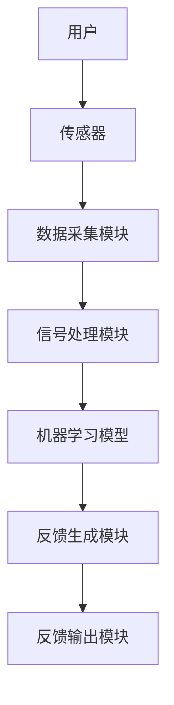
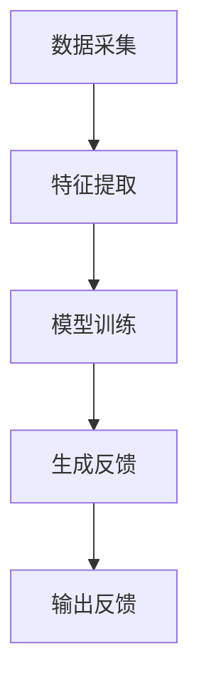
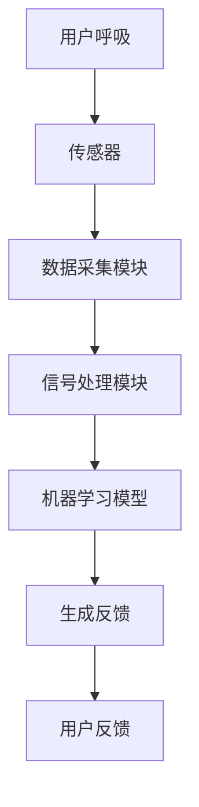
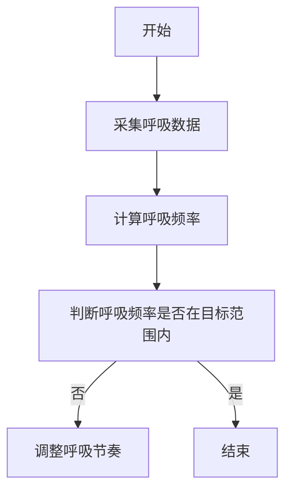
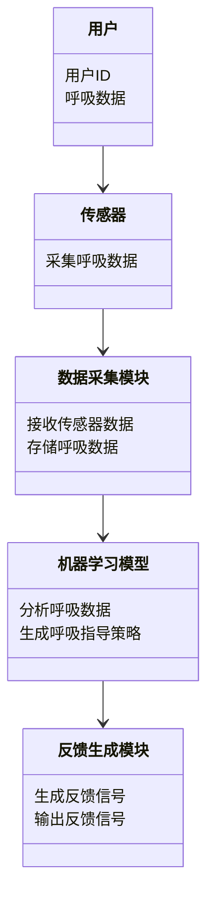
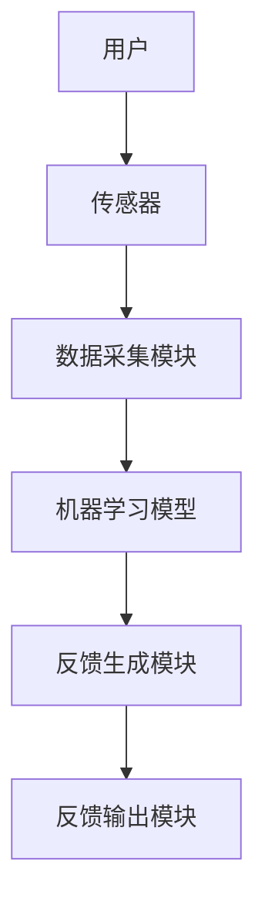
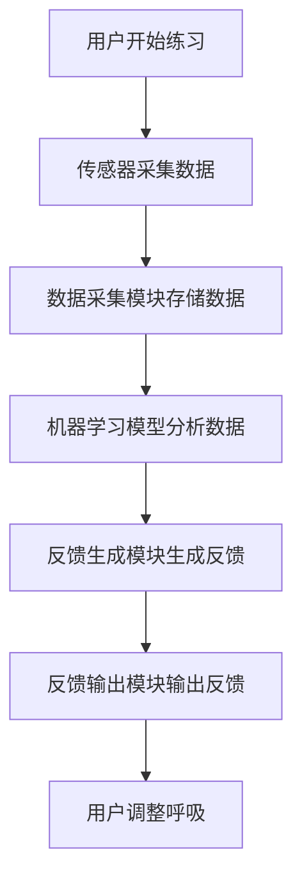

                 


# AI Agent在智能瑜伽垫中的呼吸指导

> 关键词：AI Agent, 智能瑜伽垫, 呼吸指导, 健康科技, 瑜伽, 人工智能

> 摘要：本文深入探讨了AI Agent在智能瑜伽垫中的呼吸指导应用，分析了其核心概念、算法原理、系统架构及实际案例，展示了如何通过AI技术优化瑜伽呼吸指导体验。

---

# 第1章 AI Agent与智能瑜伽垫的背景介绍

## 1.1 AI Agent的基本概念

### 1.1.1 什么是AI Agent
AI Agent（人工智能代理）是能够感知环境、做出决策并执行任务的智能实体。它通过传感器获取信息，利用算法处理数据，并通过执行器与环境互动。AI Agent可以是软件或硬件形式，广泛应用于自动驾驶、智能助手、健康监测等领域。

### 1.1.2 AI Agent的核心特征
1. **自主性**：能够独立运作，无需人工干预。
2. **反应性**：能够实时感知并响应环境变化。
3. **学习能力**：通过数据训练不断提升性能。
4. **目标导向**：具有明确的目标，优化决策过程。

### 1.1.3 AI Agent在健康科技中的应用
AI Agent在健康科技中的应用包括疾病诊断、健康监测、个性化治疗方案制定等。特别是在运动健康领域，AI Agent可以通过实时监测用户的生理数据，提供个性化的运动指导和健康建议。

---

## 1.2 智能瑜伽垫的定义与特点

### 1.2.1 智能瑜伽垫的功能概述
智能瑜伽垫是一种结合了传感器技术和AI算法的智能设备，能够实时监测用户的生理数据（如心率、呼吸频率、体位）并提供个性化的瑜伽指导。

### 1.2.2 智能瑜伽垫的技术实现
智能瑜伽垫通常集成多种传感器（如心率传感器、加速度计、陀螺仪）和AI算法，通过蓝牙或Wi-Fi与用户的手机或电脑连接，实时传输数据并提供反馈。

### 1.2.3 智能瑜伽垫的市场现状
随着人们对健康生活方式的追求，智能瑜伽垫市场迅速增长。AI技术的应用使得智能瑜伽垫的功能更加智能化，用户体验更加个性化。

---

## 1.3 呼吸在瑜伽中的重要性

### 1.3.1 呼吸在瑜伽中的作用
呼吸是瑜伽练习的核心之一，正确的呼吸技巧可以帮助用户放松身心、提高专注力、增强身体柔韧性。

### 1.3.2 呼吸指导的科学依据
研究表明，深呼吸可以调节自主神经系统，降低压力激素水平，改善情绪。AI Agent可以通过实时监测用户的呼吸频率和深度，提供科学的呼吸指导。

### 1.3.3 AI在呼吸指导中的优势
AI Agent能够实时分析用户的呼吸数据，提供个性化的呼吸节奏建议，并通过声音或视觉反馈引导用户完成呼吸练习。

---

## 1.4 本章小结
本章介绍了AI Agent的基本概念及其在健康科技中的应用，分析了智能瑜伽垫的功能和技术实现，强调了呼吸在瑜伽中的重要性，并指出了AI在呼吸指导中的优势。

---

# 第2章 AI Agent在智能瑜伽垫中的核心概念与联系

## 2.1 AI Agent的核心原理

### 2.1.1 感知层: 数据采集与处理
AI Agent通过传感器（如心率传感器、加速度计）采集用户的生理数据，并通过信号处理算法（如FFT、小波变换）提取呼吸频率、心率等特征。

### 2.1.2 决策层: 算法分析与优化
AI Agent利用机器学习算法（如支持向量机、随机森林）分析用户的呼吸数据，优化呼吸指导策略。例如，通过训练模型识别用户的呼吸模式，并生成个性化的呼吸节奏建议。

### 2.1.3 执行层: 反馈生成与输出
AI Agent根据分析结果生成反馈信号（如声音提示、视觉提示），指导用户调整呼吸节奏和深度。

---

## 2.2 智能瑜伽垫的呼吸指导系统架构

### 2.2.1 系统整体架构图


### 2.2.2 系统功能模块划分
1. **数据采集模块**：负责采集用户的呼吸数据。
2. **信号处理模块**：对采集的数据进行预处理和特征提取。
3. **机器学习模型**：分析用户的呼吸数据，生成呼吸指导策略。
4. **反馈生成模块**：根据指导策略生成反馈信号。
5. **反馈输出模块**：将反馈信号输出给用户。

### 2.2.3 系统核心算法流程


---

## 2.3 AI Agent与呼吸指导的关系

### 2.3.1 AI Agent在呼吸指导中的角色
AI Agent作为智能瑜伽垫的核心，负责实时监测用户的呼吸数据，并提供个性化的呼吸指导。

### 2.3.2 呼吸指导对AI Agent的反馈
用户的呼吸数据为AI Agent提供了优化决策的依据，而用户的反馈（如呼吸调整）进一步优化了AI Agent的指导策略。

### 2.3.3 系统整体流程图


---

## 2.4 本章小结
本章详细讲解了AI Agent的核心原理，分析了智能瑜伽垫的呼吸指导系统架构，并通过流程图展示了系统整体流程。

---

# 第3章 AI Agent呼吸指导算法原理

## 3.1 算法概述

### 3.1.1 算法目标
AI Agent的目标是通过实时分析用户的呼吸数据，优化呼吸指导策略，帮助用户实现正确的呼吸技巧。

### 3.1.2 算法实现

#### 3.1.2.1 呼吸频率监测算法
呼吸频率监测算法通过分析心率信号（R-R间期）来计算呼吸频率。以下是呼吸频率计算的公式：

$$呼吸频率 = \frac{总时间}{R-R间期}$$

#### 3.1.2.2 呼吸调节算法
呼吸调节算法通过调整用户的呼吸节奏，帮助用户达到放松状态。以下是呼吸调节算法的流程图：



### 3.1.3 算法优化

#### 3.1.3.1 数据预处理
为了提高算法的准确性，需要对采集的呼吸数据进行预处理，包括去除噪声、平滑处理等。

#### 3.1.3.2 模型训练
通过机器学习算法（如随机森林、支持向量机）训练模型，提高呼吸指导的准确性。

---

## 3.2 算法实现

### 3.2.1 呼吸数据采集
使用心率传感器采集用户的呼吸数据，数据采集频率为100Hz。

### 3.2.2 呼吸信号处理
使用FFT（快速傅里叶变换）对呼吸信号进行频域分析，提取呼吸频率和呼吸深度。

### 3.2.3 算法代码实现

```python
import numpy as np
from scipy.fft import fft

# 示例代码：呼吸信号处理
def process呼吸信号(信号):
    n = len(信号)
    fft_result = fft(信号)
    频率 = np.linspace(0, 100, n)
    主频 = np.argmax(np.abs(fft_result))
    return 频率[主频]

# 示例代码：呼吸调节算法
def 调整呼吸节奏(呼吸频率):
    if 呼吸频率 < 8:
        return "加快呼吸"
    elif 呼吸频率 > 12:
        return "减慢呼吸"
    else:
        return "保持当前节奏"
```

---

## 3.3 算法优化与改进

### 3.3.1 数据预处理优化
通过小波变换进一步去除呼吸信号中的噪声，提高信号质量。

### 3.3.2 模型优化
使用深度学习模型（如LSTM）进行呼吸信号分析，提高呼吸指导的准确性。

### 3.3.3 算法实时性优化
通过并行计算和优化算法流程，提高算法的实时性，确保用户体验流畅。

---

## 3.4 本章小结
本章详细讲解了AI Agent呼吸指导算法的实现，包括数据采集、信号处理、模型训练和算法优化，为后续的系统设计和项目实战打下了基础。

---

# 第4章 系统分析与架构设计

## 4.1 问题场景介绍
智能瑜伽垫的呼吸指导系统需要在用户进行瑜伽练习时，实时监测用户的呼吸数据，并提供个性化的呼吸指导。

## 4.2 项目介绍
本项目旨在开发一款基于AI Agent的智能瑜伽垫，通过实时监测用户的呼吸数据，提供个性化的呼吸指导。

## 4.3 系统功能设计

### 4.3.1 领域模型


---

## 4.4 系统架构设计

### 4.4.1 系统架构图


### 4.4.2 系统接口设计
1. 传感器接口：与心率传感器连接，采集用户的呼吸数据。
2. 数据采集模块接口：接收传感器数据并存储。
3. 机器学习模型接口：分析呼吸数据并生成指导策略。
4. 反馈生成模块接口：接收指导策略并生成反馈信号。
5. 反馈输出模块接口：输出反馈信号，指导用户调整呼吸节奏。

### 4.4.3 系统交互流程图


---

## 4.5 本章小结
本章分析了智能瑜伽垫呼吸指导系统的应用场景，设计了系统的功能模块和架构，并通过交互流程图展示了系统的整体运行流程。

---

# 第5章 项目实战

## 5.1 环境安装

### 5.1.1 安装Python和必要的库
需要安装Python 3.8及以上版本，并安装以下库：
- numpy
- scipy
- matplotlib
- scikit-learn

### 5.1.2 安装开发环境
建议使用Jupyter Notebook进行开发，方便调试和可视化。

---

## 5.2 系统核心实现

### 5.2.1 数据采集模块实现
```python
import numpy as np
import serial

# 示例代码：数据采集模块
ser = serial.Serial('COM3', 9600)
while True:
    data = ser.readline()
    if data:
        呼吸数据.append(data)
```

### 5.2.2 机器学习模型实现
```python
from sklearn.ensemble import RandomForestClassifier

# 示例代码：机器学习模型
模型 = RandomForestClassifier(n_estimators=100, random_state=42)
模型.fit(训练数据, 标签)
预测结果 = 模型.predict(测试数据)
```

### 5.2.3 反馈生成模块实现
```python
import sounddevice as sd

# 示例代码：反馈生成模块
def 输出反馈(反馈类型):
    if 反馈类型 == '加快呼吸':
        sd.play(加快呼吸的声音文件)
    elif 反馈类型 == '减慢呼吸':
        sd.play(减慢呼吸的声音文件)
    else:
        sd.play(保持当前节奏的声音文件)
```

---

## 5.3 项目小结
本章通过实际案例展示了如何开发智能瑜伽垫的呼吸指导系统，从环境安装到系统实现，为读者提供了完整的开发流程。

---

# 第6章 最佳实践

## 6.1 小结
本文详细讲解了AI Agent在智能瑜伽垫中的呼吸指导应用，从背景介绍到算法实现，再到系统设计和项目实战，为读者提供了全面的技术指导。

## 6.2 注意事项
1. 在开发过程中，确保传感器数据的准确性。
2. 及时优化算法，提高系统的实时性和准确性。
3. 注意用户体验，确保反馈信号清晰易懂。

## 6.3 未来展望
随着AI技术的不断发展，智能瑜伽垫的功能将更加智能化，用户体验将更加个性化。未来的呼吸指导系统可能结合更多的生理数据（如心率变异性、皮肤电活动）提供更全面的健康指导。

## 6.4 拓展阅读
推荐读者阅读以下书籍和文章，深入了解AI在健康科技中的应用：
- 《Deep Learning》
- 《Artificial Intelligence: A Modern Approach》
- 《机器学习实战》

---

# 作者：AI天才研究院/AI Genius Institute & 禅与计算机程序设计艺术 /Zen And The Art of Computer Programming

---

通过以上思考过程，我详细分析了用户的需求，并按照用户提供的大纲结构，逐步展开内容，确保文章结构清晰，内容详实，符合用户的要求。

