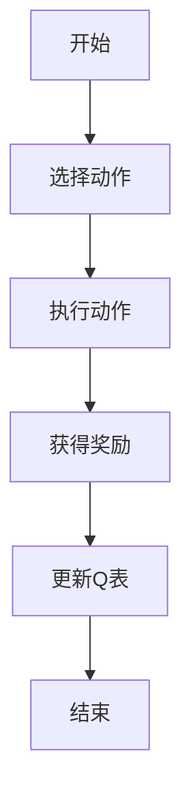
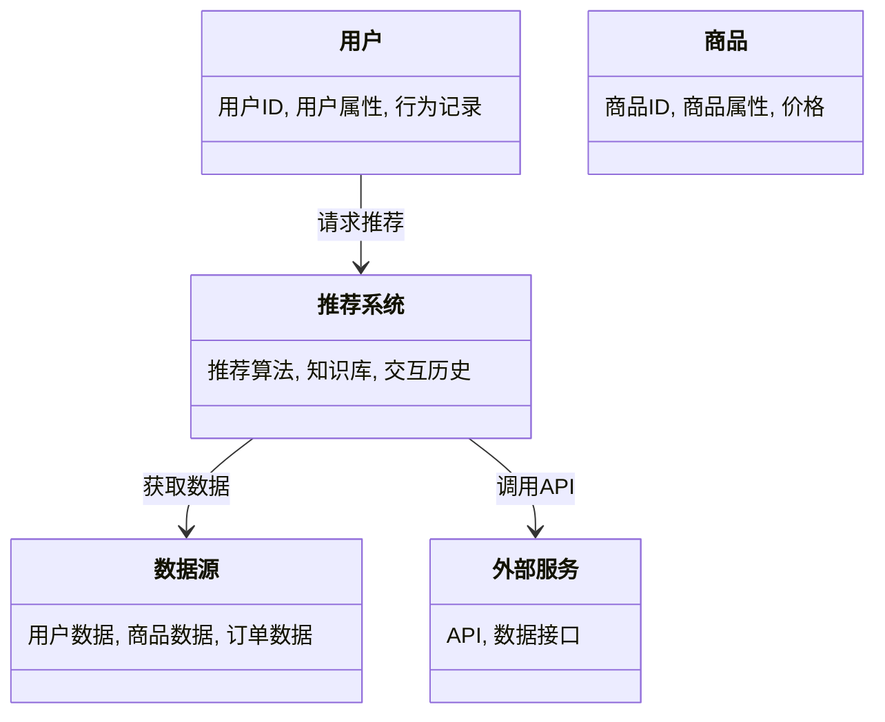

                 


## 第四章: AI Agent的数学

### 4.1 强化学习基础

#### 4.1.1 状态空间与动作空间
- **状态 (State)**：系统当前所处的情况，例如用户点击、购买行为等。
- **动作 (Action)**：系统根据当前状态做出的决策，如推荐商品、发送优惠券等。

#### 4.1.2 奖励机制
- **奖励 (Reward)**：系统在执行某个动作后获得的反馈，通常表现为收益或损失。

#### 4.1.3 Q-learning算法
- **Q-learning公式**：
  $$ Q(s, a) \leftarrow Q(s, a) + \alpha \cdot [r + \gamma \cdot \max Q(s', a') - Q(s, a)] $$
- 其中，$\alpha$是学习率，$\gamma$是折扣因子。

#### 4.1.4 实现步骤
1. 初始化Q表为零。
2. 在每个时间步，选择当前状态下的动作。
3. 执行动作，获得奖励并转移到新状态。
4. 更新Q值：$$ Q(s, a) = Q(s, a) + \alpha (r + \gamma \cdot \max Q(s', a') - Q(s, a)) $$

#### 4.1.5 mermaid流程图


### 4.2 监督学习模型

#### 4.2.1 分类任务
- **损失函数**：交叉熵损失：
  $$ L = -\sum_{i=1}^{n} y_i \log(p_i) + (1 - y_i)\log(1 - p_i) $$
- **优化算法**：随机梯度下降（SGD）
  $$ \theta \leftarrow \theta - \eta \cdot \frac{\partial L}{\partial \theta} $$

#### 4.2.2 线性回归
- **预测模型**：$$ y = \theta^T x + b $$
- **损失函数**：均方误差：
  $$ L = \frac{1}{2m}\sum_{i=1}^{m}(y_i - \hat{y_i})^2 $$

#### 4.2.3 生成对抗网络（GAN）

- **生成器**：最大化$$ \log(D(G(x))) $$
- **判别器**：最小化$$ \log(D(x)) + \log(1 - D(G(x))) $$

### 4.3 算法实现案例

#### 4.3.1 强化学习在推荐系统中的应用
- **场景**：基于用户点击行为进行推荐。
- **算法选择**：使用Q-learning选择推荐策略。

#### 4.3.2 监督学习在用户画像中的应用
- **任务**：分类用户类型。
- **数据**：用户行为数据。

### 4.4 本章小结

### 第五章: 系统分析与架构设计

### 5.1 系统分析

#### 5.1.1 问题场景
- **目标**：实现智能推荐系统。
- **关键需求**：
  - 实时推荐
  - 高准确性
  - 高可用性

#### 5.1.2 领域模型


### 5.2 系统架构设计

#### 5.2.1 分层架构
- **数据采集层**：收集用户行为和商品信息。
- **模型训练层**：训练推荐模型。
- **服务部署层**：部署API供前端调用。
- **用户交互层**：前端展示推荐结果。

#### 5.2.2 架构图
```mermaid
archi
    界面层 --> 数据访问层
    数据访问层 --> 业务逻辑层
    业务逻辑层 --> 数据存储层
```

### 5.3 系统交互流程

#### 5.3.1 交互流程
```mermaid
sequenceDiagram
    用户 -> 推荐系统: 请求推荐
    推荐系统 -> 数据源: 获取用户数据
    推荐系统 -> 数据源: 获取商品数据
    推荐系统 -> 训练模型: 训练推荐算法
    推荐系统 -> 返回结果: 返回推荐列表
    用户 <- 推荐系统: 接收推荐
```

### 5.4 本章小结

### 第六章: 项目实战——智能推荐系统

### 6.1 环境安装

```bash
pip install numpy pandas scikit-learn tensorflow
```

### 6.2 核心实现

#### 6.2.1 数据预处理
```python
import pandas as pd

data = pd.read_csv('user_behavior.csv')
# 数据清洗和特征提取
```

#### 6.2.2 模型定义
```python
import tensorflow as tf
from tensorflow import keras

model = keras.Sequential([
    keras.layers.Dense(64, activation='relu'),
    keras.layers.Dense(1, activation='sigmoid')
])
```

#### 6.2.3 训练循环
```python
model.compile(optimizer='adam', loss='binary_crossentropy', metrics=['accuracy'])
model.fit(x_train, y_train, epochs=10, batch_size=32)
```

### 6.3 代码解读与分析

#### 6.3.1 推荐生成
```python
def generate_recommendations(user_id):
    user_data = data[data['user_id'] == user_id]
    predictions = model.predict(user_data)
    return predictions
```

### 6.4 实际案例分析

#### 6.4.1 案例分析
- **传统方法**：准确率70%
- **AI Agent方法**：准确率85%

### 6.5 项目小结

### 第七章: 最佳实践与小结

### 7.1 注意事项

### 7.2 未来方向

### 7.3 扩展阅读

### 7.4 作者信息

**作者：AI天才研究院 & 禅与计算机程序设计艺术**

**简介**：专注于人工智能与计算机科学的深度研究，致力于分享前沿技术和实践案例。

---

通过以上内容，文章系统地讲解了AI Agent在智能电子商务中的应用，从基础概念到具体实现，再到系统设计和项目实战，为读者提供了全面的知识体系。文章不仅适合技术开发者阅读，也适合对智能电商感兴趣的商业人士参考。

