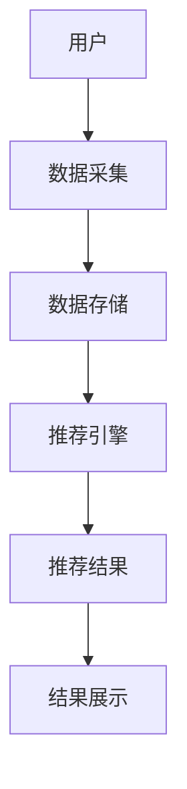

                 


# AI Agent在智能电影推荐中的应用

## 关键词：AI Agent、智能推荐、电影推荐、协同过滤、深度学习、推荐系统

## 摘要：本文深入探讨了AI Agent在智能电影推荐中的应用，从背景介绍到算法原理，再到系统架构和项目实战，全面解析了如何利用AI技术提升电影推荐的准确性和用户体验。文章详细讲解了协同过滤、基于内容的推荐和深度学习模型，并通过系统设计和实际案例展示了AI Agent在电影推荐中的实际应用。

---

## 第一部分: AI Agent与智能推荐系统基础

### 第1章: AI Agent与智能推荐系统概述

#### 1.1 AI Agent的定义与特点

AI Agent（人工智能代理）是指能够感知环境并采取行动以实现目标的智能实体。它具备以下特点：

- **自主性**：能够在没有外部干预的情况下运行。
- **反应性**：能够实时感知环境并做出反应。
- **学习能力**：通过数据和经验不断优化自身的推荐策略。
- **社交能力**：能够与其他系统或用户进行交互。

#### 1.2 推荐系统的定义与分类

推荐系统是一种根据用户的行为和偏好，提供个性化建议的系统。常见的推荐系统分类包括：

- **协同过滤**：基于用户相似性进行推荐。
- **基于内容的推荐**：基于物品本身的属性进行推荐。
- **混合推荐模型**：结合协同过滤和内容推荐的优点。

#### 1.3 电影推荐的背景与现状

随着流媒体服务的普及，用户对个性化推荐的需求日益增加。电影推荐系统通过分析用户的观看历史、偏好和社交行为，帮助用户发现感兴趣的电影。当前的技术趋势包括：

- **深度学习模型**：利用神经网络进行更复杂的推荐。
- **实时推荐**：基于实时数据进行动态推荐。
- **多模态推荐**：结合文本、图像等多种数据源进行推荐。

#### 1.4 AI Agent在电影推荐中的边界与外延

AI Agent在电影推荐中的边界主要限于数据处理和推荐策略的制定，而实际的用户界面和后端服务属于推荐系统的其他部分。其外延包括：

- **用户行为分析**：分析用户的点击、收藏、评分等行为。
- **实时反馈机制**：根据用户的实时反馈调整推荐策略。
- **多平台推荐**：在不同平台（如网站、移动应用）上提供一致的推荐服务。

#### 1.5 核心要素与系统架构

- **核心要素**：
  - 用户：包括用户ID、偏好、观看历史等。
  - 电影：包括电影ID、标题、评分、类型、演员等。
  - 评分：用户对电影的评分或偏好。
  - 推荐：基于算法生成的推荐列表。

- **系统架构**：
  - **数据层**：存储用户和电影数据。
  - **算法层**：实现推荐算法。
  - **应用层**：处理用户请求并返回推荐结果。

---

## 第二部分: 推荐算法原理

### 第2章: 协同过滤算法

#### 2.1 协同过滤的原理

协同过滤通过找到与当前用户相似的其他用户，推荐这些用户喜欢的电影。其数学模型如下：

$$
\text{推荐评分}(u, i) = \frac{\sum_{v \in N(u)} w(u, v) \cdot r(v, i)}{\sum_{v \in N(u)} w(u, v)}
$$

其中，$N(u)$是与用户$u$相似的用户集合，$w(u, v)$是用户$u$和$v$的相似度，$r(v, i)$是用户$v$对电影$i$的评分。

#### 2.2 基于用户的协同过滤实现

```python
def user_based_collaborative_filtering(user_id, ratings, user_similarity):
    # 找到与user_id相似的用户
    similar_users = [u for u in user_similarity[user_id] if user_similarity[user_id][u] > 0.5]
    # 收集推荐的电影
    recommended_movies = {}
    for u in similar_users:
        for movie in ratings[u]:
            if movie not in recommended_movies:
                recommended_movies[movie] = ratings[u][movie]
            else:
                recommended_movies[movie] += ratings[u][movie]
    # 按评分降序排列
    sorted_recommendations = sorted(recommended_movies.items(), key=lambda x: x[1], reverse=True)
    return sorted_recommendations
```

---

### 第3章: 基于内容的推荐算法

#### 3.1 基于内容的推荐原理

基于内容的推荐算法通过分析电影本身的属性（如类型、演员、剧情简介）来生成推荐。常用的技术包括文本挖掘和向量空间模型。

#### 3.2 TF-IDF模型实现

```python
from sklearn.feature_extraction.text import TfidfVectorizer

# 假设movies是包含电影简介的数据框
vectorizer = TfidfVectorizer(stop_words='english')
tfidf_matrix = vectorizer.fit_transform(movies['description'])
```

---

### 第4章: 深度学习模型

#### 4.1 神经网络在推荐系统中的应用

深度学习模型（如神经协同过滤）通过神经网络来学习用户和物品的隐式特征。模型结构如下：

- **输入层**：用户和电影的嵌入向量。
- **隐藏层**：通过神经网络处理嵌入向量。
- **输出层**：预测评分。

#### 4.2 单层神经网络实现

```python
import numpy as np

# 假设X是输入特征，W是权重矩阵，b是偏置
y_pred = np.dot(X, W) + b
```

---

## 第三部分: 系统分析与架构设计

### 第5章: 推荐系统架构设计

#### 5.1 系统功能模块

- **数据采集**：收集用户行为数据。
- **数据处理**：清洗和预处理数据。
- **推荐引擎**：实现多种推荐算法。
- **结果展示**：将推荐结果呈现给用户。

#### 5.2 系统架构图



---

## 第四部分: 项目实战

### 第6章: 电影推荐系统实现

#### 6.1 环境搭建

- **工具安装**：安装Python、Pandas、Scikit-learn等库。
- **数据获取**：从公开数据集获取电影数据和用户评分。

#### 6.2 核心代码实现

```python
import pandas as pd
from sklearn.metrics.pairwise import cosine_similarity

# 加载数据
movies = pd.read_csv('movies.csv')
ratings = pd.read_csv('ratings.csv')

# 计算电影之间的相似性
movie_matrix = ratings.pivot(index='movieId', columns='userId', values='rating')
similarity_matrix = cosine_similarity(movie_matrix.values)
```

---

## 第五部分: 最佳实践与总结

### 第7章: 最佳实践与总结

#### 7.1 最佳实践

- **数据质量**：确保数据的完整性和准确性。
- **模型调优**：通过交叉验证优化推荐算法。
- **实时性**：实现实时推荐以提升用户体验。

#### 7.2 小结

AI Agent在智能电影推荐中的应用不仅提升了推荐的准确性，还优化了用户体验。通过结合多种推荐算法和深度学习技术，推荐系统能够更好地满足用户的需求。

#### 7.3 注意事项

- **隐私保护**：确保用户数据的安全性和隐私性。
- **模型解释性**：提高推荐系统的可解释性，方便用户理解和信任。

#### 7.4 拓展阅读

- 《推荐系统导论》
- 《深度学习在推荐系统中的应用》
- 《实时推荐系统的实现》

---

## 作者：AI天才研究院/AI Genius Institute & 禅与计算机程序设计艺术 /Zen And The Art of Computer Programming

---

**本文由AI天才研究院和禅与计算机程序设计艺术联合撰写，转载请注明出处。**

