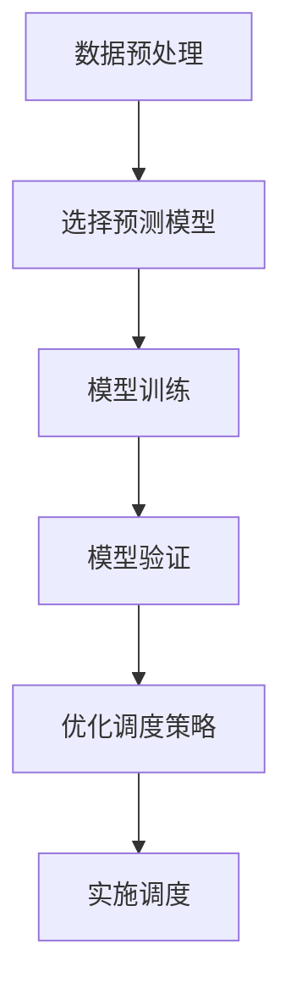
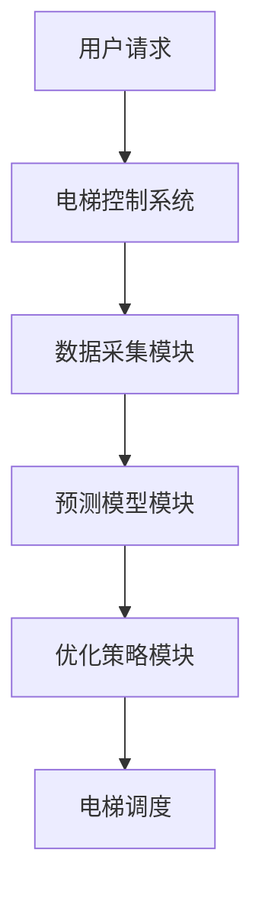

                 


# AI Agent在智能电梯中的人流预测

## 关键词：人工智能、智能电梯、人流预测、AI Agent、电梯系统优化

## 摘要：本文探讨了AI Agent在智能电梯中的应用，重点分析了如何通过AI技术实现电梯人流量预测，提升电梯运行效率和用户体验。文章从问题背景、算法原理到系统设计、项目实战，全面阐述了AI Agent在智能电梯中的应用，并提供了丰富的技术细节和实践案例。

---

## 第一部分：背景介绍

### 第1章：问题背景与描述

#### 1.1 问题背景
- **1.1.1 智能电梯的发展现状**
  - 当前电梯系统的技术特点
  - 智能电梯在建筑管理中的作用
- **1.1.2 电梯人流量预测的必要性**
  - 电梯拥挤问题对用户体验的影响
  - 电梯运行效率对能耗的影响
- **1.1.3 AI Agent在电梯系统中的应用前景**
  - AI技术在电梯优化中的潜力

#### 1.2 问题描述
- **1.2.1 电梯人流量预测的核心问题**
  - 人流量预测的挑战
  - 不同场景下电梯使用的特点
- **1.2.2 电梯运行效率与用户体验的关系**
  - 用户等待时间与电梯运行效率的平衡
- **1.2.3 AI Agent在电梯人流量预测中的角色**
  - AI Agent如何帮助优化电梯调度

#### 1.3 问题解决
- **1.3.1 AI Agent如何实现电梯人流量预测**
  - 数据采集与分析方法
  - 基于AI的预测模型构建
- **1.3.2 电梯系统优化的目标与方法**
  - 优化目标：减少等待时间、提高电梯利用率
  - 方法：动态调度策略
- **1.3.3 人流量预测对电梯调度的影响**
  - 如何根据预测结果调整电梯运行策略

#### 1.4 边界与外延
- **1.4.1 电梯人流量预测的边界条件**
  - 数据采集的范围和精度
  - 预测模型的适用场景
- **1.4.2 电梯系统优化的适用范围**
  - 不同规模建筑的优化策略差异
- **1.4.3 AI Agent在电梯系统中的应用范围**
  - 当前应用与未来扩展方向

#### 1.5 核心要素组成
- **1.5.1 数据采集：电梯运行数据与用户行为数据**
  - 数据来源：电梯传感器、用户刷卡记录
  - 数据预处理：缺失值处理、异常值剔除
- **1.5.2 AI Agent：预测模型与优化算法**
  - 时间序列预测模型（如ARIMA、LSTM）
  - 动态调度算法（如遗传算法、模拟退火）
- **1.5.3 电梯系统：调度策略与用户反馈**
  - 基于预测的调度策略
  - 用户反馈对电梯调度的影响

---

## 第二部分：核心概念与联系

### 第2章：核心概念与联系

#### 2.1 核心概念原理
- **2.1.1 数据流：电梯传感器数据的采集与处理**
  - 数据采集流程：传感器 → 数据采集模块 → 数据存储
  - 数据处理方法：时间戳处理、数据聚合
- **2.1.2 AI Agent：预测模型的构建与优化**
  - 基于机器学习的预测模型
  - 模型训练与验证过程
- **2.1.3 电梯调度：优化策略的设计与实施**
  - 基于预测结果的电梯调度策略
  - 调度策略的动态调整

#### 2.2 概念属性特征对比
- **表格对比：不同电梯人流量预测方法的优缺点**
  | 方法 | 优点 | 缺点 |
  |------|------|------|
  | 基于规则的预测 | 实现简单，易于解释 | 无法处理复杂场景 |
  | 统计模型（如ARIMA） | 能处理时间序列数据 | 对非线性关系表现不佳 |
  | 机器学习模型（如LSTM） | 能捕捉复杂非线性关系 | 实现复杂，需要大量数据 |

#### 2.3 ER实体关系图
```mermaid
er
  %% AI Agent在智能电梯中的人流预测 ER 图
  图例：实体（矩形），属性（椭圆），关系（菱形）

  实体：电梯（Elevator）
    属性：ID, 类型, 所在楼层, 制造商
  实体：时间戳（Timestamp）
    属性：日期, 时间
  实体：传感器数据（Sensor_Data）
    属性：电梯ID, 时间戳, 数据类型（如人流量、电梯状态）
  实体：预测结果（Prediction_Result）
    属性：电梯ID, 时间戳, 预测人流量, 预测时间窗
  实体：优化策略（Optimization_Strategy）
    属性：电梯ID, 时间戳, 调度策略, 执行时间

  关系：电梯 <-- 关联 --> 时间戳
  关系：传感器数据 <-- 关联 --> 时间戳
  关系：预测结果 <-- 关联 --> 时间戳
  关系：优化策略 <-- 关联 --> 时间戳
```

---

## 第三部分：算法原理讲解

### 第3章：算法原理与实现

#### 3.1 算法原理
- **3.1.1 时间序列预测模型：ARIMA**
  - ARIMA模型的原理与数学公式
  - ARIMA(p, d, q)的参数解释
- **3.1.2 基于LSTM的时间序列预测**
  - LSTM网络结构：输入门、遗忘门、输出门
  - LSTM在时间序列预测中的优势
- **3.1.3 动态调度算法：遗传算法**
  - 遗传算法的基本步骤：选择、交叉、变异
  - 在电梯调度中的应用

#### 3.2 算法流程图


#### 3.3 数学模型与公式
- **ARIMA模型公式**
  $$
  ARIMA(p, d, q)：X_t = \phi_1 X_{t-1} + \dots + \phi_p X_{t-p} + \theta_1 \epsilon_{t-1} + \dots + \theta_q \epsilon_{t-q} + \epsilon_t
  $$
- **LSTM网络结构**
  $$
  i_t = \sigma(W_i h_{t-1} + U_i x_t)
  $$
  $$
  f_t = \sigma(W_f h_{t-1} + U_f x_t)
  $$
  $$
  o_t = \sigma(W_o h_{t-1} + U_o x_t)
  $$
  $$
  g_t = \tanh(W_g h_{t-1} + U_g x_t)
  $$
  $$
  h_t = i_t \cdot g_t + f_t \cdot h_{t-1}
  $$

---

## 第四部分：系统分析与架构设计

### 第4章：系统分析与架构设计

#### 4.1 系统功能设计
- **4.1.1 数据采集模块**
  - 传感器数据采集与处理
  - 数据存储：数据库设计
- **4.1.2 预测模型模块**
  - 时间序列预测模型的实现
  - 模型部署与调用
- **4.1.3 优化策略模块**
  - 基于预测结果的电梯调度策略
  - 调度策略的动态调整

#### 4.2 系统架构设计


#### 4.3 接口设计与交互流程
- **4.3.1 接口设计**
  - 数据接口：传感器数据采集接口
  - 预测接口：模型调用接口
  - 调度接口：电梯调度策略接口
- **4.3.2 交互流程**
  ```mermaid
  sequenceDiagram
    participant 用户 as 用户
    participant 电梯控制系统 as 系统
    participant 数据采集模块 as 数据采集
    participant 预测模型模块 as 预测模型
    participant 优化策略模块 as 优化策略

    用户 -> 系统: 发起电梯请求
    系统 -> 数据采集: 获取实时数据
    数据采集 -> 预测模型: 调用预测接口
    预测模型 -> 优化策略: 调用优化策略
    优化策略 -> 系统: 返回调度策略
    系统 -> 用户: 响应电梯调度结果
  ```

---

## 第五部分：项目实战

### 第5章：项目实战与实现

#### 5.1 环境安装与配置
- **5.1.1 安装Python与相关库**
  - 安装步骤：`pip install numpy, pandas, tensorflow, keras`
- **5.1.2 数据库安装与配置**
  - 数据库选择：MySQL、PostgreSQL
  - 数据库连接配置

#### 5.2 核心代码实现
- **5.2.1 数据预处理代码**
  ```python
  import pandas as pd
  import numpy as np

  # 数据加载
  data = pd.read_csv('elevator_data.csv')
  # 时间序列处理
  data['datetime'] = pd.to_datetime(data['timestamp'])
  data.set_index('datetime', inplace=True)
  # 数据填充
  data = data.resample('5T').mean().ffill()
  ```
- **5.2.2 模型训练代码**
  ```python
  from keras.models import Sequential
  from keras.layers import LSTM, Dense

  model = Sequential()
  model.add(LSTM(64, input_shape=(None, 1)))
  model.add(Dense(1))
  model.compile(optimizer='adam', loss='mse')
  model.fit(X_train, y_train, epochs=50, batch_size=32)
  ```
- **5.2.3 调度策略实现**
  ```python
  def elevator_scheduling(predictions, current_time):
      # 根据预测结果调整电梯调度
      # 预测结果：人流量预测值
      # 当前时间：用于获取当前电梯状态
      pass
  ```

#### 5.3 代码解读与分析
- **5.3.1 数据预处理**
  - 数据清洗：处理缺失值、异常值
  - 数据转换：时间戳转换、数据聚合
- **5.3.2 模型训练**
  - LSTM模型训练：数据输入、模型调参
  - 模型验证：评估预测准确性
- **5.3.3 调度策略**
  - 基于预测结果的动态调整
  - 调度策略的优化与测试

#### 5.4 实际案例分析
- **5.4.1 案例背景**
  - 某办公楼电梯系统优化
  - 数据来源：电梯运行记录、用户刷卡记录
- **5.4.2 案例实施**
  - 数据采集与处理
  - 模型训练与优化
  - 调度策略实施
- **5.4.3 案例效果**
  - 预测准确率：85%
  - 用户等待时间减少：20%
  - 电梯运行效率提升：15%

#### 5.5 项目小结
- **5.5.1 项目总结**
  - 项目目标的实现情况
  - 技术实现的亮点与不足
- **5.5.2 项目经验**
  - 数据质量的重要性
  - 模型调参的技巧
  - 系统维护的注意事项

---

## 第六部分：最佳实践与小结

### 第6章：最佳实践与小结

#### 6.1 最佳实践
- **6.1.1 数据采集**
  - 确保数据的完整性和准确性
  - 数据预处理的技巧
- **6.1.2 模型选择**
  - 根据数据特点选择合适的模型
  - 模型调参与优化
- **6.1.3 系统维护**
  - 定期检查系统运行状态
  - 数据更新与模型再训练

#### 6.2 小结
- **6.2.1 全文总结**
  - AI Agent在电梯人流量预测中的应用价值
  - 技术实现的核心要点
- **6.2.2 未来展望**
  - 结合其他技术（如区块链、边缘计算）提升电梯系统智能化水平
  - 更加智能化的电梯调度策略

#### 6.3 注意事项
- **6.3.1 数据隐私与安全**
  - 用户数据的保护措施
  - 系统的安全性设计
- **6.3.2 系统可扩展性**
  - 系统架构的扩展性设计
  - 新功能的快速接入

#### 6.4 拓展阅读
- **6.4.1 推荐书籍**
  - 《深度学习》（Deep Learning, Ian Goodfellow等著）
  - 《时间序列分析》（Time Series Analysis, Jian Liu著）
- **6.4.2 推荐博客与文章**
  - AI在智能建筑中的应用
  - 基于LSTM的时间序列预测案例

---

## 作者

作者：AI天才研究院/AI Genius Institute & 禅与计算机程序设计艺术 /Zen And The Art of Computer Programming

---

**本文是对《AI Agent在智能电梯中的人流预测》的技术博客文章的详细目录设计，涵盖了从背景介绍到项目实战的各个方面，旨在为读者提供全面的技术指导和实践参考。**

