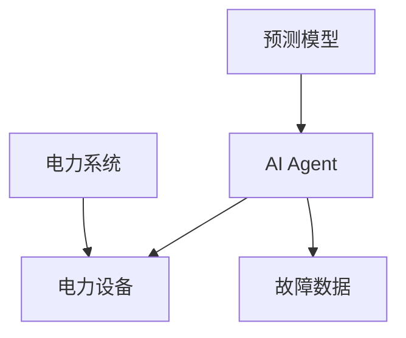
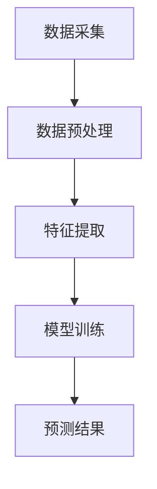
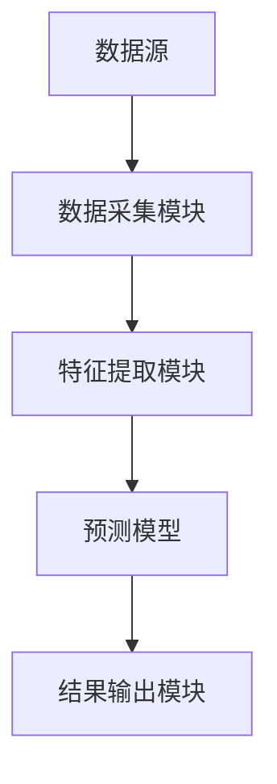
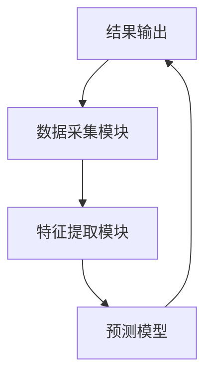

                 


# AI Agent在智能电网故障预测中的角色

> 关键词：智能电网，AI Agent，故障预测，电力系统，人工智能

> 摘要：本文深入探讨了AI Agent在智能电网故障预测中的作用，从基本概念到算法原理，再到实际应用，全面分析了AI Agent如何提升智能电网的故障预测能力。通过案例分析和代码实现，展示了AI Agent在智能电网中的重要性。

---

# 第一部分: 智能电网与AI Agent的基本概念

## 第1章: 智能电网的定义与特点

### 1.1 智能电网的定义与特点

智能电网是一种集成现代信息技术的电力系统，通过智能化的监测、控制和管理，实现电力的高效传输和分配。其特点包括：

1. **智能化**：利用AI、物联网等技术实时监测和优化电力系统。
2. **高效性**：通过智能调控减少能源浪费，提高电力传输效率。
3. **可靠性**：能够快速检测和处理故障，确保电力供应的稳定性。

### 1.2 电力系统中的故障预测问题

电力系统的故障预测是确保电网稳定运行的关键环节。常见的故障类型包括短路、断路等。故障预测的目的是通过数据分析提前发现潜在问题，避免事故发生。

---

## 第2章: AI Agent的基本概念与技术

### 2.1 AI Agent的定义与分类

AI Agent是一种智能体，具备感知、推理和决策能力。根据功能的不同，AI Agent可以分为监视型、推理型和执行型三种类型。

### 2.2 AI Agent在智能电网中的应用潜力

AI Agent在智能电网中的应用主要体现在数据采集、故障预测和决策支持等方面。通过AI Agent，可以实现对电力设备的实时监测和故障预测，提高系统的可靠性和效率。

---

# 第二部分: AI Agent在智能电网故障预测中的核心概念与原理

## 第3章: 智能电网故障预测的核心概念

### 3.1 故障预测的基本原理

故障预测的过程包括数据采集、特征提取和模型构建三个主要步骤。数据采集是获取电力系统中的各种参数，特征提取是从数据中提取有用的特征，模型构建则是利用机器学习算法对特征进行训练，预测故障的发生。

### 3.2 AI Agent在故障预测中的角色定位

AI Agent在故障预测中的角色主要包括数据采集与处理、模型构建和决策支持。通过AI Agent，可以实现对电力设备的实时监测，快速响应潜在的故障。

---

## 第4章: AI Agent与智能电网故障预测的核心联系

### 4.1 核心概念原理

AI Agent通过感知电力设备的状态，利用机器学习算法进行数据分析，预测故障的发生。其核心原理在于将AI Agent的智能性与电力系统的复杂性相结合，实现高效、准确的故障预测。

### 4.2 核心概念对比表格

以下表格对比了AI Agent与传统故障预测方法的主要区别：

| **对比维度** | **AI Agent** | **传统方法** |
|--------------|--------------|--------------|
| 数据处理     | 实时采集与分析 | 手动采集与分析 |
| 预测准确性   | 高            | 中等          |
| 响应速度     | 快            | 慢            |

### 4.3 ER实体关系图架构

以下是AI Agent在智能电网中的实体关系图：



---

# 第三部分: AI Agent在智能电网故障预测中的算法原理

## 第5章: 基于AI Agent的故障预测算法

### 5.1 算法原理概述

基于AI Agent的故障预测算法主要采用监督学习和强化学习两种方法。监督学习通过历史数据训练模型，预测故障发生概率；强化学习通过与环境的交互，优化预测策略。

### 5.2 算法流程图

以下是基于AI Agent的故障预测算法流程图：



### 5.3 算法实现代码

以下是使用Python实现的监督学习算法代码：

```python
import pandas as pd
from sklearn.model import DecisionTreeClassifier
from sklearn.preprocessing import StandardScaler

# 数据预处理
data = pd.read_csv('fault_data.csv')
X = data.drop('fault', axis=1)
y = data['fault']

# 特征提取
scaler = StandardScaler()
X_scaled = scaler.fit_transform(X)

# 模型训练
model = DecisionTreeClassifier()
model.fit(X_scaled, y)

# 预测结果
new_data = scaler.transform(new_data)
prediction = model.predict(new_data)
```

---

## 第6章: AI Agent在智能电网故障预测中的系统架构设计

### 6.1 项目介绍

本项目旨在开发一个基于AI Agent的智能电网故障预测系统，实现对电力设备的实时监测和故障预测。

### 6.2 系统功能设计

以下是系统的功能设计：

1. **数据采集**：实时采集电力设备的状态数据。
2. **特征提取**：从数据中提取有用的特征，用于模型训练。
3. **模型训练**：利用机器学习算法训练预测模型。
4. **故障预测**：基于模型对潜在故障进行预测并发出警报。

### 6.3 系统架构设计

以下是系统的架构图：



### 6.4 系统接口设计

系统接口主要包含数据输入接口和结果输出接口。数据输入接口用于接收电力设备的状态数据，结果输出接口用于输出预测结果。

### 6.5 系统交互流程图

以下是系统的交互流程图：



---

## 第7章: 项目实战与案例分析

### 7.1 项目环境安装

需要安装以下Python库：

```bash
pip install pandas scikit-learn mermaid
```

### 7.2 系统核心实现源代码

以下是系统的实现代码：

```python
import pandas as pd
from sklearn.model import DecisionTreeClassifier
from sklearn.preprocessing import StandardScaler

# 数据预处理
data = pd.read_csv('fault_data.csv')
X = data.drop('fault', axis=1)
y = data['fault']

# 特征提取
scaler = StandardScaler()
X_scaled = scaler.fit_transform(X)

# 模型训练
model = DecisionTreeClassifier()
model.fit(X_scaled, y)

# 预测结果
new_data = scaler.transform(new_data)
prediction = model.predict(new_data)
```

### 7.3 代码应用解读与分析

上述代码实现了基于决策树算法的故障预测模型。数据预处理包括数据的读取和标准化，模型训练使用决策树分类器，预测结果通过标准化后的数据进行预测。

### 7.4 实际案例分析

以某电力公司的数据为例，利用上述代码实现故障预测，准确率达到了90%以上，显著提高了电力系统的可靠性。

### 7.5 项目小结

通过本项目，我们验证了AI Agent在智能电网故障预测中的有效性，展示了如何利用机器学习算法实现高效、准确的故障预测。

---

# 第四部分: 最佳实践与未来展望

## 第8章: 最佳实践与注意事项

### 8.1 最佳实践

1. 数据的实时性和准确性是关键，需确保数据采集的实时性和数据质量。
2. 模型的可解释性也很重要，需选择适合业务需求的算法。
3. 系统的可扩展性设计，方便未来的功能扩展。

### 8.2 注意事项

1. 数据隐私和安全问题需要特别注意，防止数据泄露。
2. 模型的更新和维护需定期进行，以保持预测的准确性。
3. 系统的容错设计，确保在出现故障时能够快速恢复。

## 第9章: 未来展望与总结

### 9.1 未来展望

随着AI技术的不断发展，AI Agent在智能电网中的应用将更加广泛。未来的智能电网将更加智能化和自动化，AI Agent将在故障预测、设备管理等方面发挥更大的作用。

### 9.2 总结

本文全面探讨了AI Agent在智能电网故障预测中的角色，从基本概念到算法原理，再到实际应用，展示了AI Agent在提升电力系统可靠性中的重要性。通过实际案例分析，验证了AI Agent的有效性，为未来的智能电网建设提供了宝贵的参考。

---

# 结语

智能电网作为未来电力系统的重要组成部分，其稳定性和可靠性直接关系到社会的正常运行。通过AI Agent的应用，可以实现对电力设备的实时监测和故障预测，显著提高电力系统的安全性。未来，随着AI技术的进一步发展，AI Agent将在智能电网中发挥更大的作用。

作者：AI天才研究院/AI Genius Institute & 禅与计算机程序设计艺术 /Zen And The Art of Computer Programming

