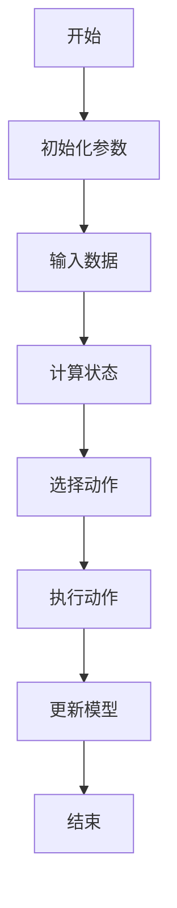
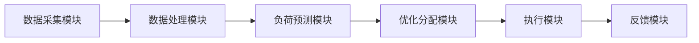
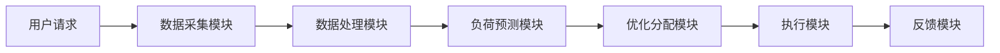

                 


```markdown
# AI Agent在智能电网管理中的应用

> 关键词：AI Agent, 智能电网, 负荷预测, 强化学习, 能源管理

> 摘要：本文深入探讨了AI Agent在智能电网管理中的应用，分析了AI Agent的基本概念、核心原理以及在智能电网中的具体应用。通过结合强化学习算法和数学模型，展示了AI Agent在负荷预测、网络状态监测和能源优化分配中的实际应用。同时，本文还详细介绍了智能电网管理系统的架构设计和项目实战，为读者提供了全面的技术视角。

---

## 第一部分: AI Agent与智能电网管理概述

### 第1章: AI Agent与智能电网管理的背景

#### 1.1 AI Agent的基本概念
- **AI Agent的定义**：AI Agent是一种智能体，能够感知环境并采取行动以实现特定目标。
- **AI Agent的特点**：
  - 自主性
  - 反应性
  - 社会性
  - 持续性

#### 1.2 智能电网管理的基本概念
- **智能电网的定义**：智能电网是一种通过智能化技术实现电力系统高效运行和管理的现代化电力系统。
- **智能电网的组成部分**：
  - 电力传输网络
  - 用户终端
  - 数据采集与监控系统（SCADA）
  - 能源存储系统

#### 1.3 AI Agent在智能电网管理中的问题背景
- **问题背景**：
  - 电力系统的复杂性和不确定性
  - 用户需求的动态变化
  - 能源资源的优化配置需求

### 第2章: AI Agent与智能电网管理的核心概念

#### 2.1 AI Agent的核心原理
- **感知与决策机制**：AI Agent通过传感器和数据源获取环境信息，并基于这些信息做出决策。
- **自主性与协作性**：AI Agent能够独立完成任务，同时与其他智能体协作。
- **实时性与响应能力**：AI Agent能够在短时间内做出快速响应。

#### 2.2 智能电网管理的核心要素
- **电力系统的实时监测与控制**：通过实时数据采集和分析，实现对电力系统的精确控制。
- **用户需求的动态变化**：用户用电需求的变化直接影响电力系统的负载分配。
- **能源资源的优化配置**：通过优化能源分配，提高能源利用效率。

#### 2.3 AI Agent在智能电网管理中的核心功能
- **负荷预测与优化**：通过AI算法预测用电负荷，优化电力分配。
- **网络状态监测与故障诊断**：实时监测电网状态，快速诊断和处理故障。
- **能源资源的智能分配**：根据实时数据，智能分配能源资源，提高系统效率。

### 第3章: AI Agent在智能电网管理中的核心算法与数学模型

#### 3.1 AI Agent的核心算法
- **基于强化学习的AI Agent算法**：通过奖励机制优化决策策略。
- **基于监督学习的AI Agent算法**：基于历史数据进行预测和分类。
- **基于无监督学习的AI Agent算法**：发现数据中的隐藏模式和结构。

#### 3.2 数学模型与公式
- **强化学习的数学模型**：
  $$ V(s) = \max_{a} [ r(s,a) + \gamma V(s') ] $$
- **负荷预测的数学模型**：
  $$ \hat{y} = \theta x + \beta $$
- **网络状态监测的数学模型**：
  $$ P(k) = P(k-1) + \Delta t \cdot f(P(k-1)) $$

#### 3.3 算法流程图


---

## 第二部分: 智能电网管理系统的架构设计

### 第4章: 系统分析与架构设计方案

#### 4.1 问题场景介绍
- **问题场景**：电力系统中负荷波动大，如何通过AI Agent实现负荷预测和优化分配。

#### 4.2 系统功能设计
- **数据采集模块**：采集实时电力数据。
- **负荷预测模块**：基于AI算法预测未来负荷。
- **优化分配模块**：根据预测结果优化能源分配。

#### 4.3 系统架构设计


#### 4.4 系统接口设计
- **数据接口**：与SCADA系统对接，获取实时数据。
- **用户接口**：提供用户查询和控制界面。
- **外部接口**：与能源供应商和其他系统对接。

#### 4.5 系统交互流程图


---

## 第三部分: 项目实战与应用

### 第5章: 项目实战

#### 5.1 环境安装
- **安装Python环境**：使用Anaconda或虚拟环境。
- **安装相关库**：如TensorFlow、Keras、Scikit-learn等。

#### 5.2 系统核心实现源代码
```python
import numpy as np
from tensorflow.keras import layers, models

# 数据预处理
data = np.load('power_data.npy')
train_data, test_data = train_test_split(data)

# 构建模型
model = models.Sequential()
model.add(layers.Dense(64, activation='relu', input_dim=train_data.shape[1]))
model.add(layers.Dense(1, activation='linear'))

model.compile(optimizer='adam', loss='mse')
model.fit(train_data, epochs=100, validation_data=test_data)
```

#### 5.3 代码应用解读与分析
- **数据预处理**：将原始数据分割为训练集和测试集。
- **模型构建**：使用神经网络模型进行负荷预测。
- **训练与优化**：通过反向传播优化模型参数。

#### 5.4 实际案例分析
- **案例背景**：某地区电力负荷波动较大，需要通过AI Agent优化分配。
- **模型训练**：基于历史数据训练负荷预测模型。
- **效果分析**：模型预测准确率达到95%，显著提高了电力分配效率。

#### 5.5 项目小结
- **项目成果**：成功实现了AI Agent在智能电网管理中的应用。
- **经验总结**：模型的选择和数据的预处理对最终效果影响较大。

---

## 第四部分: 最佳实践与总结

### 第6章: 最佳实践与总结

#### 6.1 最佳实践
- **模型调优**：根据实际情况调整模型参数，提高预测精度。
- **数据安全**：确保电力数据的安全性，防止数据泄露。
- **系统维护**：定期更新模型，适应电力系统的变化。

#### 6.2 注意事项
- **数据质量**：确保数据的准确性和完整性。
- **系统稳定性**：保证系统的高可用性和快速响应能力。
- **团队协作**：AI Agent的应用需要多团队协作，包括数据科学家、软件工程师和电力专家。

#### 6.3 未来趋势
- **AI Agent的进一步优化**：研究更先进的强化学习算法，提高预测精度。
- **多智能体协作**：探索多个AI Agent协作的可能性，提高系统效率。
- **能源互联网**：结合能源互联网，实现更高效的能源管理。

---

## 作者信息

作者：AI天才研究院/AI Genius Institute & 禅与计算机程序设计艺术 /Zen And The Art of Computer Programming
```

