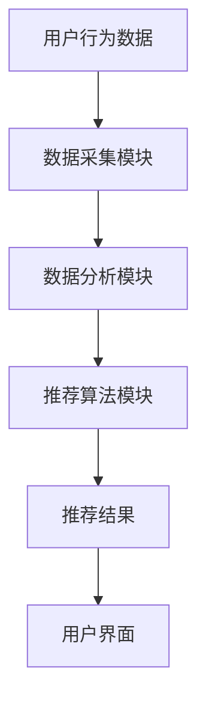

                 


# AI Agent在智能电视中的观看习惯分析

> **关键词**: AI Agent, 智能电视, 观看习惯分析, 机器学习, 推荐算法, 用户行为分析

> **摘要**: 本文深入探讨AI Agent在智能电视中的应用，重点分析用户观看习惯的算法实现与优化。从背景介绍到算法原理，从系统架构到项目实战，全面解析如何利用AI技术提升智能电视的用户体验。

---

## 第1章: AI Agent与智能电视的背景介绍

### 1.1 智能电视的发展历程

#### 1.1.1 从传统电视到智能电视的演进
传统电视的功能单一，仅限于接收电视台信号。随着互联网技术的发展，智能电视逐渐融入了更多功能，如在线视频播放、应用程序安装、语音控制等。

#### 1.1.2 AI技术在智能电视中的应用
AI Agent（智能代理）通过自然语言处理、机器学习等技术，为智能电视提供智能化服务，如个性化推荐、智能搜索、语音交互等。

#### 1.1.3 智能电视的市场现状与发展趋势
当前，智能电视市场增长迅速，AI技术的深度应用成为行业竞争的关键。未来，AI Agent将进一步提升用户体验，推动智能电视向更智能化方向发展。

---

### 1.2 AI Agent的基本概念与特点

#### 1.2.1 AI Agent的定义与核心功能
AI Agent是一种智能代理系统，能够通过学习和推理，为用户提供智能化服务。在智能电视中，AI Agent的核心功能包括用户行为分析、个性化推荐、智能交互等。

#### 1.2.2 AI Agent在智能电视中的应用场景
- 个性化推荐：根据用户的观看历史和偏好，推荐相关内容。
- 智能搜索：通过自然语言处理，快速定位用户需求的节目。
- 观看习惯分析：记录用户的观看行为，优化推荐算法。

#### 1.2.3 AI Agent与传统推荐算法的区别
AI Agent通过实时学习和自适应优化，能够更精准地捕捉用户的偏好，而传统推荐算法则基于静态数据进行预测。

---

### 1.3 用户观看习惯分析的背景与意义

#### 1.3.1 观看习惯分析的重要性
通过分析用户的观看习惯，可以更好地理解用户的偏好，优化内容推荐，提升用户体验。

#### 1.3.2 AI Agent在观看习惯分析中的作用
AI Agent能够实时采集和分析用户行为数据，构建用户画像，并动态调整推荐策略。

#### 1.3.3 本书的研究目标与内容框架
本文旨在通过AI Agent技术，分析用户的观看习惯，优化智能电视的推荐算法，提升用户体验。

---

## 第2章: AI Agent在智能电视中的核心概念与联系

### 2.1 AI Agent的核心原理

#### 2.1.1 机器学习与深度学习的基本原理
- 机器学习：通过数据训练模型，使其能够识别模式并做出预测。
- 深度学习：基于人工神经网络，能够处理更复杂的数据模式。

#### 2.1.2 自然语言处理在观看习惯分析中的应用
通过自然语言处理技术，AI Agent能够理解用户的语音指令，进一步优化推荐算法。

#### 2.1.3 用户行为分析的数学模型
用户行为分析模型包括协同过滤、基于内容的推荐、混合推荐等多种方法。

---

### 2.2 核心概念对比分析

#### 2.2.1 不同AI Agent算法的对比
- 协同过滤：基于用户相似性进行推荐。
- 基于内容的推荐：基于节目内容的相似性进行推荐。
- 混合推荐：结合协同过滤和内容推荐的优势。

#### 2.2.2 用户行为特征与推荐算法的关联
用户的行为特征包括观看时长、暂停次数、跳过率等，这些特征能够帮助推荐算法更精准地捕捉用户的偏好。

#### 2.2.3 数据流图与系统架构图


---

## 第3章: 观看习惯分析的算法原理讲解

### 3.1 算法原理概述

#### 3.1.1 协同过滤推荐算法
协同过滤是一种基于用户相似性的推荐算法。通过计算用户之间的相似度，推荐相似用户喜欢的内容。

#### 3.1.2 基于深度学习的推荐模型
深度学习模型（如神经网络）能够捕捉更复杂的用户行为模式，提升推荐的准确性。

#### 3.1.3 时间序列分析在观看习惯中的应用
通过分析用户观看行为的时间序列数据，预测用户的观看偏好。

---

### 3.2 算法实现流程

#### 3.2.1 数据预处理与特征提取
- 数据清洗：去除无效数据。
- 特征提取：提取用户行为特征，如观看时长、频率等。

#### 3.2.2 模型训练与优化
- 模型训练：基于训练数据，训练推荐模型。
- 模型优化：通过交叉验证等方法，优化模型参数。

#### 3.2.3 推荐结果生成与评估
- 推荐结果生成：基于训练好的模型，生成推荐列表。
- 推荐结果评估：通过准确率、召回率等指标，评估推荐效果。

---

### 3.3 代码实现与案例分析

#### 3.3.1 环境搭建与数据准备
- 环境搭建：安装必要的库，如Python的scikit-learn、TensorFlow等。
- 数据准备：收集和整理用户行为数据。

#### 3.3.2 代码实现与解读
```python
# 协同过滤推荐算法实现
from sklearn.metrics.pairwise import cosine_similarity

# 用户行为数据矩阵
user_behavior_matrix = ...

# 计算相似度矩阵
similarity_matrix = cosine_similarity(user_behavior_matrix)

# 根据相似度推荐内容
def recommend_content(user_id, similarity_matrix):
    similar_users = similarity_matrix[user_id]
    # 找出相似度最高的用户
    top_users = similar_users.argsort()[::-1][:5]
    recommended_content = []
    for user in top_users:
        recommended_content.extend(user_content[user])
    return recommended_content
```

#### 3.3.3 实际案例分析与结果展示
- 案例分析：基于协同过滤算法，分析用户A的观看习惯，推荐相关节目。
- 结果展示：生成推荐列表，并评估推荐效果。

---

## 第4章: 系统分析与架构设计方案

### 4.1 系统功能设计

#### 4.1.1 用户行为数据采集模块
- 数据采集：通过智能电视的传感器和日志记录用户行为数据。
- 数据存储：将采集到的数据存储到数据库中。

#### 4.1.2 数据分析与处理模块
- 数据清洗：处理脏数据。
- 数据转换：将数据转换为适合算法处理的格式。

#### 4.1.3 推荐算法实现模块
- 算法实现：基于机器学习的推荐算法。
- 模型优化：通过调参和优化提升推荐效果。

#### 4.1.4 推荐结果展示模块
- 推荐结果展示：将推荐内容展示给用户。
- 用户反馈：收集用户的反馈，进一步优化推荐算法。

---

### 4.2 系统架构设计

#### 4.2.1 分层架构设计
- 数据层：存储用户行为数据。
- 业务逻辑层：处理数据和推荐算法。
- 展示层：展示推荐结果。

#### 4.2.2 模块之间的交互关系


#### 4.2.3 系统接口设计
- 数据接口：数据采集模块与数据分析模块之间的接口。
- 推荐接口：推荐算法模块与用户界面之间的接口。

---

### 4.3 系统交互流程

#### 4.3.1 用户行为采集流程
1. 用户进行观看操作。
2. 智能电视采集用户的观看数据。
3. 数据被传输到数据分析模块。

#### 4.3.2 数据分析与处理流程
1. 数据清洗：去除无效数据。
2. 数据转换：将数据转换为适合算法处理的格式。
3. 数据分析：提取用户行为特征。

#### 4.3.3 推荐结果生成与展示流程
1. 基于分析结果，生成推荐列表。
2. 将推荐结果展示给用户。

---

## 第5章: 项目实战与代码实现

### 5.1 环境安装与数据准备

#### 5.1.1 开发环境搭建
- 安装Python、Jupyter Notebook等开发工具。
- 安装必要的库，如scikit-learn、TensorFlow等。

#### 5.1.2 数据集获取与预处理
- 数据集获取：从公开数据集获取用户行为数据。
- 数据预处理：清洗和转换数据。

---

### 5.2 系统核心代码实现

#### 5.2.1 数据采集模块代码
```python
import pandas as pd

# 读取数据
data = pd.read_csv('user_behavior.csv')

# 数据清洗
data.dropna(inplace=True)
```

#### 5.2.2 数据分析与处理代码
```python
from sklearn.preprocessing import StandardScaler

# 数据标准化
scaler = StandardScaler()
scaled_data = scaler.fit_transform(data)
```

#### 5.2.3 推荐算法实现代码
```python
from sklearn.neighbors import NearestNeighbors

# 协同过滤推荐算法
model = NearestNeighbors(n_neighbors=5)
model.fit(scaled_data)

# 获取相似用户
distances, indices = model.kneighbors(user_vector)
```

#### 5.2.4 推荐结果展示代码
```python
# 展示推荐结果
for idx in indices[0]:
    print(data.iloc[idx])
```

---

## 第6章: 总结与展望

### 6.1 项目总结
- 项目背景：AI Agent在智能电视中的应用前景广阔。
- 核心成果：通过AI Agent技术，实现用户的精准推荐。
- 经验总结：算法优化、数据处理是项目成功的关键。

### 6.2 未来展望
- 技术优化：探索更高效的推荐算法。
- 应用场景：拓展AI Agent在智能电视中的更多应用场景。

---

## 作者：AI天才研究院/AI Genius Institute & 禅与计算机程序设计艺术 /Zen And The Art of Computer Programming

