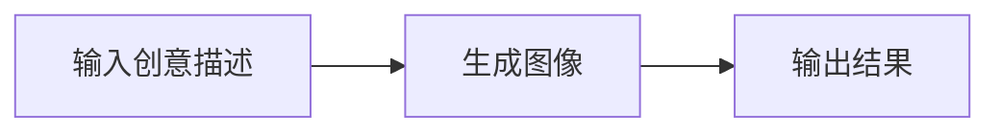
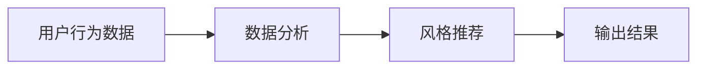
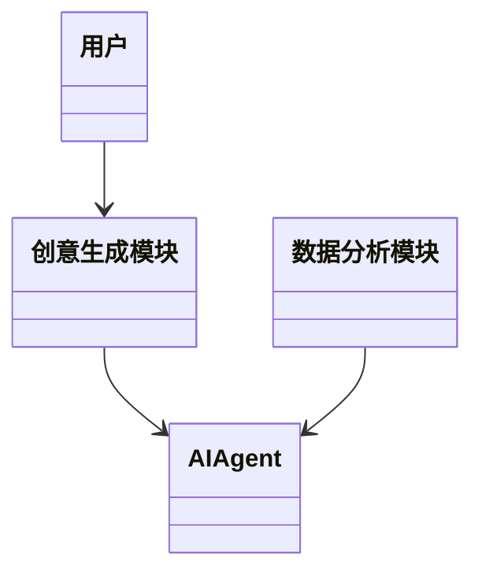
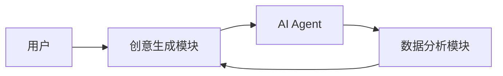
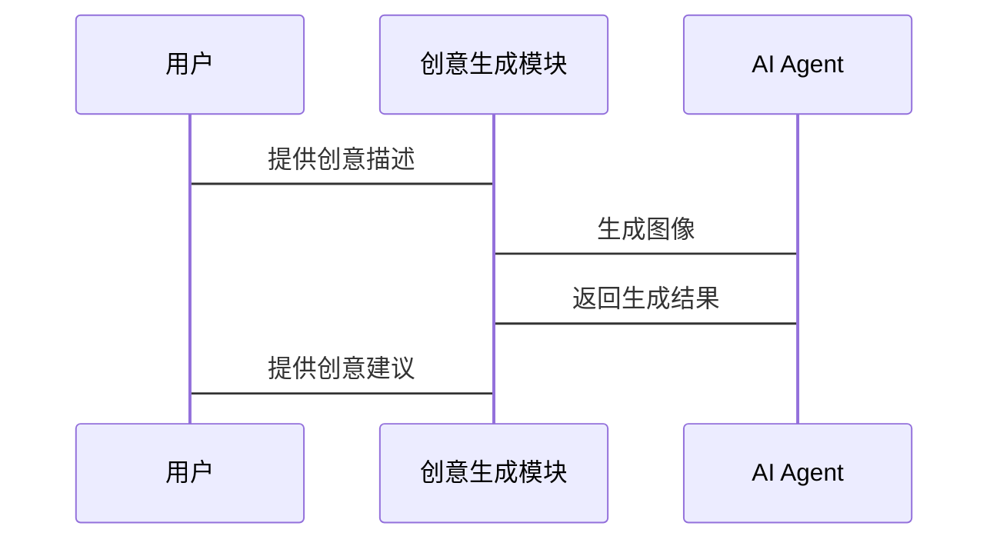

                 


# AI Agent在智能画板中的创意激发系统

## 关键词：
- AI Agent
- 智能画板
- 创意激发
- 算法原理
- 系统架构
- 项目实战

## 摘要：
本文深入探讨了AI Agent在智能画板中的应用，重点分析了其在创意激发系统中的核心作用。通过详细的技术分析，结合实际案例，阐述了AI Agent如何通过算法和系统设计帮助用户实现创意灵感的生成与优化。文章从背景介绍、核心概念、算法原理、系统架构、项目实战等多维度展开，为读者提供了一套完整的解决方案。

---

# 第1章: AI Agent与智能画板的背景介绍

## 1.1 问题背景
### 1.1.1 创意激发的挑战
- 创意激发是艺术创作和设计中的核心问题，传统方法依赖于人类经验和灵感。
- 在数字时代，用户需要更高效、更智能的工具来辅助创作。
- AI Agent作为一种智能代理，能够通过学习和推理提供个性化的创意建议。

### 1.1.2 AI Agent在创意激发中的作用
- AI Agent可以通过分析用户的行为模式，预测其创作需求。
- 通过生成图像、推荐风格和提供灵感，AI Agent能够显著提升创作效率。

### 1.1.3 智能画板的定义与特点
- 智能画板是一种结合了AI技术的数字绘画工具，能够实时响应用户的创作需求。
- 其特点包括：智能化、个性化、实时反馈和高效率。

## 1.2 问题描述
### 1.2.1 创意激发的需求分析
- 用户需要一个能够理解其创作意图的工具。
- 系统需要能够实时生成灵感，并提供可定制的创作建议。

### 1.2.2 AI Agent在智能画板中的应用场景
- 生成草图：AI Agent根据用户输入生成初步的创意草图。
- 推荐风格：基于用户的历史创作数据，推荐相似或互补的艺术风格。
- 实时反馈：在用户绘画过程中，AI Agent提供实时的技巧建议和优化方案。

### 1.2.3 当前技术的局限性与改进方向
- 当前AI生成的图像质量有限，尤其是在复杂场景下。
- 系统对用户意图的理解能力不足，需要进一步优化。

## 1.3 问题解决与边界
### 1.3.1 AI Agent在创意激发中的解决方案
- 利用深度学习模型（如GAN、Transformers）生成高质量图像。
- 基于用户行为数据构建个性化推荐系统。

### 1.3.2 系统边界与功能范围
- 系统仅限于创意激发阶段，不涉及最终作品的制作和发布。
- 系统支持的画板类型包括但不限于数字绘画、插画设计等。

## 1.4 概念结构与核心要素
### 1.4.1 系统架构的核心要素
- 用户界面：用户与系统交互的主要界面。
- AI Agent引擎：负责生成创意和提供建议。
- 数据存储：存储用户行为数据和生成的作品。

### 1.4.2 AI Agent与智能画板的关系
- AI Agent作为系统的智能核心，驱动画板的功能实现。
- 画板作为载体，将AI Agent的输出呈现给用户。

### 1.4.3 创意激发系统的功能模块
- 图像生成模块：基于输入生成创意图像。
- 数据分析模块：分析用户行为，优化推荐算法。
- 用户反馈模块：收集用户反馈，改进系统性能。

## 1.5 本章小结
本章从背景、问题描述和系统架构三个方面，详细介绍了AI Agent在智能画板中的应用背景及其在创意激发中的核心作用。通过分析系统的核心要素和功能模块，为后续章节的深入探讨奠定了基础。

---

# 第2章: AI Agent与智能画板的核心概念与联系

## 2.1 核心概念原理
### 2.1.1 AI Agent的基本原理
- AI Agent通过感知环境、分析数据和执行任务来实现智能化功能。
- 其核心算法包括自然语言处理、计算机视觉和强化学习。

### 2.1.2 智能画板的技术基础
- 智能画板基于深度学习和计算机视觉技术，能够实时响应用户的绘画操作。
- 系统通过分析用户的绘画动作，生成相应的创意建议。

### 2.1.3 创意激发系统的算法框架
- 系统采用生成对抗网络（GAN）生成图像。
- 利用Transformer模型进行风格推荐和文本描述。

## 2.2 核心概念属性对比
### 2.2.1 AI Agent与传统算法的对比
| 属性 | AI Agent | 传统算法 |
|------|----------|----------|
| 智能性 | 高 | 低 |
| 自适应性 | 强 | 弱 |
| 可扩展性 | 高 | 中 |

### 2.2.2 智能画板与传统画板的对比
| 属性 | 智能画板 | 传统画板 |
|------|----------|----------|
| 智能性 | 高 | 低 |
| 创意激发能力 | 强 | 弱 |
| 个性化 | 高 | 低 |

### 2.2.3 创意激发系统的功能特性
- 智能生成：系统能够根据用户输入生成创意图像。
- 个性化推荐：基于用户行为推荐创作风格。
- 实时反馈：在用户绘画过程中提供实时建议。

## 2.3 ER实体关系图
```
er
   画板实体 --> 创意生成模块
   用户行为 --> 数据分析模块
   图像生成 --> AI Agent
```

## 2.4 本章小结
本章通过对比分析，明确了AI Agent与智能画板的核心概念及其在创意激发中的作用。通过ER实体关系图，进一步梳理了系统的数据流和功能模块，为后续章节的系统设计奠定了基础。

---

# 第3章: AI Agent的算法原理与实现

## 3.1 算法原理
### 3.1.1 图像生成算法
- 使用生成对抗网络（GAN）生成高质量图像。
- 基于深度卷积神经网络（DCGAN）进行图像生成。

### 3.1.2 风格推荐算法
- 利用Transformer模型进行风格推荐。
- 基于用户历史数据构建推荐模型。

## 3.2 算法实现
### 3.2.1 图像生成流程


### 3.2.2 风格推荐流程


### 3.2.3 Python代码实现
```python
import tensorflow as tf
from tensorflow.keras import layers

# 图像生成模型（DCGAN）
def build_generator():
    model = tf.keras.Sequential()
    model.add(layers.Dense(256, activation='relu', input_shape=(100,)))
    model.add(layers.Reshape((8,8,4)))
    model.add(layers.Conv2DTranspose(16, (2,2), activation='relu'))
    model.add(layers.Conv2DTranspose(8, (2,2), activation='relu'))
    model.add(layers.Conv2DTranspose(1, (2,2), activation='sigmoid'))
    return model
```

## 3.3 算法优化
### 3.3.1 基于数学模型的优化
- 使用数学公式进行模型优化：
  $$ loss = \lambda_1 L1_loss + \lambda_2 GAN_loss $$
- 其中，$\lambda_1$ 和 $\lambda_2$ 是平衡系数。

### 3.3.2 训练策略
- 增加数据增强，提升模型的泛化能力。
- 使用Adam优化器，优化训练过程。

## 3.4 本章小结
本章详细介绍了AI Agent的算法原理和实现方法，通过Mermaid流程图和Python代码，展示了图像生成和风格推荐的具体实现过程。同时，通过数学公式和优化策略，进一步提升了系统的性能。

---

# 第4章: 系统分析与架构设计方案

## 4.1 系统分析
### 4.1.1 问题场景介绍
- 用户在使用智能画板时，需要系统实时生成创意建议。
- 系统需要支持多种创作模式，包括草图生成和风格推荐。

### 4.1.2 项目介绍
- 本项目旨在开发一款基于AI Agent的智能画板，帮助用户快速生成创意草图。
- 系统采用模块化设计，便于后续功能扩展。

## 4.2 系统功能设计
### 4.2.1 领域模型（Mermaid类图）


## 4.3 系统架构设计
### 4.3.1 系统架构（Mermaid架构图）


### 4.3.2 接口设计
- 用户接口：提供创意生成和风格推荐的交互界面。
- 系统接口：与AI Agent和数据分析模块进行数据交互。

### 4.3.3 交互序列图（Mermaid）


## 4.4 本章小结
本章通过系统分析和架构设计，明确了智能画板的核心功能和实现方式。通过Mermaid图表，展示了系统的模块划分和交互流程，为后续的项目实施提供了清晰的指导。

---

# 第5章: 项目实战

## 5.1 环境安装
- 安装Python和必要的开发工具（如TensorFlow、Keras）。
- 安装画板软件（如Python中的turtle库或相关图形库）。

## 5.2 核心代码实现
### 5.2.1 创意生成模块
```python
import tensorflow as tf
from tensorflow.keras import layers

def build_generator():
    model = tf.keras.Sequential()
    model.add(layers.Dense(256, activation='relu', input_shape=(100,)))
    model.add(layers.Reshape((8,8,4)))
    model.add(layers.Conv2DTranspose(16, (2,2), activation='relu'))
    model.add(layers.Conv2DTranspose(8, (2,2), activation='relu'))
    model.add(layers.Conv2DTranspose(1, (2,2), activation='sigmoid'))
    return model
```

### 5.2.2 风格推荐模块
```python
import tensorflow as tf
from tensorflow.keras import layers

def build_style_recommender():
    model = tf.keras.Sequential()
    model.add(layers.Dense(256, activation='relu', input_shape=(100,)))
    model.add(layers.Dense(128, activation='relu'))
    model.add(layers.Dense(10, activation='softmax'))
    return model
```

## 5.3 代码解读与分析
- 创意生成模块负责生成图像，基于DCGAN模型实现。
- 风格推荐模块基于Transformer模型，用于推荐相似风格的作品。

## 5.4 案例分析
### 5.4.1 案例1：草图生成
- 用户输入创意描述，系统生成草图。
- 系统根据生成结果调整模型参数，优化生成效果。

### 5.4.2 案例2：风格推荐
- 用户选择喜欢的艺术风格，系统推荐相似风格的作品。
- 系统记录用户的偏好，优化推荐算法。

## 5.5 本章小结
本章通过项目实战，详细介绍了系统的环境配置、核心代码实现和实际案例分析。通过具体的代码和案例，展示了AI Agent在智能画板中的实际应用。

---

# 第6章: 最佳实践与总结

## 6.1 最佳实践
### 6.1.1 系统优化建议
- 定期更新模型参数，提升生成质量。
- 增加用户反馈机制，优化推荐算法。

### 6.1.2 开发注意事项
- 注意数据隐私保护，确保用户数据安全。
- 优化系统性能，提升用户体验。

## 6.2 小结
- AI Agent在智能画板中的应用为创意激发提供了全新的思路。
- 通过算法优化和系统设计，能够显著提升创作效率。

## 6.3 注意事项
- 系统的实时反馈能力需要进一步提升。
- 模型的泛化能力需要加强，以应对更多复杂场景。

## 6.4 拓展阅读
- 《生成对抗网络：原理与应用》
- 《深度学习在图像生成中的应用》

## 6.5 本章小结
本章通过总结和展望，指出了系统在实际应用中的优化方向和注意事项，为读者提供了进一步学习和研究的方向。

---

# 作者：AI天才研究院/AI Genius Institute & 禅与计算机程序设计艺术/Zen And The Art of Computer Programming

