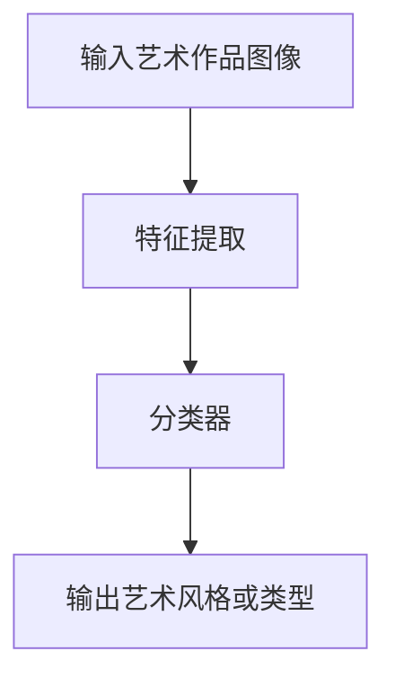
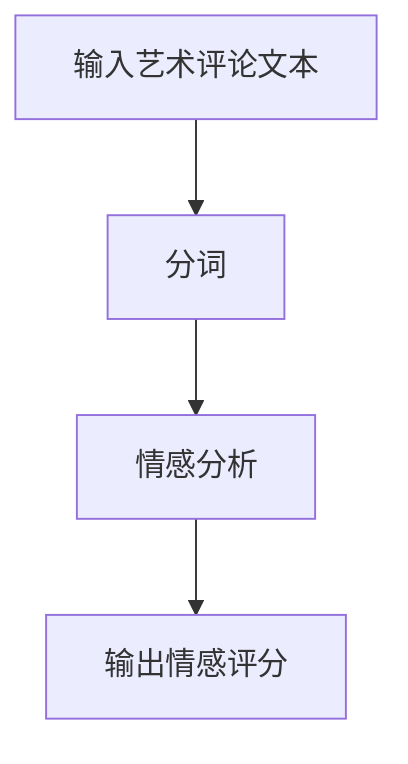

                 


# AI Agent在智能画框中的艺术鉴赏指导

> 关键词：AI Agent, 智能画框, 艺术鉴赏, 图像识别, 自然语言处理

> 摘要：本文探讨了AI Agent在智能画框中的应用，分析了艺术鉴赏的数字化趋势，详细讲解了AI Agent的核心概念、算法原理、系统架构设计以及实际项目实现。通过案例分析和最佳实践，本文为读者提供了从理论到实践的全面指导。

---

## 第一部分: AI Agent与艺术鉴赏的背景介绍

### 第1章: AI Agent的背景与概念

#### 1.1 AI Agent的基本概念
- **AI Agent的定义与特点**  
  AI Agent（人工智能代理）是指能够感知环境、自主决策并执行任务的智能实体。其特点包括自主性、反应性、目标导向性和社交能力。
  
- **AI Agent的核心属性与特征**  
  - 自主性：能够独立执行任务，无需人工干预。
  - 反应性：能够感知环境变化并实时调整行为。
  - 目标导向性：以明确的目标为导向，优化决策过程。
  - 社交能力：能够与其他系统或用户进行交互。

- **AI Agent的分类与应用场景**  
  - 按智能水平分类：反应式、基于模型的、混合型。
  - 应用场景：智能助手、推荐系统、自动驾驶、机器人控制等。

#### 1.2 艺术鉴赏的背景与需求
- **艺术鉴赏的基本概念**  
  艺术鉴赏是通过对艺术作品的分析、理解和评价，来感受其美学价值和情感内涵的过程。

- **艺术鉴赏的挑战与痛点**  
  - 艺术作品的多样性与复杂性使得鉴赏过程难以标准化。
  - 专业性要求高，普通用户难以深入理解艺术作品。
  - 鉴赏过程缺乏互动性和个性化体验。

- **艺术鉴赏的数字化趋势**  
  随着计算机视觉和自然语言处理技术的发展，艺术鉴赏逐步从线下转为线上，智能化、个性化成为趋势。

#### 1.3 AI Agent在艺术鉴赏中的结合
- **AI Agent与艺术鉴赏的结合背景**  
  随着AI技术的进步，艺术鉴赏领域逐渐引入AI Agent，以提高鉴赏效率和用户体验。

- **AI Agent在艺术鉴赏中的优势**  
  - 高效性：快速分析大量艺术作品。
  - 个性化：根据用户偏好提供定制化建议。
  - 可扩展性：支持大规模数据处理。

- **艺术鉴赏智能化的未来趋势**  
  AI Agent将更加智能化，能够实现情感识别、深度理解与创作指导。

---

## 第2章: AI Agent在智能画框中的核心概念与联系

### 2.1 AI Agent与艺术鉴赏的核心概念对比
- **AI Agent的核心概念**  
  AI Agent通过感知环境、分析数据、制定决策并执行任务，实现智能化服务。

- **艺术鉴赏的核心概念**  
  艺术鉴赏涉及作品的分析、理解和评价，注重美学价值和情感体验。

- **两者概念的对比分析**  
  - AI Agent注重技术实现，而艺术鉴赏注重人文价值。
  - AI Agent的目标是完成任务，而艺术鉴赏的目标是提升用户体验。

### 2.2 AI Agent与艺术鉴赏的属性特征对比
| **属性**       | **AI Agent**                     | **艺术鉴赏**                     |
|----------------|----------------------------------|----------------------------------|
| 输入数据        | 结构化数据、图像、文本           | 图像、文本、情感数据             |
| 处理方式        | 算法驱动、数据驱动             | 知识驱动、情感驱动             |
| 输出结果        | 分析结果、决策建议             | 美学评价、个性化建议           |
| 交互方式        | API接口、用户交互               | 人机交互、实时反馈             |
| 应用场景        | 智能助手、推荐系统             | 艺术推荐、教育辅助             |

### 2.3 AI Agent与艺术鉴赏的ER实体关系图
```mermaid
erDiagram
    actor User {
        --> "使用AI Agent进行艺术鉴赏"
    }
    class AI-Agent {
        has 属性：自主性、目标导向性、社交能力
        has 方法：图像识别、自然语言处理
    }
    class 艺术作品 {
        has 属性：类型、风格、创作时间
        has 方法：特征提取、情感分析
    }
    class 艺术鉴赏结果 {
        has 属性：美学评分、个性化建议
    }
    User --> AI-Agent: 请求鉴赏
    AI-Agent --> 艺术作品: 分析作品
    AI-Agent --> 艺术鉴赏结果: 输出结果
```

---

## 第3章: AI Agent的艺术鉴赏算法原理

### 3.1 算法原理概述
AI Agent的艺术鉴赏主要基于图像识别和自然语言处理技术，结合深度学习模型实现。

### 3.2 图像识别算法
#### 3.2.1 图像识别流程


#### 3.2.2 图像识别的数学模型
- **卷积神经网络（CNN）**  
  $$ \text{CNN}(x) = \sigma(Wx + b) $$  
  其中，$x$ 是输入图像，$W$ 是权重矩阵，$b$ 是偏置，$\sigma$ 是激活函数。

### 3.3 自然语言处理算法
#### 3.3.1 文本分析流程


#### 3.3.2 情感分析的数学模型
- **双向LSTM网络**  
  $$ \text{LSTM}(x) = \tanh(W_{\text{in}}x + W_{\text{cell}}h_{\text{prev}} + b) $$  
  其中，$x$ 是输入文本，$h_{\text{prev}}$ 是前一时刻的状态，$W$ 是权重矩阵，$b$ 是偏置。

### 3.4 综合算法实现
通过结合图像识别和自然语言处理，AI Agent可以实现对艺术作品的多维度分析。

---

## 第4章: 智能画框的系统分析与架构设计

### 4.1 项目背景
智能画框是一种结合AI技术的硬件设备，能够实时分析并展示艺术作品的相关信息。

### 4.2 系统功能设计
- **图像采集模块**：捕获艺术作品图像。
- **数据处理模块**：进行图像识别和文本分析。
- **用户交互模块**：提供实时反馈和个性化建议。

### 4.3 系统架构设计
```mermaid
graph TD
    User --> AI-Agent: 请求鉴赏
    AI-Agent --> 图像识别模块: 分析图像
    AI-Agent --> 文本分析模块: 分析评论
    图像识别模块 --> 艺术鉴赏结果
    文本分析模块 --> 艺术鉴赏结果
    艺术鉴赏结果 --> User: 输出结果
```

### 4.4 接口设计与交互
- **API接口**：提供RESTful API供外部系统调用。
- **交互流程**：用户输入→系统处理→结果反馈。

---

## 第5章: 项目实战

### 5.1 环境安装
- **Python环境**：安装Python 3.8以上版本。
- **依赖库安装**：使用pip安装numpy、tensorflow、pytorch等库。

### 5.2 核心功能实现
#### 5.2.1 图像识别代码示例
```python
import tensorflow as tf
from tensorflow.keras import layers

model = tf.keras.Sequential([
    layers.Conv2D(32, (3,3), activation='relu', input_shape=(224, 224, 3)),
    layers.MaxPooling2D(2,2),
    layers.Conv2D(64, (3,3), activation='relu'),
    layers.MaxPooling2D(2,2),
    layers.Flatten(),
    layers.Dense(128, activation='relu'),
    layers.Dense(10, activation='softmax')
])

model.compile(optimizer='adam', loss='sparse_categorical_crossentropy', metrics=['accuracy'])
```

#### 5.2.2 文本分析代码示例
```python
from tensorflow.keras.preprocessing.text import Tokenizer
from tensorflow.keras.preprocessing.sequence import pad_sequences

tokenizer = Tokenizer(num_words=10000)
tokenizer.fit_on_texts(texts)
sequences = tokenizer.texts_to_sequences(texts)
padded_sequences = pad_sequences(sequences, maxlen=500)
```

### 5.3 案例分析与解读
- **案例1**：分析梵高的《星夜》。
- **案例2**：分析用户评论，生成情感评分。

### 5.4 项目小结
通过实际案例分析，验证了AI Agent在艺术鉴赏中的有效性和实用性。

---

## 第6章: 最佳实践与注意事项

### 6.1 小结
- AI Agent在艺术鉴赏中的应用前景广阔。
- 图像识别和自然语言处理是实现智能化鉴赏的关键技术。

### 6.2 注意事项
- 数据质量对模型性能影响重大。
- 需要注意用户隐私和数据安全。

### 6.3 拓展阅读
- 推荐阅读《深度学习入门》和《自然语言处理实战》。

---

## 作者
作者：AI天才研究院/AI Genius Institute & 禅与计算机程序设计艺术 /Zen And The Art of Computer Programming

