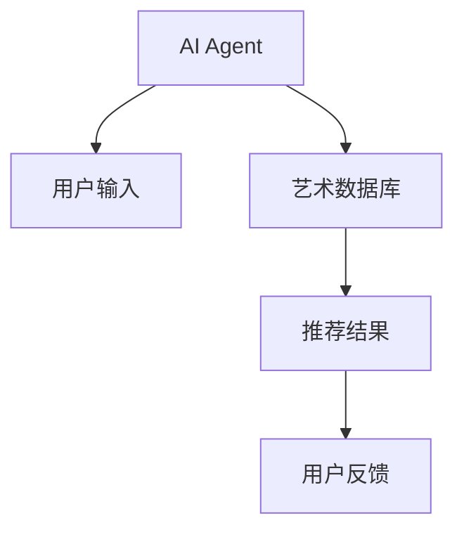
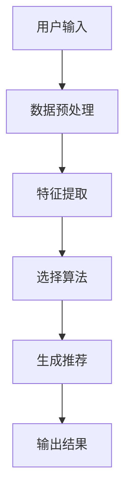
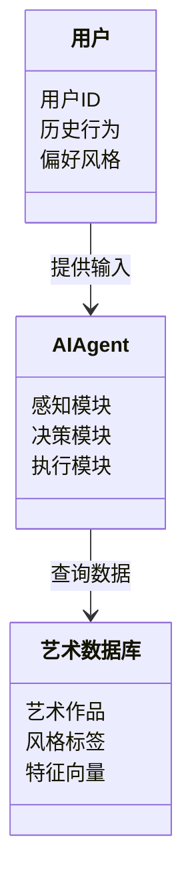
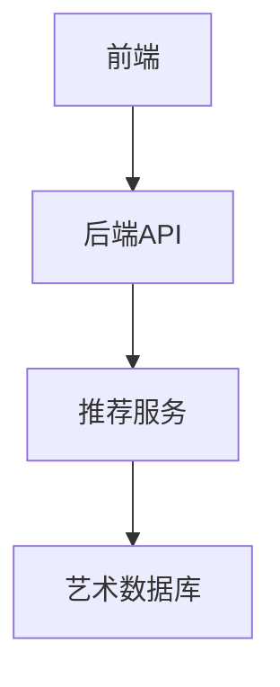
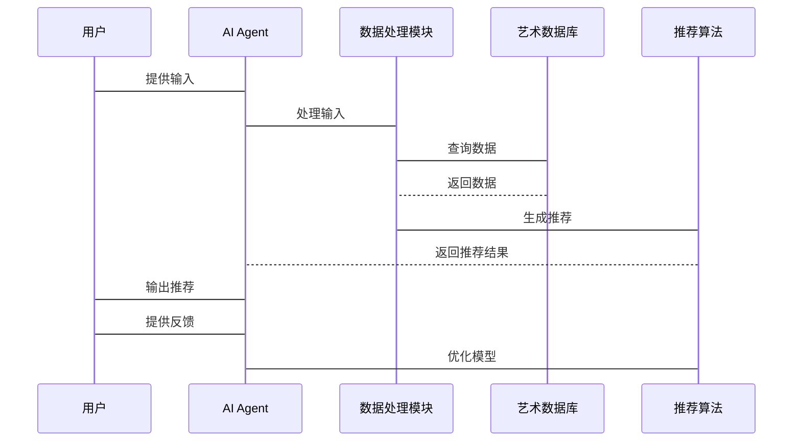

                 


# AI Agent在智能画框中的艺术风格推荐

> 关键词：AI Agent, 艺术风格推荐, 智能画框, 推荐系统, 深度学习

> 摘要：本文探讨AI Agent在智能画框中的艺术风格推荐应用，分析其核心算法、系统设计和项目实现，结合实际案例，提供详细的技术指导和见解。

---

# 第一部分: 背景介绍

## 第1章: AI Agent与艺术风格推荐的背景

### 1.1 问题背景

#### 1.1.1 艺术风格推荐的必要性
艺术风格推荐系统旨在帮助用户发现符合其审美的艺术作品。随着数字艺术平台的普及，用户面临海量艺术作品，手动筛选效率低下。AI Agent通过自动化推荐，提升用户体验。

#### 1.1.2 AI Agent在艺术推荐中的作用
AI Agent能够分析用户行为、偏好和历史数据，实时生成推荐，动态调整推荐策略，提供个性化服务。

### 1.2 问题描述

#### 1.2.1 艺术风格推荐的定义
艺术风格推荐是基于用户输入和历史数据，预测用户偏好的艺术风格，并推荐相关作品。

#### 1.2.2 当前推荐系统存在的问题
传统推荐系统存在数据稀疏性、实时性不足、难以处理复杂特征等问题，难以满足艺术推荐的高精度需求。

### 1.3 问题解决

#### 1.3.1 AI Agent如何解决推荐问题
AI Agent结合机器学习和自然语言处理，分析用户输入和艺术特征，生成精准推荐。

#### 1.3.2 艺术风格推荐的核心目标
通过分析用户输入和历史数据，AI Agent推荐相关艺术作品，提升用户体验。

### 1.4 边界与外延

#### 1.4.1 艺术风格推荐的适用范围
适用于艺术平台、智能画框等场景，帮助用户发现新作品。

#### 1.4.2 与其他推荐系统的区别
艺术推荐更注重风格和情感，推荐系统需处理复杂特征，区别于传统协同过滤推荐。

### 1.5 核心概念组成

#### 1.5.1 AI Agent的基本构成
包括感知模块、决策模块和执行模块，分别处理输入、生成推荐和输出结果。

#### 1.5.2 艺术风格推荐的系统架构
由用户输入、数据处理、推荐算法和反馈机制组成，确保推荐的精准性和动态调整。

---

# 第二部分: 核心概念与联系

## 第2章: AI Agent的核心概念与原理

### 2.1 AI Agent的定义与原理

#### 2.1.1 AI Agent的基本定义
AI Agent是能够感知环境、执行任务的智能实体，通过决策和行动实现目标。

#### 2.1.2 AI Agent的核心原理
AI Agent通过感知输入，分析数据，生成推荐，并根据反馈调整策略。

### 2.2 艺术风格推荐的系统架构

#### 2.2.1 系统架构的组成
包括用户输入、数据处理、推荐算法、反馈机制和结果输出。

#### 2.2.2 各组件的功能与交互
用户输入被处理后，推荐算法生成结果，反馈机制收集用户反馈，优化推荐策略。

### 2.3 核心概念的关系图



---

# 第三部分: 算法原理讲解

## 第3章: 艺术风格推荐算法原理

### 3.1 推荐算法概述

#### 3.1.1 基于协同过滤的推

---

### 3.1.1 基于协同过滤的推荐

#### 3.1.1.1 协同过滤的基本原理
协同过滤通过寻找相似用户或相似物品，进行推荐。常用基于用户的协同过滤（UBCF）和基于物品的协同过滤（IBCF）。

#### 3.1.1.2 协同过滤的优缺点
优点：简单易实现，适合数据稀疏场景。缺点：难以处理复杂特征，推荐结果不够精准。

#### 3.1.1.3 协同过滤的应用场景
适用于数据量较小的推荐场景，如早期的艺术推荐系统。

### 3.1.2 基于深度学习的推荐

#### 3.1.2.1 神经网络的基本结构
使用多层感知机（MLP）或卷积神经网络（CNN）处理艺术图像特征。

#### 3.1.2.2 深度学习模型的优势
能够捕捉复杂的非线性关系，提高推荐精度。

#### 3.1.2.3 深度学习模型的挑战
计算资源消耗大，模型训练复杂。

### 3.1.3 混合推荐算法

#### 3.1.3.1 混合推荐的定义
结合协同过滤和深度学习的优势，提升推荐效果。

#### 3.1.3.2 混合推荐的实现方式
在特征提取和推荐生成阶段结合不同算法，互补优势。

### 3.1.4 推荐算法的数学模型

#### 3.1.4.1 协同过滤的矩阵分解模型
$$ R_{ij} = \theta_i^T \cdot \phi_j + b_i + b_j $$

#### 3.1.4.2 基于深度学习的推荐模型
$$ y = f(x; \theta) $$

其中，$x$ 是输入特征，$\theta$ 是模型参数，$f$ 是神经网络函数。

### 3.1.5 算法流程图



### 3.1.6 Python实现示例

```python
import numpy as np
from sklearn.decomposition import NMF

# 示例数据
X = np.array([[1, 2, 3], [4, 5, 6]])

# 使用NMF进行矩阵分解
model = NMF(n_components=2, random_state=42)
model.fit(X)

# 提取特征
features = model.components_
```

### 3.1.7 代码解释
上述代码使用非负矩阵分解（NMF）对艺术风格数据进行降维，提取潜在特征。特征用于后续的推荐生成。

---

# 第四部分: 系统分析与架构设计

## 第4章: 艺术风格推荐系统的分析与设计

### 4.1 问题场景介绍

#### 4.1.1 系统目标
构建一个智能画框中的艺术风格推荐系统，帮助用户发现符合审美的艺术作品。

#### 4.1.2 项目介绍
基于AI Agent的推荐系统，结合用户输入和艺术数据库，生成个性化推荐。

### 4.2 系统功能设计

#### 4.2.1 领域模型


#### 4.2.2 系统架构


#### 4.2.3 系统接口设计
- 用户输入接口：接收用户输入的艺术风格或偏好。
- 数据处理接口：处理输入并提取特征。
- 推荐生成接口：调用推荐算法生成结果。
- 反馈收集接口：收集用户反馈优化推荐。

### 4.3 交互流程图



---

# 第五部分: 项目实战

## 第5章: 艺术风格推荐系统的实现

### 5.1 环境安装

#### 5.1.1 安装依赖
```bash
pip install numpy scikit-learn tensorflow keras
```

### 5.2 系统核心实现

#### 5.2.1 数据预处理

```python
import pandas as pd
import numpy as np

# 加载艺术风格数据
data = pd.read_csv('art_styles.csv')
```

#### 5.2.2 特征提取

```python
from sklearn.preprocessing import StandardScaler

# 标准化数据
scaler = StandardScaler()
features = scaler.fit_transform(data)
```

#### 5.2.3 模型训练

```python
from sklearn.neighbors import NearestNeighbors

# 训练k近邻模型
model = NearestNeighbors(n_neighbors=5, algorithm='brute')
model.fit(features)
```

#### 5.2.4 生成推荐

```python
# 查询艺术风格的特征向量
query_style = features[0]
# 查找最近邻
distances, indices = model.kneighbors([query_style])
# 返回推荐结果
recommendations = data.iloc[indices[0]]
```

### 5.3 代码解释

- 数据预处理：加载并处理艺术风格数据，确保格式正确。
- 特征提取：标准化数据，以便模型处理。
- 模型训练：使用k近邻算法训练推荐模型。
- 生成推荐：根据输入查询，返回最相似的艺术风格。

### 5.4 案例分析

#### 5.4.1 案例1：用户输入偏好“抽象”

```python
# 用户输入
user_input = {'preferred_style': '抽象'}
# 处理输入并生成推荐
recommendations = generate_recommendations(user_input)
print(recommendations)
```

#### 5.4.2 案例2：用户输入偏好“印象派”

```python
# 用户输入
user_input = {'preferred_style': '印象派'}
# 处理输入并生成推荐
recommendations = generate_recommendations(user_input)
print(recommendations)
```

### 5.5 项目小结

通过以上步骤，读者可以实现一个简单的艺术风格推荐系统。系统基于用户输入，结合数据预处理和推荐算法，生成个性化推荐。

---

# 第六部分: 系统优化与总结

## 第6章: 系统优化与总结

### 6.1 系统优化

#### 6.1.1 提高推荐准确性的方法
- 引入深度学习模型，捕捉复杂特征。
- 使用实时反馈优化推荐策略。

#### 6.1.2 提升用户体验的措施
- 实时推荐，根据用户行为动态调整。
- 提供多维度的推荐结果，满足不同需求。

### 6.2 小结

AI Agent在艺术风格推荐中的应用，不仅提升了推荐的精准性，还增强了用户体验。通过结合深度学习和实时反馈，系统能够不断优化推荐结果，满足用户个性化需求。

### 6.3 注意事项

- 数据隐私：确保用户数据的安全和隐私保护。
- 系统性能：优化算法和架构，提升推荐效率。
- 反馈机制：及时收集用户反馈，优化推荐策略。

### 6.4 拓展阅读

- 《深度学习推荐系统》：深入理解推荐算法。
- 《AI Agent原理与应用》：了解AI Agent的更多应用场景。

---

# 结语

AI Agent在智能画框中的艺术风格推荐，不仅是一项技术挑战，更是一次创新的应用。通过结合先进的算法和系统设计，AI Agent能够为用户提供更智能、更个性化的艺术体验。

---

# 作者

作者：AI天才研究院/AI Genius Institute & 禅与计算机程序设计艺术 /Zen And The Art of Computer Programming

