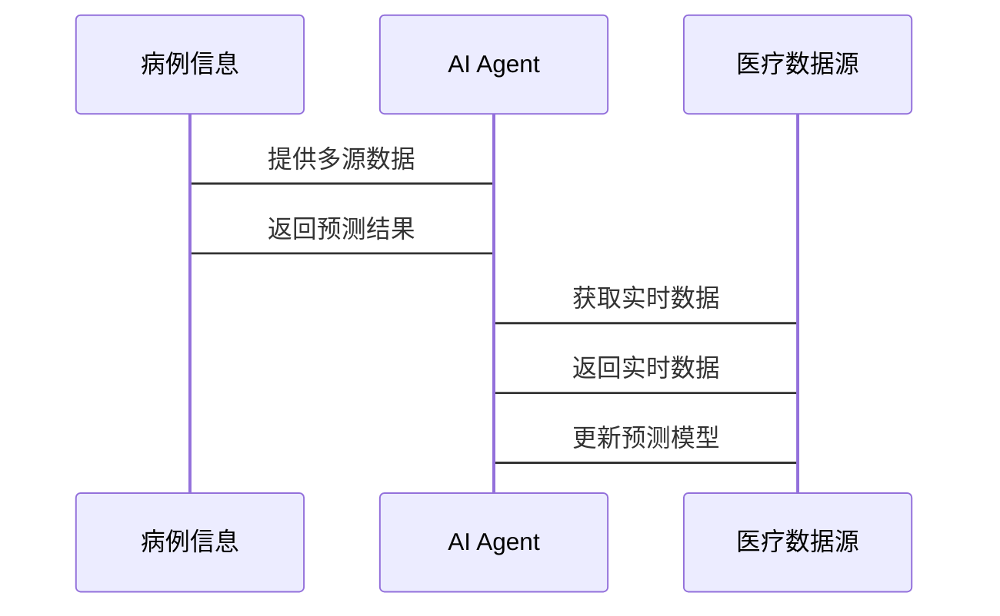

                 


# AI Agent在智能疾病预测中的角色

## 关键词：AI Agent、智能疾病预测、机器学习、数据挖掘、医疗健康

## 摘要：  
随着人工智能技术的快速发展，AI Agent（人工智能代理）在智能疾病预测中的角色日益重要。通过分析疾病预测的核心问题、AI Agent的原理与机制，以及它们的结合方式，本文深入探讨了AI Agent如何在医疗健康领域发挥重要作用。文章详细介绍了AI Agent在疾病预测中的核心算法、系统架构设计、项目实战案例，以及未来的发展方向，为读者提供全面而深入的技术见解。

---

# 第一部分: AI Agent与智能疾病预测的背景与概念

## 第1章: AI Agent与智能疾病预测的背景介绍

### 1.1 AI Agent的基本概念  
AI Agent（人工智能代理）是一种能够感知环境、自主决策并执行任务的智能实体。它具备以下特点：  
1. **自主性**：无需外部干预，能够独立完成任务。  
2. **反应性**：能够实时感知环境变化并做出响应。  
3. **目标导向性**：基于目标驱动行为，优化决策过程。  

AI Agent的核心功能包括感知、推理、规划和执行，使其能够处理复杂问题并提供高效解决方案。  

### 1.2 疾病预测的现状与挑战  
疾病预测的传统方法主要依赖统计分析和专家经验，但存在以下局限性：  
1. **数据量不足**：传统方法难以处理海量医疗数据。  
2. **预测精度低**：基于经验的模型难以捕捉复杂疾病的相关性。  
3. **效率低下**：人工分析耗时长，难以应对大规模数据。  

AI Agent的引入为疾病预测带来了新的可能性，特别是在数据处理、模型优化和实时反馈方面具有显著优势。  

### 1.3 AI Agent在疾病预测中的角色  
AI Agent在疾病预测中扮演多重角色：  
1. **数据分析师**：通过机器学习算法处理和分析医疗数据。  
2. **预测模型构建者**：基于历史数据训练预测模型。  
3. **决策支持工具**：为医生提供实时预测结果和个性化建议。  

---

## 第2章: AI Agent与疾病预测的核心概念  

### 2.1 AI Agent的原理与机制  
AI Agent的工作原理可以分解为以下步骤：  
1. **感知环境**：通过传感器或数据接口获取相关信息。  
2. **推理与决策**：基于感知数据进行分析和推理，生成决策方案。  
3. **执行操作**：根据决策结果执行相应的操作（如触发预警）。  

AI Agent的核心机制包括：  
- **感知层**：通过数据采集技术获取相关信息。  
- **推理层**：利用机器学习算法进行数据分析和预测。  
- **执行层**：根据推理结果采取行动或提供反馈。  

### 2.2 疾病预测的核心原理  
疾病预测的原理基于对疾病相关因素的分析和建模。常见的疾病预测方法包括：  
1. **监督学习**：基于标签数据训练分类模型。  
2. **无监督学习**：通过聚类分析发现潜在的疾病模式。  
3. **强化学习**：通过不断试错优化预测模型。  

### 2.3 AI Agent与疾病预测的结合模型  
AI Agent与疾病预测的结合模型可以分为以下两类：  
1. **基于规则的模型**：通过预定义规则进行疾病预测。  
2. **基于机器学习的模型**：利用深度学习算法优化预测结果。  

---

## 第3章: AI Agent与疾病预测的核心概念联系  

### 3.1 AI Agent与疾病预测的核心概念对比  
以下是AI Agent与疾病预测的核心概念对比表：  

| **核心要素** | **AI Agent** | **疾病预测** |  
|--------------|--------------|--------------|  
| **数据来源** | 多源异构数据 | 医疗数据 |  
| **核心算法** | 机器学习、强化学习 | 统计分析、分类算法 |  
| **目标** | 自主决策与执行 | 精准预测疾病 |  

### 3.2 AI Agent与疾病预测的ER实体关系图  

```mermaid
erd
  病例信息
    id: 全局唯一标识符
    症状: 文本描述
    病史: 文本描述
    实验室检查结果: 数值
    诊断结果: 文本
  AI Agent
    id: 全局唯一标识符
    感知数据: 多源数据输入
    推理结果: 预测结果
    决策反馈: 行动建议
  医疗数据源
    患者信息: 文本
    病历记录: 文本
    检查报告: 数值
  AI Agent <-> 病例信息: 数据输入与输出
  AI Agent <-> 医疗数据源: 数据接口
```

---

## 第4章: AI Agent与疾病预测的算法原理  

### 4.1 AI Agent的核心算法  

#### 4.1.1 监督学习算法  
监督学习是疾病预测中最常用的算法之一。以下是逻辑回归模型的数学公式：  

$$ P(y=1|x) = \frac{e^{\beta_0 + \beta_1 x_1 + \cdots + \beta_n x_n}}{1 + e^{\beta_0 + \beta_1 x_1 + \cdots + \beta_n x_n}} $$  

其中，$y$ 是目标变量，$x_i$ 是特征变量，$\beta_i$ 是模型参数。  

#### 4.1.2 无监督学习算法  
无监督学习适用于疾病预测中的聚类分析。以下是K-means算法的伪代码：  

```python
def kmeans(X, k):
    # 初始化质心
    centroids = initialize_centroids(X, k)
    while True:
        # 分配样本到最近的质心
        clusters = assign_clusters(X, centroids)
        # 更新质心
        new_centroids = update_centroids(X, clusters)
        if centroids == new_centroids:
            break
        centroids = new_centroids
    return clusters, centroids
```

---

## 第5章: AI Agent与疾病预测的系统架构设计  

### 5.1 项目介绍  
本项目旨在开发一个基于AI Agent的疾病预测系统，用于辅助医生进行诊断。系统的核心功能包括：  
1. 数据采集与处理：整合多源医疗数据。  
2. 模型训练：基于机器学习算法构建预测模型。  
3. 实时预测：提供疾病风险评估结果。  

### 5.2 系统功能设计  
以下是系统的领域模型：  

```mermaid
classDiagram
    class 病例信息 {
        id: 全局唯一标识符
        症状: 文本
        病史: 文本
        实验室检查结果: 数值
        诊断结果: 文本
    }
    class AI Agent {
        感知数据: 多源数据输入
        推理结果: 预测结果
        决策反馈: 行动建议
    }
    class 医疗数据源 {
        患者信息: 文本
        病历记录: 文本
        检查报告: 数值
    }
    AI Agent <---> 病例信息
    AI Agent <---> 医疗数据源
```

### 5.3 系统交互设计  
以下是系统的交互流程图：  



---

## 第6章: 总结与展望  

### 6.1 总结  
AI Agent在智能疾病预测中的作用不可忽视。通过本文的分析，我们深入探讨了AI Agent的核心原理、算法实现以及系统架构设计。AI Agent不仅能够提高疾病预测的精度，还能够为医疗决策提供实时支持。  

### 6.2 展望  
未来，AI Agent在疾病预测中的应用将更加广泛。以下是一些可能的拓展方向：  
1. **多模态数据融合**：结合文本、图像等多种数据源进行预测。  
2. **强化学习优化**：通过强化学习进一步优化预测模型。  
3. **个性化预测**：基于患者个体特征提供个性化预测服务。  

---

## 作者：AI天才研究院/AI Genius Institute & 禅与计算机程序设计艺术 /Zen And The Art of Computer Programming

