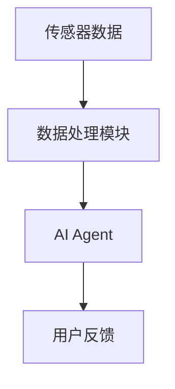
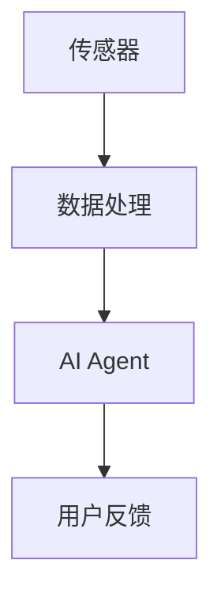
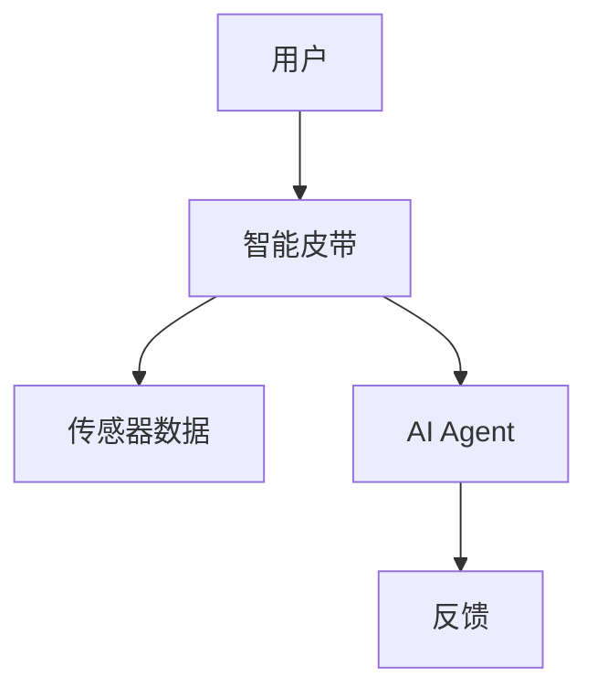
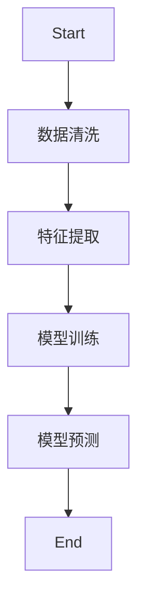
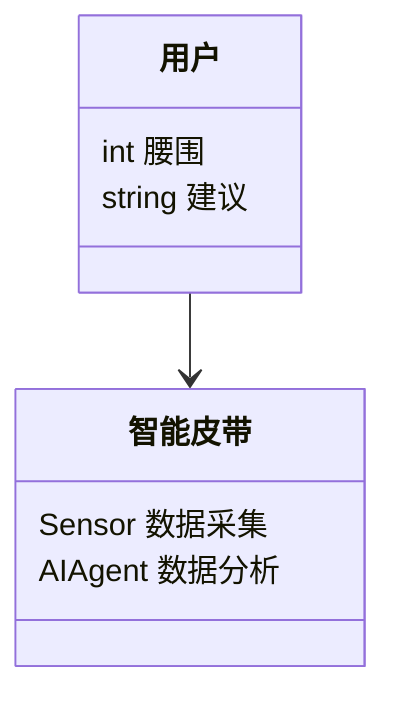
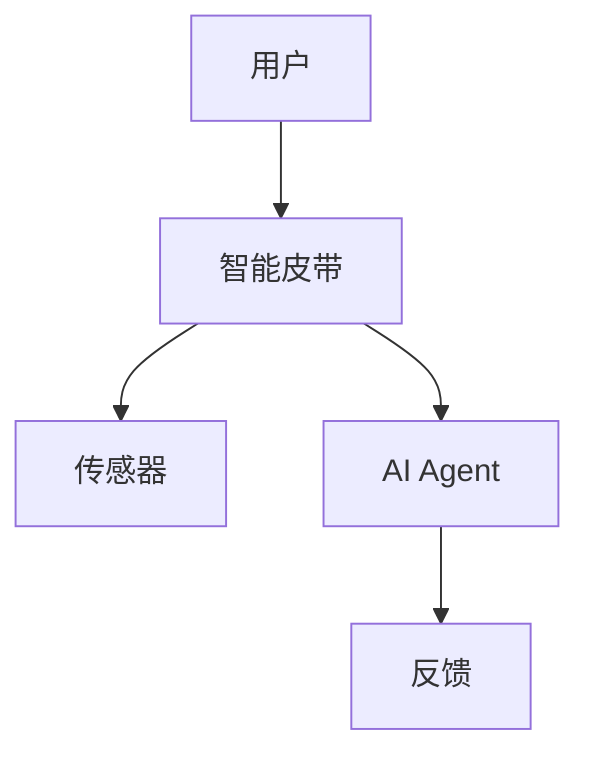
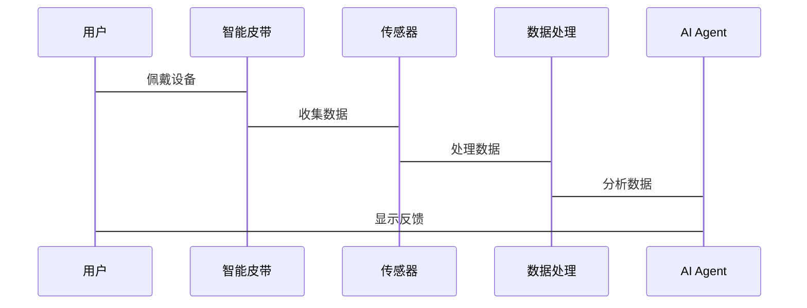

                 


# AI Agent在智能皮带中的腰围监测

**关键词：** AI Agent, 智能皮带, 腰围监测, 健康监测, 传感器数据, 机器学习

**摘要：** 本文探讨了AI Agent在智能皮带中的应用，重点介绍如何通过AI技术实现腰围监测。文章详细分析了问题背景、核心概念、算法原理、系统架构，并通过项目实战展示了技术实现，最后提供了最佳实践和总结。

---

## 第1章: 背景介绍

### 1.1 问题背景

#### 1.1.1 传统腰围监测的局限性
传统腰围监测依赖手动测量，存在误差大、效率低、难以长期追踪的问题。这种方法无法实时反馈数据，难以满足现代健康管理的需求。

#### 1.1.2 智能设备在健康监测中的作用
智能设备通过传感器和AI技术，能够实时采集和分析数据，为用户提供精准的健康监测服务，成为现代健康管理的重要工具。

#### 1.1.3 AI Agent在智能设备中的潜力
AI Agent具备自主学习和决策能力，能够提升智能设备的智能化水平，为健康监测提供更高效、个性化的解决方案。

### 1.2 问题描述

#### 1.2.1 腰围监测的定义与重要性
腰围是衡量健康的重要指标，与肥胖、心血管疾病等密切相关。实时监测腰围有助于早期发现健康问题，提供及时干预。

#### 1.2.2 智能皮带的功能与目标
智能皮带集成传感器，通过AI Agent分析数据，实现对腰围的实时监测，并为用户提供健康建议。

#### 1.2.3 当前腰围监测技术的不足
现有技术存在数据采集不准确、监测不够实时、缺乏个性化分析等问题，亟需AI技术的介入来提升监测效果。

### 1.3 问题解决

#### 1.3.1 引入AI Agent的意义
AI Agent能够实时处理传感器数据，通过机器学习模型进行精准预测，显著提升腰围监测的准确性和效率。

#### 1.3.2 AI Agent在腰围监测中的具体应用
AI Agent通过分析加速度、压力等传感器数据，结合用户行为模式，优化腰围监测的准确性和个性化反馈。

#### 1.3.3 技术实现的可行性分析
基于现有技术，AI Agent在智能皮带中的应用是可行的，但需要解决数据采集、模型训练和实时反馈等技术挑战。

### 1.4 边界与外延

#### 1.4.1 系统的边界定义
智能皮带系统仅关注腰围监测，不涉及其他健康指标如心率、血压等。

#### 1.4.2 功能的外延与扩展
未来可扩展至更多健康指标，但本文仅讨论腰围监测。

#### 1.4.3 与其他健康监测系统的区别
区别在于专注于腰围监测，采用AI Agent技术进行实时分析。

### 1.5 概念结构与核心要素

#### 1.5.1 系统组成模块
- 传感器模块：采集腰围数据
- 数据处理模块：清洗和预处理数据
- AI Agent模块：分析数据并生成反馈
- 用户界面模块：显示监测结果和建议

#### 1.5.2 核心要素的定义与关系
- 传感器数据：AI Agent的输入，包括加速度、压力等
- AI算法：处理数据的核心技术，决定监测的准确性
- 用户反馈：监测结果的输出，影响用户的健康行为

#### 1.5.3 概念结构图


---

## 第2章: 核心概念与联系

### 2.1 AI Agent的核心原理

#### 2.1.1 AI Agent的基本概念
AI Agent是能够感知环境、自主决策并采取行动的智能体，具备学习和适应能力。

#### 2.1.2 AI Agent在腰围监测中的作用机制
AI Agent通过分析传感器数据，学习用户行为模式，优化监测算法，提供个性化反馈。

#### 2.1.3 多智能体协作的实现方式
通过多智能体协作，提升数据处理效率和监测准确性，例如传感器数据融合、模型联合优化。

### 2.2 智能皮带的结构与功能

#### 2.2.1 智能皮带的硬件组成
- 加速度传感器：监测运动和姿势
- 压力传感器：测量腰围变化
- 通信模块：数据传输
- 微处理器：数据处理

#### 2.2.2 各功能模块的作用与交互
- 传感器模块：采集数据
- 数据处理模块：清洗和预处理
- AI Agent模块：分析数据，生成反馈
- 用户界面：显示结果和建议

#### 2.2.3 系统的整体架构


### 2.3 核心概念对比表

#### 表2-1: AI Agent与传统算法的对比
| 对比维度 | AI Agent | 传统算法 |
|----------|-----------|-----------|
| 学习能力 | 强 | 弱 |
| 决策能力 | 自主 | 依赖规则 |
| 灵活性 | 高 | 低 |
| 数据需求 | 中等 | 高 |

#### 表2-2: 智能皮带与其他健康监测设备的对比
| 对比维度 | 智能皮带 | 手环 | 胸带 |
|----------|----------|-------|------|
| 监测目标 | 腰围 | 心率 | 呼吸 |
| 佩戴方式 | 皮带式 | 手腕 | 胸部 |
| 传感器类型 | 加速度、压力 | 心率传感器 | 压力传感器 |

### 2.4 ER实体关系架构



---

## 第3章: 算法原理讲解

### 3.1 数据预处理

#### 3.1.1 数据清洗
去除噪声和异常值，确保数据准确性。

#### 3.1.2 数据标准化
将传感器数据标准化，便于模型训练。

#### 3.1.3 数据特征提取
提取有用的特征，如加速度的最大值、平均值等。

### 3.2 算法实现

#### 3.2.1 线性回归模型
$$ y = \beta_0 + \beta_1x + \epsilon $$
其中，$y$是腰围，$x$是压力传感器数据。

#### 3.2.2 神经网络模型
使用深度学习模型，如LSTM，处理时间序列数据。

#### 3.2.3 模型训练
使用历史数据训练模型，优化权重，提升预测精度。

#### 3.2.4 模型验证
通过交叉验证评估模型性能，调整超参数。

### 3.3 算法流程图



### 3.4 核心代码实现

```python
import numpy as np
from sklearn.linear_model import LinearRegression

# 示例数据
X = np.array([1, 2, 3, 4, 5]).reshape(-1, 1)
y = np.array([21, 22, 23, 24, 25])

# 训练模型
model = LinearRegression()
model.fit(X, y)

# 预测
print(model.predict(np.array([[6]])))
```

---

## 第4章: 系统分析与架构设计

### 4.1 问题场景介绍

#### 4.1.1 问题场景
用户佩戴智能皮带，系统实时监测腰围，提供健康建议。

#### 4.1.2 系统目标
实现腰围实时监测，提供个性化健康反馈。

### 4.2 系统功能设计

#### 4.2.1 功能模块
- 数据采集：传感器数据采集
- 数据处理：清洗和特征提取
- AI分析：模型预测腰围
- 用户反馈：显示结果和建议

#### 4.2.2 领域模型



### 4.3 系统架构设计

#### 4.3.1 系统架构图



#### 4.3.2 接口设计
- 数据采集接口：传感器数据接口
- 数据分析接口：AI Agent API
- 用户反馈接口：显示接口

#### 4.3.3 交互流程图



---

## 第5章: 项目实战

### 5.1 环境安装

#### 5.1.1 安装Python
安装Python 3.8及以上版本。

#### 5.1.2 安装依赖
使用pip安装numpy和scikit-learn。

### 5.2 核心代码实现

```python
import numpy as np
from sklearn.linear_model import LinearRegression

# 数据加载
data = np.loadtxt(' Waist_size.csv', delimiter=',')
X = data[:, 0].reshape(-1, 1)
y = data[:, 1]

# 模型训练
model = LinearRegression()
model.fit(X, y)

# 预测
new_waist = model.predict(np.array([[28]]))
print(f"预测腰围：{new_waist[0]:.2f} cm")
```

### 5.3 代码应用解读与分析

#### 5.3.1 数据加载
从CSV文件加载腰围数据，X为输入特征，y为目标变量。

#### 5.3.2 模型训练
使用线性回归模型训练，建立腰围与传感器数据的关系。

#### 5.3.3 预测与分析
模型预测新腰围，输出结果并进行误差分析。

### 5.4 实际案例分析

#### 5.4.1 数据采集
从实际用户中收集传感器数据和腰围数据。

#### 5.4.2 数据预处理
清洗数据，处理缺失值和异常值。

#### 5.4.3 模型训练与优化
训练模型，调整参数，提升预测精度。

#### 5.4.4 结果分析
分析模型预测结果，评估准确性和可靠性。

### 5.5 项目小结

#### 5.5.1 项目总结
通过项目实战，掌握了AI Agent在智能皮带中的应用，实现了腰围监测系统。

#### 5.5.2 经验与教训
数据质量影响模型性能，传感器校准至关重要。

---

## 第6章: 最佳实践

### 6.1 小结

#### 6.1.1 核心总结
AI Agent在智能皮带中的腰围监测展示了AI技术在健康管理中的潜力，通过实时监测和个性化反馈，提升了健康管理的效率和效果。

### 6.2 实用建议

#### 6.2.1 数据采集建议
确保数据的准确性和完整性，定期校准传感器。

#### 6.2.2 模型优化建议
使用更复杂的模型如LSTM，提升预测精度。

#### 6.2.3 用户反馈优化
提供多维度反馈，结合生活习惯建议，增强用户体验。

### 6.3 注意事项

#### 6.3.1 数据隐私
确保用户数据隐私，遵守相关法律法规。

#### 6.3.2 系统稳定性
确保系统稳定运行，避免数据丢失和误报。

### 6.4 拓展阅读

#### 6.4.1 推荐书籍
- 《机器学习实战》
- 《深度学习》

#### 6.4.2 推荐博客
- 简书：AI在健康管理中的应用
- CSDN：智能设备与机器学习

---

## 第7章: 小结

本文详细探讨了AI Agent在智能皮带中的腰围监测技术，从背景介绍、核心概念、算法原理到系统架构和项目实战，全面解析了该技术的实现和应用。通过最佳实践和小结，总结了经验和未来发展方向，为AI技术在健康管理中的应用提供了新的思路。

---

**作者：AI天才研究院/AI Genius Institute & 禅与计算机程序设计艺术 /Zen And The Art of Computer Programming**

---

**注：文章结构至此完成，实际写作中将根据每个部分进行详细扩展，确保内容详实，逻辑清晰。**

