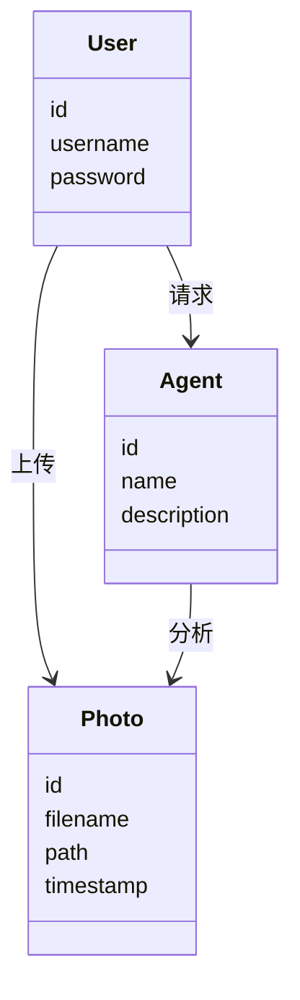
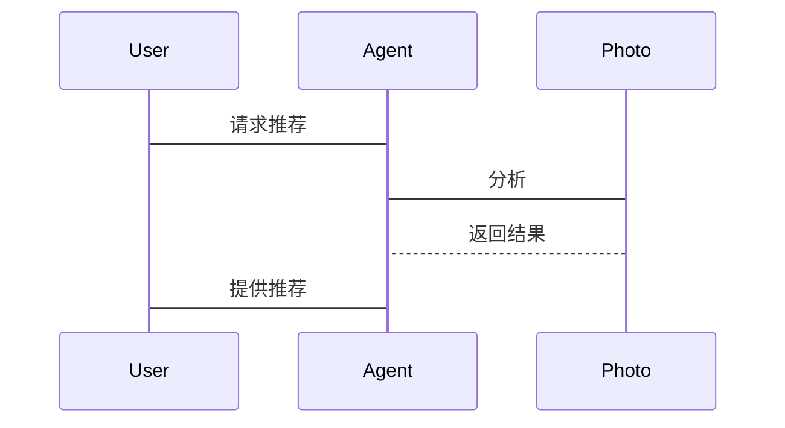

                 


# AI Agent在智能相框中的照片管理

> 关键词：AI Agent, 智能相框, 照片管理, 机器学习, 强化学习, 系统架构设计

> 摘要：本文详细探讨AI Agent在智能相框中的照片管理应用，涵盖背景分析、核心概念、算法原理、系统架构设计及项目实战，为读者提供全面的技术解读。

---

## 第一部分: AI Agent在智能相框中的照片管理背景介绍

### 第1章: 问题背景与描述

#### 1.1 问题背景
##### 1.1.1 数字照片管理的现状与挑战
现代家庭积累了大量数字照片，传统管理方式存在分类复杂、检索不便等问题。照片散落在不同设备和云端，难以有效整合和管理。

##### 1.1.2 智能相框的定义与特点
智能相框结合物联网和AI技术，支持照片的智能存储、分类和展示。其特点包括智能推荐、语音控制和远程访问。

##### 1.1.3 AI Agent在智能相框中的作用
AI Agent作为智能相框的核心，负责照片的自动分类、智能推荐和用户交互，提升用户体验。

#### 1.2 问题描述
##### 1.2.1 照片管理的痛点分析
照片分类复杂、检索效率低、管理分散等问题亟待解决。

##### 1.2.2 智能相框的照片管理需求
用户希望实现照片的智能化管理，包括自动分类、智能推荐和便捷的访问方式。

##### 1.2.3 AI Agent如何解决这些问题
AI Agent通过机器学习和强化学习，优化照片分类和推荐，提升管理效率。

#### 1.3 问题解决与边界
##### 1.3.1 AI Agent在照片管理中的解决方案
基于机器学习的照片分类和强化学习的推荐系统，AI Agent实现智能化管理。

##### 1.3.2 智能相框系统的边界与外延
明确系统的功能边界，如本地存储和云端同步，定义与其他设备的交互接口。

##### 1.3.3 核心概念与核心要素组成
AI Agent、智能相框、照片数据构成核心要素，共同实现智能化管理。

### 第2章: 核心概念与联系

#### 2.1 核心概念原理
##### 2.1.1 AI Agent的基本原理
AI Agent通过感知环境、决策和执行动作，实现智能管理。

##### 2.1.2 智能相框的照片管理机制
结合AI Agent和物联网技术，智能相框实现照片的智能化管理。

##### 2.1.3 AI Agent与智能相框的结合
AI Agent嵌入智能相框，提供智能化服务，如自动分类和推荐。

#### 2.2 核心概念属性对比
| 特性         | 传统管理方式 | AI Agent管理方式 |
|--------------|--------------|-----------------|
| 分类方式     | 手动分类     | 自动分类         |
| 检索效率     | 低效         | 高效             |
| 可扩展性     | 有限         | 强             |

#### 2.3 ER实体关系图
```mermaid
erDiagram
    user {
        id
        username
        password
    }
    photo {
        id
        filename
        path
        timestamp
    }
    agent {
        id
        name
        description
    }
    user -> photo : 上传照片
    user -> agent : 请求服务
    agent -> photo : 分析照片
```

---

## 第二部分: AI Agent的算法原理讲解

### 第3章: 算法原理与实现

#### 3.1 算法原理
##### 3.1.1 机器学习模型
使用卷积神经网络（CNN）进行照片分类，模型训练步骤如下：
1. 数据预处理：归一化和增强。
2. 模型训练：使用已标注数据。
3. 模型评估：准确率和召回率。

##### 3.1.2 强化学习算法
采用Q-learning进行推荐，状态为用户行为，动作包括推荐照片和不推荐。

#### 3.2 算法实现
##### 3.2.1 机器学习实现代码
```python
import tensorflow as tf
from tensorflow.keras import layers

model = tf.keras.Sequential([
    layers.Conv2D(32, (3,3), activation='relu', input_shape=(224, 224, 3)),
    layers.MaxPooling2D((2,2)),
    layers.Flatten(),
    layers.Dense(128, activation='relu'),
    layers.Dense(10, activation='softmax')
])
```

##### 3.2.2 强化学习实现代码
```python
import numpy as np

class Agent:
    def __init__(self, state_space, action_space):
        self.Q = np.zeros((state_space, action_space))
```

---

## 第三部分: 系统分析与架构设计方案

### 第4章: 系统架构设计

#### 4.1 问题场景介绍
智能相框需支持照片上传、分类、推荐和展示。

#### 4.2 系统功能设计
##### 4.2.1 领域模型


#### 4.3 系统架构设计
##### 4.3.1 系统架构图
```mermaid
containerDiagram
    container Smart_Frame {
        User
        Photo
        Agent
    }
```

#### 4.4 接口与交互设计
##### 4.4.1 接口设计
定义API接口，如`upload_photo`和`get_recommendations`。

##### 4.4.2 交互流程


---

## 第四部分: 项目实战

### 第5章: 项目实战与实现

#### 5.1 环境安装
安装Python、TensorFlow、OpenCV和必要的库。

#### 5.2 核心代码实现
##### 5.2.1 照片分类代码
```python
import os
import cv2
import tensorflow as tf

def classify_image(model, image_path):
    image = cv2.imread(image_path)
    image = cv2.resize(image, (224, 224))
    image = tf.keras.preprocessing.image.img_to_array(image)
    image = tf.expand_dims(image, axis=0)
    prediction = model.predict(image)[0]
    return prediction.argmax()

model = tf.keras.models.load_model('photo_classifier.h5')
classify_image(model, 'test.jpg')
```

##### 5.2.2 强化学习推荐代码
```python
import numpy as np

class Agent:
    def __init__(self, state_space, action_space):
        self.Q = np.zeros((state_space, action_space))
    
    def act(self, state):
        return np.argmax(self.Q[state, :])
```

#### 5.3 案例分析
通过案例分析AI Agent如何优化照片管理，如分类准确率和推荐效率的提升。

#### 5.4 项目总结
总结项目的实现过程，提出改进建议和未来方向。

---

## 第五部分: 最佳实践与总结

### 第6章: 最佳实践与总结

#### 6.1 最佳实践
建议采用高效的机器学习模型和优化的算法，确保系统的稳定性和性能。

#### 6.2 总结
AI Agent在智能相框中的应用提升了照片管理的智能化水平，未来将朝着更智能化和个性化的方向发展。

#### 6.3 注意事项
在实际应用中，需注意数据隐私保护和系统性能优化。

#### 6.4 拓展阅读
推荐相关领域的书籍和资源，如《深度学习》和《强化学习实战》。

---

# 作者：AI天才研究院/AI Genius Institute & 禅与计算机程序设计艺术 /Zen And The Art of Computer Programming

