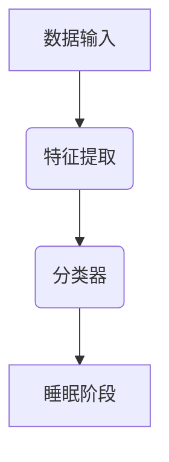
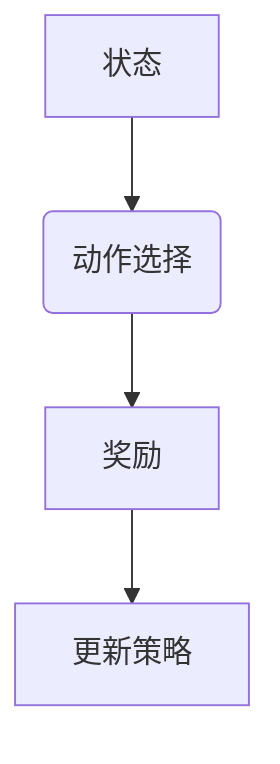
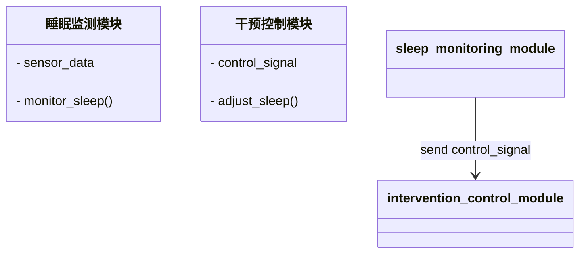
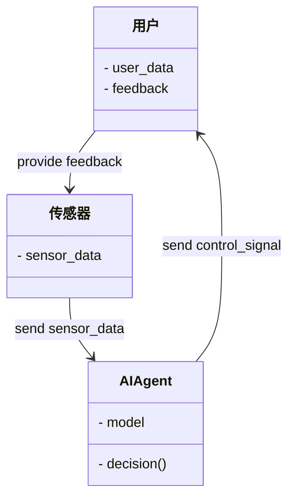
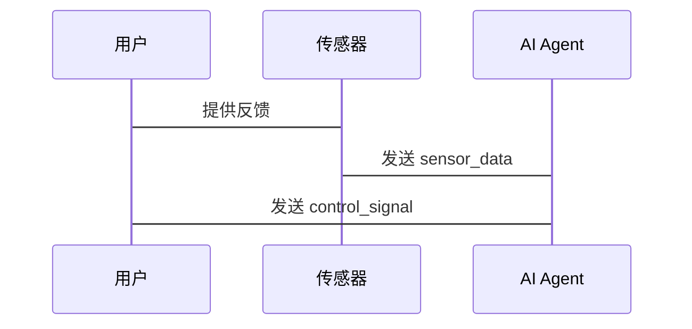

                 


# AI Agent在智能眼罩中的深度睡眠诱导

> 关键词：AI Agent, 智能眼罩, 深度睡眠, 机器学习, 强化学习, 睡眠监测

> 摘要：本文探讨了AI Agent在智能眼罩中的应用，重点介绍了其在深度睡眠诱导中的算法和系统设计。通过背景分析、核心概念对比、算法原理讲解、系统架构设计、项目实战以及总结，全面阐述了AI Agent如何优化睡眠质量，为读者提供科学的睡眠解决方案。

---

## 第1章：背景介绍

### 1.1 问题背景
1.1.1 现代睡眠问题的现状  
现代社会节奏加快，睡眠问题日益严重，影响健康。  
1.1.2 AI技术在健康领域的应用潜力  
AI技术在医疗和健康领域的应用越来越广泛，尤其是在睡眠监测和干预方面。

### 1.2 问题描述
1.2.1 深度睡眠的重要性  
深度睡眠对身体恢复和大脑功能至关重要。  
1.2.2 智能眼罩的功能需求  
智能眼罩需要实时监测睡眠状态并提供干预措施。

### 1.3 问题解决
1.3.1 AI Agent的作用  
AI Agent通过实时数据处理和决策，优化睡眠质量。  
1.3.2 智能眼罩的技术实现  
智能眼罩整合生物传感器和AI算法，提供个性化睡眠解决方案。

### 1.4 边界与外延
1.4.1 AI Agent的应用范围  
AI Agent不仅用于睡眠，还可应用于其他健康领域。  
1.4.2 智能眼罩的技术限制  
当前技术在准确性、舒适性和隐私保护方面仍需改进。

### 1.5 概念结构与核心要素
1.5.1 核心要素组成  
AI Agent、智能眼罩、生物传感器、机器学习模型、用户反馈。  
1.5.2 各要素之间的关系  
传感器数据输入AI Agent，AI Agent通过算法处理并输出控制信号，调整眼罩环境。

---

## 第2章：AI Agent的核心原理

### 2.1 基本原理
2.1.1 机器学习基础  
AI Agent基于机器学习模型，从数据中学习睡眠模式。  
2.1.2 强化学习机制  
AI Agent通过强化学习优化干预策略。

### 2.2 核心概念对比
2.2.1 AI Agent与传统算法对比  
| 特性 | AI Agent | 传统算法 |  
|------|-----------|-----------|  
| 自适应 | 高 | 低 |  
| 可扩展性 | 高 | 低 |  
2.2.2 智能眼罩与其他健康设备对比  
| 设备 | 智能眼罩 | 手环 | 智能床垫 |  
|------|-----------|---------|----------|  
| 功能 | 实时监测和干预 | 睡眠监测 | 睡眠监测 |  
| 优势 | 个性化干预 | 简单监测 | 简单监测 |  

### 2.3 ER实体关系图
AI Agent与智能眼罩的交互关系：  
```mermaid
er
actor AI Agent {
  id
  sleep_data
  decision
}
actor 智能眼罩 {
  id
  sensor_data
  control_signal
}
AI Agent --> 智能眼罩: send control_signal
智能眼罩 --> AI Agent: send sensor_data
```

---

## 第3章：深度睡眠诱导算法

### 3.1 算法原理
3.1.1 基于深度学习的睡眠监测  

3.1.2 强化学习的应用  


### 3.2 数学模型与公式
3.2.1 睡眠监测模型  
$$y = f(x)$$  
其中，$x$是输入特征，$y$是睡眠阶段预测结果。  
3.2.2 强化学习奖励函数  
$$R(s, a) = r$$  
其中，$s$是状态，$a$是动作，$r$是奖励值。

### 3.3 代码实现
3.3.1 睡眠监测代码示例  
```python
import numpy as np
from sklearn.model_selection import train_test_split

# 数据预处理
X = np.load('sleep_data.npy')
y = np.load('labels.npy')

X_train, X_test, y_train, y_test = train_test_split(X, y, test_size=0.2)

# 模型训练
model = SomeModel()
model.fit(X_train, y_train)

# 预测
y_pred = model.predict(X_test)
```

---

## 第4章：系统分析与架构设计

### 4.1 系统架构设计
4.1.1 系统功能模块  


### 4.2 系统架构设计
4.2.1 项目介绍  
智能眼罩系统整合生物传感器、AI算法和用户反馈，提供个性化睡眠解决方案。  
4.2.2 系统功能设计  


### 4.3 系统接口设计
4.3.1 接口设计  
- 用户接口：显示睡眠状态和控制选项。  
- 传感器接口：收集生理数据并传输给AI Agent。  
- AI Agent接口：接收数据，处理并输出控制信号。  

### 4.4 系统交互流程


---

## 第5章：项目实战

### 5.1 环境安装
5.1.1 开发环境  
Python 3.8+, TensorFlow 2.0+,传感器 SDK。  

### 5.2 核心代码实现
5.2.1 AI Agent代码示例  
```python
import numpy as np
import tensorflow as tf

# 定义模型
model = tf.keras.Sequential([
    tf.keras.layers.Dense(64, activation='relu'),
    tf.keras.layers.Dense(10, activation='softmax')
])

model.compile(optimizer='adam', loss='sparse_categorical_crossentropy', metrics=['accuracy'])

# 训练模型
model.fit(X_train, y_train, epochs=10, batch_size=32)
```

### 5.3 代码解读与分析
5.3.1 代码功能解读  
上述代码定义了一个简单的神经网络模型，用于睡眠阶段分类。  

### 5.4 案例分析
5.4.1 实际案例  
用户A使用智能眼罩，AI Agent通过分析其睡眠数据，调整环境光线和声音，帮助其进入深度睡眠。  

### 5.5 项目小结  
通过实际案例分析，展示了AI Agent在智能眼罩中的应用效果和优化潜力。

---

## 第6章：总结与展望

### 6.1 总结  
本文详细探讨了AI Agent在智能眼罩中的应用，重点介绍了算法原理和系统设计。  

### 6.2 未来展望  
未来，AI Agent在睡眠健康领域的应用将更加广泛，算法将更加精准，设备将更加智能化。  

### 6.3 注意事项  
- 数据隐私保护  
- 算法可解释性  
- 设备舒适性  

### 6.4 拓展阅读  
推荐书籍：《深度学习》、《强化学习入门》。  

---

## 作者：AI天才研究院/AI Genius Institute & 禅与计算机程序设计艺术 /Zen And The Art of Computer Programming

---

以上是《AI Agent在智能眼罩中的深度睡眠诱导》的技术博客文章大纲，涵盖背景、核心概念、算法原理、系统设计、项目实战和总结，帮助读者全面理解AI Agent在智能眼罩中的应用。

