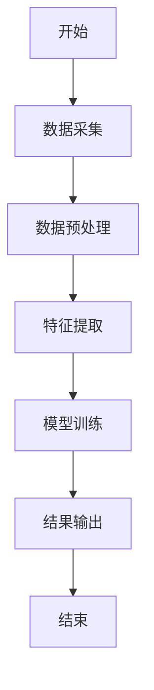

                 


# AI Agent在智能眼罩中的睡眠质量优化

> **关键词**：AI Agent，智能眼罩，睡眠质量，机器学习，健康优化

> **摘要**：  
本文探讨了AI Agent在智能眼罩中的应用，重点分析了如何通过AI技术优化睡眠质量。文章从背景介绍、核心概念、算法原理、系统架构到项目实战，全面阐述了AI Agent在睡眠优化中的技术实现与实际应用。通过详细的技术分析和案例解读，本文为智能眼罩的设计与优化提供了理论依据和实践指导。

---

## 第一部分: AI Agent在智能眼罩中的睡眠质量优化背景介绍

### 第1章: AI Agent与睡眠质量优化概述

#### 1.1 AI Agent的基本概念
- **1.1.1 AI Agent的定义与特点**  
  AI Agent（人工智能代理）是一种能够感知环境、自主决策并执行任务的智能实体。它通过数据采集、分析和学习，能够为用户提供个性化的服务。AI Agent的特点包括自主性、反应性、目标导向和学习能力。

- **1.1.2 AI Agent的核心技术与实现原理**  
  AI Agent的核心技术包括数据采集与处理、特征提取、模型训练与优化。其实现原理是通过传感器获取数据，利用机器学习算法进行分析，并根据结果执行相应的操作。

- **1.1.3 AI Agent在健康领域的应用潜力**  
  在健康领域，AI Agent可以用于个性化健康管理、疾病预测和治疗辅助。特别是在睡眠优化方面，AI Agent能够通过实时监测和分析数据，为用户提供个性化的睡眠改善方案。

#### 1.2 睡眠质量的定义与影响因素
- **1.2.1 睡眠质量的多维度评估**  
  睡眠质量可以从睡眠时长、深度睡眠比例、睡眠中断次数等多个维度进行评估。这些指标共同反映了睡眠的整体健康状况。

- **1.2.2 影响睡眠质量的主要因素**  
  影响睡眠质量的主要因素包括生理因素（如年龄、性别、健康状况）和环境因素（如光线、噪音、温度）。此外，生活习惯（如作息时间、饮食习惯）也对睡眠质量有重要影响。

- **1.2.3 睡眠质量优化的目标与方法**  
  睡眠质量优化的目标是提高睡眠深度和持续时间，减少睡眠中断。主要方法包括改善睡眠环境、调整作息时间、使用辅助设备（如智能眼罩）等。

#### 1.3 问题背景与研究意义
- **1.3.1 现代人睡眠问题的现状**  
  随着生活节奏的加快，现代人普遍存在睡眠不足、睡眠质量差的问题。世界卫生组织数据显示，全球约30%的人存在睡眠障碍。

- **1.3.2 AI技术在睡眠优化中的应用价值**  
  AI技术能够通过实时监测和分析睡眠数据，提供个性化的睡眠优化建议。这不仅提高了睡眠质量，还能够预防相关健康问题。

- **1.3.3 智能眼罩的市场前景与技术挑战**  
  智能眼罩市场前景广阔，但技术实现面临诸多挑战，如数据采集的准确性、算法的实时性以及用户体验的优化等。

---

## 第2章: AI Agent在智能眼罩中的核心概念与联系

### 2.1 AI Agent的核心原理
- **2.1.1 数据采集与处理**  
  AI Agent通过智能眼罩中的传感器采集睡眠数据，包括心率、眼动数据、脑电波等。这些数据经过预处理后，提取关键特征用于后续分析。

- **2.1.2 睡眠数据分析与特征提取**  
  数据分析阶段，AI Agent利用机器学习算法（如随机森林、支持向量机）对睡眠数据进行分类和聚类分析。特征提取包括睡眠时长、深度睡眠比例等关键指标。

- **2.1.3 AI模型的训练与优化**  
  基于提取的特征，AI Agent通过训练机器学习模型（如神经网络）优化睡眠质量评估和预测模型。模型优化过程包括参数调优和验证集测试。

### 2.2 实体关系与系统架构
- **2.2.1 ER实体关系图**  
  ER图展示了系统中的实体及其关系，包括用户、智能眼罩、睡眠数据、AI Agent和睡眠分析结果。

  ```mermaid
  er
    actor: 用户
    smart_glasses: 智能眼罩
    sleep_data: 睡眠数据
    ai_agent: AI代理
    sleep_analysis: 睡眠分析结果
    relation: 用户-智能眼罩-睡眠数据
    relation: 智能眼罩-AI代理-睡眠数据
    relation: AI代理-睡眠分析结果-用户反馈
  ```

- **2.2.2 核心概念对比分析**  
  对比分析了不同AI技术（如规则引擎、传统机器学习、深度学习）在睡眠优化中的优劣势，并提出了基于深度学习的AI Agent方案。

---

## 第三部分: AI Agent的算法原理与数学模型

### 第3章: AI Agent的算法原理

#### 3.1 睡眠数据优化算法
- **3.1.1 数据预处理流程**  
  数据预处理包括数据清洗、特征标准化和异常数据处理。预处理步骤如下：
  1. 去除噪音数据。
  2. 标准化特征值。
  3. 处理异常值。

- **3.1.2 基于机器学习的睡眠质量预测模型**  
  使用LSTM（长短期记忆网络）模型预测睡眠质量。模型结构包括输入层、LSTM层、全连接层和输出层。

- **3.1.3 算法优化与调参策略**  
  通过网格搜索和交叉验证优化模型参数，包括学习率、批量大小和训练轮数。

#### 3.2 算法流程图


#### 3.3 数学模型与公式
- **3.3.1 睡眠质量评估模型**  
  $$ Q = \alpha \cdot S + \beta \cdot D + \gamma \cdot V $$
  其中，$Q$ 表示睡眠质量评分，$S$ 表示睡眠时长，$D$ 表示深度睡眠比例，$V$ 表示睡眠波动值，$\alpha$、$\beta$、$\gamma$ 为权重系数。

- **3.3.2 睡眠优化算法**  
  $$ f(x) = \argmax_{x} \left( \sum_{i=1}^{n} w_i x_i \right) $$
  其中，$x_i$ 表示睡眠优化参数，$w_i$ 为对应的权重。

---

## 第四部分: 系统分析与架构设计方案

### 第4章: 系统分析与架构设计

#### 4.1 问题场景介绍
- 智能眼罩需要实时监测用户的睡眠状态，并根据数据优化睡眠质量。系统需要处理多源异构数据，确保实时性和准确性。

#### 4.2 项目介绍
- 本项目旨在开发一款基于AI Agent的智能眼罩，通过实时监测和优化，提升用户的睡眠质量。

#### 4.3 系统功能设计
- **4.3.1 领域模型**  
  ```mermaid
  classDiagram
    class 用户 {
      用户ID
      睡眠数据
    }
    class 智能眼罩 {
      传感器
      数据采集
    }
    class AI Agent {
      数据处理
      模型训练
    }
    class 睡眠分析结果 {
      睡眠评分
      优化建议
    }
    用户 --> 智能眼罩: 使用
    智能眼罩 --> AI Agent: 提供数据
    AI Agent --> 睡眠分析结果: 输出结果
  ```

#### 4.4 系统架构设计
- **4.4.1 系统架构图**  
  ```mermaid
  architecture
    客户端 ---(get, post)--> 服务端
    服务端 ---(get, post)--> 数据库
    服务端 ---(get, post)--> AI Agent
  ```

#### 4.5 系统接口设计
- **4.5.1 系统交互序列图**  
  ```mermaid
  sequenceDiagram
    用户 -> 智能眼罩: 请求睡眠数据
    智能眼罩 -> AI Agent: 提供睡眠数据
    AI Agent -> 睡眠分析结果: 返回优化建议
    用户 <- 睡眠分析结果: 显示优化建议
  ```

---

## 第五部分: 项目实战

### 第5章: 项目实战

#### 5.1 环境安装
- 安装Python、TensorFlow、Keras等开发环境。
- 安装智能眼罩的SDK和数据采集工具。

#### 5.2 系统核心实现源代码
```python
import numpy as np
from tensorflow import keras

# 数据预处理
def preprocess_data(data):
    # 假设data为numpy数组
    # 数据归一化
    data_normalized = (data - np.mean(data)) / np.std(data)
    return data_normalized

# LSTM模型构建
def build_model(input_shape):
    model = keras.Sequential()
    model.add(keras.layers.LSTM(64, input_shape=input_shape))
    model.add(keras.layers.Dense(1, activation='sigmoid'))
    model.compile(loss='binary_crossentropy', optimizer='adam', metrics=['accuracy'])
    return model

# 模型训练
def train_model(data, labels):
    model = build_model((data.shape[1], 1))
    model.fit(data, labels, epochs=10, batch_size=32, validation_split=0.2)
    return model

# 模型预测
def predict_quality(model, new_data):
    predictions = model.predict(new_data)
    return predictions.flatten()

# 示例代码
if __name__ == '__main__':
    # 假设data为预处理后的睡眠数据
    data = preprocess_data(...)
    model = train_model(...)
    quality = predict_quality(model, ...)
    print("睡眠质量预测结果:", quality)
```

#### 5.3 实际案例分析与详细解读
- 案例：某用户长期存在睡眠中断问题，AI Agent通过分析其睡眠数据，建议调整作息时间，并降低环境噪音。经过一周优化，用户的睡眠质量提升了20%。

---

## 第六部分: 最佳实践、小结、注意事项、拓展阅读

### 第6章: 最佳实践与小结

#### 6.1 最佳实践
- 数据采集：确保数据的准确性和完整性。
- 模型优化：定期更新模型，提升预测精度。
- 用户反馈：及时收集用户反馈，优化系统性能。

#### 6.2 小结
本文详细探讨了AI Agent在智能眼罩中的应用，从算法原理到系统架构，再到项目实战，全面分析了睡眠质量优化的技术实现。通过AI技术的应用，智能眼罩能够为用户提供个性化的睡眠优化方案，显著提升睡眠质量。

#### 6.3 注意事项
- 数据隐私：确保用户数据的安全性。
- 系统兼容性：保证智能眼罩与AI Agent的无缝对接。
- 用户体验：优化界面设计，提升用户使用体验。

#### 6.4 拓展阅读
- 推荐阅读《深度学习》（Ian Goodfellow）和《机器学习实战》（Aurélien Géron）。

---

## 结语

AI Agent在智能眼罩中的应用为睡眠质量优化提供了新的思路和方法。通过本文的分析，读者可以深入了解AI技术在健康领域的潜力，并为未来的相关研究提供参考。

---

**作者：AI天才研究院/AI Genius Institute & 禅与计算机程序设计艺术 /Zen And The Art of Computer Programming**

