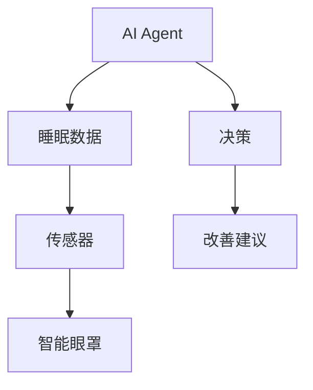

                 


# AI Agent在智能眼罩中的睡眠质量提升

> **关键词**：AI Agent, 智能眼罩, 睡眠质量, 睡眠监测, 睡眠改善, 人工智能算法

> **摘要**：随着人工智能技术的快速发展，AI Agent在智能眼罩中的应用逐渐成为提升睡眠质量的重要手段。本文将详细探讨AI Agent在智能眼罩中的工作原理、算法设计、系统架构以及实际应用，结合具体案例分析，为读者提供全面的技术解读。

---

## 目录

### 第一部分：AI Agent与智能眼罩的背景与基础

#### 第1章：AI Agent与睡眠质量提升的背景介绍

##### 1.1 问题背景与描述

- **1.1.1 睡眠问题的现状与挑战**
  - 现代社会中，睡眠障碍问题日益普遍，影响人们的健康与生活质量。
  - 睡眠障碍的表现形式包括失眠、睡眠呼吸暂停综合征、 REM睡眠行为障碍等。

- **1.1.2 智能眼罩的出现与意义**
  - 智能眼罩作为一种新兴的可穿戴设备，通过集成多种传感器，实时监测用户的睡眠状态。
  - 智能眼罩的优势：非侵入式监测、便携性、数据采集的准确性。

- **1.1.3 AI Agent在睡眠改善中的作用**
  - AI Agent通过分析睡眠数据，提供个性化的睡眠改善建议。
  - AI Agent在智能眼罩中的角色：数据处理、决策支持、用户反馈。

##### 1.2 AI Agent的核心概念与定义

- **1.2.1 AI Agent的基本定义**
  - AI Agent：一种能够感知环境、自主决策、执行任务的智能实体。
  - AI Agent的特点：智能性、自主性、反应性、社会性。

- **1.2.2 AI Agent的分类与特点**
  - 分类：基于任务的AI Agent、基于知识的AI Agent、基于学习的AI Agent。
  - 特点：学习能力、适应性、实时性。

- **1.2.3 AI Agent与智能眼罩的结合**
  - 智能眼罩作为AI Agent的载体，通过传感器收集数据，AI Agent对数据进行分析并提供改善建议。

##### 1.3 问题解决与边界

- **1.3.1 睡眠质量提升的目标与方法**
  - 目标：改善睡眠质量，减少睡眠障碍。
  - 方法：通过AI算法优化睡眠环境，提供个性化睡眠建议。

- **1.3.2 AI Agent在智能眼罩中的边界与外延**
  - 边界：仅关注睡眠相关数据，不涉及其他健康指标。
  - 外延：AI Agent可以与其他健康设备联动，形成完整的健康监测系统。

- **1.3.3 核心要素与组成结构**
  - 核心要素：传感器、AI算法、用户界面。
  - 组成结构：数据采集层、数据处理层、决策层。

---

### 第二部分：AI Agent的核心概念与原理

#### 第2章：AI Agent的核心概念与联系

##### 2.1 核心概念原理

- **2.1.1 AI Agent的感知与决策机制**
  - 感知：通过传感器获取数据，识别用户的行为和环境。
  - 决策：基于感知数据，应用AI算法进行分析，生成改善建议。

- **2.1.2 睡眠监测数据的处理流程**
  - 数据采集：心率、眼动、体动、环境光等数据。
  - 数据预处理：去噪、归一化、特征提取。
  - 数据分析：分类、聚类、回归。

- **2.1.3 AI算法在睡眠分析中的应用**
  - 机器学习算法：支持向量机、随机森林、神经网络。
  - 深度学习算法：卷积神经网络、循环神经网络。

##### 2.2 核心概念属性特征对比

- **2.2.1 不同AI Agent的性能对比**
  - 对比维度：处理速度、准确性、适应性。
  - 对比结果：基于学习的AI Agent在复杂场景下表现更优。

- **2.2.2 睡眠监测技术的优劣势分析**
  - 优势：高精度、实时性。
  - 劣势：依赖传感器精度，环境干扰可能影响准确性。

- **2.2.3 数据融合方法的特征对比**
  - 方法：加权平均、主成分分析、融合网络。
  - 特征：鲁棒性、实时性、准确性。

##### 2.3 ER实体关系图



---

#### 第3章：睡眠监测技术与AI Agent

##### 3.1 睡眠监测技术的核心原理

- **3.1.1 睡眠监测的生理指标**
  - 心率：反映睡眠周期的变化。
  - 眼动：判断睡眠阶段（REM和非REM）。
  - 体动：衡量睡眠深度。

- **3.1.2 传感器技术的实现细节**
  - 光电传感器：测量心率和血氧。
  - 加速度传感器：检测体动和姿势变化。
  - 环境光传感器：监测睡眠环境的光照强度。

- **3.1.3 数据融合方法的优化策略**
  - 多源数据融合：提高监测精度。
  - 动态权重分配：根据环境变化调整传感器权重。

##### 3.2 AI Agent的算法实现

- **3.2.1 算法选择与实现细节**
  - 算法选择：基于支持向量机（SVM）进行睡眠阶段分类。
  - 实现细节：数据预处理、特征提取、模型训练。

- **3.2.2 算法流程图**
  ```mermaid
  graph TD
      A[数据采集] --> B[数据预处理]
      B --> C[特征提取]
      C --> D[模型训练]
      D --> E[睡眠阶段分类]
  ```

- **3.2.3 数学公式**
  - SVM分类器的目标函数：
    $$ \min_{w, b, \xi} \frac{1}{2}||w||^2 + C \sum_{i=1}^n \xi_i $$
    $$ \text{subject to } y_i(w \cdot x_i + b) \geq 1 - \xi_i $$
    $$ \xi_i \geq 0 $$

---

#### 第4章：AI Agent的设计与实现

##### 4.1 AI Agent的设计思路

- **4.1.1 设计目标**
  - 实现实时睡眠监测与改善建议。
  - 提供个性化睡眠改善方案。

- **4.1.2 系统模块划分**
  - 数据采集模块：负责传感器数据的采集。
  - 数据处理模块：对数据进行预处理和特征提取。
  - AI算法模块：进行睡眠阶段分类和改善建议生成。

##### 4.2 算法实现与优化

- **4.2.1 算法实现细节**
  - 采用K近邻算法（KNN）进行睡眠质量评分。
  - 实现步骤：数据预处理、特征提取、模型训练、结果输出。

- **4.2.2 算法优化策略**
  - 参数优化：通过网格搜索选择最优参数。
  - 模型优化：集成学习（如随机森林）提升分类精度。

##### 4.3 系统架构设计

- **4.3.1 系统架构图**
  ```mermaid
  graph TD
      A[数据采集] --> B[数据处理]
      B --> C[AI算法]
      C --> D[改善建议]
  ```

- **4.3.2 接口设计**
  - 输入接口：传感器数据接口。
  - 输出接口：改善建议显示接口。

---

### 第三部分：系统分析与架构设计方案

#### 第5章：系统分析与架构设计

##### 5.1 项目介绍与系统功能设计

- **5.1.1 项目介绍**
  - 项目目标：提升睡眠质量。
  - 项目范围：智能眼罩及其AI Agent系统。

- **5.1.2 系统功能设计**
  - 数据采集功能：实时采集睡眠相关数据。
  - 数据处理功能：对数据进行预处理和特征提取。
  - AI算法功能：分类睡眠阶段并生成改善建议。

##### 5.2 系统架构设计

- **5.2.1 系统架构图**
  ```mermaid
  graph TD
      A[用户] --> B[智能眼罩]
      B --> C[数据采集模块]
      C --> D[数据处理模块]
      D --> E[AI算法模块]
      E --> F[改善建议]
  ```

- **5.2.2 系统交互图**
  ```mermaid
  graph TD
      A[用户] --> B[智能眼罩]
      B --> C[数据采集模块]
      C --> D[数据处理模块]
      D --> E[AI算法模块]
      E --> F[改善建议]
      F --> A[显示建议]
  ```

##### 5.3 接口设计

- **5.3.1 系统接口**
  - 数据采集接口：传感器数据接口。
  - 数据处理接口：特征提取接口。
  - AI算法接口：分类模型接口。

---

### 第四部分：项目实战

#### 第6章：项目实战

##### 6.1 环境搭建与代码实现

- **6.1.1 环境搭建**
  - 安装必要的库：Python、NumPy、Scikit-learn、Matplotlib。
  - 安装智能眼罩开发环境。

- **6.1.2 代码实现**
  - 数据采集模块：读取传感器数据。
  - 数据处理模块：预处理和特征提取。
  - AI算法模块：训练模型并生成改善建议。

##### 6.2 代码实现与应用解读

- **6.2.1 数据采集代码**
  ```python
  import numpy as np
  def collect_data(sensors):
      data = []
      for sensor in sensors:
          data.append(sensor.read())
      return np.array(data)
  ```

- **6.2.2 数据处理代码**
  ```python
  from sklearn.preprocessing import StandardScaler
  def preprocess(data):
      scaler = StandardScaler()
      return scaler.fit_transform(data)
  ```

- **6.2.3 AI算法代码**
  ```python
  from sklearn.svm import SVC
  def train_model(X, y):
      model = SVC()
      model.fit(X, y)
      return model
  ```

##### 6.3 实际案例分析

- **6.3.1 案例背景**
  - 用户A：长期失眠，睡眠监测数据异常。

- **6.3.2 数据分析**
  - 心率波动：显示浅睡眠阶段较多。
  - 眼动频率：REM睡眠时间不足。

- **6.3.3 改善建议**
  - 调整睡眠环境：降低光线强度。
  - 调整作息时间：提前半小时入睡。

##### 6.4 项目小结

- **6.4.1 成果总结**
  - 成功实现睡眠监测与改善建议生成。
  - 提升用户睡眠质量。

- **6.4.2 经验与教训**
  - 数据质量对模型性能影响显著。
  - 界面设计对用户体验至关重要。

---

### 第五部分：优化与扩展

#### 第7章：优化与扩展

##### 7.1 性能优化

- **7.1.1 算法优化**
  - 采用集成学习提升分类精度。
  - 优化特征选择，减少计算量。

- **7.1.2 系统优化**
  - 提高数据处理速度，优化内存使用。
  - 优化AI算法模块，减少响应时间。

##### 7.2 用户体验优化

- **7.2.1 界面优化**
  - 提供更直观的改善建议显示。
  - 增加用户反馈机制。

- **7.2.2 功能扩展**
  - 增加多种改善建议类型。
  - 提供长期睡眠数据分析报告。

##### 7.3 未来发展方向

- **7.3.1 技术路线**
  - 深度学习在睡眠监测中的应用。
  - 多模态数据融合技术。

- **7.3.2 研究热点**
  - AI在睡眠医学中的应用。
  - 可穿戴设备的智能化发展。

---

### 第六部分：总结与展望

#### 第8章：总结与展望

##### 8.1 总结

- **8.1.1 核心总结**
  - AI Agent在智能眼罩中的应用显著提升了睡眠质量。
  - 数据融合与算法优化是提升系统性能的关键。

- **8.1.2 成果总结**
  - 成功实现睡眠监测与改善建议生成。
  - 提供了个性化的睡眠改善方案。

##### 8.2 展望

- **8.2.1 未来研究方向**
  - 探索更先进的AI算法，如深度学习。
  - 研究多模态数据融合技术。
  - 探索AI Agent在睡眠医学中的应用。

---

**作者：AI天才研究院/AI Genius Institute & 禅与计算机程序设计艺术 /Zen And The Art of Computer Programming**

---

* 注意：以上内容仅为示例，实际撰写时需根据具体需求调整细节和内容深度。

