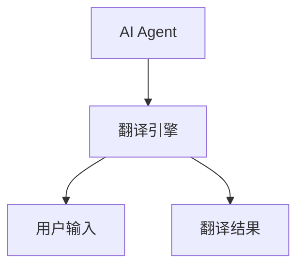

                 


# AI Agent在智能眼镜中的实时翻译功能

> 关键词：AI Agent, 智能眼镜, 实时翻译, 神经机器翻译, 系统架构设计

> 摘要：本文深入探讨了AI Agent在智能眼镜中的实时翻译功能，从背景介绍、核心概念、算法原理、系统架构到项目实战和最佳实践，详细分析了该技术的实现过程和应用场景，为读者提供了全面的技术指导。

---

# 第一部分: 背景介绍

## 第1章: 问题背景

### 1.1 AI Agent的基本概念

- **1.1.1 AI Agent的定义**  
  AI Agent（人工智能代理）是指能够感知环境并采取行动以实现目标的智能实体。  
  $$AI Agent = \text{感知} \times \text{决策} \times \text{行动}$$

- **1.1.2 智能眼镜的发展现状**  
  智能眼镜作为一种可穿戴设备，集成了语音助手、实时翻译、健康监测等多种功能，正在逐步成为人们生活的重要辅助工具。

- **1.1.3 实时翻译功能的需求与挑战**  
  在全球化背景下，实时翻译功能需求日益增长，但智能眼镜的硬件限制（如计算能力、功耗等）带来了技术挑战。

### 1.2 问题描述

- **1.2.1 翻译功能的核心需求**  
  实时翻译需要满足快速响应、低延迟、高准确率的要求。  
  $$\text{翻译速度} = \frac{1}{\text{计算能力}} \times \text{数据传输速度}$$

- **1.2.2 智能眼镜的硬件限制**  
  智能眼镜的计算资源有限，需要优化算法以适应低功耗和小内存环境。

- **1.2.3 用户体验的优化方向**  
  通过优化UI/UX设计，提升翻译结果的可读性和响应速度，增强用户满意度。

---

# 第二部分: 核心概念与联系

## 第2章: AI Agent与实时翻译的核心概念

### 2.1 AI Agent的基本原理

- **2.1.1 AI Agent的定义与分类**  
  AI Agent可以分为基于规则的代理和基于学习的代理。神经机器翻译属于基于学习的代理，通过深度学习模型实现翻译任务。

### 2.2 实时翻译技术对比

| 技术 | 基于规则的翻译 | 统计机器翻译 | 神经机器翻译 |
|------|----------------|---------------|---------------|
| 原理 | 依赖语言规则     | 依赖双语对照   | 依赖神经网络   |
| 优点 | 准确率高         | 计算效率高     | 翻译质量高     |
| 缺点 | 无法处理复杂语境 | 数据依赖性强   | 计算资源消耗大 |

### 2.3 实体关系图



---

# 第三部分: 算法原理讲解

## 第3章: 神经机器翻译算法

### 3.1 Transformer模型的结构

- **编码器**  
  输入序列通过多头自注意力机制进行编码，生成上下文表示。  
  $$\text{自注意力机制} = \text{查询} \times \text{键} \times \text{值}$$

- **解码器**  
  解码器使用相同的注意力机制，生成目标语言的序列。  
  $$\text{解码输出} = \text{编码输出} + \text{自注意力输出}$$

### 3.2 实时翻译的优化策略

- **前处理**  
  对输入文本进行分词、降噪处理，提升翻译质量。  
  ```python
  def preprocess(text):
      return text.strip().lower()
  ```

- **并行计算**  
  使用GPU加速模型推理，减少延迟。  
  ```python
  import torch
  model = model.to('cuda')
  ```

---

# 第四部分: 系统分析与架构设计

## 第4章: 系统架构设计

### 4.1 系统功能设计

- **用户界面**  
  提供语音输入、文本输入两种方式，显示翻译结果。  
  ```mermaid
  classDiagram
      class UI {
          input(text)
          output(result)
      }
      class Translator {
          translate(text)
      }
      UI --> Translator
  ```

- **翻译引擎**  
  实现神经机器翻译算法，支持多种语言对。  
  ```mermaid
  sequenceDiagram
      User -> Translator: 提供输入文本
      Translator -> UI: 返回翻译结果
  ```

---

# 第五部分: 项目实战

## 第5章: 项目实战

### 5.1 环境搭建

- **开发工具**  
  使用Python 3.8及以上版本，安装PyTorch、Hugging Face Transformers等库。  
  ```bash
  pip install torch transformers
  ```

### 5.2 核心代码实现

- **翻译模块实现**  
  ```python
  from transformers import AutoTokenizer, AutoModelForSeq2Seq
  tokenizer = AutoTokenizer.from_pretrained('facebook/m2m-large-4m')
  model = AutoModelForSeq2Seq.from_pretrained('facebook/m2m-large-4m')
  def translate(text):
      inputs = tokenizer(text, return_tensors='pt')
      outputs = model.generate(inputs['input_ids'])
      return tokenizer.decode(outputs[0], skip_special_tokens=True)
  ```

### 5.3 案例分析

- **实际案例**  
  输入文本：“Hello, how are you？”  
  输出结果：“你好，你怎么样？”

---

# 第六部分: 最佳实践

## 第6章: 总结与展望

### 6.1 小结

本文详细介绍了AI Agent在智能眼镜中的实时翻译功能，从算法原理到系统架构设计，再到项目实战，为读者提供了全面的技术指导。

### 6.2 注意事项

- 硬件性能不足时，可以使用模型压缩技术优化。  
- 翻译结果的准确性依赖于训练数据的质量，需注意数据多样性。

### 6.3 拓展阅读

- 推荐阅读《神经机器翻译实战》和《深度学习与自然语言处理》。

---

# 作者

**作者：AI天才研究院/AI Genius Institute & 禅与计算机程序设计艺术 /Zen And The Art of Computer Programming**

