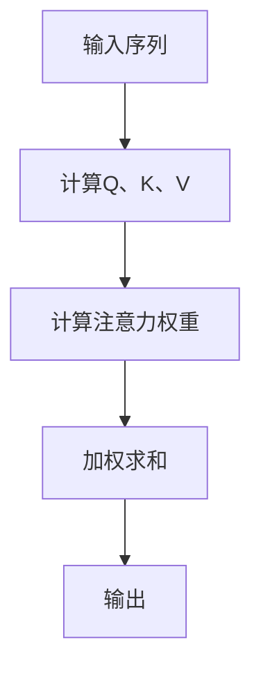
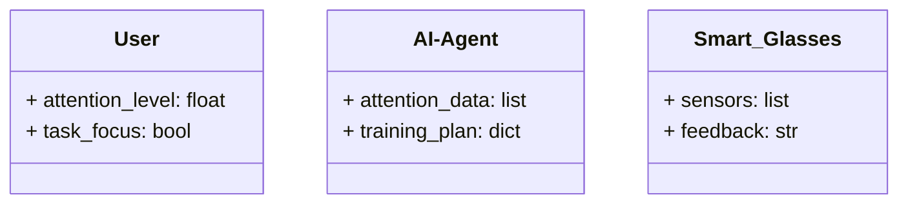
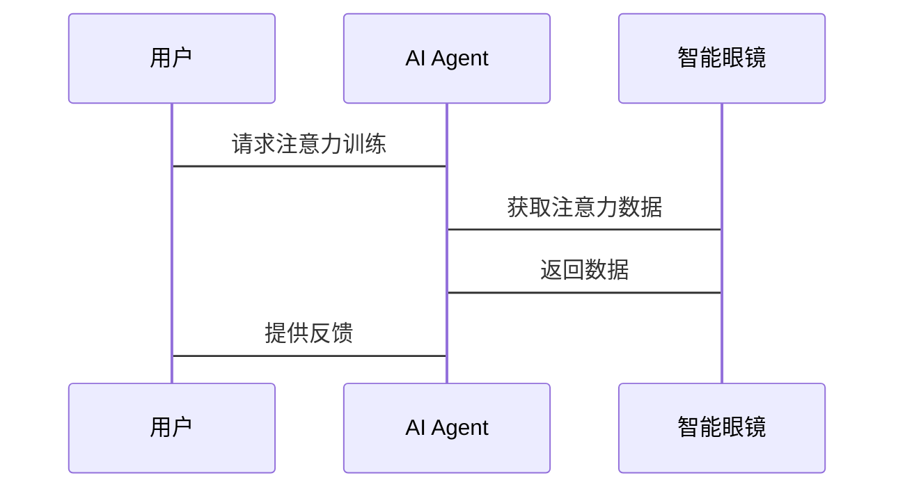

                 


# AI Agent在智能眼镜中的注意力集中训练

> 关键词：AI Agent, 注意力训练, 智能眼镜, 注意力机制, 系统设计, 项目实战, 最佳实践

> 摘要：本文探讨了AI Agent在智能眼镜中的应用，特别是如何通过注意力集中训练帮助用户提高专注力。文章详细介绍了注意力机制的原理、AI Agent的设计与实现、系统架构以及实际项目中的应用，最后给出了最佳实践和注意事项。

---

## 第一章: AI Agent与注意力集中训练的背景介绍

### 1.1 问题背景与描述

#### 1.1.1 注意力分散的现状与挑战
在现代社会中，人们面临着多任务处理的挑战，注意力分散已成为普遍问题。智能眼镜作为一种 wearable technology，具有潜力帮助用户管理注意力，但需要AI Agent的支持。

#### 1.1.2 智能眼镜在注意力管理中的潜力
智能眼镜可以实时监测用户的注意力状态，并通过AI Agent提供反馈，帮助用户集中注意力。

#### 1.1.3 AI Agent在注意力训练中的角色
AI Agent负责处理注意力数据，提供个性化训练方案，并与智能眼镜进行交互。

### 1.2 问题解决与边界

#### 1.2.1 AI Agent如何帮助集中注意力
通过实时监测和反馈，AI Agent可以提醒用户调整注意力状态，优化学习和工作效率。

#### 1.2.2 注意力训练的边界与外延
注意力训练仅关注核心任务，不涉及其他干扰因素。

#### 1.2.3 智能眼镜与AI Agent的结合场景
智能眼镜作为硬件平台，AI Agent作为软件引擎，两者结合实现注意力训练。

### 1.3 核心概念与结构

#### 1.3.1 AI Agent的基本构成
包括感知层、决策层和执行层。

#### 1.3.2 注意力训练的核心要素
实时监测、反馈机制、个性化训练。

#### 1.3.3 智能眼镜硬件与AI Agent的交互机制
通过传感器数据流和AI Agent进行实时交互。

---

## 第二章: AI Agent与注意力训练的核心概念与联系

### 2.1 注意力机制的原理

#### 2.1.1 注意力机制的定义与特点
注意力机制是一种选择性关注重要信息的机制，广泛应用于自然语言处理。

#### 2.1.2 基于神经网络的注意力模型
自注意力机制通过计算序列中元素的相关性，决定每个元素的权重。

#### 2.1.3 多头注意力机制的优缺点
多头注意力能够捕捉不同位置的信息，但计算复杂度较高。

### 2.2 AI Agent与注意力训练的关联

#### 2.2.1 AI Agent如何触发注意力机制
AI Agent通过实时监测用户行为，触发注意力机制进行调整。

#### 2.2.2 注意力训练对AI Agent性能的影响
注意力训练数据的反馈可以优化AI Agent的性能。

#### 2.2.3 系统中的实体关系图

```mermaid
er
actor: 用户
agent: AI Agent
attention_data: 注意力数据
goal: 注意力训练目标
action: 用户操作
```

---

## 第三章: 注意力机制的算法原理讲解

### 3.1 注意力机制的算法原理

#### 3.1.1 自注意力机制
自注意力机制通过计算序列中元素的相关性，生成注意力权重。

#### 3.1.2 多头注意力机制
多头注意力机制通过并行计算多个注意力头，捕捉更多上下文信息。

#### 3.1.3 注意力权重的计算公式

$$\text{Attention}(Q, K, V) = \text{softmax}\left(\frac{QK^T}{\sqrt{d_k}}\right)V$$

### 3.2 基于Transformer的注意力机制

#### 3.2.1 Transformer模型的结构
包括编码器和解码器，广泛应用于自然语言处理任务。

#### 3.2.2 多头注意力的实现步骤



#### 3.2.3 注意力机制的数学模型

$$\text{score}(i, j) = \text{exp}(\text{dot}(q_i, k_j)) / \sum_{l} \text{exp}(\text{dot}(q_i, k_l))$$

### 3.3 算法实现与优化

#### 3.3.1 算法实现步骤

```python
def attention(query, key, value, d_k):
    scores = (query @ key.T) / np.sqrt(d_k)
    scores = softmax(scores)
    output = scores @ value
    return output
```

#### 3.3.2 算法优化方法
包括减少头数、降低维度和并行计算。

---

## 第四章: 系统分析与架构设计方案

### 4.1 项目场景介绍

#### 4.1.1 项目介绍
开发一个AI Agent，通过智能眼镜帮助用户进行注意力训练。

#### 4.1.2 系统功能需求
实时监测注意力状态，提供个性化训练方案。

### 4.2 系统功能设计

#### 4.2.1 领域模型



#### 4.2.2 系统架构设计


#### 4.2.3 接口设计与交互流程



---

## 第五章: 项目实战

### 5.1 项目环境搭建

#### 5.1.1 环境安装
安装Python、TensorFlow、Mermaid CLI等工具。

#### 5.1.2 核心代码实现

```python
import numpy as np
import tensorflow as tf

class AttentionModel:
    def __init__(self, d_k, d_v):
        self.W_q = tf.keras.layers.Dense(d_k)
        self.W_k = tf.keras.layers.Dense(d_k)
        self.W_v = tf.keras.layers.Dense(d_v)
    
    def call(self, query, key, value):
        scores = (self.W_q(query) @ self.W_k(key).T) / np.sqrt(d_k)
        scores = tf.nn.softmax(scores)
        output = scores @ self.W_v(value)
        return output
```

#### 5.1.3 代码解读与分析
解释代码的功能和实现细节。

### 5.2 项目实战与案例分析

#### 5.2.1 实际案例分析
分析一个用户在学习过程中注意力分散的情况，AI Agent如何帮助调整。

#### 5.2.2 项目剖析
详细讲解项目的设计思路和实现过程。

### 5.3 项目小结

总结项目的实现过程，反思遇到的问题和解决方案。

---

## 第六章: 最佳实践与小结

### 6.1 最佳实践 tips

#### 6.1.1 数据隐私保护
确保用户数据的安全。

#### 6.1.2 算法优化建议
采用更高效的注意力机制。

#### 6.1.3 系统维护与更新
定期更新模型，优化性能。

### 6.2 小结

总结全文，强调AI Agent在智能眼镜中的潜力和实际应用价值。

### 6.3 注意事项

提醒读者在实际应用中注意数据隐私和算法优化。

### 6.4 拓展阅读

推荐相关书籍和资源，供读者进一步学习。

---

## 附录: 参考文献与术语表

### 附录 A: 术语表

- AI Agent：人工智能代理
- 注意力机制：注意力权重计算方法
- Transformer：一种深度学习模型

### 附录 B: 参考文献

- [1] Vaswani et al. "Attention Is All You Need." 2017.
- [2] LeCun et al. "Deep Learning." 2015.

---

## 作者：AI天才研究院 & 禅与计算机程序设计艺术

---

这篇文章系统地介绍了AI Agent在智能眼镜中的注意力集中训练，从背景介绍到项目实战，为读者提供了全面的知识和实践指导。

