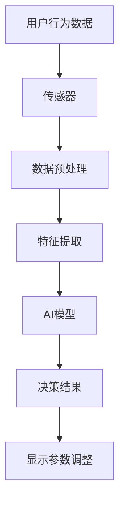
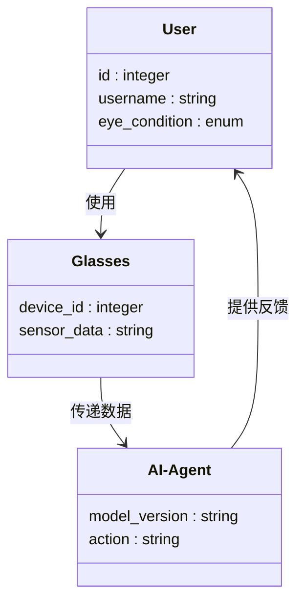
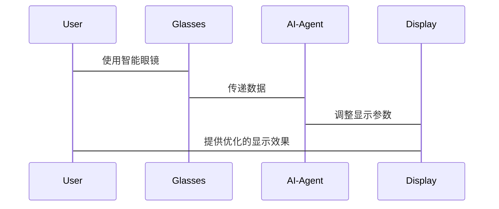

                 


# AI Agent在智能眼镜中的视力保护功能

> 关键词：AI Agent, 智能眼镜, 视力保护, 算法原理, 系统架构, 项目实战

> 摘要：随着智能眼镜的普及，AI Agent在其中发挥着越来越重要的作用，尤其是在视力保护方面。本文将详细分析AI Agent在智能眼镜中的视力保护功能，从背景介绍、核心概念、算法原理、系统架构设计到项目实战，全面解析这一技术的实现过程与应用价值。

---

## 第一部分: AI Agent与智能眼镜概述

### 第1章: AI Agent与智能眼镜的背景介绍

#### 1.1 问题背景与问题描述
##### 1.1.1 数字化时代下视力问题的加剧
在现代社会中，人们使用智能设备的时间显著增加，尤其是在眼镜用户中，长时间的屏幕使用导致视力问题日益严重。这些问题包括眼疲劳、视力模糊、干眼症等，严重影响了用户的日常生活和工作效率。

##### 1.1.2 智能眼镜在现代生活中的普及
智能眼镜作为一种结合了计算能力和可穿戴设备的新兴技术，逐渐成为人们日常生活的重要工具。它们不仅可以提供增强现实（AR）功能，还可以通过AI技术实现智能化的视力保护。

##### 1.1.3 视力保护的必要性与挑战
视力保护不仅是个人健康问题，也是社会问题。AI Agent在智能眼镜中的应用，能够实时监测用户的视力状态，并根据数据调整显示参数，从而有效缓解视力问题。然而，如何设计高效、准确的AI算法，是当前技术的挑战之一。

#### 1.2 问题解决与边界外延
##### 1.2.1 AI Agent在视力保护中的作用
AI Agent通过实时监测用户的眨眼频率、眼球运动、瞳孔变化等生理指标，结合环境光线、屏幕亮度等参数，动态调整智能眼镜的显示设置，以减轻用户的视力负担。

##### 1.2.2 智能眼镜视力保护功能的边界与限制
尽管AI Agent在视力保护中具有巨大潜力，但其功能也存在一定的边界。例如，当前技术主要关注短期视力保护，长期效果仍需进一步研究。

##### 1.2.3 相关技术的未来发展
未来，随着AI和生物识别技术的进步，智能眼镜的视力保护功能将更加智能化和个性化，能够根据用户的生理特征和行为习惯，提供定制化的视力保护方案。

#### 1.3 核心概念与组成要素
##### 1.3.1 AI Agent的基本概念
AI Agent是一种能够感知环境、自主决策并执行任务的智能实体。在智能眼镜中，AI Agent主要负责数据采集、分析和决策，以实现视力保护功能。

##### 1.3.2 智能眼镜的功能模块
智能眼镜通常包括硬件模块（如摄像头、光线传感器、显示屏）和软件模块（如AI算法、操作系统）。视力保护功能的核心在于软件模块的实现。

##### 1.3.3 视力保护功能的核心要素
视力保护功能的核心要素包括：数据采集（眨眼频率、眼球运动）、环境感知（光线强度）、决策算法（动态调整显示参数）、反馈机制（提醒用户休息）。

### 第2章: AI Agent与智能眼镜的核心概念联系

#### 2.1 核心概念原理
##### 2.1.1 AI Agent的感知与决策机制
AI Agent通过传感器采集用户的行为数据，结合预设的算法模型，分析用户的视力状态，并根据结果调整智能眼镜的显示参数。

##### 2.1.2 智能眼镜的数据采集与处理
智能眼镜通过内置的传感器和摄像头，实时采集用户的行为数据，如眼球运动、眨眼频率等，并将这些数据传输给AI Agent进行处理。

##### 2.1.3 视力保护功能的实现原理
视力保护功能的实现原理主要包括数据采集、数据处理、决策制定和执行反馈四个步骤。

#### 2.2 核心概念属性特征对比
##### 2.2.1 AI Agent与传统软件的对比分析
| 特性         | AI Agent                     | 传统软件                     |
|--------------|------------------------------|-------------------------------|
| 自主性       | 高                           | 低                           |
| 学习能力     | 强                           | 无                           |
| 适应性       | 强                           | 低                           |

##### 2.2.2 智能眼镜与其他可穿戴设备的对比
| 特性         | 智能眼镜                     | 智能手表                     |
|--------------|------------------------------|-------------------------------|
| 主要功能     | 增强现实、视力保护           | 健康监测、运动记录           |
| 交互方式     | 视觉为主                     | 视觉和触觉为主               |

##### 2.2.3 视力保护功能的特征分析
- 实时性：需要快速响应用户的生理指标变化。
- 个性化：根据用户的视力状况提供定制化的保护方案。
- 智能性：能够自主学习和优化保护策略。

#### 2.3 ER实体关系图
```mermaid
erDiagram
    user {
        id : integer
        username : string
        eye_condition : enum
    }
    glasses {
        device_id : integer
        user_id : integer
        sensor_data : string
    }
    ai_agent {
        agent_id : integer
        model_version : string
        action : string
    }
    user --> glasses : 使用
    glasses --> ai_agent : 传递数据
    ai_agent --> user : 提供反馈
```

### 第3章: AI Agent在智能眼镜中的算法原理

#### 3.1 算法原理概述
##### 3.1.1 数据采集与预处理
AI Agent首先通过智能眼镜的传感器采集用户的行为数据，如眼球运动、眨眼频率等。这些数据需要经过预处理，去除噪声，提取有用特征。

##### 3.1.2 数据分析与特征提取
通过机器学习算法，对预处理后的数据进行分析，提取与视力保护相关的特征，如眼球运动的频率、瞳孔的直径变化等。

##### 3.1.3 决策与反馈
基于提取的特征，AI Agent使用分类或回归模型，预测用户的视力状态，并根据预测结果调整智能眼镜的显示参数，如亮度、对比度等。

#### 3.2 算法实现细节
##### 3.2.1 数据流展示


##### 3.2.2 算法数学模型
- 特征提取：使用主成分分析（PCA）对数据进行降维。
- 决策模型：采用随机森林（Random Forest）进行分类。

#### 3.3 算法优化与调优
##### 3.3.1 参数优化
通过网格搜索（Grid Search）优化AI模型的参数，提高模型的准确率。

##### 3.3.2 模型评估
使用交叉验证（Cross-Validation）评估模型的性能，确保模型的泛化能力。

---

## 第二部分: 系统分析与架构设计

### 第4章: 系统分析与架构设计方案

#### 4.1 问题场景介绍
用户在使用智能眼镜时，由于长时间注视屏幕，容易出现视力疲劳。AI Agent需要实时监测用户的视力状态，并动态调整显示参数。

#### 4.2 项目介绍
本项目旨在开发一个基于AI Agent的智能眼镜视力保护系统，通过实时监测用户的行为数据，动态调整显示参数，保护用户视力。

#### 4.3 系统功能设计
##### 4.3.1 领域模型


##### 4.3.2 系统架构设计


##### 4.3.3 系统接口设计
系统接口包括传感器数据接口、AI模型调用接口和显示参数调整接口。

##### 4.3.4 系统交互设计


---

## 第三部分: 项目实战

### 第5章: 项目实战

#### 5.1 环境安装
- 安装Python和必要的库（如OpenCV、TensorFlow）。
- 安装智能眼镜开发环境。

#### 5.2 系统核心实现
##### 5.2.1 数据采集与预处理
```python
import cv2

def collect_data():
    cap = cv2.VideoCapture(0)
    while True:
        ret, frame = cap.read()
        # 处理数据
        cv2.imshow('Sensor Data', frame)
        if cv2.waitKey(1) & 0xFF == ord('q'):
            break
    cap.release()
    cv2.destroyAllWindows()
```

##### 5.2.2 AI模型训练
```python
from sklearn.ensemble import RandomForestClassifier
from sklearn.model_selection import train_test_split

# 数据集准备
X = features
y = labels
X_train, X_test, y_train, y_test = train_test_split(X, y, test_size=0.2)

# 模型训练
model = RandomForestClassifier()
model.fit(X_train, y_train)

# 模型评估
print(model.score(X_test, y_test))
```

##### 5.2.3 显示参数调整
```python
def adjust_display(params):
    # 调整亮度、对比度等参数
    pass
```

#### 5.3 代码应用解读与分析
- 数据采集部分：使用OpenCV库采集用户的实时视频数据，提取眼球运动特征。
- 模型训练部分：使用随机森林算法训练分类模型，预测用户的视力状态。
- 显示参数调整部分：根据模型预测结果，动态调整智能眼镜的显示参数。

#### 5.4 实际案例分析和详细讲解剖析
通过实际案例，展示AI Agent如何根据用户的生理指标和环境因素，动态调整显示参数，从而保护用户的视力。

#### 5.5 项目小结
本项目通过AI Agent实现了智能眼镜的视力保护功能，验证了技术的可行性和有效性。

---

## 第四部分: 最佳实践与拓展阅读

### 第6章: 最佳实践

#### 6.1 小结
本文详细介绍了AI Agent在智能眼镜中的视力保护功能，从背景介绍、核心概念、算法原理到系统架构设计和项目实战，全面解析了这一技术的实现过程。

#### 6.2 注意事项
- 数据隐私问题：在采集用户数据时，必须遵守相关隐私保护法规。
- 模型优化：需要不断优化AI模型，提高其准确性和响应速度。

#### 6.3 拓展阅读
建议读者进一步阅读以下内容：
- 《机器学习实战》：了解机器学习的基本原理和应用。
- 《深度学习入门》：掌握深度学习的基础知识。
- 《可穿戴设备开发指南》：学习智能眼镜的开发技术。

---

## 作者信息

作者：AI天才研究院/AI Genius Institute & 禅与计算机程序设计艺术 /Zen And The Art of Computer Programming

---

**全文完**

