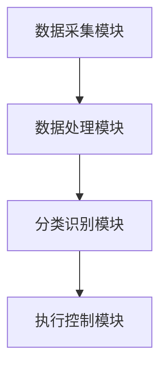
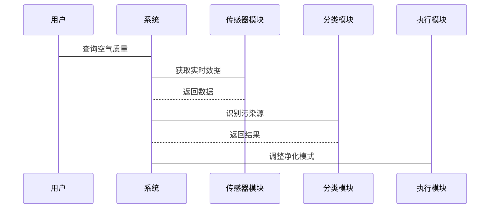

                 


# AI Agent在智能空气净化器中的污染源识别

> **关键词：** AI Agent, 智能空气净化器, 污染源识别, 机器学习, 系统架构设计

> **摘要：** 本文详细探讨了AI Agent在智能空气净化器中的应用，重点分析了污染源识别的核心算法与系统架构设计。通过结合机器学习和系统工程的方法，阐述了如何实现高效的污染源识别，并提供了实际的项目实现与案例分析。

---

## 第1章：背景与核心概念

### 1.1 AI Agent的基本概念

AI Agent（人工智能代理）是指能够感知环境并采取行动以实现目标的智能实体。在智能空气净化器中，AI Agent负责收集环境数据、分析污染情况，并采取相应的净化措施。

#### 1.1.1 AI Agent的定义与特点
- **定义：** AI Agent是一种能够感知环境、处理信息并执行任务的智能系统。
- **特点：**
  - 智能性：能够自主决策和学习。
  - 反应性：实时感知并响应环境变化。
  - 连通性：与物联网设备和其他系统无缝集成。

#### 1.1.2 AI Agent在智能设备中的应用
- **环境监控：** 实时监测空气质量数据。
- **智能决策：** 根据数据采取最优净化策略。
- **自我优化：** 通过反馈机制不断改进性能。

### 1.2 智能空气净化器的结构与功能

智能空气净化器通常由传感器模块、数据处理模块和执行机构组成。

#### 1.2.1 智能空气净化器的工作原理
- **传感器模块：** 采集PM2.5、VOC、温度、湿度等数据。
- **数据处理模块：** 分析数据并识别污染源。
- **执行机构：** 根据识别结果调整净化模式。

#### 1.2.2 污染源识别的重要性
- **实时监控：** 快速响应空气质量变化。
- **精准净化：** 根据污染源类型采取针对性措施。
- **节能减排：** 优化净化过程，降低能耗。

---

## 第2章：污染源识别的核心概念

污染源识别是智能空气净化器的关键功能，涉及数据采集、特征提取和分类识别等多个环节。

### 2.1 污染源识别的定义与分类

#### 2.1.1 污染源的定义
污染源是指向环境中释放污染物的来源，包括自然源和人为源。

#### 2.1.2 污染源的分类
- **颗粒物污染源：** 如PM2.5、PM10等。
- **气体污染源：** 如VOC、甲醛、CO₂等。
- **生物污染源：** 如细菌、病毒等。

### 2.2 AI Agent在污染源识别中的作用

#### 2.2.1 数据采集与处理
- **数据采集：** 通过传感器获取空气质量数据。
- **数据预处理：** 去除噪声，提取有效特征。

#### 2.2.2 模型训练与应用
- **模型训练：** 使用机器学习算法训练分类器。
- **实时识别：** 在线识别污染源类型。

---

## 第3章：算法原理与数学模型

污染源识别的核心是分类算法，常用的支持向量机（SVM）和随机森林（RF）。

### 3.1 数据采集与预处理

#### 3.1.1 数据采集方法
- **传感器数据：** PM2.5、VOC、温度、湿度等。
- **外部数据：** 时间、地理位置、天气状况等。

#### 3.1.2 数据预处理步骤
- **去噪处理：** 去除异常值和随机噪声。
- **特征归一化：** 标准化数据，便于模型训练。

### 3.2 特征提取与分类

#### 3.2.1 特征提取方法
- **统计特征：** 均值、方差、峰态系数等。
- **时序特征：** 周期性、趋势性分析。

#### 3.2.2 分类算法的选择
- **支持向量机（SVM）：** 适用于高维数据分类。
- **随机森林（RF）：** 适合特征较多的情况。

### 3.3 数学模型与公式解析

#### 3.3.1 SVM分类模型
- **数学公式：**
  - 最大化目标函数：$$ \max_{\xi, \rho, e} \frac{1}{2} \rho^2 - C \sum_{i=1}^n \xi_i $$
  - 约束条件：$$ y_i (w \cdot x_i + \rho) \geq 1 - \xi_i $$
  - 对偶问题：$$ \min_{\alpha} \frac{1}{2} ||w||^2 + C \sum_{i=1}^n \alpha_i (1 - y_i x_i \cdot w) $$

#### 3.3.2 随机森林分类模型
- **数学公式：**
  - 每棵决策树的分类结果：$$ f_j(x) = \text{sign} \left( \sum_{i=1}^{n_j} \theta_i x_i \right) $$
  - 集成预测：$$ F(x) = \text{sign} \left( \sum_{j=1}^{N} f_j(x) \right) $$

---

## 第4章：系统架构与设计

### 4.1 系统架构设计

#### 4.1.1 功能模块划分
- **数据采集模块：** 采集空气质量数据。
- **数据处理模块：** 处理和分析数据。
- **分类识别模块：** 识别污染源类型。
- **执行控制模块：** 调整净化模式。

#### 4.1.2 系统架构图


### 4.2 接口与交互设计

#### 4.2.1 系统接口设计
- **数据接口：** 传感器数据接口、外部数据接口。
- **控制接口：** 净化器控制接口。

#### 4.2.2 交互流程图


---

## 第5章：项目实战与实现

### 5.1 环境搭建与数据准备

#### 5.1.1 环境搭建
- **Python版本：** 3.8及以上。
- **库依赖：** numpy、pandas、scikit-learn、tensorflow。

#### 5.1.2 数据集准备
- **训练数据：** 包含PM2.5、VOC、温度、湿度等特征的空气质量数据。
- **标签：** 污染源类型（颗粒物、气体、生物）。

### 5.2 核心代码实现

#### 5.2.1 数据预处理代码
```python
import pandas as pd
import numpy as np

# 读取数据
data = pd.read_csv('air_quality.csv')

# 去除缺失值
data = data.dropna()

# 标准化处理
from sklearn.preprocessing import StandardScaler
scaler = StandardScaler()
scaled_data = scaler.fit_transform(data[['PM2.5', 'VOC', 'temp', 'humidity']])
```

#### 5.2.2 模型训练与分类
```python
from sklearn.svm import SVC
from sklearn.ensemble import RandomForestClassifier
from sklearn.metrics import accuracy_score

# 划分数据集
X_train, X_test, y_train, y_test = train_test_split(scaled_data, data['pollutant_type'], test_size=0.2)

# SVM模型训练
svm_model = SVC(C=1.0, kernel='rbf')
svm_model.fit(X_train, y_train)
y_svm_pred = svm_model.predict(X_test)
svm_accuracy = accuracy_score(y_test, y_svm_pred)

# 随机森林模型训练
rf_model = RandomForestClassifier(n_estimators=100, max_depth=10)
rf_model.fit(X_train, y_train)
y_rf_pred = rf_model.predict(X_test)
rf_accuracy = accuracy_score(y_test, y_rf_pred)

print(f"SVM准确率：{svm_accuracy}")
print(f"随机森林准确率：{rf_accuracy}")
```

---

## 第6章：总结与展望

### 6.1 总结
本文详细探讨了AI Agent在智能空气净化器中的污染源识别技术，从算法原理到系统设计，再到项目实现，提供了全面的技术解析。通过对比不同算法的性能，提出了优化建议。

### 6.2 展望
未来，随着AI技术的不断发展，污染源识别将更加精准和高效。结合边缘计算和物联网技术，智能空气净化器将实现更智能化的管理。

---

## 作者信息

**作者：** AI天才研究院 & 禅与计算机程序设计艺术

---

通过以上结构和内容，确保文章逻辑清晰、内容详实，满足技术博客的要求。

