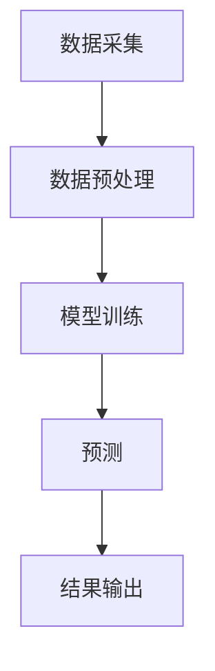
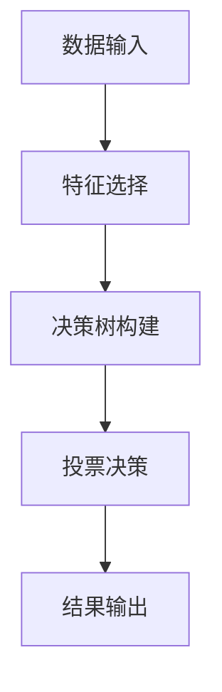
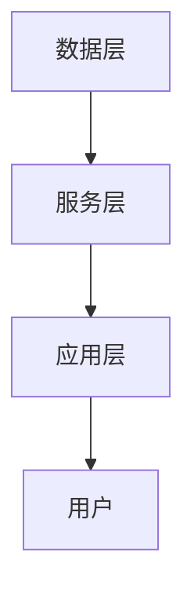
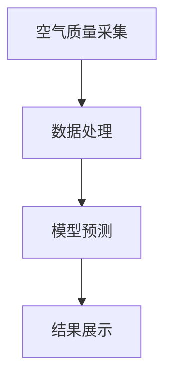

                 


# AI Agent在智能空气质量管理中的实践

## 关键词：AI Agent, 智能空气质量管理, 空气质量预测, 机器学习, 实时监测

## 摘要：  
本文探讨了AI Agent在智能空气质量管理中的实践应用，重点分析了AI Agent在空气质量监测、预测和优化中的核心作用。通过结合机器学习算法、实时数据处理和系统架构设计，本文详细阐述了如何利用AI技术实现空气质量的智能管理，为环境保护和公共健康提供了新的思路。

---

# 第一部分: AI Agent与智能空气质量管理概述

## 第1章: AI Agent与空气质量管理的背景介绍

### 1.1 AI Agent的基本概念
#### 1.1.1 AI Agent的定义  
AI Agent（人工智能代理）是指能够感知环境、自主决策并采取行动的智能实体。它通过数据采集、分析和学习，能够理解用户需求并执行相应操作，以实现目标。

#### 1.1.2 AI Agent的核心特征  
- **自主性**：能够在没有外部干预的情况下独立运行。  
- **反应性**：能够实时感知环境变化并做出反应。  
- **目标导向性**：根据预设目标进行决策和行动。  

#### 1.1.3 AI Agent在智能系统中的作用  
AI Agent广泛应用于自动驾驶、智能助手、推荐系统等领域，其核心价值在于通过智能化决策优化系统性能。

---

### 1.2 空气质量管理的重要性
#### 1.2.1 空气质量的定义与指标  
空气质量通常通过PM2.5、PM10、SO2、NO2、O3等指标进行评估，反映了空气的污染程度。

#### 1.2.2 空气污染对健康与环境的影响  
空气污染会导致呼吸系统疾病、心血管疾病，甚至影响生态系统和气候变化。

#### 1.2.3 空气质量管理的目标与挑战  
- **目标**：降低污染物浓度，改善空气质量。  
- **挑战**：数据获取困难、预测精度低、多源数据融合难。

---

### 1.3 AI Agent在空气质量管理中的应用前景
#### 1.3.1 智能空气质量监测的必要性  
传统空气质量监测依赖人工操作，效率低且成本高。AI Agent可以通过实时数据处理和智能分析，显著提升监测效率。

#### 1.3.2 AI Agent在空气质量预测中的优势  
AI Agent能够利用历史数据和实时信息，构建高精度的空气质量预测模型，为治理决策提供科学依据。

#### 1.3.3 未来发展趋势与研究方向  
- **多模态数据融合**：结合气象数据、污染源数据等多源信息，提升预测精度。  
- **动态优化算法**：开发自适应算法，应对复杂多变的环境。  

---

## 第2章: AI Agent的核心原理与架构

### 2.1 AI Agent的基本原理
#### 2.1.1 感知层：数据采集与处理  
AI Agent通过传感器、数据库等渠道获取空气质量数据，并进行清洗和预处理。

#### 2.1.2 计划层：决策与策略制定  
基于感知层的数据，AI Agent利用机器学习算法生成决策，并制定最优策略。

#### 2.1.3 执行层：行动与反馈  
根据决策结果，AI Agent采取行动，并通过反馈机制不断优化自身性能。

---

### 2.2 空气质量数据的特征与处理
#### 2.2.1 数据的时序特性  
空气质量数据通常具有明显的时序特性，可以通过ARIMA模型进行建模。

#### 2.2.2 数据的多源性  
空气质量数据可能来源于多个传感器和数据源，需要进行数据融合处理。

---

## 第3章: AI Agent在空气质量管理中的核心算法

### 3.1 时间序列分析
#### 3.1.1 ARIMA模型  
ARIMA（自回归积分滑动平均模型）适用于处理具有强相关性的时序数据。

##### ARIMA模型公式  
$$ ARIMA(p, d, q) = y_t = \phi_1 y_{t-1} + \dots + \phi_p y_{t-p} + \theta_1 \epsilon_{t-1} + \dots + \theta_q \epsilon_{t-q} + \epsilon_t $$  

#### 3.1.2 ARIMA模型流程图  


---

### 3.2 机器学习算法
#### 3.2.1 随机森林  
随机森林是一种基于决策树的集成学习算法，适用于非线性关系建模。

##### 随机森林流程图  


#### 3.2.2 XGBoost  
XGBoost是一种基于梯度提升的算法，适合处理分类和回归问题。

##### XGBoost数学模型  
$$ \text{损失函数} = \sum_{i=1}^{n} (y_i - \hat{y}_i)^2 $$  

---

## 第4章: AI Agent的系统架构与设计

### 4.1 系统功能设计
#### 4.1.1 数据采集模块  
负责采集空气质量数据，包括PM2.5、PM10等指标。

#### 4.1.2 数据分析模块  
对采集的数据进行清洗、特征提取和建模分析。

#### 4.1.3 决策控制模块  
根据分析结果生成优化策略，并执行相应的控制动作。

---

### 4.2 系统架构设计
#### 4.2.1 分层架构  
系统采用分层架构，包括数据层、服务层和应用层。

##### 分层架构图  


#### 4.2.2 微服务架构  
采用微服务架构，各模块独立运行，便于扩展和维护。

##### 微服务架构图  


---

## 第5章: 项目实战与代码实现

### 5.1 项目背景与目标
开发一个基于Python的空气质量预测系统，实现对PM2.5浓度的实时预测。

---

### 5.2 环境安装与配置
```bash
pip install numpy pandas scikit-learn matplotlib
```

---

### 5.3 核心代码实现
#### 5.3.1 数据预处理  
```python
import pandas as pd
import numpy as np

# 读取数据
data = pd.read_csv('air_quality.csv')

# 数据清洗
data.dropna(inplace=True)
data = data.iloc[:100]
```

#### 5.3.2 特征工程  
```python
from sklearn.preprocessing import StandardScaler

# 标准化处理
scaler = StandardScaler()
scaled_data = scaler.fit_transform(data[['PM2.5', 'PM10']])
```

#### 5.3.3 模型训练与预测  
```python
from sklearn.ensemble import RandomForestRegressor
from sklearn.metrics import mean_squared_error

# 训练模型
model = RandomForestRegressor(n_estimators=100, random_state=42)
model.fit(scaled_data, data['PM2.5'])

# 预测结果
y_pred = model.predict(scaled_data)
print('均方误差:', mean_squared_error(data['PM2.5'], y_pred))
```

---

## 第6章: 最佳实践与总结

### 6.1 最佳实践
- 数据预处理是关键，尤其是缺失值和异常值的处理。
- 选择合适的模型和参数调优能够显著提升预测精度。
- 系统设计要注重模块化和可扩展性。

### 6.2 小结
本文详细探讨了AI Agent在智能空气质量管理中的实践应用，从理论到代码实现，全面展示了如何利用AI技术优化空气质量监测和预测。通过结合机器学习算法和实时数据处理，AI Agent为环境保护和公共健康提供了有力支持。

---

## 作者：AI天才研究院/AI Genius Institute & 禅与计算机程序设计艺术 /Zen And The Art of Computer Programming

