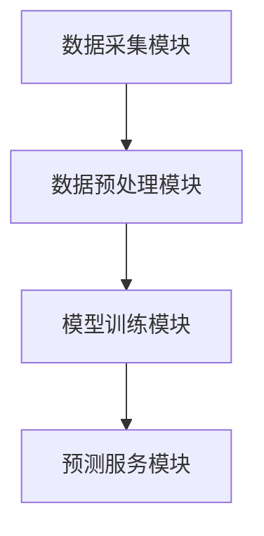

                 


# AI Agent在智能空气质量预测中的实践

## 关键词：AI Agent，空气质量预测，机器学习，多智能体协同，强化学习

## 摘要：
空气质量预测是环境保护的重要组成部分，而AI Agent（人工智能代理）在其中发挥着越来越重要的作用。本文详细探讨了AI Agent在空气质量预测中的应用，从理论基础到实际实现，涵盖了空气质量预测的背景、核心概念、AI Agent的核心原理、系统架构设计、项目实战以及最佳实践。通过结合多智能体协同、强化学习和注意力机制，本文展示了如何利用AI Agent构建一个高效、准确的空气质量预测系统，并通过实际案例分析了系统的实现过程。最后，本文总结了项目的成果，并提出了未来的发展方向。

---

# 第一部分: AI Agent与空气质量预测的背景介绍

## 第1章: AI Agent与空气质量预测概述

### 1.1 空气质量预测的背景与意义
#### 1.1.1 空气污染问题的现状
空气污染是全球性的环境问题，尤其是PM2.5、PM10、SO2、NO2等污染物的浓度超标，对人类健康和生态环境造成了严重威胁。随着工业化进程的加快和城市化进程的推进，空气污染问题日益严峻。

#### 1.1.2 空气质量预测的重要性
空气质量预测可以帮助政府和公众提前采取措施，减少污染对健康和环境的影响。例如，当预测到空气污染指数（AQI）将达到重度污染时，政府可以采取限行、停产等措施，公众可以减少外出或采取防护措施。

#### 1.1.3 AI Agent在空气质量预测中的作用
AI Agent是一种智能实体，能够感知环境、自主决策并执行任务。在空气质量预测中，AI Agent可以通过实时监测气象数据、污染物浓度数据，结合历史数据和模型预测，提供精准的空气质量预测结果。

### 1.2 AI Agent的基本概念
#### 1.2.1 什么是AI Agent
AI Agent（人工智能代理）是指能够感知环境、自主决策并执行任务的智能实体。它可以是一个软件程序，也可以是一个物理设备，通过传感器和执行器与环境交互。

#### 1.2.2 AI Agent的核心特点
- **自主性**：AI Agent能够自主决策，无需人工干预。
- **反应性**：能够实时感知环境变化并做出响应。
- **学习能力**：能够通过数据学习和优化预测模型。
- **协作性**：多个AI Agent可以协同工作，共同完成复杂任务。

#### 1.2.3 AI Agent与传统预测模型的区别
传统预测模型通常基于统计方法或简单的机器学习算法，而AI Agent结合了多智能体协同、强化学习等技术，能够实现更复杂的任务。

### 1.3 空气质量预测的挑战与机遇
#### 1.3.1 空气质量预测的主要挑战
- 数据复杂性：空气质量受多种因素影响，如气象条件、污染源分布、人类活动等，数据复杂且动态变化。
- 数据缺失：某些地区的空气质量数据可能不完整，影响模型的准确性。
- 模型泛化能力：如何在不同地区、不同季节下保持模型的泛化能力是挑战。

#### 1.3.2 AI Agent在空气质量预测中的优势
- **多智能体协同**：通过多个AI Agent协同工作，可以更好地捕捉空气质量的变化趋势。
- **实时性**：AI Agent能够实时感知数据并做出预测，适用于实时空气质量监测。
- **自适应性**：AI Agent能够根据环境变化自适应调整预测模型。

#### 1.3.3 空气质量预测的未来发展方向
随着AI技术的不断发展，空气质量预测将更加智能化、精准化。未来的AI Agent将具备更强的学习能力和协作能力，能够更好地应对复杂的空气质量预测问题。

### 1.4 本章小结
本章介绍了空气质量预测的背景和意义，以及AI Agent的基本概念和特点。通过对比传统预测模型，展示了AI Agent在空气质量预测中的优势和挑战。接下来的章节将深入探讨空气质量预测的核心概念和AI Agent的核心原理。

---

# 第二部分: 空气质量预测的核心概念与原理

## 第2章: 空气质量预测的核心概念

### 2.1 空气质量预测的关键因素
#### 2.1.1 污染物浓度
PM2.5、PM10、SO2、NO2等污染物的浓度是空气质量预测的核心指标。这些污染物的浓度受气象条件、污染源排放、地理环境等多种因素影响。

#### 2.1.2 气象因素
温度、湿度、风速、风向、气压等气象因素对污染物的扩散和浓度变化有重要影响。例如，高温和低湿度会加速污染物的扩散。

#### 2.1.3 地理位置与污染源分布
地理位置、地形地势、城市布局等因素会影响污染物的扩散路径和浓度分布。例如，盆地地形容易导致污染物积聚。

### 2.2 数据特征分析
#### 2.2.1 数据特征的分类
空气质量预测数据通常包括时间序列数据、地理数据、气象数据等。这些数据需要进行特征提取和特征工程，以便更好地训练预测模型。

#### 2.2.2 数据特征的重要性排序
通过分析数据特征的重要性，可以筛选出对空气质量预测影响最大的特征，从而提高模型的准确性和计算效率。

#### 2.2.3 数据特征的预处理方法
- 数据清洗：处理缺失值、异常值。
- 数据标准化：将不同量纲的特征进行标准化处理。
- 数据窗口化：将时间序列数据转化为滑动窗口形式，用于模型输入。

### 2.3 空气质量预测的数学模型
#### 2.3.1 时间序列模型
时间序列模型是空气质量预测的核心工具之一，常用的模型包括ARIMA（自回归积分滑动平均模型）和LSTM（长短期记忆网络）。

#### 2.3.2 模型的输入输出关系
空气质量预测模型的输入通常是历史空气质量数据、气象数据、污染源数据等，输出是未来一定时间内的空气质量预测值。

#### 2.3.3 模型的训练与评估
模型的训练需要使用历史数据，评估指标包括均方误差（MSE）、平均绝对误差（MAE）、决定系数（R²）等。

### 2.4 本章小结
本章详细介绍了空气质量预测的关键因素和数据特征分析方法，以及数学模型的基本原理和输入输出关系。这些内容为后续章节的AI Agent设计奠定了基础。

---

# 第三部分: AI Agent的核心原理与算法实现

## 第3章: AI Agent的核心原理

### 3.1 多智能体协同的基本原理
#### 3.1.1 多智能体系统的基本概念
多智能体系统是由多个智能体组成的分布式系统，每个智能体负责特定的任务，通过通信和协作完成整体目标。

#### 3.1.2 多智能体协同的工作机制
- 信息共享：智能体之间通过通信共享数据和信息。
- 协作决策：多个智能体共同决策，形成最优解决方案。
- 分工合作：每个智能体负责特定的任务，提高系统的效率。

#### 3.1.3 多智能体系统的优势与挑战
- **优势**：能够处理复杂的任务，提高系统的鲁棒性和灵活性。
- **挑战**：智能体之间的通信和协作需要复杂的协议，系统的实时性和安全性需要考虑。

### 3.2 强化学习在AI Agent中的应用
#### 3.2.1 强化学习的基本原理
强化学习是一种通过试错机制学习策略的方法，智能体通过与环境交互，获得奖励或惩罚，逐步优化决策策略。

#### 3.2.2 强化学习在空气质量预测中的应用
AI Agent可以通过强化学习优化预测模型的参数，提高预测的准确性和实时性。

#### 3.2.3 强化学习算法的选择与实现
常用的强化学习算法包括Q-Learning、Deep Q-Network（DQN）等。本文选择DQN算法，通过神经网络近似Q值函数，实现智能体的决策优化。

### 3.3 注意力机制在空气质量预测中的应用
#### 3.3.1 注意力机制的基本原理
注意力机制是一种基于权重分配的方法，能够关注输入数据中重要的部分，提高模型的聚焦能力。

#### 3.3.2 注意力机制在空气质量预测中的应用
在空气质量预测中，注意力机制可以帮助模型关注重要的气象数据和污染源数据，提高预测的准确性。

#### 3.3.3 注意力机制的实现
通过多头注意力机制（Multi-Head Attention）实现，将输入数据进行变换和注意力计算，输出最终的权重分配。

### 3.4 本章小结
本章详细介绍了AI Agent的核心原理，包括多智能体协同、强化学习和注意力机制的应用。这些技术为空气质量预测系统的实现提供了理论基础。

---

## 第4章: 系统架构设计

### 4.1 系统功能设计
#### 4.1.1 系统功能模块
- 数据采集模块：采集空气质量数据、气象数据、污染源数据等。
- 数据预处理模块：对采集的数据进行清洗、标准化和窗口化处理。
- 模型训练模块：训练AI Agent的预测模型。
- 预测服务模块：提供实时空气质量预测服务。

#### 4.1.2 系统功能流程
- 数据采集模块通过传感器和API接口获取实时数据。
- 数据预处理模块对数据进行处理，生成模型输入格式。
- 模型训练模块利用历史数据训练AI Agent的预测模型。
- 预测服务模块基于实时数据，调用AI Agent进行预测，并输出结果。

### 4.2 系统架构设计
#### 4.2.1 系统架构图


#### 4.2.2 系统组件之间的交互
- 数据采集模块将数据传递给数据预处理模块。
- 数据预处理模块将处理后的数据传递给模型训练模块。
- 模型训练模块训练完成后，将模型部署到预测服务模块。
- 预测服务模块基于实时数据，调用AI Agent进行预测，并输出结果。

### 4.3 系统接口设计
#### 4.3.1 API接口定义
- 数据采集接口：提供获取实时数据的API。
- 预测服务接口：提供空气质量预测结果的API。

#### 4.3.2 API接口的实现
- 数据采集接口通过HTTP请求获取数据。
- 预测服务接口通过调用AI Agent进行预测，并返回结果。

### 4.4 本章小结
本章详细介绍了系统的功能设计和架构设计，展示了系统各个模块之间的交互关系。接下来的章节将详细讲解系统的实现过程。

---

## 第5章: 项目实战

### 5.1 环境安装与配置
#### 5.1.1 Python环境的安装
- 安装Python 3.8或更高版本。
- 安装必要的库：numpy、pandas、keras、tensorflow、scikit-learn等。

#### 5.1.2 数据采集工具的安装
- 使用API接口获取空气质量数据，例如使用 requests 库发送HTTP请求。
- 使用传感器数据采集工具，例如Raspberry Pi和传感器模块。

#### 5.1.3 系统框架的搭建
- 使用Flask或Django搭建Web服务框架。
- 使用Kubernetes或Docker进行容器化部署。

### 5.2 系统核心实现
#### 5.2.1 数据采集模块的实现
```python
import requests

def fetch_air_quality_data():
    response = requests.get("http://api.airpollution.com/realtime")
    data = response.json()
    return data
```

#### 5.2.2 数据预处理模块的实现
```python
import pandas as pd

def preprocess_data(data):
    df = pd.DataFrame(data)
    df = df.dropna()
    df = (df - df.mean()) / df.std()  # 标准化
    return df
```

#### 5.2.3 模型训练模块的实现
```python
from keras.models import Sequential
from keras.layers import LSTM, Dense

def build_model(input_shape):
    model = Sequential()
    model.add(LSTM(64, input_shape=input_shape))
    model.add(Dense(1))
    model.compile(loss='mean_squared_error', optimizer='adam')
    return model
```

#### 5.2.4 预测服务模块的实现
```python
from flask import Flask, jsonify

app = Flask(__name__)

@app.route('/predict', methods=['POST'])
def predict():
    data = request.json
    processed_data = preprocess_data(data)
    prediction = model.predict(processed_data)
    return jsonify({'prediction': prediction.tolist()})

if __name__ == '__main__':
    app.run()
```

### 5.3 实际案例分析
#### 5.3.1 数据采集与处理
- 使用API接口获取空气质量数据，例如PM2.5、PM10、SO2等污染物的浓度数据。
- 使用传感器采集实时气象数据，例如温度、湿度、风速等。

#### 5.3.2 模型训练与优化
- 使用历史数据训练AI Agent的预测模型，优化模型参数，提高预测准确率。
- 使用交叉验证评估模型的性能，调整模型结构和超参数。

#### 5.3.3 系统部署与测试
- 将系统部署到云服务器，例如AWS、阿里云等。
- 使用真实数据进行测试，验证系统的预测能力和响应速度。

### 5.4 本章小结
本章通过实际案例分析，详细讲解了系统的实现过程，包括环境安装、核心模块的实现以及系统部署与测试。通过代码示例，读者可以更好地理解和实现空气质量预测系统。

---

## 第6章: 最佳实践与总结

### 6.1 最佳实践
#### 6.1.1 数据预处理的重要性
- 数据清洗和标准化是提高模型准确性的关键步骤。
- 数据窗口化处理可以更好地捕捉时间序列数据的特征。

#### 6.1.2 模型选择与优化
- 根据数据特点选择合适的模型，例如时间序列数据适合LSTM模型。
- 使用交叉验证和网格搜索优化模型超参数。

#### 6.1.3 系统架构设计的注意事项
- 系统模块化设计可以提高系统的可维护性和扩展性。
- 使用容器化技术（如Docker）可以简化系统的部署和管理。

### 6.2 小结
通过本文的详细讲解，读者可以系统地了解AI Agent在空气质量预测中的应用，从理论到实践，涵盖核心概念、系统架构设计和项目实现。未来，随着AI技术的不断发展，空气质量预测系统将更加智能化和精准化。

### 6.3 注意事项
- 数据隐私和安全问题需要注意，避免数据泄露。
- 系统的实时性和响应速度需要优化，确保用户体验。
- 模型的可解释性需要提高，方便用户理解和信任。

### 6.4 拓展阅读
- 深度学习在时间序列预测中的应用。
- 多智能体协同在环境监测中的应用。
- 强化学习在实时预测系统中的优化。

---

# 结语

空气质量预测是环境保护的重要组成部分，AI Agent在其中发挥着越来越重要的作用。本文通过详细讲解空气质量预测的核心概念、AI Agent的核心原理、系统架构设计和项目实战，展示了如何利用AI技术构建一个高效、准确的空气质量预测系统。未来，随着AI技术的不断发展，空气质量预测系统将更加智能化和精准化，为环境保护和人类健康做出更大的贡献。

---

# 作者：AI天才研究院/AI Genius Institute & 禅与计算机程序设计艺术 /Zen And The Art of Computer Programming

