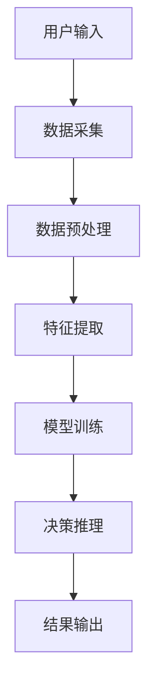
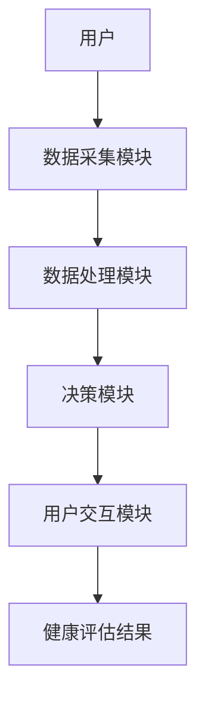
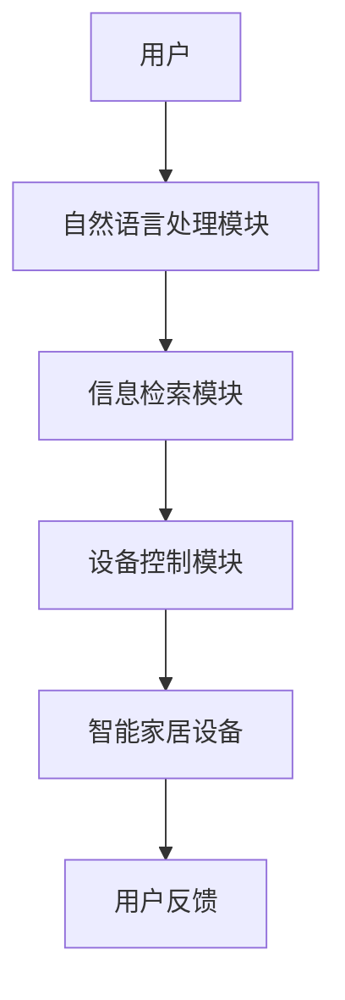

                 


# AI Agent在智能穿戴设备中的应用：健康监测与生活助手

**关键词**：AI Agent，智能穿戴设备，健康监测，生活助手，人工智能技术，智能健康管理系统

**摘要**：  
随着人工智能技术的快速发展，AI Agent（人工智能代理）在智能穿戴设备中的应用日益广泛。本文将深入探讨AI Agent在智能穿戴设备中的应用场景，特别是健康监测与生活助手两大领域。通过分析AI Agent的核心概念、算法原理、系统架构以及实际案例，本文旨在为读者提供一个全面的技术视角，展示AI Agent如何通过智能穿戴设备提升用户的健康管理和生活质量。

---

## 第一部分: AI Agent与智能穿戴设备的背景介绍

### 第1章: AI Agent与智能穿戴设备概述

#### 1.1 AI Agent的基本概念
##### 1.1.1 什么是AI Agent
AI Agent（人工智能代理）是一种能够感知环境并采取行动以实现特定目标的智能实体。它通过传感器、数据处理和决策算法，为用户提供智能化的服务。AI Agent的核心在于其自主性和智能性，能够根据用户需求和环境变化动态调整行为。

##### 1.1.2 AI Agent的核心特征
- **自主性**：AI Agent能够在没有外部干预的情况下自主决策和行动。
- **反应性**：能够实时感知环境变化并做出反应。
- **学习能力**：通过机器学习算法不断优化自身的决策模型。
- **交互性**：能够与用户和其他系统进行有效交互。

##### 1.1.3 AI Agent与智能穿戴设备的结合
AI Agent通过与智能穿戴设备的传感器、数据处理模块和用户界面结合，实现了健康监测和生活助手功能。例如，AI Agent可以通过分析心率、步频等数据，实时监测用户的健康状况，并在必要时提供预警和建议。

#### 1.2 智能穿戴设备的定义与分类
##### 1.2.1 智能穿戴设备的定义
智能穿戴设备是指能够穿戴在身体上的智能电子设备，包括智能手表、智能手环、智能眼镜等。这些设备通常集成了传感器、计算单元和无线通信模块，能够实时采集和处理用户数据。

##### 1.2.2 常见的智能穿戴设备类型
- **智能手表**：支持健康监测、消息通知、运动记录等功能。
- **智能手环**：主要用于健康监测和运动记录。
- **智能眼镜**：集成了摄像头、屏幕和语音助手，支持增强现实功能。
- **其他设备**：如智能鞋垫、智能腰带等。

##### 1.2.3 智能穿戴设备的功能特点
- **实时监测**：能够持续采集用户的生理数据，如心率、体温、运动数据等。
- **数据处理**：内置或外接计算单元，能够对数据进行分析和处理。
- **智能交互**：通过语音、触觉或视觉方式与用户交互。
- **远程连接**：支持蓝牙、Wi-Fi等通信技术，能够与手机或其他设备连接。

---

### 第2章: AI Agent在智能穿戴设备中的应用背景

#### 2.1 健康监测的市场需求
##### 2.1.1 全球健康监测市场的现状
随着人们对健康的关注不断增加，健康监测设备市场迅速增长。根据市场研究机构的数据，全球健康监测设备市场规模已超过千亿美元，且仍在快速增长中。

##### 2.1.2 智能穿戴设备在健康监测中的优势
智能穿戴设备凭借其便携性、实时性和数据处理能力，成为健康监测领域的核心工具。AI Agent的引入进一步提升了设备的智能化水平，能够实时分析健康数据并提供个性化建议。

##### 2.1.3 用户对健康监测的需求分析
用户对健康监测的需求主要集中在以下几个方面：
- 实时监测：用户希望设备能够实时采集和分析健康数据。
- 个性化建议：基于个人数据提供定制化的健康建议。
- 预警功能：在健康状况异常时及时发出预警。

#### 2.2 生活助手的智能化趋势
##### 2.2.1 智能助手的发展历程
智能助手从早期的简单任务处理逐步发展为具备自主学习和决策能力的AI Agent。AI Agent通过自然语言处理和机器学习技术，能够更准确地理解用户需求并提供服务。

##### 2.2.2 AI Agent在生活助手中的应用场景
AI Agent在生活助手中主要应用于以下几个方面：
- **日程管理**：帮助用户安排和管理日常任务。
- **信息检索**：快速获取用户所需的信息。
- **任务执行**：根据用户指令执行特定任务，如发送消息、预约服务等。
- **智能家居控制**：通过AI Agent控制家中的智能设备。

##### 2.2.3 智能生活助手的未来发展方向
未来的智能生活助手将更加智能化和个性化，AI Agent将具备更强的学习能力和适应性，能够更好地理解和满足用户需求。

---

## 第二部分: AI Agent的核心概念与技术原理

### 第3章: AI Agent的核心概念与原理

#### 3.1 AI Agent的定义与特征
##### 3.1.1 AI Agent的定义
AI Agent是一种能够感知环境、自主决策并采取行动以实现目标的智能实体。它通过传感器、数据处理和决策算法，为用户提供智能化服务。

##### 3.1.2 AI Agent的核心特征对比表格
| 特征         | 描述                                                                 |
|--------------|----------------------------------------------------------------------|
| 自主性       | 能够在没有外部干预的情况下自主决策和行动                         |
| 反应性       | 能够实时感知环境变化并做出反应                                     |
| 学习能力     | 通过机器学习算法不断优化自身的决策模型                           |
| 交互性       | 能够与用户和其他系统进行有效交互                                   |

##### 3.1.3 AI Agent与智能穿戴设备的结合
AI Agent通过与智能穿戴设备的传感器、数据处理模块和用户界面结合，实现了健康监测和生活助手功能。例如，AI Agent可以通过分析心率、步频等数据，实时监测用户的健康状况，并在必要时提供预警和建议。

#### 3.2 AI Agent的算法原理
##### 3.2.1 AI Agent的算法流程图


##### 3.2.2 AI Agent的数学模型与公式
AI Agent的核心算法通常基于机器学习模型，例如支持向量机（SVM）或神经网络。以下是一个简单的线性回归模型公式：
$$ y = \beta_0 + \beta_1x + \epsilon $$

其中：
- $y$ 是预测值
- $\beta_0$ 是截距
- $\beta_1$ 是回归系数
- $x$ 是自变量
- $\epsilon$ 是误差项

##### 3.2.3 AI Agent算法的实现代码示例
```python
import numpy as np
from sklearn.linear_model import LinearRegression

# 示例数据
X = np.array([[1], [2], [3], [4], [5]])
y = np.array([2, 4, 5, 4, 6])

# 模型训练
model = LinearRegression()
model.fit(X, y)

# 预测
predicted = model.predict(X)
print("预测值:", predicted)
print("回归系数:", model.coef_)
print("截距:", model.intercept_)
```

---

## 第三部分: AI Agent在健康监测与生活助手中的应用

### 第4章: AI Agent在健康监测中的应用

#### 4.1 健康数据的采集与处理
##### 4.1.1 健康数据的采集流程
AI Agent通过智能穿戴设备的传感器采集用户的健康数据，例如心率、体温、运动数据等。

##### 4.1.2 数据预处理的数学模型
数据预处理是健康监测的重要步骤，通常包括数据清洗和特征提取。例如，使用滑动平均法对心率数据进行平滑处理：
$$ \text{平滑后数据} = \frac{\sum_{i=1}^{n} x_i}{n} $$

##### 4.1.3 数据分析与健康评估
通过机器学习模型对预处理后的数据进行分析，评估用户的健康状况。例如，使用支持向量机（SVM）对心率数据进行分类，判断用户是否处于健康状态。

#### 4.2 健康监测的系统架构设计
##### 4.2.1 系统功能设计
- 数据采集模块：负责采集用户的健康数据。
- 数据处理模块：对采集到的数据进行预处理和特征提取。
- 决策模块：基于机器学习模型对数据进行分析和决策。
- 用户交互模块：将分析结果以用户友好的方式展示。

##### 4.2.2 系统架构图


---

### 第5章: AI Agent在生活助手中的应用

#### 5.1 生活助手的核心功能
##### 5.1.1 日程管理
AI Agent可以通过自然语言处理技术，帮助用户管理日程安排，例如提醒用户重要事件或会议。

##### 5.1.2 信息检索
AI Agent能够快速检索用户所需的信息，例如天气预报、新闻资讯等。

##### 5.1.3 智能家居控制
通过与智能家居设备的连接，AI Agent可以实现对家中设备的远程控制，例如调节灯光、空调等。

#### 5.2 生活助手的系统实现
##### 5.2.1 系统功能设计
- 自然语言处理模块：支持用户通过语音或文本与AI Agent交互。
- 信息检索模块：负责获取用户所需的信息。
- 设备控制模块：通过物联网协议控制智能家居设备。

##### 5.2.2 系统架构图


---

## 第四部分: 项目实战与案例分析

### 第6章: 项目实战

#### 6.1 项目背景
本项目旨在开发一个基于AI Agent的智能健康管理系统，实现健康监测和生活助手功能。

#### 6.2 项目核心实现
##### 6.2.1 数据采集与处理
使用智能手表采集用户的健康数据，包括心率、步频和体温等。

##### 6.2.2 模型训练与优化
通过机器学习算法对健康数据进行分析，优化AI Agent的决策模型。

##### 6.2.3 系统集成与测试
将AI Agent集成到智能手表中，进行功能测试和用户体验优化。

---

### 第7章: 案例分析

#### 7.1 案例背景
某智能手表公司开发了一款支持AI Agent的智能手表，具备健康监测和生活助手功能。

#### 7.2 系统实现
- 数据采集：通过心率传感器采集用户的心率数据。
- 数据分析：使用机器学习模型分析心率数据，判断用户是否处于健康状态。
- 用户交互：通过屏幕和语音提示向用户展示分析结果。

#### 7.3 项目总结
通过本案例，展示了AI Agent在智能穿戴设备中的实际应用，证明了其在健康监测和生活助手领域的巨大潜力。

---

## 第五部分: 最佳实践与小结

### 第8章: 最佳实践

#### 8.1 开发建议
- 在开发AI Agent时，需注重算法的实时性和准确性。
- 确保系统的安全性和隐私保护，避免用户数据泄露。

#### 8.2 技术趋势
- AI Agent在智能穿戴设备中的应用将更加智能化和个性化。
- 未来的AI Agent将具备更强的学习能力和适应性，能够更好地满足用户需求。

### 第9章: 小结与展望

#### 9.1 小结
本文详细探讨了AI Agent在智能穿戴设备中的应用，重点分析了健康监测与生活助手两大领域的技术实现和实际案例。

#### 9.2 展望
随着人工智能技术的不断发展，AI Agent在智能穿戴设备中的应用将更加广泛和深入，为用户的健康管理和生活质量带来更大的提升。

---

## 作者信息

作者：AI天才研究院/AI Genius Institute & 禅与计算机程序设计艺术/Zen And The Art of Computer Programming

