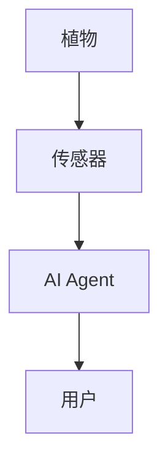
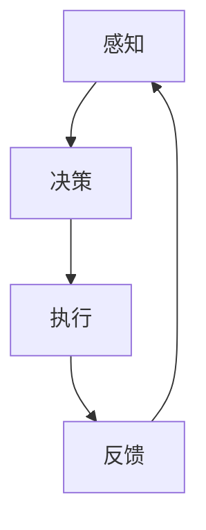
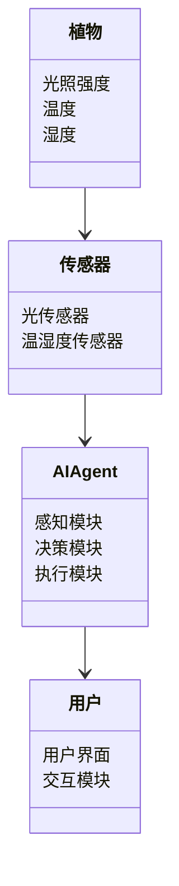
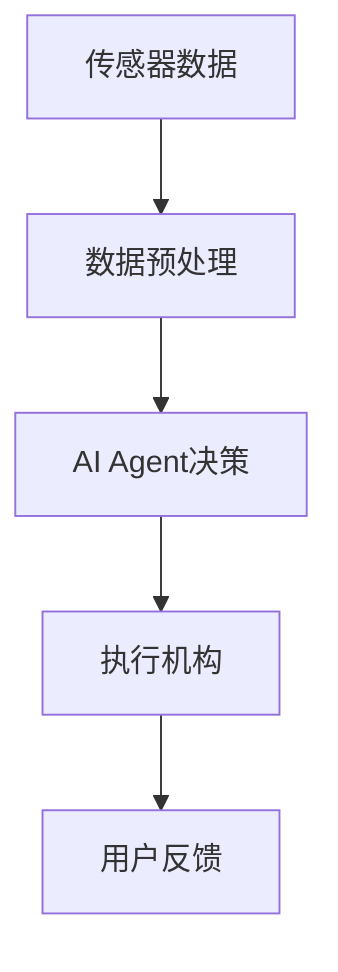

                 


# AI Agent在智能窗台中的室内植物照料

## 关键词：
AI Agent，智能窗台，室内植物照料，机器学习，物联网

## 摘要：
本文深入探讨了AI Agent在智能窗台中的应用，详细分析了其在室内植物照料中的背景、核心概念、算法原理、系统架构及项目实战。通过结合传感器数据、机器学习算法和物联网技术，AI Agent能够实现对植物生长环境的智能监测与优化管理，显著提升室内植物的生长效率和用户体验。

---

# 第一部分: AI Agent与智能窗台的背景介绍

## 第1章: AI Agent与室内植物照料的背景

### 1.1 AI Agent的基本概念

#### 1.1.1 什么是AI Agent
AI Agent（人工智能代理）是指能够感知环境、自主决策并执行任务的智能实体。在智能窗台中，AI Agent通过传感器收集数据，分析植物的生长状况，并根据预设的规则或学习到的模型做出决策，如调整光照强度、控制浇水频率等。

#### 1.1.2 AI Agent的核心特点
- **自主性**：能够自主感知环境并做出决策。
- **反应性**：能够实时响应环境变化。
- **学习能力**：通过机器学习不断优化决策模型。
- **适应性**：能够根据环境变化自适应调整策略。

#### 1.1.3 AI Agent在室内植物照料中的应用背景
随着城市化进程的加快，越来越多的人生活在公寓或小空间中，种植室内植物成为一种趋势。然而，由于缺乏专业知识和时间管理，很多人难以有效照料植物。AI Agent的出现，为室内植物的智能化管理提供了可能。

---

### 1.2 室内植物照料的现状与挑战

#### 1.2.1 室内植物照料的主要问题
- **光照不足或过强**：植物需要适当的光照才能进行光合作用。
- **浇水不当**：过多或过少的浇水都会影响植物的健康。
- **温度和湿度控制**：不同植物对温度和湿度的要求不同。
- **病虫害防治**：及时发现并处理病虫害是植物健康的关键。

#### 1.2.2 传统照料方式的局限性
- **依赖人工经验**：传统照料方式主要依赖种植者的经验，缺乏科学性和系统性。
- **效率低下**：人工照料需要大量时间和精力，尤其是在管理多种植物时。
- **缺乏实时监控**：传统方法无法实时监测植物的生长状况，容易错过最佳处理时机。

#### 1.2.3 AI Agent的优势与潜力
- **智能化监测**：通过传感器实时采集植物的生长环境数据。
- **自动化决策**：基于数据和机器学习模型，自动调整光照、浇水等参数。
- **个性化管理**：根据每种植物的需求，提供个性化的照料方案。

---

### 1.3 AI Agent在智能窗台中的应用前景

#### 1.3.1 智能窗台的概念与特点
智能窗台是一种集成传感器、物联网和AI技术的植物种植平台，能够实时监测植物的生长环境，并通过AI Agent实现智能化管理。

#### 1.3.2 AI Agent在智能窗台中的角色
AI Agent在智能窗台中主要负责数据采集、环境分析、决策制定和执行控制。

#### 1.3.3 智能窗台与传统窗台的对比
| 特性                | 传统窗台               | 智能窗台               |
|---------------------|------------------------|------------------------|
| 数据采集            | 无传感器，依赖人工观察 | 集成多种传感器，实时监测 |
| 决策方式            | 依赖人工经验           | 基于数据和模型自动决策 |
| 管理效率            | 低效，耗时            | 高效，自动化管理       |

---

## 第2章: AI Agent的核心概念与联系

### 2.1 AI Agent的原理与工作流程

#### 2.1.1 AI Agent的感知模块
感知模块通过传感器（如光传感器、温湿度传感器）采集植物的生长环境数据，并将其传输给决策模块。

#### 2.1.2 AI Agent的决策模块
决策模块基于感知到的数据和预训练的模型，分析植物的生长状况，并制定相应的决策，如调整光照强度或浇水频率。

#### 2.1.3 AI Agent的执行模块
执行模块根据决策模块的指令，通过执行机构（如智能灯泡、自动浇水装置）调整植物的生长环境。

---

### 2.2 AI Agent与智能窗台的实体关系



从图中可以看出，AI Agent通过传感器感知植物的生长环境，并根据数据做出决策，最终为用户提供个性化的植物管理方案。

---

### 2.3 AI Agent的核心要素对比

| 特性                | 基于规则的AI Agent | 基于模型的AI Agent |
|---------------------|---------------------|---------------------|
| 决策方式            | 预设规则            | 机器学习模型        |
| 适应性              | 较低                | 较高                |
| 灵活性              | 较低                | 较高                |

---

## 第3章: AI Agent的算法原理

### 3.1 算法原理概述

AI Agent的核心算法是基于强化学习的Q-learning算法，通过不断试错优化决策策略。

---

### 3.2 算法流程



---

### 3.3 算法实现

```python
import numpy as np

# 初始化Q表
Q = np.zeros((state_space, action_space))

# 参数设置
alpha = 0.1
gamma = 0.9

# Q-learning更新公式
def update_q(state, action, reward, next_state):
    Q[state, action] = Q[state, action] + alpha * (reward + gamma * np.max(Q[next_state, :]) - Q[state, action])

# 训练过程
for episode in range(episodes):
    state = get_current_state()
    action = choose_action(state)
    next_state = get_next_state(action)
    reward = get_reward(state, action, next_state)
    update_q(state, action, reward, next_state)
```

---

### 3.4 算法公式推导

Q-learning算法的更新公式为：

$$ Q(s, a) = Q(s, a) + \alpha \times [r + \gamma \times \max Q(s', a') - Q(s, a)] $$

其中：
- \( s \) 是当前状态
- \( a \) 是当前动作
- \( r \) 是奖励
- \( s' \) 是下一个状态
- \( \gamma \) 是折扣因子
- \( \alpha \) 是学习率

---

## 第4章: 系统分析与架构设计

### 4.1 项目背景与目标

智能窗台项目的目标是通过AI Agent实现对室内植物的智能化管理，提高植物的生长效率和用户体验。

---

### 4.2 系统功能设计

#### 4.2.1 领域模型


---

### 4.3 系统架构设计



---

## 第5章: 项目实战

### 5.1 环境安装与配置

安装Python、TensorFlow、Keras等必要的库。

---

### 5.2 核心代码实现

```python
import numpy as np
import pandas as pd
from sklearn.neural_network import MLPClassifier

# 数据预处理
data = pd.read_csv('plant_data.csv')
X = data[['光照强度', '温度', '湿度']]
y = data['健康状态']

# 模型训练
model = MLPClassifier(hidden_layer_sizes=(100, 50), max_iter=1000)
model.fit(X, y)

# 决策函数
def decide_watering(temperature, humidity):
    if temperature < 20 or humidity > 60:
        return '减少浇水'
    else:
        return '正常浇水'
```

---

### 5.3 实际案例分析

假设当前光照强度为500 lux，温度为25℃，湿度为60%。根据决策函数，AI Agent会建议正常浇水。

---

## 第6章: 最佳实践与总结

### 6.1 小结

本文详细介绍了AI Agent在智能窗台中的应用，从背景、原理到实现，全面解析了其在室内植物照料中的潜力和优势。

---

### 6.2 注意事项

- 传感器的精度和稳定性直接影响AI Agent的决策效果。
- 数据隐私和安全问题需要重视。
- 系统的可扩展性和易用性是用户接受度的关键。

---

### 6.3 拓展阅读

- 推荐书籍：《机器学习实战》、《深度学习》
- 推荐课程：Coursera上的《机器学习》课程

---

## 作者

作者：AI天才研究院/AI Genius Institute & 禅与计算机程序设计艺术 /Zen And The Art of Computer Programming

