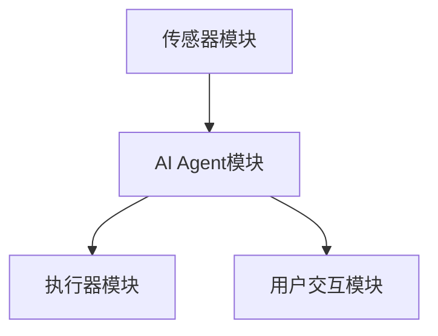
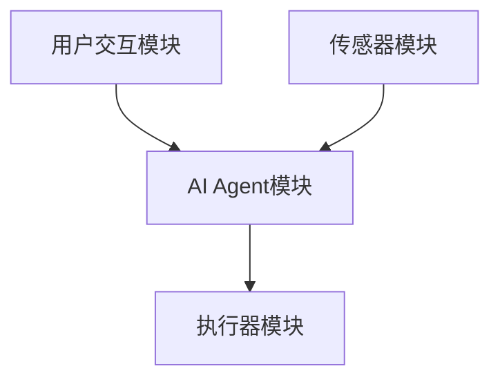
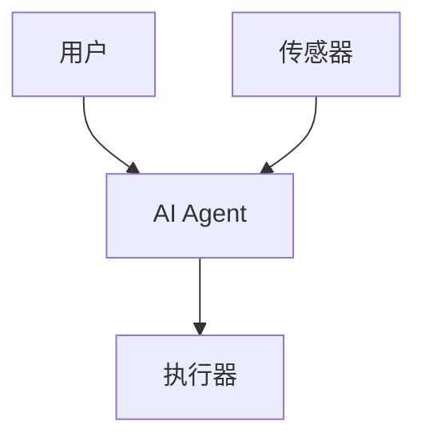

                 


# AI Agent在智能窗帘中的光线调节

## 关键词：
AI Agent, 智能窗帘, 光线调节, 算法原理, 系统架构, 物联网, 智能家居

## 摘要：
本文详细探讨了AI Agent在智能窗帘中的光线调节应用。从AI Agent的基本概念到其在智能窗帘中的具体应用，从算法原理到系统架构设计，从项目实战到最佳实践，全面分析了AI Agent如何通过感知环境、学习决策和执行控制来实现智能窗帘的光线调节。文章结合理论与实践，通过详细的算法流程图、系统架构图和代码示例，帮助读者深入理解AI Agent在智能窗帘中的工作原理和实际应用。

---

## 第一部分: AI Agent与智能窗帘概述

### 第1章: AI Agent与智能窗帘的背景介绍

#### 1.1 AI Agent的基本概念
##### 1.1.1 AI Agent的定义
AI Agent（人工智能代理）是指能够感知环境、做出决策并执行操作的智能实体。它可以是一个软件程序或物理设备，通过传感器和执行器与环境交互。

##### 1.1.2 AI Agent的核心特征
| 特性 | 描述 |
|------|------|
| 感知能力 | 能够通过传感器获取环境信息 |
| 决策能力 | 能够基于感知信息做出决策 |
| 执行能力 | 能够通过执行器影响环境 |
| 学习能力 | 能够通过经验优化行为 |

##### 1.1.3 AI Agent与智能系统的区别
AI Agent是一种智能系统，但与传统智能系统相比，其特点是具有更强的自主性和适应性，能够动态调整行为以适应环境变化。

#### 1.2 智能窗帘的基本概念
##### 1.2.1 智能窗帘的定义
智能窗帘是一种结合了物联网技术的智能家居设备，能够通过传感器和控制器实现自动开关和光线调节。

##### 1.2.2 智能窗帘的功能与应用场景
智能窗帘的主要功能包括自动开关、光线调节、远程控制等。应用场景包括家庭、办公室、酒店等。

##### 1.2.3 智能窗帘与传统窗帘的区别
| 特性 | 传统窗帘 | 智能窗帘 |
|------|----------|----------|
| 控制方式 | 手动或遥控 | 自动化控制 |
| 调节方式 | 固定模式 | 智能调节 |
| 连接性 | 无网络连接 | 支持物联网 |

#### 1.3 AI Agent在智能窗帘中的应用背景
##### 1.3.1 光线调节的智能化需求
随着人们对舒适生活环境的需求增加，智能窗帘能够根据光照强度、时间等因素自动调节，提升居住体验。

##### 1.3.2 智能家居的发展趋势
智能家居是未来家居发展的趋势，AI Agent作为智能家居的核心技术之一，能够实现设备之间的协同工作。

##### 1.3.3 AI Agent在智能窗帘中的优势
AI Agent能够通过学习用户习惯和环境变化，提供个性化的光线调节服务，提升用户体验。

---

## 第二部分: AI Agent与智能窗帘的核心概念

### 第2章: AI Agent与智能窗帘的系统架构

#### 2.1 系统架构概述
##### 2.1.1 系统组成模块
智能窗帘系统主要由传感器模块、AI Agent模块、执行器模块和用户交互模块组成。

##### 2.1.2 各模块的功能与交互关系
传感器模块负责采集环境数据，AI Agent模块负责处理数据并做出决策，执行器模块负责执行决策，用户交互模块负责与用户进行交互。

##### 2.1.3 系统的整体架构图（Mermaid图）


#### 2.2 AI Agent的核心算法
##### 2.2.1 状态感知算法
状态感知算法通过传感器获取环境数据，例如光照强度、时间、用户位置等。

##### 2.2.2 行为决策算法
行为决策算法基于感知状态和历史数据，通过强化学习或基于规则的算法做出决策。

##### 2.2.3 执行控制算法
执行控制算法通过执行器模块（如电机）控制窗帘的开合程度，实现光线调节。

#### 2.3 系统功能设计
##### 2.3.1 光线调节功能
系统根据光照强度和时间，自动调整窗帘的开合程度。

##### 2.3.2 用户交互功能
用户可以通过手机APP或语音助手远程控制窗帘。

##### 2.3.3 数据采集与分析功能
系统采集并分析环境数据，优化光线调节策略。

---

## 第三部分: AI Agent的算法原理与实现

### 第3章: AI Agent的算法原理

#### 3.1 AI Agent的算法原理
##### 3.1.1 强化学习算法
强化学习是一种通过试错学习优化决策的算法，适用于动态环境下的决策问题。

##### 3.1.2 基于规则的算法
基于规则的算法通过预定义的规则进行决策，适用于规则明确的场景。

##### 3.1.3 混合算法
混合算法结合强化学习和基于规则的算法，适用于复杂场景。

#### 3.2 算法实现步骤
##### 3.2.1 数据采集与预处理
通过光照传感器采集光照强度数据，并进行数据清洗和归一化处理。

##### 3.2.2 模型训练与优化
使用强化学习算法训练AI Agent，优化决策策略。

##### 3.2.3 算法部署与测试
将算法部署到智能窗帘系统中，进行功能测试和性能优化。

#### 3.3 算法的数学模型与公式
##### 3.3.1 强化学习的数学模型
强化学习的数学模型通常涉及状态、动作、奖励和策略。

##### 3.3.2 基于规则的算法实现
基于规则的算法通过条件语句实现，例如：
```python
if 光照强度 > 100:
    调整窗帘开合度为50%
```

##### 3.3.3 混合算法的实现流程
混合算法结合强化学习和基于规则的算法，例如：
```python
if 光照强度 > 100:
    使用强化学习策略调整窗帘开合度
else:
    使用基于规则的策略调整窗帘开合度
```

---

## 第四部分: 系统架构设计与实现

### 第4章: 系统架构设计

#### 4.1 系统架构设计
##### 4.1.1 系统功能模块划分
系统功能模块包括传感器模块、AI Agent模块、执行器模块和用户交互模块。

##### 4.1.2 系统组件之间的交互关系
传感器模块采集数据，AI Agent模块处理数据并做出决策，执行器模块执行决策，用户交互模块与用户进行交互。

##### 4.1.3 系统架构图（Mermaid图）


#### 4.2 系统接口设计
##### 4.2.1 系统内部接口
系统内部接口包括传感器与AI Agent之间的数据接口，AI Agent与执行器之间的控制接口。

##### 4.2.2 系统外部接口
系统外部接口包括用户与系统的交互接口，例如手机APP或语音助手。

##### 4.2.3 接口交互流程图（Mermaid图）


#### 4.3 系统交互设计
##### 4.3.1 用户与系统交互流程
用户通过手机APP发送指令，系统接收指令并调整窗帘。

##### 4.3.2 系统内部组件交互流程
传感器采集数据，AI Agent处理数据并做出决策，执行器执行决策。

##### 4.3.3 交互流程图（Mermaid图）


---

## 第五部分: 项目实战

### 第5章: 项目实战

#### 5.1 环境安装
##### 5.1.1 安装Python环境
安装Python 3.x及以上版本，并安装必要的库，例如TensorFlow、Keras等。

##### 5.1.2 安装物联网设备
安装智能窗帘系统，包括传感器、执行器和用户交互模块。

#### 5.2 系统核心实现
##### 5.2.1 AI Agent的核心代码
```python
class AI-Agent:
    def __init__(self):
        self.sensor_data = []
        self.decision_rule = {}

    def感知环境(self):
        # 获取传感器数据
        return self.sensor_data

    def做出决策(self):
        # 基于规则的决策
        if self.感知环境()[0] > 100:
            return "调整窗帘开合度为50%"
        else:
            return "保持当前状态"

    def执行操作(self, decision):
        # 通过执行器执行决策
        print(f"执行决策：{decision}")
```

##### 5.2.2 代码功能解读
上述代码展示了AI Agent的基本功能，包括感知环境、做出决策和执行操作。

#### 5.3 实际案例分析
##### 5.3.1 案例背景
某用户希望智能窗帘在光照强度超过100时自动调整开合度。

##### 5.3.2 案例实现
通过AI Agent的感知环境和做出决策功能，实现光照强度超过100时调整窗帘开合度。

##### 5.3.3 案例分析
通过案例分析，验证AI Agent在智能窗帘中的应用效果。

#### 5.4 项目总结
##### 5.4.1 成功经验
AI Agent能够有效实现智能窗帘的光线调节，提升用户体验。

##### 5.4.2 失败教训
算法优化和系统稳定性需要进一步提升。

---

## 第六部分: 最佳实践

### 第6章: 最佳实践

#### 6.1 小结
AI Agent在智能窗帘中的光线调节应用前景广阔，通过算法优化和系统设计，能够实现智能化的光线调节。

#### 6.2 注意事项
在实际应用中，需要注意数据安全、系统稳定性和用户体验。

#### 6.3 拓展阅读
推荐读者阅读《强化学习实战》、《物联网系统设计》等相关书籍，深入学习AI Agent和物联网技术。

---

## 作者：AI天才研究院/AI Genius Institute & 禅与计算机程序设计艺术 /Zen And The Art of Computer Programming

---

以上是《AI Agent在智能窗帘中的光线调节》的技术博客文章的完整目录和内容框架。

