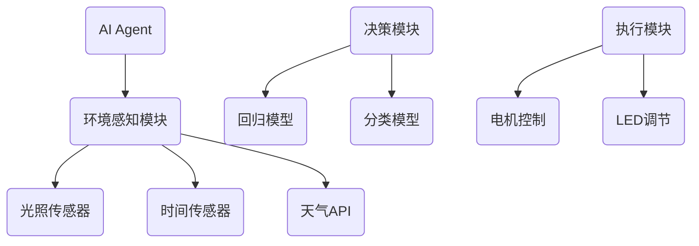
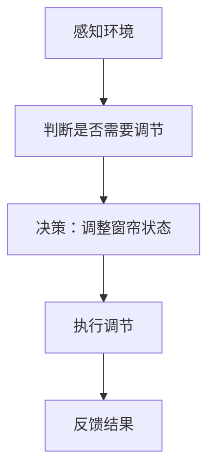
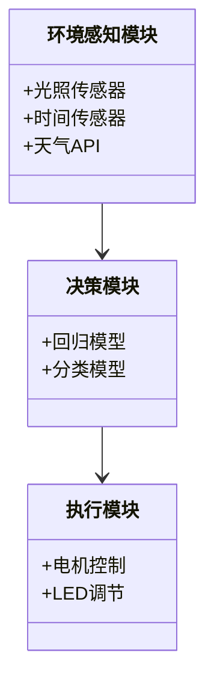
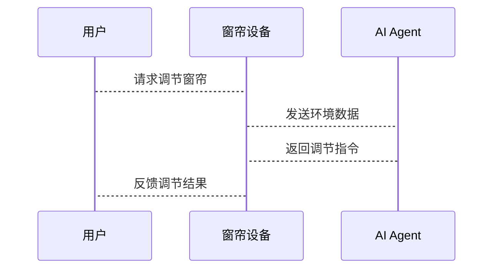

                 


# AI Agent在智能窗帘中的季节性光照调节

> 关键词：AI Agent, 智能窗帘, 季节性光照调节, 状态感知, 决策逻辑, 执行控制

> 摘要：本文详细探讨了AI Agent在智能窗帘中的应用，特别是在季节性光照调节方面的创新与实践。通过分析AI Agent的核心原理、算法模型、系统架构及实际案例，本文为读者呈现了一个从理论到实践的完整技术解决方案。

---

# 第一部分: AI Agent在智能窗帘中的季节性光照调节概述

# 第1章: AI Agent与智能窗帘概述

## 1.1 AI Agent的基本概念
### 1.1.1 AI Agent的定义
AI Agent（人工智能代理）是一种能够感知环境、做出决策并执行动作的智能实体。它通过传感器获取信息，利用算法处理数据，并通过执行器与环境交互。

### 1.1.2 AI Agent的核心特点
- **自主性**：能够在没有外部干预的情况下运行。
- **反应性**：能够实时感知环境变化并做出响应。
- **目标导向性**：根据预设目标或用户需求执行任务。
- **学习能力**：通过数据积累和机器学习算法优化性能。

### 1.1.3 AI Agent与传统自动化控制的区别
| 特性         | AI Agent                     | 传统自动化控制              |
|--------------|------------------------------|-----------------------------|
| 感知能力     | 强大，支持多模态数据输入      | 有限，通常基于单一传感器或输入 |
| 决策能力     | 基于机器学习模型，动态调整   | 基于预设规则，静态不变       |
| 学习能力     | 支持在线学习和优化           | 通常无法自适应调整           |
| 交互能力     | 支持与用户和环境实时交互     | 通常仅执行预设动作           |

## 1.2 智能窗帘的定义与应用场景
### 1.2.1 智能窗帘的基本功能
智能窗帘通过电动或智能控制系统，实现开合、调节透光度等功能。其核心功能包括：
- 自动开关窗帘。
- 调节透光度以控制室内光线强度。
- 根据环境数据（如光照强度、温度、时间等）自动调整状态。

### 1.2.2 智能窗帘的典型应用场景
- **家庭场景**：根据家庭成员的生活习惯自动调节窗帘。
- **办公场景**：根据工作时间自动调节光线，提升工作效率。
- **酒店场景**：为住客提供舒适的睡眠环境。

### 1.2.3 季节性光照调节的重要性
不同季节的光照强度和日照时间差异显著。例如：
- **夏季**：光照强度高，需要减少透光以避免室内过热。
- **冬季**：日照时间短，需要增加透光以提高室内亮度。

## 1.3 季节性光照调节的背景与挑战
### 1.3.1 光照调节的背景需求
随着全球能源危机和环保意识的增强，智能窗帘通过优化光照调节，可以有效减少能源浪费。

### 1.3.2 季节性光照变化的特点
- **周期性**：季节性变化具有周期性，可以通过历史数据预测。
- **区域性**：不同地区的光照条件差异显著。
- **动态性**：光照强度随时间变化，且受天气影响。

### 1.3.3 智能窗帘调节的挑战与机遇
- **挑战**：光照条件复杂多变，传统控制方式难以满足需求。
- **机遇**：AI技术的快速发展为智能窗帘提供了更高效的解决方案。

## 1.4 本章小结
本章介绍了AI Agent的基本概念及其在智能窗帘中的应用，重点分析了季节性光照调节的重要性及面临的挑战。

---

# 第二部分: AI Agent的核心概念与原理

# 第2章: AI Agent的核心概念与联系

## 2.1 AI Agent的核心原理
### 2.1.1 状态感知
AI Agent通过多种传感器（如光照传感器、温度传感器、时间传感器等）获取环境数据。

### 2.1.2 决策逻辑
基于感知到的环境数据，AI Agent利用机器学习模型生成决策。例如：
- 使用回归模型预测光照强度。
- 使用分类模型判断是否需要调整窗帘状态。

### 2.1.3 执行控制
根据决策结果，AI Agent通过执行器（如电机、电磁阀等）调整窗帘状态。

## 2.2 AI Agent的实体关系图


## 2.3 AI Agent的决策流程图


## 2.4 本章小结
本章详细介绍了AI Agent的核心原理及其在智能窗帘中的应用流程。

---

# 第三部分: AI Agent的算法原理与数学模型

# 第3章: AI Agent的算法原理

## 3.1 状态感知算法
### 3.1.1 光照强度计算公式
$$ I = a \times t + b \times w + c $$
其中，$I$为光照强度，$t$为时间，$w$为天气因素，$c$为常数。

### 3.1.2 时间感知算法
根据地理位置和日期，计算日出日落时间。例如：
- 使用天文算法计算日出时间。

### 3.1.3 天气感知算法
通过天气API获取实时天气数据，例如：
- 光照强度（lux）
- 天气状况（晴天、阴天等）

## 3.2 决策逻辑算法
### 3.2.1 回归模型
使用线性回归模型预测光照强度：
$$ y = \beta_0 + \beta_1 x_1 + \beta_2 x_2 + \dots + \beta_n x_n $$

### 3.2.2 分类模型
使用随机森林或支持向量机（SVM）进行分类，判断是否需要调节窗帘状态。

## 3.3 执行控制算法
### 3.3.1 电机控制算法
根据决策结果，控制电机的转速和方向。

### 3.3.2 LED调节算法
根据光照强度，动态调节LED的亮度。

## 3.4 本章小结
本章详细介绍了AI Agent在智能窗帘中的算法原理，包括状态感知、决策逻辑和执行控制。

---

# 第四部分: 系统分析与架构设计方案

# 第4章: 系统分析与架构设计

## 4.1 项目背景与目标
### 4.1.1 项目背景
随着智能家居的普及，智能窗帘的需求日益增长。

### 4.1.2 项目目标
实现基于AI Agent的智能窗帘系统，能够根据季节变化自动调节光照。

## 4.2 系统功能设计
### 4.2.1 领域模型


### 4.2.2 系统架构设计


## 4.3 接口设计
### 4.3.1 设备接口
- 窗帘设备与AI Agent之间的通信接口。

### 4.3.2 用户接口
- 用户通过手机APP或网页控制窗帘。

## 4.4 交互流程图


## 4.5 本章小结
本章从系统架构和接口设计的角度，详细介绍了AI Agent在智能窗帘中的实现方案。

---

# 第五部分: 项目实战

# 第5章: 项目实战

## 5.1 环境搭建
### 5.1.1 安装Python
```bash
python --version
pip install --upgrade pip
```

### 5.1.2 安装AI框架
```bash
pip install numpy
pip install scikit-learn
pip install matplotlib
```

## 5.2 核心代码实现
### 5.2.1 光照强度计算
```python
import numpy as np
from sklearn.linear_model import LinearRegression

# 示例数据
X = np.array([[1, 2], [3, 4], [5, 6]])
y = np.array([7, 8, 9])

model = LinearRegression()
model.fit(X, y)

# 预测
new_X = np.array([[2, 3]])
predicted_y = model.predict(new_X)
print(predicted_y)
```

### 5.2.2 决策逻辑
```python
def decide_adjust(predicted_y):
    if predicted_y > 100:
        return "close"
    elif predicted_y < 50:
        return "open"
    else:
        return "adjust"
```

### 5.2.3 执行控制
```python
def execute_control(action):
    if action == "close":
        motor_control.close()
    elif action == "open":
        motor_control.open()
    elif action == "adjust":
        led_regulate.brightness()
```

## 5.3 代码解读
### 5.3.1 光照强度计算
- 使用线性回归模型预测光照强度。

### 5.3.2 决策逻辑
- 根据预测的光照强度决定是否需要调整窗帘。

### 5.3.3 执行控制
- 根据决策结果控制电机或LED。

## 5.4 案例分析
### 5.4.1 案例背景
某地区夏季光照强度较高，需要自动调节窗帘以降低室内温度。

### 5.4.2 实际调节过程
1. 光照传感器检测到光照强度为120lux。
2. AI Agent预测光照强度为130lux。
3. 决策模块判断需要关闭窗帘。
4. 执行模块控制电机关闭窗帘。

## 5.5 本章小结
本章通过实际案例展示了AI Agent在智能窗帘中的应用，详细讲解了核心代码的实现和运行过程。

---

# 第六部分: 最佳实践与总结

# 第6章: 最佳实践与总结

## 6.1 最佳实践
### 6.1.1 数据质量
- 确保环境数据的准确性和实时性。

### 6.1.2 系统维护
- 定期更新模型参数，确保系统性能。

### 6.1.3 用户反馈
- 收集用户反馈，不断优化系统。

## 6.2 小结
通过本文的介绍，读者可以全面了解AI Agent在智能窗帘中的应用，从理论到实践，掌握核心算法和系统设计方法。

## 6.3 注意事项
- 数据隐私保护。
- 系统稳定性保障。
- 环境适应性优化。

## 6.4 拓展阅读
- 《机器学习实战》
- 《智能系统设计与实现》
- 《AI在智能家居中的应用》

---

# 作者：AI天才研究院/AI Genius Institute & 禅与计算机程序设计艺术 /Zen And The Art of Computer Programming

---

通过以上目录大纲，您可以根据实际需求进一步扩展每章的具体内容，添加更多细节和案例，以满足深度和广度的要求。

