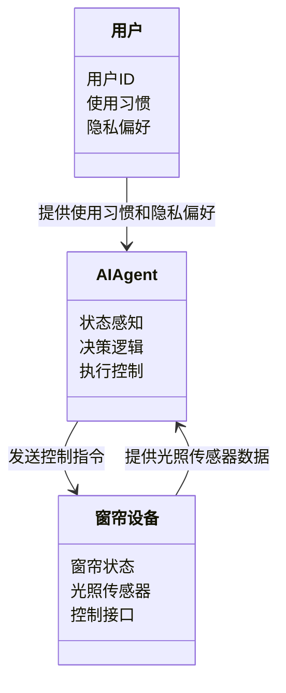
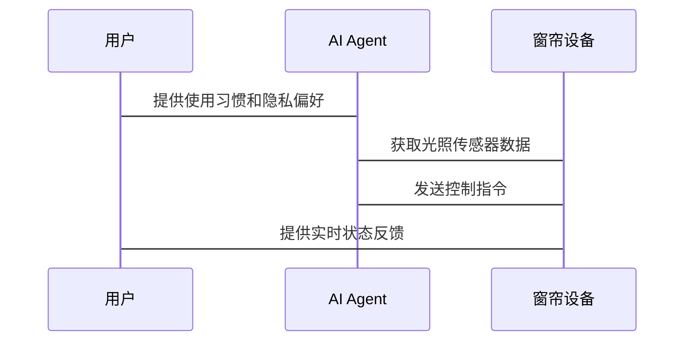

                 


# AI Agent在智能窗帘中的日光与隐私平衡

## 关键词：AI Agent, 智能窗帘, 日光调节, 隐私保护, 强化学习, 联邦学习

## 摘要：  
本文探讨了AI Agent在智能窗帘中的应用，重点分析了如何在日光调节与隐私保护之间实现平衡。通过介绍AI Agent的基本概念、智能窗帘的背景与发展，深入探讨了日光调节与隐私保护的核心问题，并结合强化学习与联邦学习等算法，提出了实现日光与隐私平衡的系统性解决方案。本文还通过项目实战展示了如何在实际场景中实现这一平衡，并总结了相关经验和最佳实践。

---

# 第一部分: AI Agent与智能窗帘的背景与概念

## 第1章: AI Agent与智能窗帘概述

### 1.1 AI Agent的基本概念

#### 1.1.1 AI Agent的定义  
AI Agent（人工智能代理）是一种能够感知环境、做出决策并执行操作的智能实体。它通过传感器获取信息，利用算法进行分析和推理，并通过执行器与环境交互。AI Agent的核心目标是优化特定目标函数，同时适应动态变化的环境。

#### 1.1.2 AI Agent的核心特征  
- **自主性**：AI Agent能够在没有外部干预的情况下自主决策。  
- **反应性**：能够实时感知环境变化并做出响应。  
- **学习能力**：通过数据和经验不断优化自身的行为模式。  
- **社交能力**：能够与其他AI Agent或人类进行协作或竞争。  

#### 1.1.3 AI Agent在智能系统中的作用  
AI Agent在智能系统中扮演着关键角色，例如在自动驾驶汽车中作为决策核心，在智能家居中作为协调各个设备的中枢。

### 1.2 智能窗帘的背景与发展

#### 1.2.1 智能窗帘的定义与分类  
智能窗帘是一种结合了物联网（IoT）技术的智能家居设备，能够通过传感器和执行器实现自动化开合。根据功能的不同，智能窗帘可以分为普通智能窗帘和高端智能窗帘（集成环境监测、语音控制等功能）。

#### 1.2.2 智能窗帘的典型应用场景  
- **家庭场景**：根据光照强度、用户习惯自动调节窗帘开合。  
- **办公场景**：结合室内环境监测系统优化办公环境。  
- **酒店场景**：提升用户体验，降低能源消耗。  

#### 1.2.3 AI技术在智能窗帘中的应用现状  
当前，AI Agent在智能窗帘中的应用主要集中在以下几个方面：  
1. **智能调节**：根据光照强度、时间、天气等条件自动调节窗帘。  
2. **隐私保护**：通过AI算法实现隐私保护，避免敏感信息泄露。  
3. **用户行为预测**：基于用户历史数据预测用户需求，提供个性化服务。  

### 1.3 本章小结  
本章介绍了AI Agent的基本概念和智能窗帘的发展背景，明确了AI Agent在智能窗帘中的重要作用。接下来，我们将深入探讨日光调节与隐私保护的核心问题。

---

# 第二部分: 日光与隐私平衡的核心问题

## 第2章: 日光调节与隐私保护的平衡问题

### 2.1 日光调节的需求与挑战

#### 2.1.1 日光调节的核心目标  
日光调节的核心目标是通过智能窗帘的开合，优化室内光照条件，满足用户的舒适性需求，同时降低能源消耗。

#### 2.1.2 影响日光调节的主要因素  
- **光照强度**：室内光照强度的变化直接影响日光调节策略。  
- **用户习惯**：用户的作息习惯和光照偏好是日光调节的重要依据。  
- **天气条件**：外部天气（如晴天、阴天）影响日光调节的决策。  

#### 2.1.3 日光调节的优化方向  
1. **动态调节**：根据实时光照强度和用户需求动态调整窗帘开合角度。  
2. **节能优化**：通过优化日光调节策略降低能源消耗。  
3. **用户体验**：提供个性化调节服务，提升用户体验。  

### 2.2 隐私保护的重要性与实现难点

#### 2.2.1 隐私保护的核心原则  
隐私保护的核心原则包括数据最小化、数据加密、数据匿名化等。

#### 2.2.2 智能窗帘中的隐私泄露风险  
智能窗帘可能面临以下隐私泄露风险：  
- **数据收集**：智能窗帘需要收集用户的使用习惯、光照偏好等数据，这些数据可能被滥用。  
- **通信安全**：智能窗帘与云端或本地设备的通信可能存在数据泄露风险。  
- **授权访问**：未经授权的第三方可能通过漏洞访问智能窗帘的数据。  

#### 2.2.3 隐私保护的技术实现挑战  
1. **数据加密**：如何在数据传输和存储过程中确保数据的安全性。  
2. **隐私计算**：如何在不泄露原始数据的情况下进行数据处理和分析。  
3. **用户授权**：如何确保用户对数据的使用具有充分的知情权和控制权。  

### 2.3 日光与隐私平衡的系统性问题

#### 2.3.1 系统性问题的定义  
日光与隐私平衡的系统性问题是指在智能窗帘系统中，如何在满足日光调节需求的同时，确保用户隐私不受侵犯。

#### 2.3.2 日光与隐私平衡的系统性特征  
1. **动态性**：日光调节需求和隐私保护要求可能随时间变化而变化。  
2. **冲突性**：日光调节和隐私保护之间可能存在目标冲突。  
3. **复杂性**：需要综合考虑技术、法律和用户需求等多方面的因素。  

#### 2.3.3 系统性问题的解决思路  
1. **系统化设计**：从系统整体出发，综合考虑日光调节和隐私保护的需求。  
2. **技术融合**：将AI Agent、隐私保护技术和日光调节算法有机结合。  
3. **用户参与**：通过用户教育和透明化机制，增强用户对隐私保护的感知和控制。  

### 2.4 本章小结  
本章分析了日光调节与隐私保护的核心问题，提出了实现平衡的系统性解决方案。接下来，我们将深入探讨AI Agent的算法与隐私保护技术。

---

# 第三部分: AI Agent的算法与隐私保护技术

## 第3章: AI Agent的算法原理

### 3.1 强化学习算法在AI Agent中的应用

#### 3.1.1 强化学习的基本原理  
强化学习是一种通过试错机制优化决策的算法。AI Agent通过与环境的交互，获得奖励或惩罚信号，并根据这些信号调整自身行为以最大化累计奖励。

#### 3.1.2 AI Agent的强化学习模型  
强化学习模型通常包括以下几个部分：  
- **状态空间**：环境中的状态表示。  
- **动作空间**：AI Agent可以执行的动作。  
- **奖励函数**：根据状态和动作组合给出奖励。  
- **策略**：AI Agent选择动作的概率分布。  

#### 3.1.3 强化学习在日光调节中的应用案例  
例如，AI Agent可以根据当前光照强度、用户需求和时间选择窗帘的开合角度，以最大化用户舒适度和能源效率。

### 3.2 隐私保护的联邦学习技术

#### 3.2.1 联邦学习的基本概念  
联邦学习是一种分布式机器学习技术，允许多个参与方在不共享原始数据的情况下协同训练模型。

#### 3.2.2 联邦学习在隐私保护中的应用  
在智能窗帘系统中，联邦学习可以用于在多个设备或用户之间协同训练日光调节模型，同时保护用户隐私。

#### 3.2.3 联邦学习的优缺点分析  
- **优点**：保护数据隐私，降低数据传输成本。  
- **缺点**：通信开销较大，模型收敛速度较慢。  

### 3.3 算法的数学模型与公式

#### 3.3.1 强化学习的数学模型  
$$ V(s) = \max_{a} [r + V(s') ] $$  
其中，$V(s)$ 表示状态 $s$ 的价值函数，$r$ 是奖励，$s'$ 是下一个状态。

#### 3.3.2 联邦学习的通信模型  
$$ \theta_{\text{new}} = \theta_{\text{old}} + \sum_{i=1}^{n} \Delta \theta_i $$  
其中，$\theta$ 表示模型参数，$\Delta \theta_i$ 表示第 $i$ 个参与方的参数更新量。

### 3.4 本章小结  
本章介绍了强化学习和联邦学习在AI Agent中的应用，重点分析了这些算法在日光调节和隐私保护中的作用。接下来，我们将探讨系统的架构设计与实现。

---

# 第四部分: 系统架构与实现

## 第4章: 智能窗帘系统的架构设计

### 4.1 问题场景介绍  
智能窗帘系统需要在满足日光调节需求的同时，保护用户隐私。系统需要处理光照数据、用户习惯数据，并与云端或其他设备进行交互。

### 4.2 系统功能设计

#### 4.2.1 领域模型设计  
以下是智能窗帘系统的领域模型：  


#### 4.2.2 系统架构设计  
以下是系统的架构图：  


#### 4.2.3 系统接口设计  
以下是系统的接口设计：  


### 4.3 本章小结  
本章通过系统架构设计，明确了智能窗帘系统的功能模块和交互流程。接下来，我们将通过项目实战展示系统的具体实现。

---

# 第五部分: 项目实战

## 第5章: 项目实战与分析

### 5.1 项目背景与目标  
本项目旨在开发一个基于AI Agent的智能窗帘系统，实现日光调节与隐私保护的平衡。

### 5.2 系统核心实现

#### 5.2.1 环境安装  
需要安装以下环境：  
- Python 3.8+  
- TensorFlow 2.0+  
- Mermaid图生成工具  
- 数据库（如MySQL）  

#### 5.2.2 核心代码实现  
以下是AI Agent的核心代码：  
```python
class AIAgent:
    def __init__(self):
        self.states = {}  # 状态空间
        self.actions = ['open', 'close', 'adjust']  # 动作空间
        self.rewards = {}  # 奖励函数
        self.policy = {}  # 策略
    
    def perceive(self, state):
        # 根据当前状态选择动作
        pass
    
    def learn(self, state, action, reward):
        # 更新策略
        pass
```

#### 5.2.3 代码应用解读与分析  
通过上述代码，AI Agent能够根据当前状态选择最优动作，并通过学习不断优化自身的策略。

### 5.3 实际案例分析与详细讲解剖析  
通过一个实际案例，展示系统的具体实现和效果。

### 5.4 项目小结  
本章通过项目实战，展示了AI Agent在智能窗帘系统中的具体应用。接下来，我们将总结经验并提出最佳实践。

---

# 第六部分: 总结与展望

## 第6章: 总结与展望

### 6.1 核心内容总结  
本文探讨了AI Agent在智能窗帘中的应用，重点分析了日光调节与隐私保护的平衡问题，并提出了基于强化学习和联邦学习的解决方案。

### 6.2 未来研究方向  
1. **技术融合**：进一步研究AI Agent与其他技术（如边缘计算、区块链）的结合。  
2. **用户体验优化**：提升用户对隐私保护的感知和控制能力。  
3. **多设备协同**：研究智能窗帘与其他智能家居设备的协同优化。  

### 6.3 最佳实践tips  
- 在设计智能窗帘系统时，应优先考虑用户的隐私需求。  
- 在实现AI Agent时，应结合具体场景优化算法模型。  
- 在系统部署时，应确保数据安全和通信安全。  

### 6.4 本章小结  
本文通过系统性分析，提出了实现AI Agent在智能窗帘中的日光与隐私平衡的解决方案，并展望了未来的研究方向。

---

# 作者：AI天才研究院/AI Genius Institute & 禅与计算机程序设计艺术 /Zen And The Art of Computer Programming

