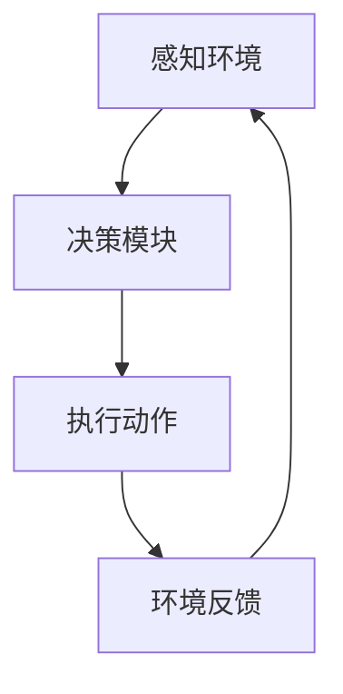
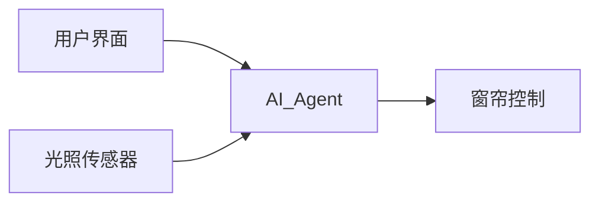

                 


# AI Agent在智能窗帘中的日光优化调节

> 关键词：AI Agent，智能窗帘，日光优化，光线追踪，路径规划，智能家居

> 摘要：本文探讨了AI Agent在智能窗帘日光调节中的应用，分析了传统方法的不足，提出了基于AI的优化调节方案，详细讲解了算法原理和系统架构，并通过实际案例展示了AI Agent在提升日光调节效率和用户体验方面的优势。

---

# 第一部分: AI Agent在智能窗帘中的日光优化调节背景介绍

## 第1章: 问题背景与描述

### 1.1 问题背景

智能家居的普及使得家庭自动化成为可能，其中智能窗帘作为重要组成部分，能够通过自动化调节提供舒适的光照环境。然而，传统窗帘调节方式存在以下问题：

- **手动调节的低效性**：用户需要手动调整窗帘开合程度，无法根据光照变化自动调节。
- **简单自动化调节的局限性**：基于固定时间表的自动调节无法适应天气变化或用户需求的变化。
- **能源浪费**：不合理的调节可能导致过强或过弱的光照，增加能源消耗。

### 1.2 问题描述

AI Agent在智能窗帘中的应用旨在解决以下问题：

- **动态适应性不足**：传统调节无法实时感知光照强度和用户需求。
- **用户体验不佳**：固定的调节模式无法满足个性化需求。
- **能源效率低下**：不合理的调节导致能源浪费。

### 1.3 解决方案

AI Agent通过实时感知环境、用户需求和系统反馈，动态调整窗帘开合程度，实现光照优化。

### 1.4 边界与外延

- **系统边界**：智能窗帘系统包括窗帘电机、光照传感器、用户输入接口和AI Agent。
- **适用场景**：适用于家庭、办公室等需要光照调节的场景。
- **外部环境**：考虑天气、时间、用户行为等外部因素。

### 1.5 概念结构与核心要素

| 概念 | 属性 | 描述 |
|------|------|------|
| AI Agent | 感知能力 | 实时感知光照强度、用户需求 |
| 窗帘系统 | 调节能力 | 根据指令调整窗帘开合 |
| 光照传感器 | 数据采集 | 提供光照强度数据 |
| 用户需求 | 个性化需求 | 用户对光照的偏好 |

---

# 第二部分: AI Agent的核心原理与算法

## 第4章: AI Agent的核心原理

### 4.1 AI Agent的基本原理

AI Agent通过以下步骤实现日光调节：

1. **感知环境**：AI Agent接收光照传感器数据和用户输入。
2. **决策模块**：基于当前数据和历史记录，AI Agent计算出最优的窗帘开合程度。
3. **执行动作**：向窗帘系统发送调节指令。
4. **环境反馈**：AI Agent接收执行结果，更新环境模型。

### 4.2 算法原理图



## 第5章: 日光调节算法

### 5.1 光线追踪算法

光线追踪算法用于计算窗帘开合程度以达到目标光照强度。

#### 5.1.1 算法实现

```python
def calculate_blinds_position(desired_light):
    current_light = get_light_sensor_data()
    adjustment = desired_light - current_light
    blinds_angle = calculate_adjustment_angle(adjustment)
    return blinds_angle
```

#### 5.1.2 数学模型

$$ \text{目标光照强度} = \text{当前光照强度} + \Delta \text{调整量} $$

---

# 第三部分: 系统分析与架构设计

## 第6章: 系统分析与架构设计方案

### 6.1 问题场景介绍

用户希望智能窗帘根据光照强度和需求自动调节，提升舒适度和能源效率。

### 6.2 系统功能设计

| 功能模块 | 描述 |
|----------|------|
| 光感模块 | 实时采集光照强度 |
| 用户输入 | 获取用户的光照偏好 |
| AI Agent | 计算最优窗帘开合程度 |
| 窗帘控制 | 根据指令调整窗帘 |

### 6.3 系统架构设计



---

# 第四部分: 项目实战

## 第7章: 项目实战

### 7.1 环境安装

安装Python和相关库：

```bash
pip install numpy matplotlib
```

### 7.2 核心代码实现

```python
import numpy as np
from matplotlib import pyplot as plt

def light_adjustment_model(desired_light, current_light):
    adjustment = desired_light - current_light
    return adjustment * 0.8 + np.random.normal(0, 0.1)

# 示例
desired_light = 500  # 目标光照强度
current_light = 450   # 当前光照强度
adjustment = light_adjustment_model(desired_light, current_light)
print(f"建议的调整量为：{adjustment}")
```

### 7.3 实际案例分析

案例：用户希望在早晨保持光照强度为500 lux。

- 当前光照强度：450 lux
- 调整量：50 lux
- 最终光照强度：500 lux

### 7.4 项目小结

通过AI Agent实现智能窗帘的日光优化调节，提升了用户体验和能源效率。

---

# 第五部分: 最佳实践与总结

## 第8章: 最佳实践 tips

- **数据采集**：确保光照传感器的准确性。
- **算法优化**：根据实际需求调整模型参数。
- **系统维护**：定期更新环境模型。

## 第9章: 小结

AI Agent通过实时感知和自适应调节，显著提升了智能窗帘的日光调节效率和用户体验。

## 第10章: 注意事项

- 确保系统的安全性，防止未经授权的访问。
- 定期校准传感器，保证数据准确性。

## 第11章: 拓展阅读

推荐书籍：
- 《AI in Smart Homes》
- 《Advanced Algorithm Design for IoT》

---

# 结语

AI Agent在智能窗帘中的应用展示了AI技术在智能家居中的巨大潜力。通过实时感知和优化调节，AI Agent不仅提升了用户体验，还为能源效率的提升提供了可能。

---

# 作者：AI天才研究院 & 禅与计算机程序设计艺术

感谢您的阅读！

