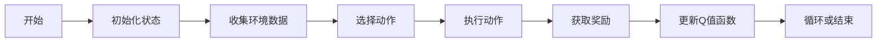
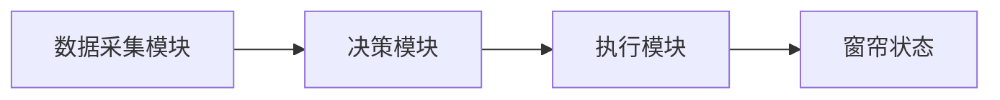
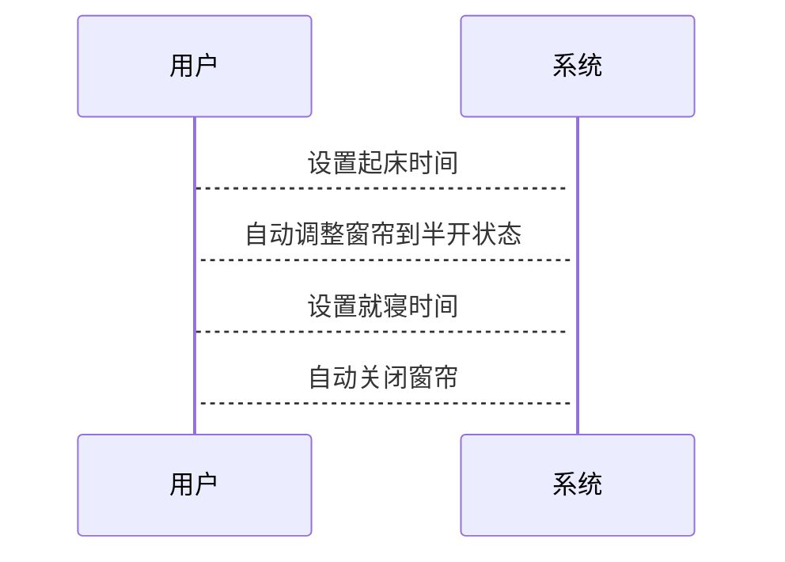

                 


# AI Agent在智能窗帘中的昼夜节律调节

> 关键词：AI Agent，智能窗帘，昼夜节律，强化学习，系统架构，物联网

> 摘要：本文探讨AI Agent在智能窗帘中的应用，重点分析其如何通过昼夜节律调节优化用户的睡眠和生活节奏。文章从背景介绍、核心概念、算法原理、系统架构到项目实战，全面解析AI Agent在智能窗帘中的实现与应用，为读者提供详尽的技术指导。

---

## 第1章: AI Agent与昼夜节律调节的背景介绍

### 1.1 问题背景与重要性

#### 1.1.1 人类昼夜节律的基本概念
- 人类的生物钟是由大脑中的视交叉上核（SCN）控制的，周期约为24小时。
- 光线是调节昼夜节律的主要外部因素，尤其是蓝光对人的影响最大。

#### 1.1.2 现代生活方式对昼夜节律的影响
- 电子设备的普及导致人们接触过多蓝光，影响睡眠质量。
- 不规律的工作时间（如夜班）打乱昼夜节律，引发健康问题。

#### 1.1.3 AI Agent在昼夜节律调节中的作用
- AI Agent可以通过学习用户的行为模式，自动调整窗帘的开合时间。
- 结合环境数据（如光照、温度）优化调节策略，帮助用户维持健康的昼夜节律。

### 1.2 智能窗帘的发展现状

#### 1.2.1 智能窗帘的基本功能与技术
- 基本功能：远程控制、定时开关、光线感应。
- 技术基础：物联网（IoT）、无线通信（Wi-Fi、蓝牙）、传感器技术。

#### 1.2.2 当前智能窗帘的不足之处
- 缺乏智能化的调节逻辑，无法根据用户需求优化开合时间。
- 无法结合外部环境数据（如天气、光照强度）进行智能决策。

#### 1.2.3 引入AI Agent的必要性
- 通过AI Agent实现个性化、智能化的窗帘控制。
- 提供更健康、更舒适的睡眠和生活环境。

---

## 第2章: AI Agent的核心概念与原理

### 2.1 AI Agent的基本定义

#### 2.1.1 AI Agent的定义与分类
- **定义**：AI Agent是一种智能体，能够感知环境、自主决策并执行任务。
- **分类**：
  - **反应式Agent**：基于当前感知做出反应。
  - **认知式Agent**：具有推理、规划能力，能够理解上下文。

#### 2.1.2 AI Agent的主要特点与优势
- **自主性**：无需人工干预，自动执行任务。
- **反应性**：实时感知环境变化并做出调整。
- **学习能力**：通过机器学习优化决策策略。

#### 2.1.3 AI Agent与传统自动控制系统的区别
| 特性           | AI Agent                   | 传统控制系统               |
|----------------|----------------------------|-----------------------------|
| 决策方式       | 基于机器学习模型           | 基于固定规则               |
| 适应性         | 能够自适应环境变化         | 需人工调整规则             |
| 学习能力       | 具备学习能力               | 无学习能力                 |

### 2.2 昼夜节律调节的核心原理

#### 2.2.1 人类昼夜节律的生物机制
- **光敏感细胞**：视网膜中的视杆细胞和视锥细胞对光敏感。
- **褪黑激素**：由松果体分泌，调节睡眠-觉醒周期。

#### 2.2.2 光照对昼夜节律的影响
- **早晨光照**：促进覚醒，抑制褪黑激素分泌。
- **傍晚光照**：帮助调整生物钟，准备进入睡眠状态。

#### 2.2.3 AI Agent如何模拟和优化昼夜节律
- **数据采集**：收集用户的作息习惯、光照强度、室内温度等数据。
- **模型训练**：基于强化学习优化窗帘开合策略。
- **实时调整**：根据环境变化动态调整窗帘状态。

### 2.3 AI Agent与智能窗帘的结合

#### 2.3.1 AI Agent在智能窗帘中的应用场景
- **睡眠优化**：根据用户的睡眠周期自动调节窗帘开合时间。
- **节能优化**：在光照充足时关闭窗帘，减少能源消耗。

---

## 第3章: AI Agent的算法原理与实现

### 3.1 算法原理

#### 3.1.1 强化学习模型
- **状态空间**：用户的作息习惯、光照强度、室内温度。
- **动作空间**：窗帘的开合状态（开、关、半开）。
- **奖励函数**：用户满意度评分，基于睡眠质量、节能效果等指标。

#### 3.1.2 数学模型
$$ R = r_{t} + \gamma \max_{a} Q(s', a) $$
其中：
- \( R \) 是总奖励，
- \( r_{t} \) 是即时奖励，
- \( \gamma \) 是折扣因子，
- \( Q(s', a) \) 是状态-动作值函数。

### 3.2 算法实现

#### 3.2.1 算法流程


#### 3.2.2 Python代码实现
```python
import numpy as np

class AIAgent:
    def __init__(self, state_space, action_space):
        self.state_space = state_space
        self.action_space = action_space
        self.Q = np.zeros((state_space, action_space))
    
    def choose_action(self, state, epsilon=0.1):
        if np.random.random() < epsilon:
            return np.random.randint(self.action_space)
        return np.argmax(self.Q[state])
    
    def update_Q(self, current_state, action, reward, next_state, alpha=0.1):
        self.Q[current_state][action] += alpha * (reward + np.max(self.Q[next_state]) - self.Q[current_state][action])
```

---

## 第4章: 系统架构与设计

### 4.1 系统架构设计

#### 4.1.1 模块化架构
- **数据采集模块**：采集用户行为数据、环境数据。
- **决策模块**：AI Agent负责决策窗帘开合。
- **执行模块**：驱动电机或其他执行机构。



### 4.2 接口设计

#### 4.2.1 API接口
- **GET /status**：获取当前窗帘状态。
- **POST /command**：发送窗帘控制命令。

### 4.3 交互流程

#### 4.3.1 用户与系统交互


---

## 第5章: 项目实战与案例分析

### 5.1 项目实战

#### 5.1.1 环境安装
```bash
pip install numpy scikit-learn matplotlib
```

#### 5.1.2 核心代码实现
```python
# 窗帘控制类
class SmartCurtain:
    def __init__(self):
        self.state = 'closed'  # 状态：'open', 'closed', 'half-open'
    
    def open(self):
        self.state = 'open'
    
    def close(self):
        self.state = 'closed'
    
    def half_open(self):
        self.state = 'half-open'
    
    def get_state(self):
        return self.state
```

---

## 第6章: 最佳实践与总结

### 6.1 最佳实践

- **数据隐私**：确保用户数据的安全性，避免泄露。
- **系统兼容性**：支持多种智能设备和平台的互联互通。
- **持续优化**：定期更新AI模型，提升调节效果。

### 6.2 小结

本文详细介绍了AI Agent在智能窗帘中的昼夜节律调节，从理论到实践，为读者提供了全面的技术指导。通过AI Agent的学习和优化能力，智能窗帘能够更好地适应用户的作息需求，提升生活质量。

### 6.3 注意事项

- 在实际应用中，需考虑网络延迟和设备稳定性问题。
- 定期维护和更新系统，确保长期稳定运行。

### 6.4 拓展阅读

- 推荐阅读《强化学习入门》、《物联网应用开发》等书籍，深入理解相关技术。

---

## 作者：AI天才研究院 & 禅与计算机程序设计艺术

---

以上就是《AI Agent在智能窗帘中的昼夜节律调节》的完整目录和内容概览，希望对您有所帮助！

