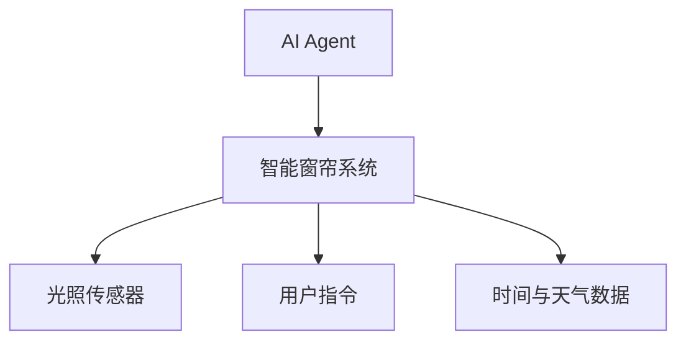
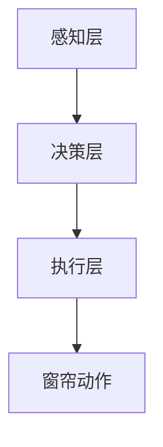
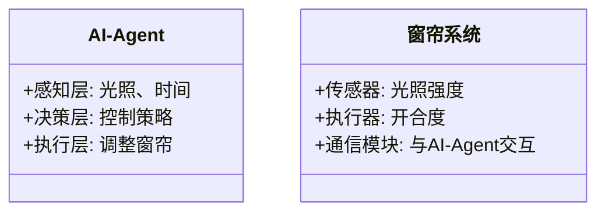
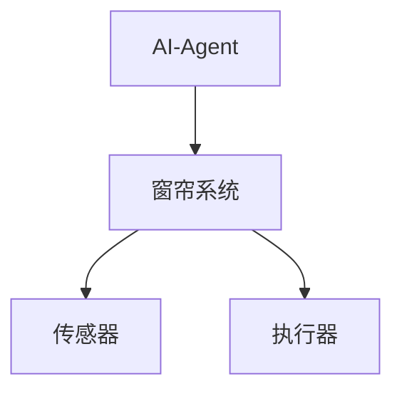
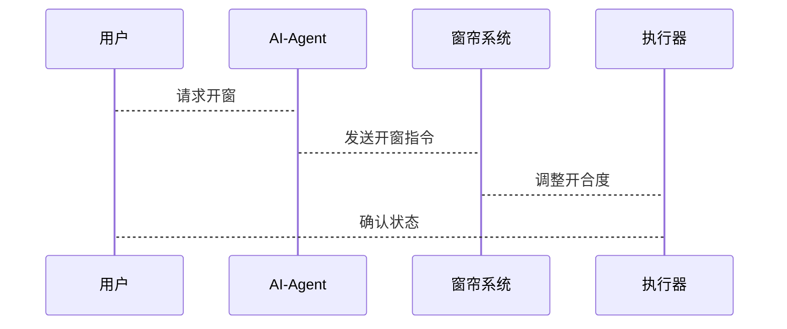

                 


# AI Agent在智能窗帘中的自然光利用优化

> 关键词：AI Agent, 智能窗帘, 自然光优化, 机器学习, 智能家居

> 摘要：本文探讨AI Agent在智能窗帘中的应用，分析如何通过AI技术优化自然光利用。从背景到算法，再到系统设计和实战案例，详细讲解实现过程。

---

## 第1章: 背景介绍

### 1.1 问题背景
#### 1.1.1 能源浪费与资源优化的必要性
现代建筑中，能源浪费问题日益突出，优化自然光利用可减少能源消耗。

#### 1.1.2 智能家居的发展趋势
智能家居普及，推动AI技术在家庭设备中的应用，如智能窗帘。

#### 1.1.3 自然光利用的重要性
合理利用自然光可降低照明能耗，提高舒适度。

### 1.2 问题描述
#### 1.2.1 窗帘控制的现状与不足
传统窗帘仅响应手动或定时开关，无法智能调节。

#### 1.2.2 用户需求与自然光利用的矛盾
用户需求多样，环境动态变化，传统方式难以满足。

#### 1.2.3 AI Agent在智能窗帘中的潜在价值
AI Agent可实时感知环境，优化窗帘控制策略。

### 1.3 问题解决
#### 1.3.1 AI Agent的核心作用
通过感知环境、决策和执行，优化自然光利用。

#### 1.3.2 自然光利用的优化目标
最大化利用自然光，最小化能源消耗，提升舒适度。

#### 1.3.3 边界与外延
限定条件如天气、时间，扩展至其他智能家居设备。

### 1.4 概念结构与核心要素
#### 1.4.1 AI Agent的定义与组成
AI Agent通过感知、决策、执行优化环境。

#### 1.4.2 智能窗帘的系统架构
包括传感器、执行器和AI Agent控制器。

#### 1.4.3 自然光利用的数学模型
建立光照强度与窗帘开合度的数学关系。

---

## 第2章: 核心概念与联系

### 2.1 AI Agent的原理
#### 2.1.1 感知层
采集光照强度、时间、天气等数据。

#### 2.1.2 决策层
基于感知数据，生成窗帘控制策略。

#### 2.1.3 执行层
根据决策结果，调整窗帘开合。

### 2.2 智能窗帘的系统架构
#### 2.2.1 硬件部分
传感器、执行器、通信模块。

#### 2.2.2 软件部分
AI算法、数据处理、用户界面。

#### 2.2.3 交互界面
用户通过手机或语音助手控制窗帘。

### 2.3 核心概念对比分析
| 对比项       | 传统控制方式         | AI优化方式         |
|--------------|----------------------|----------------------|
| 控制策略     | 固定时间表           | 动态优化            |
| 响应速度     | 较慢                | 实时响应            |
| 能耗优化     | 有限                | 显著                |

### 2.4 实体关系图


---

## 第3章: 算法原理讲解

### 3.1 AI Agent的算法实现

#### 3.1.1 算法流程图


#### 3.1.2 Python代码实现
```python
# 算法实现代码
import numpy as np
from sklearn.linear_model import LinearRegression

# 数据预处理
X = np.array([1, 2, 3, 4, 5]).reshape(-1, 1)
y = np.array([2, 4, 5, 4, 6])

# 训练模型
model = LinearRegression()
model.fit(X, y)

# 预测
new_X = np.array([6]).reshape(-1, 1)
predicted_y = model.predict(new_X)
```

#### 3.1.3 数学模型与公式
光照强度预测模型：
$$ y = \beta_0 + \beta_1x + \epsilon $$

---

## 第4章: 系统分析与架构设计

### 4.1 项目介绍
智能窗帘系统设计，利用AI Agent优化自然光利用。

### 4.2 系统功能设计


### 4.3 系统架构设计


### 4.4 接口设计与交互


---

## 第5章: 项目实战

### 5.1 环境安装
安装Python、机器学习库、Mermaid工具。

### 5.2 核心代码实现
```python
import numpy as np
from sklearn.linear_model import LinearRegression

# 数据
X = np.array([1, 2, 3, 4, 5]).reshape(-1, 1)
y = np.array([2, 4, 5, 4, 6])

# 训练
model = LinearRegression()
model.fit(X, y)

# 使用
print(model.predict([[6]]))
```

### 5.3 代码解读
通过线性回归模型预测光照强度，调整窗帘开合。

### 5.4 案例分析
实际应用案例，分析优化效果和数据。

### 5.5 项目小结
项目实现过程中的收获与遇到的问题。

---

## 第6章: 最佳实践

### 6.1 小结
AI Agent在智能窗帘中的应用前景广阔。

### 6.2 注意事项
数据准确性、系统稳定性、用户隐私保护。

### 6.3 拓展阅读
推荐相关技术书籍和论文。

---

# 作者：AI天才研究院 & 禅与计算机程序设计艺术

---

这篇文章通过系统地分析AI Agent在智能窗帘中的应用，详细讲解了从背景到算法实现再到系统设计的全过程，为读者提供了全面的技术指导和实践参考。

