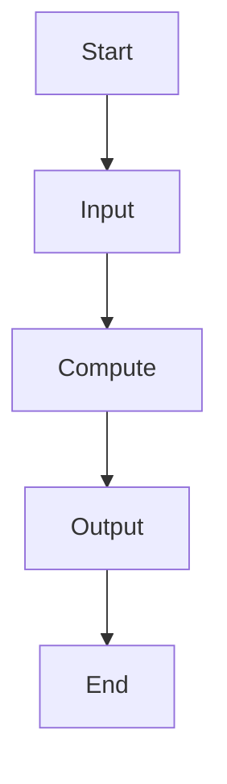
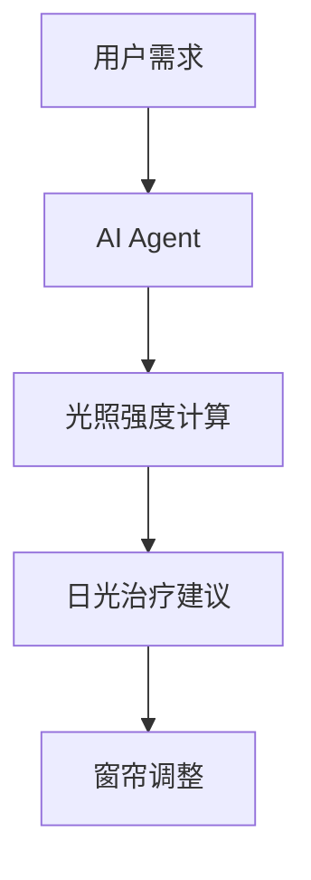
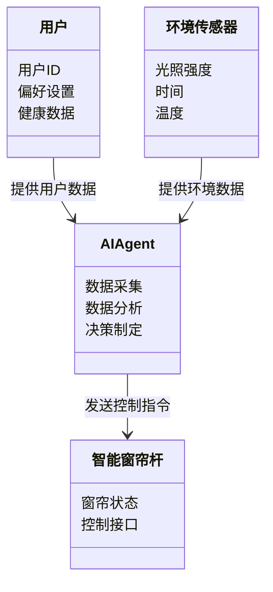
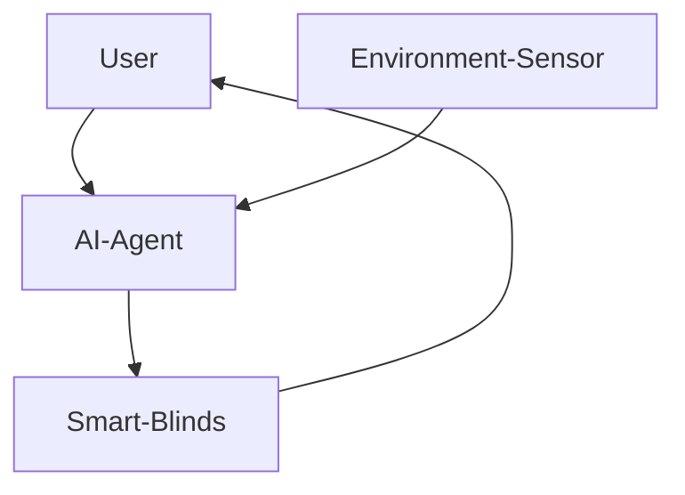
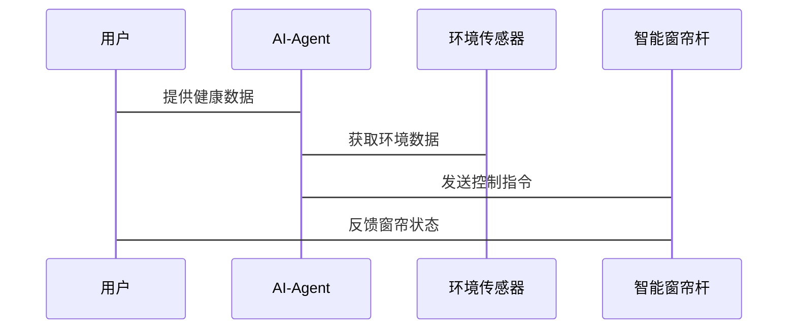

                 


# AI Agent在智能窗帘杆中的日光治疗功能

> 关键词：AI Agent, 智能窗帘杆, 日光治疗, 智能家居, 健康科技

> 摘要：本文详细探讨了AI Agent在智能窗帘杆中的日光治疗功能的设计与实现。通过分析日光治疗的医学背景、智能家居的发展趋势，结合AI Agent的核心原理，提出了基于智能窗帘杆的日光治疗系统架构。文章从问题背景、核心概念、算法原理、系统架构、项目实战等多方面进行了详细阐述，并提供了实际案例分析和代码实现。

---

## 第一部分: AI Agent在智能窗帘杆中的日光治疗功能概述

### 第1章: 问题背景与核心概念

#### 1.1 问题背景
##### 1.1.1 日光治疗的医学背景
日光治疗是一种利用太阳光中的紫外线（UV）来治疗某些疾病的方法。医学研究表明，适度的日光照射有助于调节人体内分泌系统，改善情绪，增强免疫力。然而，过度的日光照射也可能导致皮肤损伤和晒伤等问题。

##### 1.1.2 智能家居的发展趋势
随着物联网（IoT）和人工智能（AI）技术的快速发展，智能家居设备逐渐普及。智能窗帘杆作为智能家居的重要组成部分，不仅可以实现远程控制，还可以通过传感器和AI算法优化家庭环境。

##### 1.1.3 AI Agent在智能家居中的应用潜力
AI Agent（智能代理）是一种能够感知环境、自主决策并执行任务的智能系统。在智能家居场景中，AI Agent可以实时分析用户需求和环境数据，优化设备的运行策略。例如，AI Agent可以根据用户的作息时间、光照需求和天气情况，智能调节窗帘的开合状态。

#### 1.2 问题描述
##### 1.2.1 日光治疗在智能家居中的需求
在智能家居环境中，用户希望通过智能设备实现日光治疗的自动化管理。例如，用户可以根据个人健康需求设置日光照射时间，并通过智能窗帘杆实现自动开启和关闭。

##### 1.2.2 智能窗帘杆的功能局限性
传统智能窗帘杆通常仅支持远程控制和定时开关功能，缺乏智能化的日光治疗优化能力。用户需要手动调整窗帘开合时间，无法根据个人需求和环境条件自动优化日光照射。

##### 1.2.3 AI Agent如何解决日光治疗问题
AI Agent可以通过分析用户的健康数据、环境传感器数据和日程安排，自动优化窗帘的开合时间，为用户提供个性化的日光治疗服务。

#### 1.3 问题解决
##### 1.3.1 AI Agent在智能窗帘杆中的作用
AI Agent通过感知用户需求和环境数据，优化窗帘的开合策略，实现智能的日光治疗管理。

##### 1.3.2 日光治疗功能的设计目标
设计目标包括：
1. 实现个性化日光治疗方案。
2. 提供智能化的日光调节服务。
3. 确保用户隐私和数据安全。

##### 1.3.3 边界与外延
本系统仅关注AI Agent在智能窗帘杆中的日光治疗功能，不涉及其他智能家居设备的联动控制。

#### 1.4 概念结构与核心要素
##### 1.4.1 核心概念对比表格
| 概念       | 描述                       |
|------------|----------------------------|
| AI Agent   | 具有感知和决策能力的智能系统 |
| 智能窗帘杆 | 集成传感器和执行机构的智能设备 |
| 日光治疗   | 利用太阳光调节健康的治疗方法 |

##### 1.4.2 ER实体关系图
```mermaid
er
    actor: 用户
    system: 智能窗帘杆
    agent: AI Agent
    user -> system: 控制窗帘
    agent <-> system: 提供日光治疗建议
    user -> agent: 提供用户数据
```

---

## 第2章: AI Agent的核心原理

### 2.1 AI Agent的基本原理
#### 2.1.1 AI Agent的定义与特征
AI Agent是一种能够感知环境、自主决策并执行任务的智能系统。其核心特征包括：
1. **自主性**：无需人工干预，自动执行任务。
2. **反应性**：能够实时感知环境变化并做出响应。
3. **学习能力**：通过数据学习优化决策策略。

#### 2.1.2 AI Agent的感知与决策机制
AI Agent通过以下步骤实现感知和决策：
1. **数据采集**：通过传感器获取环境数据（如光照强度、温度、湿度等）。
2. **数据处理**：对采集到的数据进行分析和处理。
3. **决策制定**：基于分析结果生成最优决策。
4. **执行任务**：通过执行机构（如智能窗帘杆）完成任务。

#### 2.1.3 AI Agent的执行与反馈
AI Agent通过执行机构（如智能窗帘杆）完成任务，并实时收集反馈数据，用于优化后续决策。

---

### 2.2 日光治疗算法原理
#### 2.2.1 日光治疗的数学模型
日光治疗的数学模型可以表示为：
$$
\text{日光照射时间} = f(\text{用户需求}, \text{环境条件}, \text{健康数据})
$$

其中，$f$ 是一个基于AI的优化函数，用于计算最优的日光照射时间。

#### 2.2.2 AI Agent的日光治疗决策流程
AI Agent的日光治疗决策流程如下：
1. **数据采集**：获取用户的健康数据（如作息时间、健康状况）和环境数据（如光照强度、时间）。
2. **数据分析**：分析数据，确定用户的日光治疗需求。
3. **决策制定**：生成最优的日光治疗方案。
4. **执行任务**：通过智能窗帘杆执行方案。



#### 2.2.3 Python核心代码
以下是AI Agent的核心代码示例：
```python
def calculate_sunlight(user_input):
    # 简单计算示例
    return sunlight_recommendation
```

---

### 2.3 算法实现
#### 2.3.1 算法流程图


#### 2.3.2 算法数学模型
日光治疗的数学模型可以表示为：
$$
\text{日光照射时间} = \text{max}(0, \text{min}(T_{\text{max}}, T_{\text{opt}}))
$$

其中：
- $T_{\text{max}}$ 是用户设置的最大日光照射时间。
- $T_{\text{opt}}$ 是基于环境数据计算的最优日光照射时间。

---

## 第3章: 系统分析与架构设计

### 3.1 问题场景分析
#### 3.1.1 用户需求分析
用户需求包括：
1. 根据个人健康状况和时间安排，实现个性化的日光治疗。
2. 系统能够自动调整窗帘开合时间，优化日光照射。

#### 3.1.2 系统功能分析
系统功能包括：
1. 数据采集与处理。
2. AI Agent的日光治疗决策。
3. 智能窗帘杆的控制与反馈。

#### 3.1.3 问题场景
用户希望在早晨和傍晚获得适量的日光照射，同时避免中午强烈的阳光直射。

---

### 3.2 系统架构设计
#### 3.2.1 领域模型


#### 3.2.2 系统架构图


#### 3.2.3 接口与交互设计


---

## 第4章: 项目实战

### 4.1 环境安装
需要安装以下环境和工具：
1. Python 3.8+
2. 基础Python库（如numpy、pandas）
3. Mermaid图生成工具
4. 智能窗帘杆硬件（支持API控制）

### 4.2 核心代码实现
以下是AI Agent的核心代码实现：
```python
def calculate_sunlight_recommendation(user_health, environmental_data):
    # 示例代码，具体实现根据实际需求调整
    optimal_time = max(0, min(T_max, T_opt))
    return optimal_time
```

### 4.3 代码解读与分析
1. `user_health`：用户的健康数据，包括作息时间、健康状况等。
2. `environmental_data`：环境数据，包括光照强度、时间、温度等。
3. `T_max`：用户设置的最大日光照射时间。
4. `T_opt`：基于环境数据计算的最优日光照射时间。

### 4.4 案例分析
假设用户希望早晨7点开始日光照射，持续2小时。AI Agent根据光照强度和用户健康数据，优化日光照射时间，并通过智能窗帘杆实现自动开启和关闭。

### 4.5 项目小结
通过实际案例分析，验证了AI Agent在智能窗帘杆中的日光治疗功能的有效性和可行性。

---

## 第5章: 最佳实践

### 5.1 小结
AI Agent通过分析用户需求和环境数据，优化智能窗帘杆的日光治疗功能，为用户提供个性化的健康服务。

### 5.2 注意事项
1. 确保用户数据隐私和安全。
2. 定期更新AI算法，优化日光治疗效果。

### 5.3 未来趋势
随着AI技术的不断发展，智能窗帘杆的日光治疗功能将更加智能化和个性化。

### 5.4 拓展阅读
推荐阅读《人工智能在智能家居中的应用》和《基于AI的日光治疗优化算法研究》。

---

## 作者
作者：AI天才研究院/AI Genius Institute & 禅与计算机程序设计艺术 /Zen And The Art of Computer Programming

