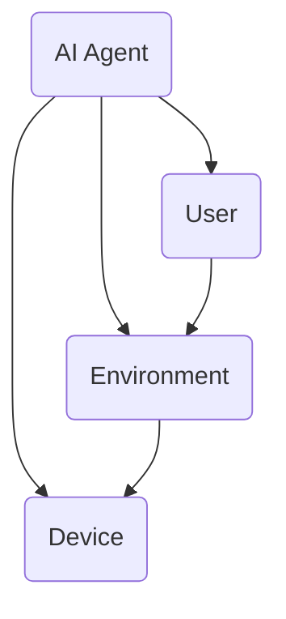
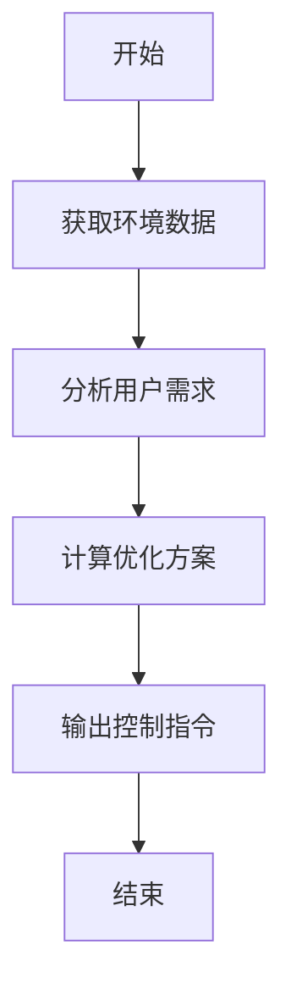
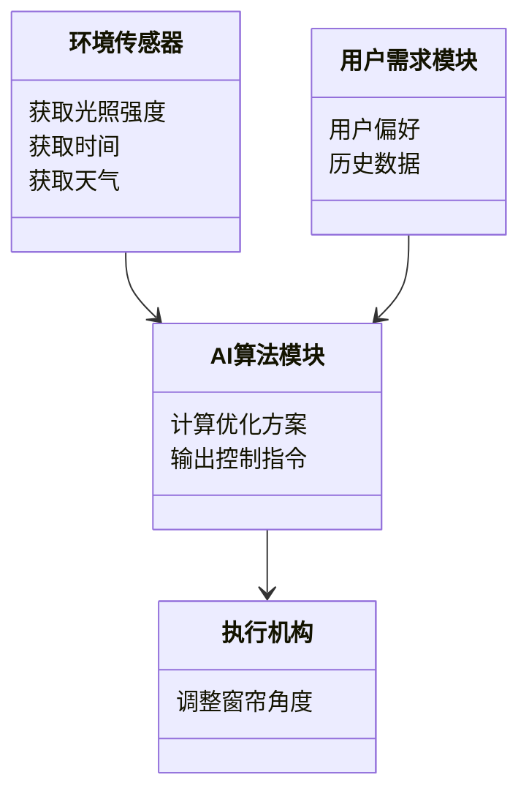
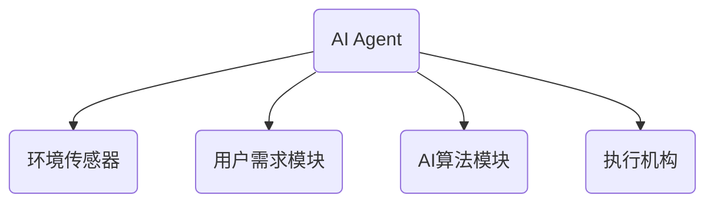

                 


# AI Agent在智能窗帘杆中的自然光优化

> 关键词：AI Agent，智能窗帘杆，自然光优化，算法优化，智能系统设计

> 摘要：本文详细探讨了AI Agent在智能窗帘杆中的应用，通过优化自然光环境，结合算法设计和系统架构，展示了如何利用AI技术提升生活质量。文章从背景介绍、核心概念、算法原理到系统设计和项目实战，全面解析了AI Agent在智能窗帘杆中的实现与优化过程。

---

## 第一部分：背景与概述

### 第1章：AI Agent与智能窗帘杆概述

#### 1.1 问题背景

自然光对人类的健康和生活质量有着重要影响，适当的光照可以调节人体生物钟，改善情绪，促进健康。然而，传统的窗帘杆只能通过手动调节，无法根据环境变化和用户需求自动调整，导致光照优化效果有限。随着智能技术的发展，AI Agent的引入为智能窗帘杆带来了新的可能性。

#### 1.2 问题描述

智能窗帘杆的现有功能通常局限于定时开关和手动调节，无法实时感知环境光照变化和用户需求，导致无法实现最优的自然光调节。AI Agent的引入可以解决这一问题，通过实时数据分析和智能决策，实现动态优化。

#### 1.3 问题解决

AI Agent通过整合环境传感器、用户行为数据和光照模型，能够实时分析并优化窗帘的开合角度，从而调节进入室内的自然光量，满足用户的健康和舒适需求。这种智能化的调节方式显著提升了用户体验，同时优化了能源消耗。

#### 1.4 概念结构与核心要素

AI Agent系统由传感器模块、数据处理模块、决策算法模块和执行机构模块组成。系统通过传感器收集环境数据，利用AI算法进行分析和决策，并通过执行机构调整窗帘状态，实现自然光的优化。

---

## 第二部分：核心概念与联系

### 第2章：AI Agent的原理与特性

#### 2.1 AI Agent的基本原理

AI Agent是一种能够感知环境、自主决策并执行任务的智能实体。它通过接收外部输入和内部状态，运用算法进行分析和推理，生成相应的动作指令，以实现目标。

#### 2.2 AI Agent的特性对比

| 特性     | 描述                                                                 |
|----------|----------------------------------------------------------------------|
| 智能性    | 能够理解和处理复杂信息，具备问题解决能力                             |
| 自适应性  | 能够根据环境变化调整行为，具有灵活性                                 |
| 学习能力  | 能够通过数据学习和优化，提升决策准确性                               |

#### 2.3 ER实体关系图



### 第3章：自然光优化的核心算法

#### 3.1 算法原理

AI Agent通过实时采集光照强度、时间、天气等数据，结合用户的光照偏好和健康需求，计算出最佳的窗帘开合角度。算法基于多目标优化，平衡用户需求和环境因素，确保自然光的最优分布。

#### 3.2 算法流程图



---

## 第三部分：算法原理讲解

### 第4章：数学模型与公式

#### 4.1 算法数学模型

优化目标函数：
$$ \text{最大化} \quad f(x) = \text{光照强度} + \text{用户满意度} $$

约束条件：
$$ 0 \leq x \leq 1 $$

其中，光照强度由环境传感器测量，用户满意度基于历史数据和实时反馈计算。

---

## 第四部分：系统分析与架构设计

### 第5章：系统架构设计

#### 5.1 系统功能需求

系统需要实现环境数据采集、用户需求分析、算法优化和设备控制四大功能模块。

#### 5.2 系统功能设计



#### 5.3 系统架构设计



---

## 第五部分：项目实战

### 第6章：项目实战

#### 6.1 环境安装

需要安装环境传感器、智能窗帘杆和AI Agent系统。环境传感器负责采集光照、温度和时间数据，智能窗帘杆通过电机调节角度，AI Agent系统负责数据处理和决策。

#### 6.2 核心实现代码

```python
import numpy as np

def optimize_light(exposure, user_preference):
    # 曝光强度范围：0-100%
    # 用户偏好：0-100%
    target_exposure = np.interp(user_preference, [0, 100], [20, 80])
    angle = np.arccos((target_exposure - 20) / 60) * 180 / np.pi
    return angle

# 示例调用
exposure = 60
user_preference = 75
result = optimize_light(exposure, user_preference)
print(f"Optimal angle: {result} degrees")
```

#### 6.3 案例分析

通过实际案例展示算法优化效果，分析不同光照条件和用户偏好下的窗帘角度调整，验证算法的有效性和准确性。

---

## 第六部分：最佳实践

### 第7章：总结与展望

#### 7.1 总结

本文详细介绍了AI Agent在智能窗帘杆中的应用，从背景分析到系统设计，再到项目实现，全面展示了如何利用AI技术优化自然光环境。

#### 7.2 展望

未来，随着AI技术的进步，智能窗帘杆将更加智能化，可能结合更多传感器和用户反馈，提供更个性化的服务。

---

## 结语

通过本文的详细讲解，读者可以深入了解AI Agent在智能窗帘杆中的应用，掌握相关算法和系统设计方法。希望本文能够为智能窗帘杆的进一步发展提供有价值的参考。

---

**作者：AI天才研究院/AI Genius Institute & 禅与计算机程序设计艺术 /Zen And The Art of Computer Programming**

