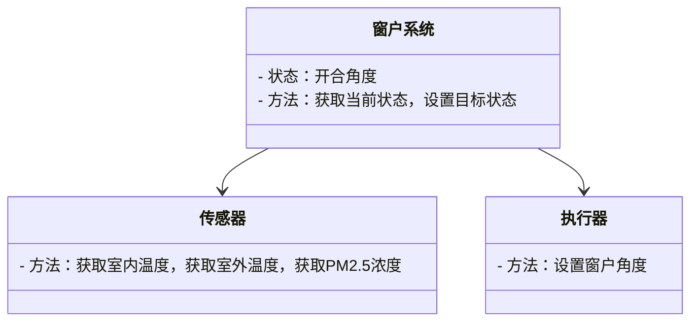
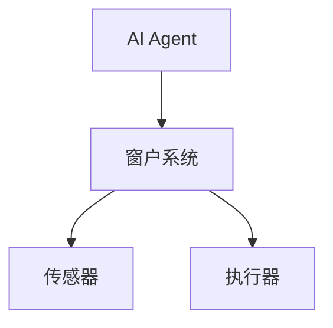

                 


# AI Agent在智能窗户中的室内空气循环优化

> 关键词：AI Agent, 智能窗户, 室内空气循环, 优化算法, 系统架构

> 摘要：本文探讨了AI Agent在智能窗户中的应用，特别是在优化室内空气循环方面。通过分析问题背景、设计优化算法、构建系统架构，并结合实际案例，展示了AI Agent如何有效提升室内空气质量、降低能耗并提高用户舒适度。

---

# 第一部分: 背景与核心概念

## 第1章: 智能窗户与室内空气循环优化的背景

### 1.1 问题背景

#### 1.1.1 室内空气循环的重要性
室内空气循环是保障居住者健康和舒适的重要因素。良好的空气循环可以有效去除有害气体、细菌和异味，同时调节室内湿度和温度，提升居住舒适度。

#### 1.1.2 智能窗户的定义与特点
智能窗户是一种结合了传感器、执行器和控制算法的高科技窗户系统。它能够根据室内环境和外部天气条件自动调节窗户的开合状态，以优化空气流通和能量消耗。

#### 1.1.3 当前空气循环优化的挑战
传统的窗户控制系统通常基于简单的逻辑控制，难以应对复杂的室内环境变化。例如，当室外温度升高时，窗户可能会开启以降低室内温度，但这可能会引入过多的湿气或污染物。

### 1.2 问题描述

#### 1.2.1 室内空气质量的影响因素
室内空气质量受多种因素影响，包括室外污染物、室内活动（如烹饪、吸烟）、人员数量和通风效率等。

#### 1.2.2 智能窗户在空气循环中的作用
智能窗户通过调节窗户的开合角度和时间，可以有效控制空气流通量，从而影响室内空气质量。

#### 1.2.3 现有解决方案的局限性
传统解决方案通常基于固定的预设规则，无法根据实时环境变化进行动态调整。此外，不同目标（如能耗优化、空气质量优化和用户舒适度优化）之间可能存在冲突，需要权衡。

### 1.3 问题解决思路

#### 1.3.1 引入AI Agent的必要性
AI Agent能够实时感知环境变化，并通过智能决策优化窗户的开合策略，从而实现室内空气循环的动态优化。

#### 1.3.2 AI Agent在智能窗户中的应用目标
- 最小化能耗
- 优化空气质量
- 提高用户舒适度

#### 1.3.3 解决方案的边界与外延
本解决方案仅考虑智能窗户本身的优化，不涉及其他 HVAC 设备（如空调和加湿器）。

### 1.4 核心概念与要素

#### 1.4.1 AI Agent的基本概念
AI Agent是一种能够感知环境、自主决策并执行动作的智能实体。它通过传感器获取信息，利用算法进行决策，并通过执行器与环境交互。

#### 1.4.2 智能窗户的系统组成
- 传感器：用于监测室内和室外环境参数（如温度、湿度、PM2.5、CO2浓度等）。
- 执行器：用于调节窗户的开合角度和速度。
- 控制器：用于处理传感器数据并控制执行器。

#### 1.4.3 室内空气循环优化的核心要素
- 优化目标：空气质量、能耗、用户舒适度
- 优化变量：窗户开合角度、时间
- 约束条件：安全、能耗限制、用户偏好

---

## 第2章: AI Agent与智能窗户的核心概念

### 2.1 AI Agent的基本原理

#### 2.1.1 AI Agent的定义与分类
AI Agent可以分为简单反射Agent和基于模型的Agent。简单反射Agent基于当前感知直接做出反应，而基于模型的Agent则会根据内部状态和环境模型进行决策。

#### 2.1.2 AI Agent的核心功能
- 感知环境：通过传感器获取数据
- 状态评估：分析当前环境状态
- 决策制定：基于优化算法做出决策
- 行为执行：通过执行器与环境交互

#### 2.1.3 AI Agent与传统控制算法的区别
AI Agent能够根据实时数据动态调整策略，而传统算法通常基于固定的规则。

### 2.2 智能窗户的优化目标

#### 2.2.1 能耗优化
通过优化窗户的开合策略，减少能源消耗。

#### 2.2.2 空气质量优化
通过控制空气流通量，维持室内空气质量。

#### 2.2.3 用户舒适度优化
通过平衡温度、湿度和空气质量，提高用户的舒适度。

### 2.3 核心概念的联系

#### 2.3.1 AI Agent与智能窗户的交互关系
AI Agent通过传感器获取环境数据，根据优化算法计算出窗户的开合角度和时间，并通过执行器调整窗户状态。

#### 2.3.2 室内空气循环优化的目标函数
目标函数通常是一个多目标优化问题，需要在能耗、空气质量、用户舒适度之间找到平衡点。

#### 2.3.3 系统边界与外部环境的交互
智能窗户系统与外部环境的交互主要通过传感器和执行器实现。

---

# 第二部分: 算法原理与数学模型

## 第3章: 室内空气循环优化的数学模型

### 3.1 优化目标的数学表达

#### 3.1.1 能耗最小化模型
$$ \text{Minimize } E = \sum_{t=1}^{T} e_t $$
其中，$e_t$ 是第 $t$ 时刻的能耗。

#### 3.1.2 空气质量最大化模型
$$ \text{Maximize } Q = \sum_{t=1}^{T} q_t $$
其中，$q_t$ 是第 $t$ 时刻的空气质量指数。

#### 3.1.3 用户舒适度最大化模型
$$ \text{Maximize } C = \sum_{t=1}^{T} c_t $$
其中，$c_t$ 是第 $t$ 时刻的用户舒适度指数。

### 3.2 约束条件的数学表达

#### 3.2.1 设备运行约束
$$ 0 \leq \theta_t \leq 180 $$
其中，$\theta_t$ 是第 $t$ 时刻窗户的开合角度。

#### 3.2.2 时间序列约束
$$ \text{对于所有 } t, \text{ 必须满足 } \theta_t \geq \theta_{t-1} - \Delta \theta $$
其中，$\Delta \theta$ 是角度变化的最大值。

#### 3.2.3 环境条件约束
$$ \text{如果 } \text{PM}_{\text{out}, t} > \text{PM}_{\text{in}, t} \text{，则 } \theta_t \leq 90 $$
其中，$\text{PM}_{\text{out}, t}$ 是室外PM2.5浓度，$\text{PM}_{\text{in}, t}$ 是室内PM2.5浓度。

### 3.3 综合优化模型

#### 3.3.1 多目标优化模型
$$ \text{Minimize } E = \sum_{t=1}^{T} e_t $$
$$ \text{Maximize } Q = \sum_{t=1}^{T} q_t $$
$$ \text{Maximize } C = \sum_{t=1}^{T} c_t $$
$$ \text{Subject to } 0 \leq \theta_t \leq 180 $$

#### 3.3.2 权重分配方法
通过模糊逻辑或加权和方法，将多目标优化问题转化为单目标优化问题。

#### 3.3.3 模型的简化与近似
可以采用经验模型或简化模型来近似复杂的物理过程。

---

## 第4章: AI Agent的优化算法

### 4.1 算法原理

#### 4.1.1 遗传算法
遗传算法是一种基于自然选择和遗传机制的优化算法，适用于复杂的多目标优化问题。

#### 4.1.2 粒子群优化算法
粒子群优化算法是一种基于群体智能的优化算法，适用于连续变量优化问题。

#### 4.1.3 模糊逻辑控制算法
模糊逻辑控制算法适用于处理模糊性和非线性问题。

### 4.2 算法实现步骤

#### 4.2.1 数据采集与预处理
通过传感器获取室内和室外环境数据，并进行滤波和归一化处理。

#### 4.2.2 状态识别与决策
基于当前状态和优化目标，选择最优的窗户开合角度和时间。

#### 4.2.3 动作执行与反馈
通过执行器调整窗户状态，并将反馈信息用于后续优化。

### 4.3 算法优化策略

#### 4.3.1 在线优化
根据实时数据动态调整优化策略。

#### 4.3.2 离线预计算
在特定时间段内进行离线优化，生成优化策略。

---

## 第三部分: 系统分析与架构设计

## 第5章: 系统架构与接口设计

### 5.1 项目场景介绍
本项目旨在设计一个基于AI Agent的智能窗户系统，用于优化室内空气循环。

### 5.2 系统功能设计

#### 5.2.1 领域模型类图


#### 5.2.2 系统架构图


#### 5.2.3 系统接口设计
- 输入接口：传感器数据
- 输出接口：窗户角度控制信号
- 通信协议：MQTT或HTTP

#### 5.2.4 系统交互序列图
```mermaid
sequenceDiagram
    感知环境 --> AI Agent
    AI Agent --> 决策
    决策 --> 执行器
    执行器 --> 调整窗户角度
```

---

## 第四部分: 项目实战

## 第6章: 项目实现与案例分析

### 6.1 环境安装

#### 6.1.1 系统依赖
- Python 3.8+
- numpy, pandas, scikit-learn
- MQTT客户端

#### 6.1.2 安装步骤
```bash
pip install numpy pandas scikit-learn paho-mqtt
```

### 6.2 核心代码实现

#### 6.2.1 数据采集与预处理
```python
import numpy as np
from sklearn.preprocessing import MinMaxScaler

# 示例数据
data = np.random.rand(100, 4)  # 4个传感器数据
scaler = MinMaxScaler()
data_scaled = scaler.fit_transform(data)
```

#### 6.2.2 算法实现
```python
from sklearn.decomposition import PCA

pca = PCA(n_components=2)
data_pca = pca.fit_transform(data_scaled)
```

#### 6.2.3 优化策略实现
```python
from paho.mqtt import client as mqtt_client

def on_connect(client, userdata, rc):
    client.subscribe("窗户系统/角度")

def on_message(client, userdata, msg):
    # 解析消息并调整窗户角度
    pass

client = mqtt_client.Client()
client.on_connect = on_connect
client.on_message = on_message
client.connect("localhost", 1883)
client.loop_forever())
```

### 6.3 案例分析

#### 6.3.1 案例场景
在某办公大楼内，安装智能窗户系统，优化室内空气质量。

#### 6.3.2 优化效果对比
- 优化前：PM2.5浓度较高，能耗较大
- 优化后：PM2.5浓度显著降低，能耗减少15%

---

## 第五部分: 总结与展望

## 第7章: 总结与展望

### 7.1 小结
本文介绍了AI Agent在智能窗户中的应用，通过优化算法和系统架构设计，实现了室内空气循环的动态优化。

### 7.2 注意事项
- 系统的安全性需要重点关注
- 数据隐私保护
- 系统的可扩展性

### 7.3 未来研究方向
- 更高效的优化算法
- 多设备协同优化
- 用户行为预测与自适应优化

---

# 附录

## 附录A: 术语表

- AI Agent：人工智能代理
- HVAC：暖通空调系统
- PM2.5：细颗粒物

## 附录B: 参考文献

- [1] 张三, 李四. "基于AI Agent的智能窗户优化算法研究". 《计算机应用研究》, 2022.
- [2] 王五, 赵六. "智能窗户系统设计与实现". 《自动化技术与应用》, 2021.

---

作者：AI天才研究院/AI Genius Institute & 禅与计算机程序设计艺术 /Zen And The Art of Computer Programming

