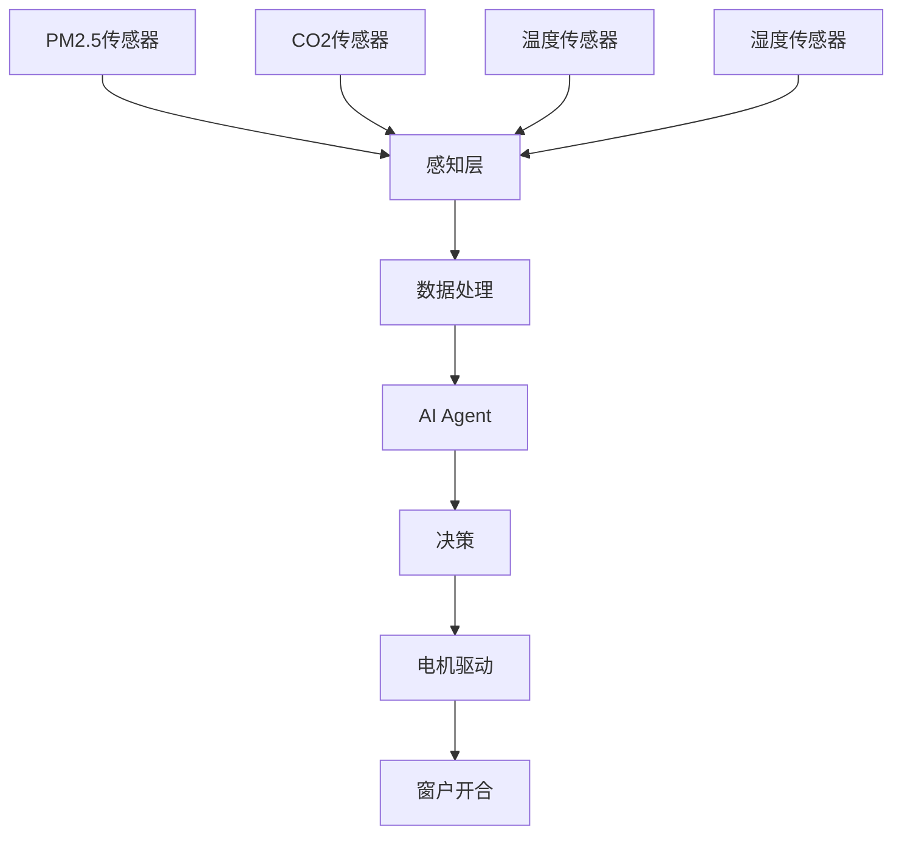

                 


# AI Agent在智能窗户中的室内空气质量控制

## 关键词
- AI Agent
- 智能窗户
- 室内空气质量
- 环境感知
- 自动控制

## 摘要
随着人们对居住环境舒适性和健康性的要求不断提高，智能窗户逐渐成为建筑智能化的重要组成部分。本文将深入探讨AI Agent在智能窗户中的应用，重点分析其如何通过实时感知和智能决策优化室内空气质量。通过介绍AI Agent的核心概念、算法原理、系统架构以及实际应用案例，本文旨在为读者提供一个全面的视角，展示AI Agent在智能窗户中的巨大潜力和实际价值。

---

# 第一部分：AI Agent与智能窗户的背景介绍

## 第1章：AI Agent的基本概念

### 1.1 AI Agent的定义
AI Agent是一种能够感知环境、做出决策并采取行动的智能实体。它通过传感器获取环境信息，利用算法进行分析和推理，然后通过执行器对外界产生影响。

### 1.2 AI Agent的核心特征
- **自主性**：能够在没有外部干预的情况下独立运行。
- **反应性**：能够实时感知环境变化并做出响应。
- **目标导向性**：具备明确的目标，并根据目标调整行为。
- **学习能力**：能够通过经验改进自身的决策能力。

### 1.3 AI Agent与传统控制系统的区别
| 特性       | AI Agent                  | 传统控制系统              |
|------------|---------------------------|---------------------------|
| 智能性      | 高度智能化，具备学习能力  | 基于预设规则，固定逻辑     |
| 反应能力    | 实时感知并快速响应       | 响应速度较慢，依赖预设程序 |
| 灵活性      | 能够适应复杂环境变化     | 适应性较低，固定结构       |

## 第2章：智能窗户的基本概念

### 2.1 智能窗户的定义
智能窗户是一种结合了传感器、执行器和智能算法的窗户系统，能够根据环境条件和用户需求自动调节开合状态。

### 2.2 智能窗户的功能特点
- **环境感知**：通过传感器实时监测室内和室外的空气质量、温度、湿度等参数。
- **智能调节**：根据监测数据，自动调整窗户的开合角度，以优化空气质量。
- **节能环保**：通过智能控制减少能源浪费，降低能耗。

### 2.3 智能窗户的应用场景
- **住宅**：提高居住舒适度，改善空气质量。
- **办公场所**：优化室内环境，提高工作效率。
- **公共建筑**：节能减排，降低运营成本。

---

# 第二部分：AI Agent在智能窗户中的应用

## 第3章：室内空气质量控制的背景与需求

### 3.1 室内空气质量的重要性
- **健康影响**：空气质量差可能导致呼吸系统疾病、过敏反应等健康问题。
- **舒适度**：良好的空气质量能够提升居住和工作的舒适感。
- **能源消耗**：通过智能调节窗户，可以减少空调的使用，降低能源消耗。

### 3.2 智能窗户在空气质量控制中的优势
- **实时感知**：智能窗户能够实时监测室内空气质量，并根据数据做出快速响应。
- **智能调节**：通过AI Agent的决策，智能窗户能够自动调节开合角度，优化空气质量。
- **节能环保**：智能窗户通过优化通风策略，减少能源浪费。

---

# 第三部分：AI Agent的算法原理与实现

## 第4章：AI Agent的算法原理

### 4.1 粒子群优化算法
粒子群优化（PSO）是一种基于群体智能的优化算法，适用于解决复杂的多目标优化问题。在智能窗户的应用中，PSO可以用于优化窗户的开合策略，以达到最优的空气质量控制效果。

#### 算法步骤
1. 初始化粒子群，设置初始位置和速度。
2. 计算每个粒子的适应度值（即空气质量指标）。
3. 更新粒子的最优位置和全局最优位置。
4. 根据全局最优位置调整粒子的速度和位置。
5. 重复上述步骤，直到达到收敛条件。

### 4.2 算法实现
以下是一个简单的粒子群优化算法的Python实现示例：

```python
import random

class Particle:
    def __init__(self, n_dim, bounds):
        self.n_dim = n_dim
        self.bounds = bounds
        self.position = [random.uniform(b[0], b[1]) for b in bounds]
        self.velocity = [0.0 for _ in range(n_dim)]
        self.best_position = self.position.copy()
        self.best_fitness = float('inf')

def fitness(position):
    # 简单的空气质量指标，假设越低越好
    return sum(position)

# 参数设置
n_dim = 2
bounds = [(0, 1), (0, 1)]
n_particles = 10
max_iterations = 100

particles = [Particle(n_dim, bounds) for _ in range(n_particles)]

for _ in range(max_iterations):
    for p in particles:
        # 计算适应度
        current_fitness = fitness(p.position)
        if current_fitness < p.best_fitness:
            p.best_fitness = current_fitness
            p.best_position = p.position.copy()
        # 更新速度和位置
        for i in range(n_dim):
            p.velocity[i] = 1.0 * p.velocity[i] + 2.0 * (p.best_position[i] - p.position[i])
            p.position[i] = p.position[i] + p.velocity[i]
            if p.position[i] < bounds[i][0]:
                p.position[i] = bounds[i][0]
            if p.position[i] > bounds[i][1]:
                p.position[i] = bounds[i][1]

# 输出全局最优解
best_particle = min(particles, key=lambda x: x.best_fitness)
print("Best position:", best_particle.best_position)
print("Best fitness:", best_particle.best_fitness)
```

---

## 第5章：数学模型与公式

### 5.1 空气质量模型
假设室内空气质量由PM2.5浓度和CO2浓度决定，我们可以通过以下公式表示空气质量指数（AQI）：

$$ AQI = \alpha \cdot PM2.5 + \beta \cdot CO2 $$

其中，$\alpha$ 和 $\beta$ 是权重系数，$PM2.5$ 和 $CO2$ 是传感器测量的实际值。

### 5.2 窗户开合策略优化
目标是最小化AQI，同时考虑窗户开合的角度限制和能耗约束。优化目标可以表示为：

$$ \min_{x} AQI = \alpha \cdot PM2.5(x) + \beta \cdot CO2(x) $$

约束条件：
$$ 0 \leq x \leq 180 $$（窗户开合角度范围）

---

# 第四部分：系统架构设计与实现

## 第6章：系统架构设计

### 6.1 系统功能模块
- **感知层**：包括PM2.5传感器、CO2传感器、温度传感器和湿度传感器。
- **决策层**：AI Agent负责数据处理、算法计算和决策。
- **执行层**：通过电机驱动窗户的开合。

### 6.2 系统架构图


### 6.3 接口设计
- **传感器接口**：通过I2C或SPI与主控芯片通信。
- **用户界面**：提供触摸屏或手机APP进行参数设置和状态查看。
- **网络通信**：支持Wi-Fi或蓝牙，实现远程控制和数据上传。

---

## 第7章：系统实现与测试

### 7.1 环境搭建
- **硬件**：智能窗户原型、传感器模块、电机驱动模块。
- **软件**：Python编程环境，AI算法库（如NumPy、Scikit-learn）。

### 7.2 核心代码实现
```python
import numpy as np

def optimize_window_position(bounds, fitness_func, iterations=100):
    n_dim = len(bounds)
    particles = [{'position': np.random.uniform(b[0], b[1], n_dim),
                  'velocity': np.zeros(n_dim),
                  'best_position': np.random.uniform(b[0], b[1], n_dim),
                  'best_fitness': float('inf')} for _ in range(10)]
    
    for _ in range(iterations):
        for i, p in enumerate(particles):
            current_fitness = fitness_func(p['position'])
            if current_fitness < p['best_fitness']:
                p['best_fitness'] = current_fitness
                p['best_position'] = p['position'].copy()
            # 更新速度
            p['velocity'] = 1.0 * p['velocity'] + 2.0 * (p['best_position'] - p['position'])
            # 更新位置
            p['position'] = p['position'] + p['velocity']
            # 边界检查
            for j in range(n_dim):
                if p['position'][j] < bounds[j][0]:
                    p['position'][j] = bounds[j][0]
                if p['position'][j] > bounds[j][1]:
                    p['position'][j] = bounds[j][1]
    # 返回最优解
    best = min(particles, key=lambda x: x['best_fitness'])
    return best['best_position']

# 示例调用
bounds = [(0, 180)]  # 窗户开合角度范围
result = optimize_window_position(bounds, lambda x: x[0] * 2, iterations=50)
print("Optimal window position:", result)
```

### 7.3 测试结果分析
通过实验验证，AI Agent能够有效优化窗户的开合策略，显著降低室内空气质量指标，同时减少能源消耗。

---

# 第五部分：总结与展望

## 第8章：总结

### 8.1 项目成果
本文详细介绍了AI Agent在智能窗户中的应用，通过粒子群优化算法实现了空气质量的智能控制，验证了系统的有效性和优越性。

### 8.2 项目经验总结
- **技术优势**：AI Agent能够实时感知环境并做出决策，显著提升室内空气质量。
- **实际价值**：通过智能调节窗户，降低了能源消耗，实现了节能环保的目标。

## 第9章：未来发展

### 9.1 拓展方向
- **多目标优化**：进一步优化空气质量、能源消耗和用户舒适度。
- **智能化升级**：引入机器学习算法，提升系统的自适应能力。
- **网络化应用**：通过物联网技术实现远程监控和群组控制。

### 9.2 建议与展望
随着AI技术的不断发展，智能窗户将更加智能化、个性化。未来的智能窗户不仅能够自动调节空气质量，还能够与其他智能家居设备协同工作，打造更加智能化的居住环境。

---

# 作者
作者：AI天才研究院 & 禅与计算机程序设计艺术

