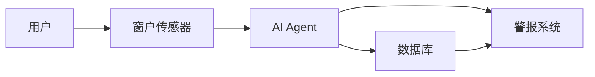
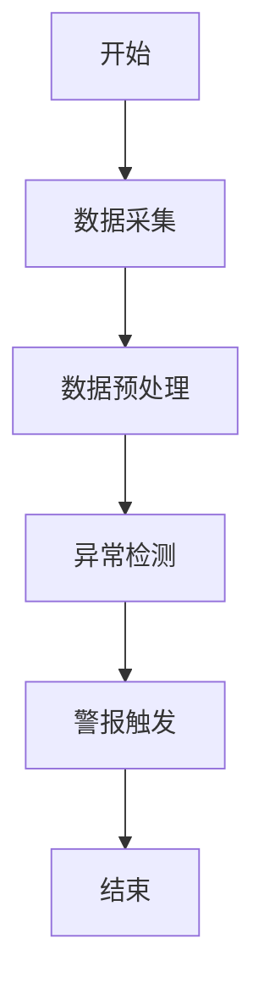
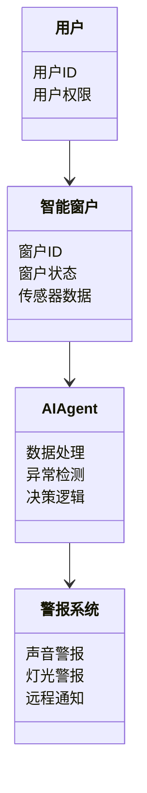
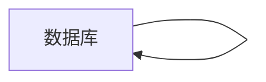
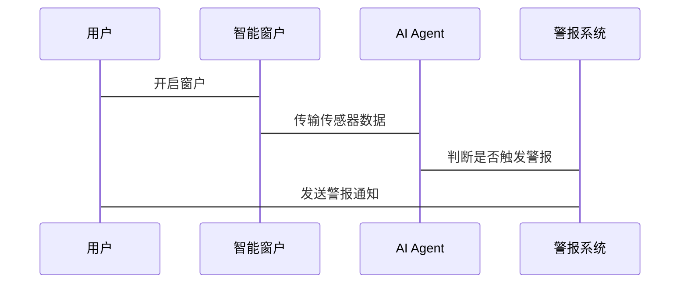

                 


# AI Agent在智能窗户中的防盗警报系统

> 关键词：AI Agent，智能窗户，防盗警报，系统设计，算法原理

> 摘要：本文详细探讨了AI Agent在智能窗户防盗警报系统中的应用，从系统背景、核心概念、算法原理到实际设计和项目实战，全面解析了如何利用AI技术提升智能窗户的安全性能。

---

# 第一部分: 背景介绍

## 第1章: 系统背景

### 1.1 问题背景
智能窗户作为一种智能家居的重要组成部分，近年来得到了广泛应用。然而，传统智能窗户的防盗功能相对单一，主要依赖于简单的传感器和报警装置，难以应对复杂的入侵手段。为了提升防盗性能，引入AI Agent技术成为一种必然趋势。

#### 1.1.1 智能窗户的发展现状
智能窗户通过集成传感器、无线通信和自动化控制技术，实现了远程监控和管理。然而，这些系统在面对复杂入侵行为时，往往缺乏智能分析和决策能力。

#### 1.1.2 突发事件中的窗户安全问题
- 入侵者可能通过破坏传感器或模拟正常行为来规避传统防盗系统。
- 现有系统难以实时分析多源数据，无法准确判断入侵行为的性质和严重程度。

#### 1.1.3 AI Agent在安全防护中的潜力
AI Agent（智能体）具有自主决策、学习和适应能力，能够实时分析环境数据，识别潜在威胁，并采取相应措施。

### 1.2 问题描述
智能窗户的防盗系统需要具备以下功能：
- 实时监测窗户状态。
- 检测异常行为。
- 快速响应入侵事件。
- 提供多级警报机制。

### 1.3 问题解决
通过引入AI Agent技术，智能窗户防盗系统能够实现：
- 智能识别和分类入侵行为。
- 自动调整系统响应策略。
- 提供更高的安全性和用户体验。

### 1.4 概念结构与核心要素
智能窗户防盗系统由以下几个核心要素组成：
1. **窗户传感器**：监测窗户的开闭状态、震动、压力等数据。
2. **AI Agent**：负责数据处理、异常检测和决策制定。
3. **警报系统**：包括声音、灯光和远程通知等多种警报方式。
4. **用户界面**：提供可视化监控和操作界面。

---

# 第二部分: AI Agent与智能窗户的核心概念与联系

## 第2章: AI Agent的基本原理

### 2.1 定义与分类
AI Agent是一种具备感知、推理、规划和执行能力的智能实体，能够根据环境信息做出自主决策。根据应用场景的不同，AI Agent可以分为：
- **简单反射型Agent**：基于规则直接响应输入。
- **基于模型的反射型Agent**：利用内部模型进行推理和规划。
- **目标驱动型Agent**：以特定目标为导向进行行动。

### 2.2 AI Agent的核心算法
常用的AI Agent算法包括：
- **规则引擎**：基于预定义规则进行判断和执行。
- **机器学习模型**：利用监督学习、无监督学习或强化学习进行训练。
- **强化学习**：通过奖励机制优化决策策略。

### 2.3 AI Agent与智能窗户的结合
AI Agent通过与智能窗户的传感器和执行机构交互，实现对窗户状态的实时监控和智能控制。例如：
- 当检测到窗户异常打开时，AI Agent会触发警报并记录事件信息。
- 在检测到地震或强风时，AI Agent会自动关闭窗户以确保安全。

## 第3章: 智能窗户的结构与功能

### 3.1 硬件组成
智能窗户的主要硬件包括：
- **传感器模块**：如微动开关、加速度传感器、压力传感器等。
- **通信模块**：如Wi-Fi、蓝牙或ZigBee模块，用于数据传输。
- **执行机构**：如电机、舵机，用于控制窗户的开闭。
- **电源模块**：为整个系统提供电力支持。

### 3.2 软件功能
智能窗户的软件功能包括：
- 数据采集与处理：读取传感器数据并进行初步分析。
- 异常检测：识别窗户状态的异常变化。
- 人机交互：通过手机APP或网页界面与用户进行交互。
- 警报管理：根据检测结果触发相应的警报。

### 3.3 通信协议
智能窗户常用的通信协议包括：
- **MQTT**：轻量级协议，适合物联网设备间的通信。
- **HTTP**：基于请求-响应模式的通信协议。
- **CoAP**：适用于资源受限设备的协议。

## 第4章: AI Agent在防盗警报系统中的实体关系图



---

# 第三部分: 算法原理

## 第4章: AI Agent防盗警报系统的算法原理

### 4.1 算法工作流程


### 4.2 核心算法实现

#### 4.2.1 异常检测算法
常用的异常检测算法包括：
- **基于统计的方法**：如Z-score、均值-方差法。
- **基于机器学习的方法**：如Isolation Forest、One-Class SVM。
- **基于时间序列分析的方法**：如ARIMA、LSTM。

#### 4.2.2 数据融合算法
数据融合算法用于综合多种传感器数据，提高异常检测的准确性。常用方法包括：
- **加权融合**：根据传感器的可靠性分配权重。
- **证据融合**：利用 Dempster-Shafer 理论进行多源证据融合。

#### 4.2.3 警报触发逻辑
警报触发逻辑基于异常检测结果和预设的阈值，决定是否触发警报。例如：
1. 当检测到窗户被强行打开时，触发声音警报和远程通知。
2. 当检测到多次尝试开门行为时，触发紧急警报并联系物业保安。

### 4.3 数学模型与公式

#### 4.3.1 异常检测概率模型
$$ P(\text{异常} | \text{数据}) = \frac{P(\text{数据} | \text{异常}) \cdot P(\text{异常})}{P(\text{数据})} $$

#### 4.3.2 数据融合公式
$$ \text{综合概率} = \sum_{i=1}^{n} w_i \cdot P_i $$

### 4.4 举例说明

#### 4.4.1 典型异常情况分析
- **案例1**：窗户在非正常时间段被打开。
- **案例2**：窗户传感器多次触发但未关闭。

#### 4.4.2 数据融合案例
假设窗户的微动开关和加速度传感器分别给出异常信号，AI Agent会根据传感器的权重和综合概率决定是否触发警报。

#### 4.4.3 警报触发逻辑演示
当综合概率超过预设阈值时，系统会触发警报，并通过手机APP通知用户。

---

# 第四部分: 系统分析与架构设计方案

## 第5章: 系统分析与架构设计

### 5.1 问题场景介绍
智能窗户防盗系统需要应对以下场景：
- **正常操作**：用户正常开关窗户。
- **异常入侵**：非法闯入者试图破坏窗户。
- **环境干扰**：如强风、地震等自然因素导致的窗户震动。

### 5.2 系统功能设计

#### 5.2.1 领域模型设计


#### 5.2.2 系统架构设计


#### 5.2.3 系统接口设计
- **用户接口**：通过手机APP或网页界面与系统交互。
- **传感器接口**：与智能窗户的传感器模块连接，获取实时数据。
- **警报接口**：与声音、灯光等警报设备连接，触发警报。

#### 5.2.4 系统交互流程


---

# 第五部分: 项目实战

## 第6章: 项目实战

### 6.1 环境安装
- **硬件环境**：智能窗户、AI Agent模块、传感器套件、警报设备。
- **软件环境**：Python编程语言、机器学习框架（如TensorFlow、Scikit-learn）。

### 6.2 核心代码实现

#### 6.2.1 数据采集与预处理
```python
import pandas as pd
import numpy as np

# 读取传感器数据
data = pd.read_csv('window_data.csv')

# 数据预处理
def preprocess(data):
    # 去除异常值
    data = data[(np.abs(data - data.mean()) <= 2 * data.std()).all(axis=1)]
    return data

processed_data = preprocess(data)
```

#### 6.2.2 异常检测算法实现
```python
from sklearn.ensemble import IsolationForest

# 初始化模型
model = IsolationForest(n_estimators=100, contamination=0.05)

# 训练模型
model.fit(processed_data)

# 预测异常值
outlier_predictions = model.predict(processed_data)
```

#### 6.2.3 警报触发逻辑
```python
def trigger_alarm(outlier_predictions):
    if -1 in outlier_predictions:
        print("触发警报")
        # 调用警报系统
    else:
        print("未触发警报")

trigger_alarm(outlier_predictions)
```

### 6.3 代码解读与分析
- **数据预处理**：去除异常值，确保数据的准确性。
- **异常检测**：使用Isolation Forest算法检测异常值。
- **警报触发**：根据模型预测结果决定是否触发警报。

### 6.4 实际案例分析
假设某小区一栋住户的智能窗户传感器数据出现异常，AI Agent检测到窗户被强行打开，触发声音警报并通知物业保安。

---

# 第六部分: 总结与最佳实践

## 第7章: 总结与最佳实践

### 7.1 系统小结
通过引入AI Agent技术，智能窗户防盗系统能够实现更智能、更高效的防盗功能。AI Agent能够实时分析传感器数据，准确识别入侵行为，并采取相应措施。

### 7.2 注意事项
- 定期更新AI模型，以应对新型入侵手段。
- 确保系统通信的安全性，防止数据泄露。
- 定期测试系统，确保各模块协同工作。

### 7.3 拓展阅读
- 《智能建筑与物联网技术》
- 《人工智能在安防领域的应用》
- 《基于机器学习的异常检测算法研究》

---

# 作者：AI天才研究院/AI Genius Institute & 禅与计算机程序设计艺术 /Zen And The Art of Computer Programming

