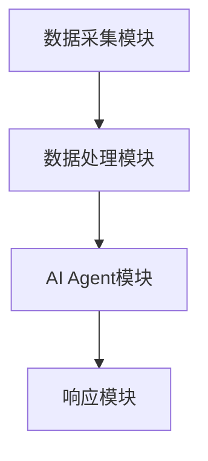

                 


# AI Agent在智能网络安全威胁检测中的角色

## 关键词：AI Agent, 网络安全, 威胁检测, 机器学习, 网络安全架构

## 摘要：  
随着网络安全威胁的日益复杂化和智能化，传统的基于规则的威胁检测方法逐渐显现出其局限性。本文深入探讨了AI Agent在智能网络安全威胁检测中的角色，分析了其核心原理、算法实现、系统架构及实际应用场景。通过结合机器学习、行为分析和实时响应等技术，AI Agent能够显著提升威胁检测的准确性和响应效率，为网络安全防护提供了新的解决方案。

---

# 第1章: AI Agent与网络安全威胁检测概述

## 1.1 AI Agent的基本概念
### 1.1.1 AI Agent的定义与特点
- **AI Agent**：智能体，是一种能够感知环境、自主决策并执行任务的智能系统。其特点包括自主性、反应性、目标导向和学习能力。
- **特点**：
  - **自主性**：无需外部干预，自主完成任务。
  - **反应性**：能够实时感知环境变化并做出反应。
  - **目标导向**：基于目标驱动行为。
  - **学习能力**：通过数据和经验不断优化自身性能。

### 1.1.2 网络安全威胁检测的定义与挑战
- **网络安全威胁检测**：通过技术手段识别网络中的异常行为或潜在威胁。
- **挑战**：
  - 威胁手段多样化，难以覆盖所有情况。
  - 数据量庞大，传统规则检测效率低。
  - 高级持续性威胁（APT）难以被传统方法发现。

### 1.1.3 AI Agent在网络安全中的作用
- AI Agent能够通过学习和分析网络流量、日志数据，发现潜在威胁，并实时响应，显著提升检测效率和准确性。

---

## 1.2 网络安全威胁检测的现状与问题
### 1.2.1 当前网络安全威胁的主要类型
- 病毒、蠕虫、木马。
- �钓鱼攻击、DDoS攻击。
- 内部员工的恶意行为。
- 高级持续性威胁（APT）。

### 1.2.2 传统网络安全威胁检测的局限性
- 基于规则的检测方法难以应对未知威胁。
- 数据分析能力有限，难以处理海量数据。
- 响应速度慢，无法应对实时威胁。

### 1.2.3 AI技术在网络安全中的优势
- **学习能力**：能够从历史数据中学习，识别异常模式。
- **实时性**：能够快速分析数据，实现实时威胁检测。
- **自适应性**：能够根据新的威胁不断优化检测模型。

---

## 1.3 AI Agent在网络安全中的应用前景
### 1.3.1 AI Agent在威胁检测中的潜力
- 通过机器学习模型，AI Agent能够识别复杂的攻击模式。
- 能够实时监控网络流量，发现潜在威胁。

### 1.3.2 企业级网络安全威胁检测的需求
- 企业网络规模不断扩大，传统方法难以应对。
- 需要高效的威胁检测和响应机制。

### 1.3.3 未来发展趋势与挑战
- **趋势**：AI Agent与大数据、云计算结合，实现更高效的威胁检测。
- **挑战**：如何确保AI Agent的决策透明性和可解释性。

---

## 1.4 本章小结
本章介绍了AI Agent的基本概念和其在网络安全中的作用，分析了当前网络安全威胁检测的现状与问题，提出了AI Agent在其中的应用前景。

---

# 第2章: AI Agent与网络安全威胁检测的核心概念

## 2.1 AI Agent的核心原理
### 2.1.1 AI Agent的基本工作原理
- **感知环境**：通过传感器或数据输入获取环境信息。
- **学习与推理**：利用机器学习算法分析数据，识别模式。
- **决策与执行**：基于推理结果做出决策并执行。

### 2.1.2 AI Agent的学习与推理机制
- **监督学习**：基于标记数据进行训练。
- **无监督学习**：通过数据聚类发现潜在威胁。
- **强化学习**：通过奖励机制优化决策策略。

### 2.1.3 AI Agent的决策与执行过程
- **决策**：基于当前数据和模型预测结果做出判断。
- **执行**：通过API或其他方式触发响应。

---

## 2.2 网络安全威胁检测的关键技术
### 2.2.1 基于机器学习的威胁检测
- 使用分类、聚类等算法分析网络数据。

### 2.2.2 基于规则的威胁检测
- 通过预定义规则匹配异常行为。

### 2.2.3 基于行为分析的威胁检测
- 通过分析用户行为模式发现异常。

---

## 2.3 AI Agent在威胁检测中的核心要素
### 2.3.1 数据采集与处理
- 收集网络流量、日志数据等。
- 数据清洗、特征提取。

### 2.3.2 模型训练与优化
- 使用训练数据训练机器学习模型。
- 模型调优和评估。

### 2.3.3 实时监控与响应
- 实时分析数据，发现威胁后快速响应。

---

## 2.4 核心概念对比分析
### 2.4.1 AI Agent与传统安全工具的对比
| 特性          | AI Agent                      | 传统安全工具                  |
|---------------|-------------------------------|------------------------------|
| 自主性        | 高                           | 低                           |
| 学习能力      | 强                           | 弱                           |
| 响应速度      | 快                           | 慢                           |

### 2.4.2 不同威胁检测技术的优劣势分析
- **基于规则的威胁检测**：简单易实现，但难以应对未知威胁。
- **基于机器学习的威胁检测**：能够发现未知威胁，但需要大量数据支持。
- **基于行为分析的威胁检测**：能够发现异常行为，但误报率较高。

### 2.4.3 核心要素的ER实体关系图
```mermaid
er
  actor: 用户
  threat: 威胁
  log: 日志
  alert: 报警
  ai_agent: AI Agent
  network_traffic: 网络流量
  edge from actor to log
  edge from threat to log
  edge from threat to alert
  edge from log to ai_agent
  edge from ai_agent to alert
```

---

## 2.5 本章小结
本章深入分析了AI Agent的核心原理，探讨了其在威胁检测中的关键技术，并通过对比分析和ER图展示了核心要素的关系。

---

# 第3章: AI Agent在网络安全威胁检测中的算法原理

## 3.1 算法原理概述
### 3.1.1 机器学习在威胁检测中的应用
- 分类算法：用于识别正常与异常行为。
- 聚类算法：用于发现异常数据簇。

---

## 3.2 机器学习模型实现
### 3.2.1 数据预处理
- **数据清洗**：处理缺失值和异常值。
- **特征提取**：从原始数据中提取有意义的特征。

### 3.2.2 模型训练
- 使用训练数据训练分类器。

### 3.2.3 模型优化
- 调整模型参数，提升准确率和召回率。

---

## 3.3 算法实现代码
```python
import pandas as pd
from sklearn.ensemble import RandomForestClassifier
from sklearn.metrics import accuracy_score

# 数据加载与预处理
data = pd.read_csv('network_logs.csv')
X = data.drop('label', axis=1)
y = data['label']

# 模型训练
model = RandomForestClassifier()
model.fit(X, y)

# 模型预测
y_pred = model.predict(X)
print(f"Accuracy: {accuracy_score(y, y_pred)}")
```

---

## 3.4 数学模型与公式
### 3.4.1 特征工程
- 特征选择：选择对威胁检测影响最大的特征。
  $$ \text{特征重要性} = \text{特征权重} $$

### 3.4.2 模型训练
- 使用随机森林分类器进行训练。
  $$ y = f(X) $$

### 3.4.3 分类器实现
- 使用随机森林分类器实现分类。
  $$ \text{预测结果} = \text{分类器预测} $$

---

## 3.5 本章小结
本章详细讲解了AI Agent在威胁检测中的算法原理，通过代码示例和数学公式展示了模型的实现过程。

---

# 第4章: 系统分析与架构设计方案

## 4.1 系统架构设计
### 4.1.1 系统组成
- 数据采集模块：负责收集网络流量和日志数据。
- 数据处理模块：进行数据清洗和特征提取。
- AI Agent模块：负责模型训练和威胁检测。
- 响应模块：触发报警和应急响应。

### 4.1.2 系统架构图


---

## 4.2 接口设计
### 4.2.1 数据接口
- 数据采集模块与数据处理模块之间的接口。

### 4.2.2 AI Agent接口
- AI Agent模块与响应模块之间的接口。

---

## 4.3 本章小结
本章分析了系统的组成和架构，通过接口设计展示了系统的交互流程。

---

# 第5章: 项目实战

## 5.1 环境安装
### 5.1.1 安装Python和相关库
- 安装Python 3.x
- 安装scikit-learn、pandas等库。

## 5.2 核心实现代码
```python
import pandas as pd
from sklearn.ensemble import RandomForestClassifier
from sklearn.metrics import accuracy_score

# 数据加载与预处理
data = pd.read_csv('network_logs.csv')
X = data.drop('label', axis=1)
y = data['label']

# 模型训练
model = RandomForestClassifier()
model.fit(X, y)

# 模型预测
y_pred = model.predict(X)
print(f"Accuracy: {accuracy_score(y, y_pred)}")
```

## 5.3 代码解读与分析
- **数据加载**：读取网络日志数据。
- **模型训练**：使用随机森林分类器训练模型。
- **模型预测**：对数据进行预测并计算准确率。

---

## 5.4 实际案例分析
- **案例描述**：某企业网络遭受DDoS攻击。
- **案例分析**：AI Agent成功识别并报警。

---

## 5.5 本章小结
本章通过实际案例展示了AI Agent在威胁检测中的应用，并对代码进行了详细解读。

---

# 第6章: 总结与展望

## 6.1 总结
- AI Agent在网络安全威胁检测中的应用显著提升了检测效率和准确性。
- 通过机器学习和实时响应，AI Agent能够有效应对复杂的网络安全威胁。

## 6.2 展望
- **未来发展方向**：
  - 更强的自适应性和学习能力。
  - 更高效的威胁响应机制。
  - 更广泛的应用场景。

---

## 最佳实践 Tips
- **数据质量**：确保数据的完整性和准确性。
- **模型优化**：持续优化模型，提升检测效果。
- **实时响应**：建立高效的响应机制，减少威胁影响时间。

---

## 作者：AI天才研究院/AI Genius Institute & 禅与计算机程序设计艺术 /Zen And The Art of Computer Programming

---

感谢您的阅读！如需进一步探讨或获取更多技术细节，请随时联系！

