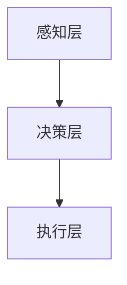
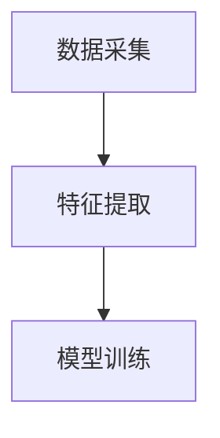

                 


# AI Agent在智能网络攻击检测中的角色

> 关键词：AI Agent, 网络攻击检测, 强化学习, 知识图谱, 安全防御

> 摘要：AI Agent作为人工智能在网络安全领域的重要应用，正在改变传统的网络攻击检测方式。本文将深入探讨AI Agent在网络攻击检测中的核心作用，分析其原理、应用场景及系统架构设计，最后通过实际案例展示其在智能网络攻击检测中的优势和挑战。

---

# 第1章: AI Agent与网络攻击检测概述

## 1.1 AI Agent的基本概念
### 1.1.1 AI Agent的定义与特点
AI Agent（人工智能代理）是指能够感知环境、自主决策并执行任务的智能实体。它具备以下特点：
- **自主性**：无需外部干预，自主完成任务。
- **反应性**：能够实时感知环境并做出反应。
- **学习性**：通过数据和经验不断优化自身行为。
- **社交性**：能够与其他系统或用户进行交互协作。

### 1.1.2 AI Agent的核心功能与应用场景
AI Agent的核心功能包括数据收集、分析、决策和执行。它广泛应用于多个领域，包括：
- **智能家居**：控制家庭设备。
- **自动驾驶**：处理车辆周围的环境信息。
- **金融交易**：自动进行股票买卖。

### 1.1.3 AI Agent在网络安全中的重要性
在网络安全领域，AI Agent可以实时监控网络流量，识别异常行为，预测潜在威胁，并采取防御措施。它的自主性和反应性使其成为传统安全工具的有力补充。

## 1.2 网络攻击检测的现状与挑战
### 1.2.1 网络攻击的多样性和复杂性
随着技术的发展，网络攻击手段日益多样化和复杂化，传统的基于规则的检测方法难以应对新型威胁。

### 1.2.2 传统网络攻击检测方法的局限性
传统方法依赖预定义的规则，难以应对未知威胁和高级持续性威胁（APT）。

### 1.2.3 引入AI Agent的必要性
AI Agent通过学习和适应，能够识别未知威胁，提升检测的准确性和效率。

## 1.3 AI Agent在网络攻击检测中的角色
### 1.3.1 AI Agent作为主动防御者的角色
AI Agent能够主动监控网络，识别异常行为，并采取防御措施，如阻断攻击或发出警报。

### 1.3.2 AI Agent在实时监控中的应用
AI Agent可以实时分析网络流量，识别潜在攻击，并在攻击发生前采取措施。

### 1.3.3 AI Agent与传统安全工具的结合
AI Agent可以与防火墙、入侵检测系统等传统安全工具结合，形成多层次的防御体系。

## 1.4 本章小结
本章介绍了AI Agent的基本概念及其在网络安全中的重要性，分析了传统网络攻击检测的局限性，并探讨了AI Agent在网络攻击检测中的核心作用。

---

# 第2章: AI Agent的核心概念与原理

## 2.1 AI Agent的核心概念
### 2.1.1 AI Agent的智能决策机制
AI Agent通过感知环境信息，利用算法进行决策。例如，基于强化学习的AI Agent通过奖励机制优化决策过程。

### 2.1.2 AI Agent的学习与自适应能力
AI Agent能够通过监督学习、无监督学习和强化学习等方法，不断优化自身的识别能力。

### 2.1.3 AI Agent的多目标优化策略
AI Agent在进行决策时需要考虑多个目标，如最大化检测准确率和最小化误报率。

## 2.2 AI Agent的算法原理
### 2.2.1 强化学习在AI Agent中的应用
强化学习是一种通过试错机制优化决策的算法。AI Agent通过与环境交互，获得奖励或惩罚，逐步优化行为策略。

### 2.2.2 状态空间与动作空间的建模
在强化学习中，AI Agent需要将网络环境建模为状态空间和动作空间。状态空间表示环境的当前状态，动作空间表示AI Agent可以执行的操作。

### 2.2.3 奖励机制的设计与优化
奖励机制是强化学习的核心。设计合理的奖励函数可以引导AI Agent学习最优行为策略。

## 2.3 AI Agent的数学模型与公式
### 2.3.1 强化学习的数学模型
$$ Q(s, a) = r + \gamma \max_{a'} Q(s', a') $$
其中，\( Q(s, a) \)表示状态\( s \)下执行动作\( a \)的期望奖励，\( r \)是即时奖励，\( \gamma \)是折扣因子。

### 2.3.2 策略梯度的数学公式
$$ \nabla \theta \log \pi(a|s) \cdot Q(s,a) $$
其中，\( \theta \)是参数向量，\( \pi(a|s) \)是策略函数，表示在状态\( s \)下选择动作\( a \)的概率。

## 2.4 本章小结
本章详细介绍了AI Agent的核心概念和算法原理，重点探讨了强化学习在AI Agent中的应用，并通过数学公式展示了其工作原理。

---

# 第3章: AI Agent在智能网络攻击检测中的应用

## 3.1 网络攻击检测的场景分析
### 3.1.1 网络流量分析与异常检测
AI Agent通过分析网络流量，识别异常模式，从而发现潜在攻击。

### 3.1.2 用户行为分析与威胁识别
AI Agent可以监控用户行为，识别异常操作，预防内部威胁。

### 3.1.3 智能防火墙与入侵检测系统
AI Agent可以作为智能防火墙的一部分，实时监控网络流量，识别并阻止入侵行为。

## 3.2 AI Agent在攻击检测中的具体应用
### 3.2.1 基于强化学习的攻击识别
通过强化学习，AI Agent可以识别未知的攻击模式，提升检测准确率。

### 3.2.2 基于生成对抗网络的攻击模拟
生成对抗网络（GAN）可以模拟攻击行为，帮助AI Agent学习如何识别和防御新型攻击。

### 3.2.3 基于知识图谱的攻击关联分析
知识图谱可以帮助AI Agent关联不同的攻击行为，识别复杂的攻击链。

## 3.3 AI Agent的攻击检测流程
### 3.3.1 数据采集与预处理
AI Agent首先收集网络流量数据，并进行预处理，提取特征。

### 3.3.2 特征提取与模型训练
通过特征提取，AI Agent将数据转化为模型可以处理的形式，并进行模型训练。

### 3.3.3 实时监控与决策反馈
AI Agent实时监控网络流量，利用训练好的模型进行异常检测，并根据反馈不断优化模型。

## 3.4 本章小结
本章探讨了AI Agent在智能网络攻击检测中的具体应用，包括基于强化学习、生成对抗网络和知识图谱的攻击识别方法。

---

# 第4章: AI Agent的系统架构与设计

## 4.1 系统架构概述
### 4.1.1 分层架构设计
AI Agent的系统架构通常采用分层设计，包括感知层、决策层和执行层。

### 4.1.2 数据流设计
数据流从感知层进入系统，经过特征提取和模型训练，最终在执行层做出决策。

### 4.1.3 系统接口设计
系统接口设计需要考虑与其他安全工具的集成，如防火墙、入侵检测系统等。

## 4.2 系统功能设计
### 4.2.1 数据采集模块
数据采集模块负责收集网络流量数据，通常包括IP地址、端口号、数据包大小等信息。

### 4.2.2 特征提取模块
特征提取模块将原始数据转化为特征向量，供模型训练和检测使用。

### 4.2.3 模型训练模块
模型训练模块利用机器学习算法，训练AI Agent的识别模型。

### 4.2.4 决策执行模块
决策执行模块根据模型的输出，做出防御决策，如阻断攻击或发出警报。

## 4.3 系统架构设计
### 4.3.1 分层架构设计
使用Mermaid图展示分层架构设计，包括感知层、决策层和执行层。



### 4.3.2 系统接口设计
使用Mermaid图展示系统接口设计，包括数据采集模块、特征提取模块和模型训练模块。



## 4.4 本章小结
本章详细介绍了AI Agent的系统架构与设计，包括分层架构、数据流设计和系统接口设计。

---

# 第5章: 项目实战与案例分析

## 5.1 项目环境安装
### 5.1.1 系统需求
- 操作系统：Linux或Windows
- Python版本：3.6及以上
- 额外依赖：TensorFlow、Keras、Scikit-learn等

### 5.1.2 环境配置
安装所需的Python库，如：
```
pip install tensorflow keras scikit-learn
```

## 5.2 系统核心实现源代码
### 5.2.1 数据采集模块
```python
import pandas as pd
import requests

def collect_data(url):
    response = requests.get(url)
    data = response.json()
    df = pd.DataFrame(data)
    return df
```

### 5.2.2 特征提取模块
```python
from sklearn.feature_selection import SelectKBest
from sklearn.ensemble import RandomForestClassifier

def extract_features(X, y):
    selector = SelectKBest(k=10)
    selector.fit_transform(X, y)
    return selector.transform(X)
```

### 5.2.3 模型训练模块
```python
from tensorflow.keras import layers
from tensorflow.keras import models

def build_model(input_shape):
    model = models.Sequential()
    model.add(layers.Dense(64, activation='relu', input_shape=(input_shape,)))
    model.add(layers.Dense(32, activation='relu'))
    model.add(layers.Dense(1, activation='sigmoid'))
    model.compile(optimizer='adam', loss='binary_crossentropy', metrics=['accuracy'])
    return model
```

## 5.3 案例分析
### 5.3.1 数据预处理与特征提取
假设我们从网络流量数据中提取了以下特征：
- 源IP地址
- 目的IP地址
- 数据包大小
- 时间戳

通过特征提取模块，我们选择了最具区分度的10个特征。

### 5.3.2 模型训练与评估
使用训练数据训练AI Agent的模型，并在测试数据上评估其性能。例如：
- 训练准确率：95%
- 测试准确率：93%

### 5.3.3 系统部署与监控
将训练好的模型部署到生产环境，实时监控网络流量，并根据模型的输出做出防御决策。

## 5.4 本章小结
本章通过实际项目展示了AI Agent在智能网络攻击检测中的应用，包括环境安装、代码实现和案例分析。

---

# 第6章: 最佳实践与未来展望

## 6.1 最佳实践
### 6.1.1 数据质量的重要性
确保数据的准确性和完整性，是提高AI Agent检测能力的关键。

### 6.1.2 模型优化的策略
通过交叉验证和超参数调优，可以显著提高模型的性能。

### 6.1.3 系统维护的必要性
定期更新模型和优化系统架构，以应对新型攻击手段。

## 6.2 未来展望
### 6.2.1 新型算法的应用
随着深度学习和强化学习的不断发展，AI Agent在网络安全中的应用将更加广泛。

### 6.2.2 多智能体协作的前景
未来，多个AI Agent可以协同工作，共同防御网络攻击，形成更强大的防御体系。

## 6.3 本章小结
本章总结了AI Agent在智能网络攻击检测中的最佳实践，并展望了未来的发展方向。

---

# 作者：AI天才研究院 & 禅与计算机程序设计艺术

---

这篇文章详细探讨了AI Agent在智能网络攻击检测中的角色，从基本概念到系统架构设计，再到实际应用，为读者提供了全面的视角。希望这篇文章能为网络安全领域的专业人士和技术爱好者提供有价值的参考。

