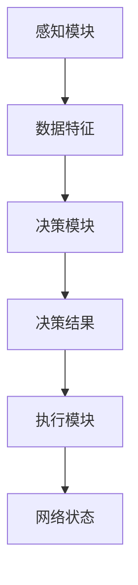

                 


```markdown
# AI Agent在智能网络管理中的应用

> 关键词：智能网络管理，AI Agent，网络优化，故障诊断，资源分配，算法原理，系统架构

> 摘要：本文探讨了AI Agent在智能网络管理中的应用，通过分析AI Agent的核心概念、算法原理、系统架构及项目实战，详细阐述了其在网络监控、故障诊断和资源分配中的作用。文章从理论到实践，系统地介绍了如何利用AI Agent优化网络管理流程，帮助读者全面理解并掌握相关技术。

---

## 第一部分: AI Agent的基本概念与背景

### 第1章: AI Agent的基本概念与背景

#### 1.1 AI Agent的定义与特点

**1.1.1 AI Agent的定义**  
AI Agent（人工智能代理）是一种能够感知环境、自主决策并执行任务的智能实体。它通过传感器获取信息，利用算法进行分析，并通过执行器与环境交互，以实现特定目标。

**1.1.2 AI Agent的核心特点**  
- **自主性**：AI Agent能够在没有外部干预的情况下独立运作。  
- **反应性**：能够实时感知环境变化并做出响应。  
- **目标导向**：所有行为均以实现特定目标为导向。  
- **学习能力**：通过数据反馈不断优化自身的决策能力。  

**1.1.3 AI Agent与传统网络管理的区别**  
传统网络管理依赖人工操作和固定的规则，而AI Agent能够自主学习、适应变化并优化管理流程。

#### 1.2 智能网络管理的背景与挑战

**1.2.1 网络管理的传统方法与局限性**  
传统网络管理依赖人工监控和固定规则，存在效率低下、响应速度慢、资源浪费等问题。

**1.2.2 智能网络管理的需求与目标**  
随着网络规模的扩大和复杂度的增加，智能网络管理成为必然趋势。其目标是实现自动化、智能化的网络监控、故障诊断和资源优化。

**1.2.3 AI Agent在智能网络管理中的作用**  
AI Agent能够实时监控网络状态、预测潜在问题、优化资源分配，从而显著提升网络管理效率。

#### 1.3 本章小结  
本章介绍了AI Agent的基本概念、特点及其在智能网络管理中的重要性，为后续内容奠定了基础。

---

## 第二部分: AI Agent的核心概念与原理

### 第2章: AI Agent的核心概念与联系

#### 2.1 AI Agent的核心要素

**2.1.1 感知模块**  
AI Agent通过感知模块获取网络环境中的数据，包括流量、设备状态等信息。  

**2.1.2 决策模块**  
基于感知到的信息，决策模块利用算法生成最优决策。  

**2.1.3 执行模块**  
执行模块根据决策结果采取相应行动，如调整路由、分配资源等。

#### 2.2 AI Agent的核心原理

**2.2.1 感知原理**  
通过传感器或API接口获取网络数据，利用特征提取和数据处理技术进行信息分析。  

**2.2.2 决策原理**  
基于感知数据，通过机器学习模型生成决策。  

**2.2.3 执行原理**  
根据决策结果，通过执行器或API接口实现网络配置调整。

#### 2.3 AI Agent的核心概念关系图

**2.3.1 AI Agent核心概念关系表**  

| 模块         | 输入      | 输出      | 功能描述                           |
|--------------|-----------|-----------|------------------------------------|
| 感知模块     | 网络数据   | 数据特征   | 提取网络环境特征                   |
| 决策模块     | 数据特征   | 决策结果   | 生成最优决策                     |
| 执行模块     | 决策结果   | 网络状态   | 调整网络配置                      |

**2.3.2 AI Agent核心概念关系图（Mermaid流程图）**



---

## 第三部分: AI Agent的算法原理

### 第3章: AI Agent的感知算法

#### 3.1 感知算法概述

**3.1.1 感知算法的定义与特点**  
感知算法用于从网络数据中提取有用信息，帮助AI Agent理解网络状态。  

**3.1.2 感知算法的分类与应用场景**  
- **特征提取算法**：用于从原始数据中提取关键特征。  
- **异常检测算法**：用于识别网络中的异常流量或故障。  

#### 3.2 基于深度学习的感知算法

**3.2.1 深度学习的基本原理**  
深度学习通过多层神经网络模型，从数据中自动提取特征并进行分类。  

**3.2.2 基于深度学习的感知算法实现**  
- 输入：网络流量数据。  
- 输出：网络状态标签（正常/异常）。  

**3.2.3 感知算法的数学模型与公式**  
以下是基于深度学习的感知算法的数学模型：

$$ y = f(x) = Wx + b $$  
其中，$x$ 是输入数据，$W$ 是权重矩阵，$b$ 是偏置向量，$f(x)$ 是输出结果。

#### 3.3 感知算法的实现代码示例

**3.3.1 环境安装与配置**  
需要安装Python、TensorFlow和Keras库。  

**3.3.2 感知算法的Python源代码实现**

```python
import numpy as np
import tensorflow as tf
from tensorflow import keras

# 数据预处理
(x_train, y_train), (x_test, y_test) = keras.datasets.mnist.load_data()

# 模型构建
model = keras.Sequential([
    keras.layers.Flatten(),
    keras.layers.Dense(128, activation='relu'),
    keras.layers.Dense(10, activation='softmax')
])

# 模型编译
model.compile(optimizer='adam', loss='sparse_categorical_crossentropy', metrics=['accuracy'])

# 模型训练
model.fit(x_train, y_train, epochs=5, batch_size=128, validation_data=(x_test, y_test))
```

**3.3.3 代码的功能解读与分析**  
上述代码实现了基于深度学习的感知算法，用于分类网络流量数据。模型通过多层神经网络提取特征并进行分类。

---

## 第四章: AI Agent的决策算法

#### 4.1 决策算法概述

**4.1.1 决策算法的定义与特点**  
决策算法用于根据感知数据生成最优决策。  

**4.1.2 决策算法的分类与应用场景**  
- **强化学习算法**：通过试错方式优化决策策略。  
- **规则引擎**：基于预定义规则生成决策。  

#### 4.2 基于强化学习的决策算法

**4.2.1 强化学习的基本原理**  
通过与环境交互，智能体通过试错学习最优策略。  

**4.2.2 基于强化学习的决策算法实现**  
- 状态空间：网络设备的状态。  
- 动作空间：调整设备参数。  
- 奖励函数：网络性能指标（如延迟、带宽）。  

**4.2.3 决策算法的数学模型与公式**  
以下是强化学习的Q-learning算法：

$$ Q(s, a) = Q(s, a) + \alpha [r + \gamma \max Q(s', a') - Q(s, a)] $$  
其中，$s$ 是当前状态，$a$ 是动作，$r$ 是奖励，$\gamma$ 是折扣因子，$\alpha$ 是学习率。  

---

## 第五章: AI Agent的系统架构设计

#### 5.1 系统分析与架构设计方案

**5.1.1 问题场景介绍**  
以一个典型的网络管理场景为例，描述AI Agent如何优化网络性能。  

**5.1.2 系统功能设计**  
- **感知模块**：实时监控网络流量和设备状态。  
- **决策模块**：基于感知数据生成优化决策。  
- **执行模块**：根据决策结果调整网络配置。  

**5.1.3 系统架构设计（Mermaid架构图）**


---

## 第六章: 项目实战

#### 6.1 项目环境安装与配置

- **工具安装**：安装Python、TensorFlow、Keras等工具。  
- **数据准备**：收集网络流量数据。  

#### 6.2 项目核心实现

**6.2.1 感知算法的实现**  
实现基于深度学习的感知算法，用于分类网络流量数据。  

**6.2.2 决策算法的实现**  
实现基于强化学习的决策算法，用于优化网络配置。  

#### 6.3 项目案例分析与解读

**6.3.1 案例背景**  
描述一个具体的网络管理场景，如优化网络延迟。  

**6.3.2 实施步骤**  
- 数据采集与预处理。  
- 感知算法训练与部署。  
- 决策算法优化与验证。  

---

## 第七章: 总结与展望

#### 7.1 最佳实践 tips

- **数据质量**：确保感知数据的准确性和实时性。  
- **算法选择**：根据具体场景选择合适的算法。  
- **系统优化**：定期优化系统架构和算法模型。  

#### 7.2 小结  
本文详细介绍了AI Agent在智能网络管理中的应用，从概念到算法再到系统架构，为读者提供了全面的技术指导。

#### 7.3 注意事项

- 确保系统的安全性与稳定性。  
- 定期更新算法模型以应对网络环境的变化。  

#### 7.4 拓展阅读

- 《深度学习实战》  
- 《强化学习与智能体设计》  
- 《网络管理与优化》  

---

## 作者：AI天才研究院/AI Genius Institute & 禅与计算机程序设计艺术/Zen And The Art of Computer Programming
```

