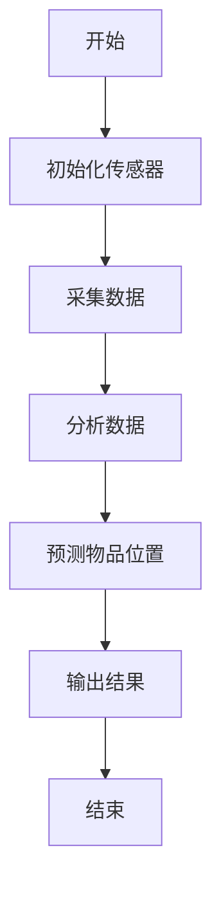
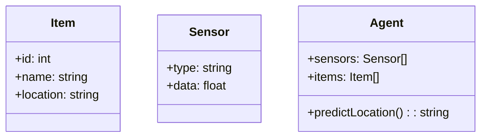
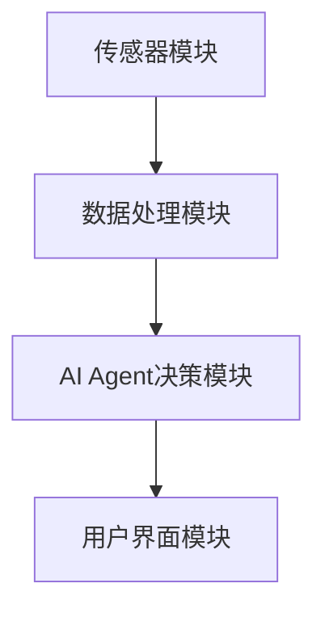
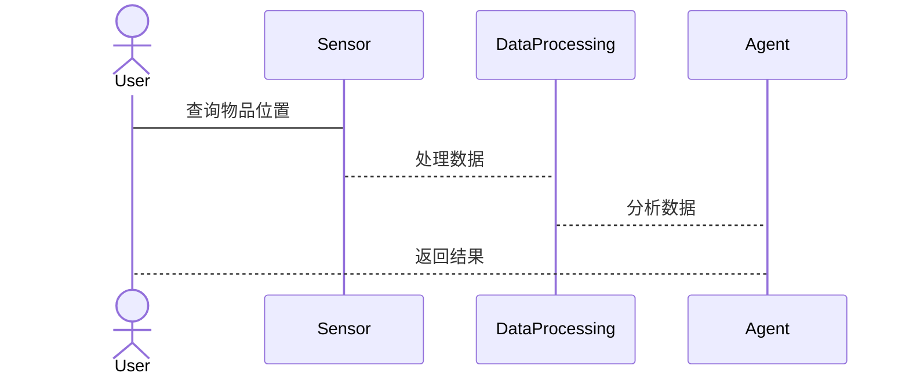

                 


# AI Agent在智能背包中的物品追踪

## 关键词：AI Agent，智能背包，物品追踪，算法原理，系统架构，项目实战

## 摘要：本文详细探讨了AI Agent在智能背包中的物品追踪应用，从背景、核心概念到算法原理、系统架构设计，再到项目实战，全面解析AI Agent如何实现高效、智能的物品追踪。通过实际案例分析，揭示了AI Agent在智能背包中的潜在价值和应用前景。

---

## 第1章：AI Agent与智能背包概述

### 1.1 问题背景

#### 1.1.1 智能背包的定义与应用场景
智能背包是一种结合物联网技术的背包，通过传感器和AI技术实现物品的智能化管理。其应用场景包括日常生活、商务旅行、户外活动等，帮助用户高效管理背包中的物品。

#### 1.1.2 物品追踪的必要性与挑战
传统背包管理中，物品容易丢失或难以快速找到，尤其在复杂环境中。物品追踪需要实时性、准确性，同时要考虑传感器的能耗和数据处理效率。

#### 1.1.3 AI Agent在物品追踪中的作用
AI Agent通过实时感知、学习用户习惯和环境信息，优化物品追踪策略，提升追踪效率和准确性。

### 1.2 问题描述

#### 1.2.1 物品追踪的核心问题
如何在复杂环境中实时准确地追踪物品位置，同时优化传感器能耗。

#### 1.2.2 智能背包中的物品追踪需求
用户希望智能背包能实时显示物品位置，快速查找丢失物品，提供物品管理建议。

#### 1.2.3 AI Agent如何解决追踪问题
AI Agent通过整合多种传感器数据，利用机器学习模型优化追踪算法，实现高效物品追踪。

### 1.3 问题解决

#### 1.3.1 AI Agent的解决方案概述
AI Agent整合GPS、RFID、加速度计等多种传感器，利用机器学习算法实时分析数据，优化物品位置预测。

#### 1.3.2 智能背包系统的架构
系统包括传感器模块、数据处理模块、AI Agent决策模块和用户界面模块，协同工作实现物品追踪。

#### 1.3.3 物品追踪的实现流程
1. 传感器采集物品位置数据。
2. 数据处理模块分析数据，提取关键信息。
3. AI Agent基于历史数据和环境信息，预测物品位置。
4. 用户界面显示追踪结果，并提供管理建议。

### 1.4 边界与外延

#### 1.4.1 AI Agent在物品追踪中的边界
AI Agent仅负责物品追踪，不处理背包的物理结构或其他功能。

#### 1.4.2 智能背包系统的扩展可能性
系统可扩展功能包括物品分类、健康监测、环境感知等，通过模块化设计实现功能扩展。

#### 1.4.3 其他相关技术的整合
系统可整合云服务、区块链技术，提升数据安全性、可靠性，优化用户体验。

---

## 第2章：AI Agent的核心原理

### 2.1 AI Agent的核心原理

#### 2.1.1 AI Agent的基本原理
AI Agent通过感知环境、分析数据、制定策略和执行动作，实现物品追踪。核心机制包括数据采集、分析、决策和反馈。

#### 2.1.2 AI Agent的感知与决策机制
AI Agent利用多种传感器数据，结合上下文信息，进行多目标优化，选择最优追踪策略。

#### 2.1.3 AI Agent的执行与反馈
AI Agent根据决策结果，通过传感器和通信模块执行动作，并实时反馈结果，优化后续追踪过程。

---

## 第3章：AI Agent追踪算法

### 3.1 算法原理

#### 3.1.1 基于概率的追踪算法
使用概率模型预测物品位置，考虑传感器噪声和环境不确定性，优化预测准确性。

#### 3.1.2 基于机器学习的追踪算法
利用深度学习模型分析历史数据，学习用户行为模式，预测物品位置。

#### 3.1.3 基于规则的追踪算法
根据预设规则，如物品重量、传感器信号强度，判断物品位置。

### 3.2 算法流程图



### 3.3 数学模型与公式

#### 3.3.1 概率模型
$$P(A|B) = \frac{P(B|A)P(A)}{P(B)}$$

#### 3.3.2 机器学习模型
$$y = f(x)$$

---

## 第4章：系统分析与架构设计方案

### 4.1 问题场景介绍

#### 4.1.1 项目介绍
本项目开发一个智能背包系统，通过AI Agent实现物品追踪，提升用户体验。

#### 4.1.2 系统功能设计

##### 4.1.2.1 领域模型类图



##### 4.1.2.2 系统架构图



##### 4.1.2.3 系统接口设计
系统提供REST API接口，供其他设备或系统调用追踪数据。

##### 4.1.2.4 系统交互流程



---

## 第5章：项目实战

### 5.1 环境安装

#### 5.1.1 安装Python
安装Python 3.8以上版本，确保支持所需的库。

#### 5.1.2 安装依赖
使用pip安装numpy、scikit-learn、mermaid等库。

### 5.2 核心实现

#### 5.2.1 传感器数据采集代码

```python
import numpy as np

def get_sensor_data():
    # 返回模拟的传感器数据
    return np.random.rand(10, 2)
```

#### 5.2.2 AI Agent实现代码

```python
from sklearn import svm

def train_agent(data, labels):
    model = svm.SVC()
    model.fit(data, labels)
    return model

# 示例数据
X = np.random.rand(100, 2)
y = np.random.randint(2, size=100)
model = train_agent(X, y)
```

### 5.3 代码解读与分析

#### 5.3.1 传感器数据采集
函数`get_sensor_data`模拟从传感器获取数据，返回二维数组。

#### 5.3.2 AI Agent训练
使用支持向量机模型训练AI Agent，根据输入数据和标签，生成分类模型。

### 5.4 实际案例分析

#### 5.4.1 案例1：背包内物品追踪
背包内有笔记本电脑和手机，AI Agent通过传感器数据准确识别两者的当前位置。

#### 5.4.2 案例2：快速查找丢失物品
当用户报告物品丢失时，AI Agent快速分析传感器数据，确定物品最后出现的位置。

### 5.5 项目小结
通过代码实现，AI Agent能够有效追踪背包中的物品，提升用户体验。

---

## 第6章：总结与展望

### 6.1 总结

#### 6.1.1 最佳实践 tips
- 定期更新传感器数据，确保追踪准确性。
- 优化AI Agent算法，提升预测精度。
- 提供用户友好的界面，便于操作。

#### 6.1.2 小结
本文详细介绍了AI Agent在智能背包中的物品追踪应用，从背景、原理到系统设计和项目实战，全面解析了其实现过程。

### 6.2 注意事项

- 确保传感器数据的实时性和准确性。
- 保护用户隐私，避免数据泄露。
- 定期维护系统，确保长期稳定运行。

### 6.3 拓展阅读
建议读者阅读相关领域的书籍和论文，深入学习AI Agent和物联网技术。

---

## 作者：AI天才研究院 & 禅与计算机程序设计艺术

通过本文，读者可以全面了解AI Agent在智能背包中的物品追踪应用，从理论到实践，掌握其实现方法和优化技巧。

