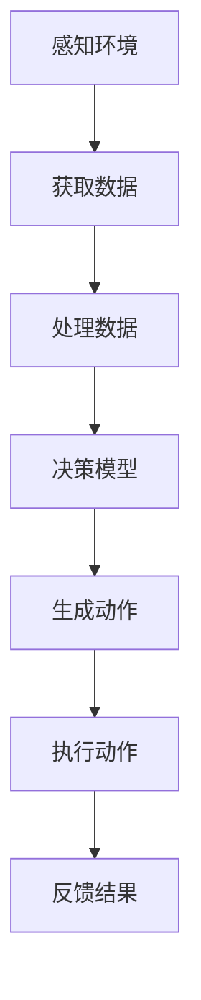

                 


# AI Agent在智能能源管理中的实践

## 关键词
AI Agent，智能能源管理，强化学习，能源优化，系统架构

## 摘要
AI Agent作为一种革命性的技术，正在逐渐改变能源管理的模式。本文系统地介绍了AI Agent的基本概念、核心原理，以及其在智能能源管理中的应用场景。通过对能源管理系统架构的详细分析，结合具体案例，深入探讨了AI Agent在能源优化中的优势和挑战。本文还提供了数学模型和算法流程图，帮助读者更好地理解AI Agent的实现机制。最后，总结了AI Agent在智能能源管理中的应用前景，并提出了未来的研究方向。

---

# 第1章: AI Agent与智能能源管理的背景与概念

## 1.1 AI Agent的基本概念

### 1.1.1 AI Agent的定义与特点
AI Agent（人工智能代理）是指具备智能决策能力的软件实体，能够根据环境信息自主决策并执行操作。其特点包括：
- **自主性**：无需外部干预，能够自主决策。
- **反应性**：能够实时感知环境并做出反应。
- **目标导向性**：基于目标驱动行为。
- **学习能力**：通过学习不断优化决策模型。

### 1.1.2 AI Agent的核心原理
AI Agent通过感知环境信息，运用算法进行决策，并通过执行器与环境交互，形成一个闭环系统。其核心原理包括：
- **感知**：通过传感器或其他数据源获取环境信息。
- **决策**：基于感知信息和历史数据，运用算法进行决策。
- **执行**：通过执行器将决策转化为实际操作。

### 1.1.3 AI Agent与传统自动化的区别
传统自动化基于预设规则，而AI Agent具备学习和自适应能力，能够处理复杂和不确定的环境。

## 1.2 智能能源管理的定义与特点

### 1.2.1 能源管理的基本概念
能源管理是指对能源的生产、传输、分配和消耗进行规划和控制的过程。

### 1.2.2 智能能源管理的核心特征
智能能源管理利用信息技术和数据分析，实现能源系统的实时监控、优化调度和高效利用。

### 1.2.3 智能能源管理与传统能源管理的区别
传统能源管理依赖人工操作和经验，而智能能源管理通过智能化技术实现自动化和优化。

## 1.3 AI Agent在智能能源管理中的应用前景

### 1.3.1 AI Agent在能源管理中的潜在应用领域
- 智能电网
- 能源需求预测
- 负荷控制
- 可再生能源整合

### 1.3.2 企业采用AI Agent的优势
- 提高能源利用效率
- 降低运营成本
- 增强系统灵活性和响应能力

### 1.3.3 AI Agent应用的挑战与机遇
- 技术复杂性
- 数据隐私问题
- 能源市场的不确定性

## 1.4 本章小结
本章介绍了AI Agent的基本概念、核心原理，以及智能能源管理的定义与特点。同时，探讨了AI Agent在智能能源管理中的应用前景，为后续内容奠定了基础。

---

# 第2章: AI Agent与智能能源管理的核心概念

## 2.1 AI Agent的核心概念与原理

### 2.1.1 AI Agent的决策机制
AI Agent通过感知信息和历史数据，运用算法进行决策。

### 2.1.2 AI Agent的学习能力
通过机器学习算法不断优化决策模型。

### 2.1.3 AI Agent的自适应能力
能够根据环境变化调整策略和行为。

## 2.2 智能能源管理的核心概念与原理

### 2.2.1 能源数据的采集与处理
通过传感器和数据采集系统获取能源系统的实时数据。

### 2.2.2 能源系统的优化算法
基于数学模型和优化理论，制定最优的能源调度方案。

### 2.2.3 能源系统的实时监控与反馈
通过实时数据监控系统，动态调整能源管理策略。

## 2.3 AI Agent与智能能源管理的关系

### 2.3.1 AI Agent在智能能源管理中的角色
作为决策的核心模块，优化能源系统的运行。

### 2.3.2 AI Agent与能源管理系统的交互流程
AI Agent通过接口获取数据，进行决策并发送指令到系统执行。

### 2.3.3 AI Agent在能源管理中的价值体现
提高决策效率、增强系统的适应性和灵活性。

## 2.4 核心概念对比表格
表2-1: AI Agent与传统能源管理的核心概念对比

| 比较维度 | AI Agent | 传统能源管理 |
|----------|-----------|--------------|
| 决策机制 | 基于算法和数据 | 基于预设规则 |
| 数据处理 | 学习和优化 | 人工处理和分析 |
| 优化算法 | 强化学习、监督学习 | 基于经验的规则 |

## 2.5 实体关系图（ER图）

```mermaid
erd
    能源管理系统
    <|-- 数据采集模块
    能源管理系统
    <|-- AI Agent模块
    能源管理系统
    <|-- 决策执行模块
```

---

# 第3章: AI Agent的算法原理与数学模型

## 3.1 AI Agent的核心算法

### 3.1.1 强化学习算法
通过奖励机制，使AI Agent学习最优策略。

### 3.1.2 监督学习算法
基于标注数据，训练AI Agent进行分类或预测。

### 3.1.3 非监督学习算法
通过聚类或其他技术，发现数据中的潜在模式。

## 3.2 AI Agent的数学模型

### 3.2.1 状态空间模型
描述系统的状态空间及其转移概率。

### 3.2.2 动作空间模型
定义AI Agent可能采取的动作及其影响。

### 3.2.3 奖励函数模型
定义不同状态下AI Agent获得的奖励值。

## 3.3 算法流程图



## 3.4 数学公式与详细讲解

### 公式3-1：状态转移概率公式
$$ P(s' | s, a) $$
表示在当前状态s和动作a下，转移到状态s'的概率。

### 公式3-2：奖励函数公式
$$ R(s, a) $$
表示在状态s和动作a下，AI Agent获得的奖励值。

## 3.5 举例说明
通过具体案例，如强化学习在能源调度中的应用，详细讲解AI Agent的算法原理和实际应用。

---

# 第4章: 智能能源管理系统的分析与架构设计

## 4.1 系统分析

### 4.1.1 问题场景介绍
智能能源管理系统的应用场景，如智能电网、可再生能源整合等。

### 4.1.2 系统功能需求
包括数据采集、优化调度、实时监控等功能。

### 4.1.3 系统性能需求
如实时性、可靠性、可扩展性等。

## 4.2 系统架构设计

### 4.2.1 系统功能模块划分
数据采集模块、优化算法模块、决策执行模块等。

### 4.2.2 系统架构图

```mermaid
graph TD
    数据采集模块 --> AI Agent模块
    AI Agent模块 --> 优化算法模块
    优化算法模块 --> 决策执行模块
    决策执行模块 --> 能源管理系统
```

## 4.3 项目实战

### 5.1 环境安装
介绍项目所需环境，如Python、TensorFlow等。

### 5.2 核心实现源代码
提供AI Agent算法的核心代码，如强化学习的实现。

### 5.3 代码应用解读与分析
详细解读代码的功能和实现逻辑，分析其在能源管理中的应用。

### 5.4 实际案例分析
通过具体案例，如智能电网项目，展示AI Agent的应用效果和优势。

### 5.5 项目小结
总结项目成果，分析优缺点，提出改进建议。

---

# 第5章: 总结与展望

## 6.1 总结与展望
总结本文的主要内容和研究成果。展望AI Agent在智能能源管理中的未来发展方向，如多智能体协作、边缘计算等。

## 6.2 最佳实践
提供一些实际应用中的最佳实践，如数据质量管理、模型优化、安全性保障等。

## 6.3 小结
简要回顾全文，强调AI Agent在智能能源管理中的重要性和潜力。

---

# 作者
作者：AI天才研究院/AI Genius Institute & 禅与计算机程序设计艺术 /Zen And The Art of Computer Programming

