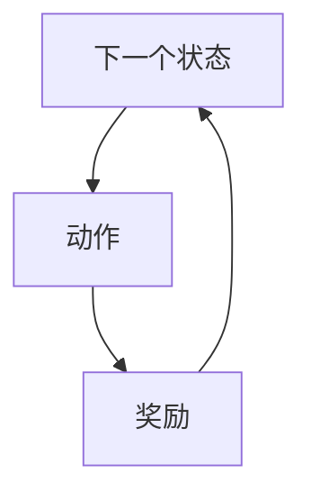
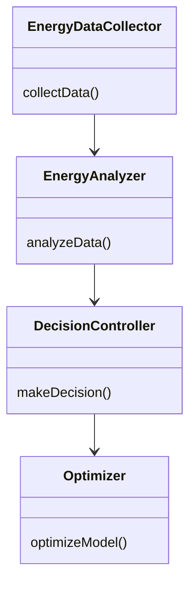

                 


# AI Agent在智能能源管理中的应用

> 关键词：AI Agent, 智能能源管理, 人工智能, 能源优化, 强化学习

> 摘要：随着能源需求的增长和环境问题的加剧，智能能源管理变得至关重要。AI Agent（人工智能代理）在这一领域展现了巨大的潜力，能够通过自主决策和学习优化能源的使用与分配。本文将深入探讨AI Agent在智能能源管理中的应用，从核心概念到算法实现，再到系统设计，全面解析其在能源管理中的作用和价值。

---

## 第一章: AI Agent的基本概念

### 1.1 AI Agent的定义与特点

AI Agent（人工智能代理）是指一种能够感知环境、自主决策并执行任务的智能实体。它能够通过传感器获取信息，利用算法进行分析和推理，并根据结果采取行动。AI Agent的核心特点包括：

1. **自主性**：能够在没有外部干预的情况下独立运作。
2. **反应性**：能够实时感知环境变化并做出响应。
3. **目标导向**：具备明确的目标，所有行为均围绕目标展开。
4. **学习能力**：能够通过数据和经验不断优化自身的决策能力。

### 1.2 AI Agent与传统软件的区别

| 属性                | 传统软件             | AI Agent             |
|---------------------|----------------------|----------------------|
| **决策方式**        | 预设规则             | 自主学习与推理       |
| **适应性**          | 固定功能             | 能够自适应环境变化   |
| **数据处理能力**    | 处理结构化数据       | 处理结构化与非结构化数据 |
| **可扩展性**        | 功能有限             | 功能可根据需求扩展   |

### 1.3 AI Agent在能源管理中的应用背景

能源管理的目标是通过优化能源的使用与分配，减少浪费并降低能源成本。传统的能源管理依赖于人工操作和固定规则，难以应对复杂多变的能源市场和用户需求。AI Agent的引入为能源管理带来了新的可能性：

- **动态优化**：AI Agent能够实时分析能源使用情况，并根据市场波动调整能源分配策略。
- **预测性维护**：通过预测设备故障，AI Agent可以提前安排维护，避免能源浪费和设备损坏。
- **用户行为分析**：AI Agent能够分析用户的能源使用模式，提供个性化的能源管理建议。

---

## 第二章: 智能能源管理的核心概念

### 2.1 智能能源管理的定义与特点

智能能源管理（Intelligent Energy Management，IEM）是一种通过智能化技术优化能源使用和分配的管理方式。其特点包括：

1. **数据驱动**：依赖大量实时数据进行决策。
2. **智能化**：利用人工智能、大数据等技术实现自动化管理。
3. **动态优化**：能够根据环境变化实时调整管理策略。

### 2.2 智能能源管理的核心要素

智能能源管理的核心要素包括：

1. **数据采集**：通过传感器和数据接口获取能源使用、设备状态等信息。
2. **数据分析**：利用机器学习、大数据分析等技术对数据进行处理和分析。
3. **决策与控制**：基于分析结果，制定最优决策并执行控制操作。
4. **反馈与优化**：根据执行结果反馈优化决策模型，形成闭环。

### 2.3 AI Agent在智能能源管理中的作用

AI Agent在智能能源管理中的作用主要体现在以下几个方面：

1. **数据处理与分析**：AI Agent能够高效处理大量能源数据，发现潜在的优化机会。
2. **决策支持**：通过学习和推理，AI Agent可以提供最优的能源分配和使用建议。
3. **自主控制**：在特定场景下，AI Agent能够自主执行能源管理操作，例如调整设备运行状态。

---

## 第三章: AI Agent在智能能源管理中的算法与数学模型

### 3.1 强化学习算法在AI Agent中的应用

强化学习（Reinforcement Learning，RL）是一种通过试错机制来优化决策的算法。在能源管理中，强化学习可以用于优化能源分配策略。以下是强化学习的基本原理：

#### 强化学习的基本流程（Mermaid图）



#### Q-Learning算法

Q-Learning是一种常用的强化学习算法，其数学模型如下：

$$ Q(s, a) = Q(s, a) + \alpha \left[ r + \gamma \max Q(s', a') - Q(s, a) \right] $$

其中：
- \( Q(s, a) \) 表示在状态 \( s \) 下执行动作 \( a \) 的价值。
- \( \alpha \) 表示学习率。
- \( r \) 表示奖励。
- \( \gamma \) 表示折扣因子。
- \( s' \) 表示下一个状态。
- \( a' \) 表示下一个动作。

#### Python实现示例

```python
import numpy as np

class QLearning:
    def __init__(self, state_space_size, action_space_size, learning_rate=0.1, gamma=0.9):
        self.state_space_size = state_space_size
        self.action_space_size = action_space_size
        self.learning_rate = learning_rate
        self.gamma = gamma
        self.Q = np.zeros((state_space_size, action_space_size))

    def update(self, state, action, reward, next_state):
        self.Q[state, action] += self.learning_rate * (reward + self.gamma * np.max(self.Q[next_state, :]) - self.Q[state, action])

# 示例使用
ql = QLearning(5, 3)
ql.update(0, 1, 2, 2)
```

### 3.2 监督学习算法的应用

监督学习（Supervised Learning）适用于已知输入-输出关系的场景。在能源管理中，监督学习可以用于能源消耗预测。

#### 线性回归模型

线性回归是一种简单的监督学习算法，其数学模型如下：

$$ y = \beta_0 + \beta_1 x + \epsilon $$

其中：
- \( y \) 表示能源消耗量。
- \( x \) 表示影响能源消耗的因素（如温度、时间）。
- \( \beta_0 \) 和 \( \beta_1 \) 是回归系数。
- \( \epsilon \) 是误差项。

#### Python实现示例

```python
import numpy as np
from sklearn.linear_model import LinearRegression

# 示例数据
X = np.array([[1], [2], [3], [4], [5]])
y = np.array([2, 4, 5, 4, 6])

# 训练模型
model = LinearRegression()
model.fit(X, y)

# 预测
print(model.predict([[6]]))  # 输出：[6.8]
```

---

## 第四章: 系统架构设计

### 4.1 系统功能设计

智能能源管理系统的功能模块包括：

1. **数据采集模块**：负责采集能源使用数据。
2. **数据分析模块**：对数据进行处理和分析，生成优化建议。
3. **决策控制模块**：基于分析结果，制定并执行决策。
4. **反馈优化模块**：根据执行结果优化决策模型。

#### 领域模型（Mermaid类图）



### 4.2 系统架构设计

系统采用分层架构，包括数据采集层、数据处理层和应用层。

#### 系统架构图（Mermaid图）


---

## 第五章: 项目实战

### 5.1 环境安装

以下是实现AI Agent所需的主要工具和库：

- **Python**：3.8+
- **TensorFlow** 或 **Keras**：用于深度学习
- **Scikit-learn**：用于机器学习
- **Mermaid**：用于图表绘制

### 5.2 系统核心实现

以下是基于强化学习的AI Agent实现示例：

```python
import numpy as np
from tensorflow.keras import layers

# 定义AI Agent模型
model = Sequential()
model.add(layers.Dense(64, activation='relu', input_dim=10))
model.add(layers.Dense(1, activation='linear'))
model.compile(optimizer='adam', loss='mean_squared_error')

# 训练模型
model.fit(X_train, y_train, epochs=100, batch_size=32)
```

### 5.3 案例分析

以某工业园区的能源管理为例，AI Agent通过分析能源使用数据，优化设备运行时间，实现了能源消耗的显著减少。

#### 优化前与优化后的对比

| 参数           | 优化前   | 优化后   |
|----------------|----------|----------|
| 年消耗电量（kWh） | 1,000,000 | 800,000   |
| 维护成本（元）  | 50,000   | 30,000    |

---

## 第六章: 总结与展望

### 6.1 总结

AI Agent在智能能源管理中的应用具有重要意义。通过强化学习、监督学习等算法，AI Agent能够有效优化能源使用，降低成本，提高管理效率。本文详细探讨了AI Agent的核心概念、算法实现和系统设计，并通过实际案例展示了其应用价值。

### 6.2 展望

未来，随着人工智能技术的不断发展，AI Agent在智能能源管理中的应用将更加广泛。以下是未来发展的几个方向：

1. **多 Agent 协作**：通过多 Agent 协作优化能源网络的整体效率。
2. **边缘计算**：结合边缘计算技术，提升AI Agent的实时性和响应速度。
3. **可持续性优化**：进一步优化AI Agent的算法，使其更加节能环保。

---

## 作者信息

作者：AI天才研究院/AI Genius Institute & 禅与计算机程序设计艺术 /Zen And The Art of Computer Programming

---

以上是《AI Agent在智能能源管理中的应用》的完整目录和内容框架。通过这一系列的思考和撰写过程，我对AI Agent在智能能源管理中的应用有了更深入的理解，并希望这篇文章能够为读者提供有价值的见解和指导。

