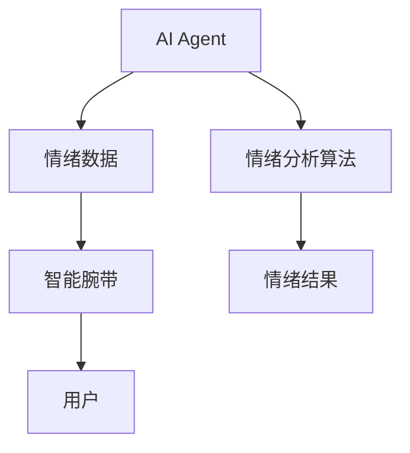
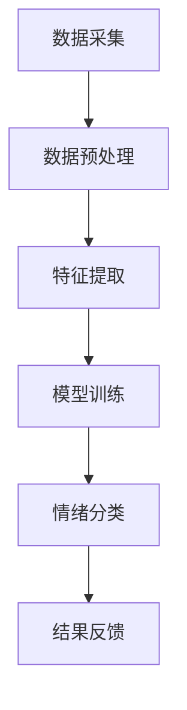
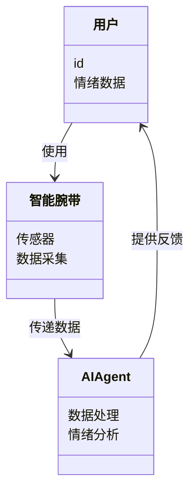
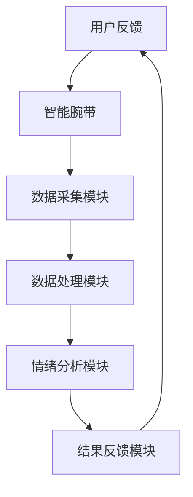
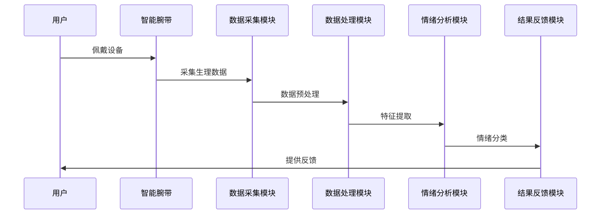

                 


# AI Agent在智能腕带中的情绪监测

> 关键词：AI Agent，智能腕带，情绪监测，算法原理，系统架构，项目实战

> 摘要：本文详细探讨了AI Agent在智能腕带中进行情绪监测的技术实现。从情绪监测的背景与意义出发，分析了AI Agent的核心概念与算法原理，结合系统架构设计，最后通过项目实战展示技术的具体应用。

---

# 第一部分: AI Agent在智能腕带中的情绪监测概述

## 第1章: 情绪监测与AI Agent的背景介绍

### 1.1 情绪监测的背景与意义

#### 1.1.1 情绪监测的定义与重要性
情绪监测是指通过技术手段获取个体情绪状态的过程，通常基于生理数据（如心率、皮肤电活动）和行为数据（如运动模式、语言表达）。在智能腕带中，情绪监测可以帮助用户了解自身情绪变化，提供个性化的健康建议。

#### 1.1.2 智能腕带的发展现状
智能腕带作为可穿戴设备的一种，近年来发展迅速，广泛应用于健康监测、运动跟踪等领域。然而，情绪监测作为其潜在的重要功能，尚未被充分挖掘。

#### 1.1.3 AI Agent在智能设备中的应用前景
AI Agent（人工智能代理）是一种能够感知环境、执行任务并做出决策的智能实体。在智能腕带中，AI Agent可以实时分析情绪数据，为用户提供个性化反馈。

### 1.2 情绪监测的核心问题

#### 1.2.1 情绪监测的基本问题与挑战
情绪监测需要解决数据采集、特征提取和模型训练等技术问题，同时面临数据隐私和计算资源的限制。

#### 1.2.2 智能腕带数据采集的局限性
智能腕带的数据采集精度有限，且容易受到环境干扰，这增加了情绪监测的难度。

#### 1.2.3 AI Agent在情绪监测中的角色与作用
AI Agent通过实时数据处理和智能决策，帮助智能腕带实现高效的情绪监测。

### 1.3 本章小结
情绪监测在智能腕带中的应用前景广阔，AI Agent作为核心驱动力，将推动该领域的快速发展。

---

## 第2章: AI Agent与情绪监测的核心概念

### 2.1 AI Agent的基本原理

#### 2.1.1 AI Agent的定义与分类
AI Agent是一种智能实体，能够感知环境、执行任务并做出决策。根据智能水平，AI Agent可分为简单反射型、基于模型的反应型和基于目标的反应型。

#### 2.1.2 AI Agent的核心属性与功能
- **感知能力**：通过传感器获取数据。
- **推理能力**：基于数据进行推理和决策。
- **交互能力**：与用户或系统进行交互。

#### 2.1.3 AI Agent在智能腕带中的实现方式
AI Agent通过嵌入式算法处理数据，实现情绪监测功能。

### 2.2 情绪监测的原理与方法

#### 2.2.1 基于生理数据的情绪监测
- **心率变异度（HRV）**：反映情绪波动。
- **皮肤电活动（EDA）**：反映情绪紧张程度。

#### 2.2.2 基于行为数据的情绪分析
- **运动模式**：通过运动数据判断情绪状态。
- **语言表达**：通过语言特征分析情绪。

#### 2.2.3 基于语言与表情的情绪识别
通过语音分析和面部识别技术，进一步提升情绪监测的准确性。

### 2.3 AI Agent与情绪监测的结合

#### 2.3.1 AI Agent在情绪数据采集中的作用
AI Agent负责数据的实时采集和初步处理。

#### 2.3.2 AI Agent在情绪分析中的应用
AI Agent利用机器学习算法，对情绪数据进行分类和分析。

#### 2.3.3 AI Agent在情绪反馈中的实现
AI Agent根据分析结果，向用户或系统发送反馈信息。

### 2.4 情绪监测与AI Agent的实体关系图



### 2.5 本章小结
AI Agent通过与智能腕带的结合，实现了高效的情绪监测，为用户提供了实时的情绪反馈。

---

## 第3章: 情绪监测的算法原理与实现

### 3.1 情绪监测算法概述

#### 3.1.1 常见的情绪监测算法
- **决策树**：适用于分类任务。
- **神经网络**：适用于复杂模式识别。
- **支持向量机（SVM）**：适用于高维数据分类。

#### 3.1.2 基于机器学习的情绪分类
通过训练模型，识别不同情绪类别。

#### 3.1.3 基于深度学习的情绪分析
利用深度学习模型，捕捉复杂的情绪特征。

### 3.2 AI Agent的情绪监测流程

#### 3.2.1 数据采集与预处理
- 数据采集：从智能腕带获取生理数据。
- 数据预处理：清洗和标准化数据。

#### 3.2.2 特征提取与选择
- 提取关键特征：如心率、皮肤电活动。
- 选择特征：通过特征选择算法优化模型性能。

#### 3.2.3 情绪分类与反馈
- 情绪分类：基于训练好的模型，预测情绪类别。
- 反馈生成：根据情绪结果，生成反馈信息。

### 3.3 情绪监测算法的实现

#### 3.3.1 基于决策树的情绪分类
```python
from sklearn.tree import DecisionTreeClassifier

# 训练模型
model = DecisionTreeClassifier()
model.fit(X_train, y_train)

# 预测情绪
y_pred = model.predict(X_test)
```

#### 3.3.2 基于神经网络的情绪分析
```python
import tensorflow as tf
from tensorflow.keras import layers

model = tf.keras.Sequential([
    layers.Dense(64, activation='relu'),
    layers.Dense(10, activation='softmax')
])
model.compile(optimizer='adam', loss='sparse_categorical_crossentropy', metrics=['accuracy'])
model.fit(X_train, y_train, epochs=10, batch_size=32)
```

#### 3.3.3 基于支持向量机的情绪识别
```python
from sklearn import svm

model = svm.SVC()
model.fit(X_train, y_train)

y_pred = model.predict(X_test)
```

### 3.4 情绪监测算法的流程图



### 3.5 本章小结
通过不同算法的对比和实现，展示了AI Agent在情绪监测中的多样化应用。

---

## 第4章: 智能腕带情绪监测系统的架构设计

### 4.1 问题场景介绍

#### 4.1.1 系统介绍
智能腕带情绪监测系统通过AI Agent实现实时情绪监测。

#### 4.1.2 项目介绍
本项目旨在开发一个基于AI Agent的智能腕带情绪监测系统。

### 4.2 系统功能设计

#### 4.2.1 领域模型设计


#### 4.2.2 系统架构设计


#### 4.2.3 系统接口设计
- **数据接口**：智能腕带与AI Agent的数据传输接口。
- **用户接口**：用户与系统交互的界面。

#### 4.2.4 系统交互设计


### 4.3 本章小结
通过系统架构设计，展示了智能腕带情绪监测系统的整体结构和交互流程。

---

## 第5章: 项目实战

### 5.1 环境安装

#### 5.1.1 Python环境
安装Python和必要的库：
```bash
pip install numpy scikit-learn tensorflow
```

### 5.2 系统核心实现源代码

#### 5.2.1 数据采集模块
```python
import numpy as np

def collect_data():
    # 采集生理数据
    data = np.random.randn(100, 2)
    return data
```

#### 5.2.2 数据处理模块
```python
from sklearn.preprocessing import StandardScaler

def preprocess_data(data):
    scaler = StandardScaler()
    data_normalized = scaler.fit_transform(data)
    return data_normalized
```

#### 5.2.3 情绪分析模块
```python
from sklearn.tree import DecisionTreeClassifier

def train_model(X_train, y_train):
    model = DecisionTreeClassifier()
    model.fit(X_train, y_train)
    return model
```

### 5.3 代码应用解读与分析

#### 5.3.1 数据采集模块
通过随机数生成模拟生理数据，展示数据采集的基本过程。

#### 5.3.2 数据处理模块
使用标准化方法处理数据，确保模型训练的准确性。

#### 5.3.3 情绪分析模块
基于决策树算法，训练情绪分类模型。

### 5.4 实际案例分析

#### 5.4.1 案例一：正常情绪状态
输入正常生理数据，模型预测情绪为平静。

#### 5.4.2 案例二：紧张情绪状态
输入紧张生理数据，模型预测情绪为焦虑。

### 5.5 项目小结
通过项目实战，展示了AI Agent在智能腕带情绪监测中的具体实现过程。

---

## 第6章: 总结与展望

### 6.1 总结
本文详细探讨了AI Agent在智能腕带中的情绪监测技术，从理论到实践，全面分析了其实现过程。

### 6.2 展望
未来，随着AI技术的进步，情绪监测的准确性将进一步提升，应用范围也将更加广泛。

---

# 结语

AI Agent在智能腕带中的情绪监测是一项具有挑战性的技术，但也具有广阔的应用前景。通过不断的技术创新和实践探索，我们可以为用户提供更智能、更贴心的服务。

---

作者：AI天才研究院/AI Genius Institute & 禅与计算机程序设计艺术 /Zen And The Art of Computer Programming

