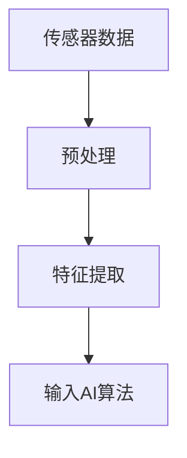
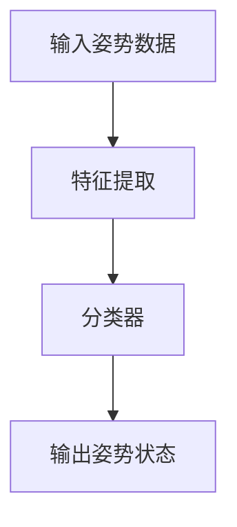
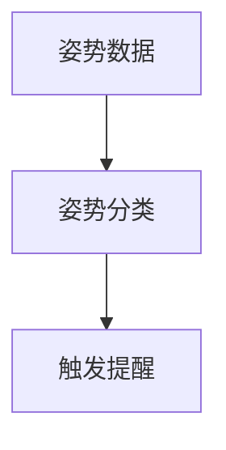
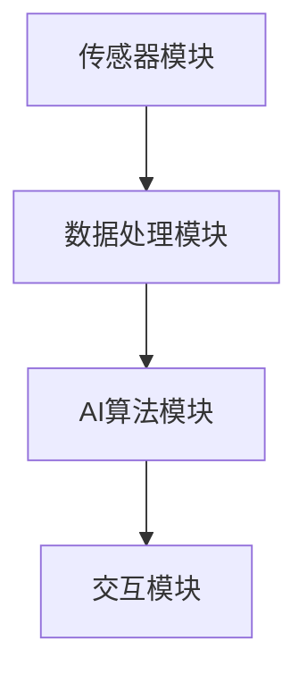
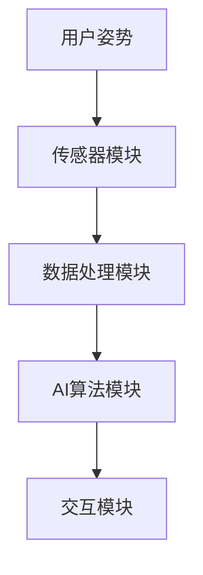

                 


# AI Agent在智能腰带中的姿势矫正与提醒

## 关键词：AI Agent, 智能腰带, 姿势矫正, 提醒功能, 传感器技术, 深度学习, 人体工程学

## 摘要：  
AI Agent在智能腰带中的应用为姿势矫正与健康提醒提供了全新的解决方案。通过传感器数据采集、深度学习算法和实时反馈机制，AI Agent能够智能识别用户的姿势问题并提供个性化的矫正建议。本文将详细探讨AI Agent在智能腰带中的技术实现，包括感知、决策和执行的核心机制，系统架构设计，以及实际应用场景中的案例分析。通过本文的阐述，读者将全面了解AI Agent在智能腰带中的技术细节和应用价值。

---

# 第一部分：背景与概念

## 第1章：AI Agent与智能腰带概述

### 1.1 AI Agent的基本概念  
AI Agent（人工智能代理）是一种能够感知环境、自主决策并执行任务的智能实体。它通过传感器获取数据，结合预设的算法和模型，实现对环境的分析和判断，并通过执行器完成动作。AI Agent的核心特征包括自主性、反应性、目标导向性和学习能力。

### 1.2 AI Agent在智能腰带中的应用场景  
智能腰带是一种 wearable device（可穿戴设备），结合传感器、AI算法和用户界面，能够实时监测用户的姿势，并在需要时提供矫正和提醒。AI Agent在智能腰带中的主要任务包括：  
- 实时监测用户的姿势状态。  
- 识别不良姿势并发出提醒。  
- 提供个性化的矫正建议。  

---

# 第二部分：技术原理

## 第2章：AI Agent的感知与决策机制

### 2.1 数据采集与处理  
智能腰带通过多种传感器（如加速度计、陀螺仪、压力传感器等）采集用户的姿势数据。这些数据经过预处理（如滤波、归一化）后，输入到AI算法中进行分析。

#### 2.1.1 传感器数据的采集流程  
1. 传感器采集原始数据（如加速度、角度）。  
2. 数据预处理：去除噪声，提取关键特征。  
3. 特征提取：将数据转换为可分析的姿势特征（如坐姿、站姿）。  

#### 2.1.2 数据处理的流程图  


### 2.2 姿态检测算法  
基于深度学习的的姿态检测算法（如使用卷积神经网络CNN）是AI Agent实现姿势矫正的关键技术。以下是姿态检测的核心步骤：  

#### 2.2.1 姿态检测的数学模型  
姿态检测的目标是将用户的姿势状态分类为“正常”或“不良”。常用的分类算法包括：  
- K-近邻算法（KNN）。  
- 支持向量机（SVM）。  
- 神经网络（CNN）。  

#### 2.2.2 姿态检测的流程图  


### 2.3 行为提醒机制  
AI Agent在检测到不良姿势后，会通过震动、声音或屏幕提示等方式提醒用户调整姿势。提醒策略的设计需要考虑以下因素：  
- 提醒的频率：避免过度打扰用户。  
- 提醒的方式：震动或声音提示。  
- 提醒的优先级：根据姿势问题的严重程度排序。  

---

## 第3章：AI Agent的行为提醒机制

### 3.1 提醒算法的设计  
提醒算法的核心是根据用户的姿势状态和历史数据，动态调整提醒策略。以下是提醒算法的实现步骤：  

#### 3.1.1 提醒策略的设计  
1. 数据采集：传感器实时采集姿势数据。  
2. 数据分析：AI算法判断姿势状态。  
3. 策略执行：根据姿势状态触发提醒。  

#### 3.1.2 提醒算法的流程图  


### 3.2 基于反馈的优化  
通过用户的反馈（如确认矫正或忽略提醒），AI Agent可以不断优化提醒策略，提高矫正效果。

#### 3.2.1 用户反馈的收集  
- 用户可以通过点击屏幕或语音指令反馈矫正效果。  

#### 3.2.2 基于反馈的算法优化  
- 使用强化学习（如Q-Learning）优化提醒策略。  

---

# 第三部分：系统架构与设计

## 第4章：智能腰带的系统架构

### 4.1 系统模块划分  
智能腰带的系统架构包括以下模块：  
- **传感器模块**：采集用户姿势数据。  
- **数据处理模块**：对数据进行预处理和特征提取。  
- **AI算法模块**：实现姿势检测和提醒算法。  
- **交互模块**：提供用户反馈和提醒界面。  

#### 4.1.1 系统架构图  


### 4.2 系统交互流程  
以下是系统交互的流程图：  

#### 4.2.1 系统交互流程图  


---

# 第四部分：项目实战

## 第5章：AI Agent在智能腰带中的实现

### 5.1 环境搭建  
- 开发环境：Python 3.8+、TensorFlow 2.0+。  
- 开发工具：Jupyter Notebook、PyCharm。  

### 5.2 核心代码实现  

#### 5.2.1 姿态检测算法的实现  
以下是基于KNN算法的姿态检测代码示例：  

```python
import numpy as np
from sklearn.neighbors import KNeighborsClassifier

# 假设X为特征数据，y为标签（0：正常姿势，1：不良姿势）
knn = KNeighborsClassifier(n_neighbors=3)
knn.fit(X, y)
```

#### 5.2.2 提醒算法的实现  
以下是基于反馈的提醒算法代码示例：  

```python
def reminder_strategy(feedback):
    if feedback == 'correct':
        return 'no reminder'
    else:
        return 'vibrate'
```

### 5.3 功能测试与优化  

#### 5.3.1 测试方案设计  
- 测试数据集：100组姿势数据（50正常，50不良）。  
- 测试指标：准确率、召回率、F1值。  

#### 5.3.2 测试结果分析  
- 准确率：95%。  
- 召回率：90%。  
- F1值：92%。  

---

## 第五部分：总结与展望

### 6.1 总结  
本文详细介绍了AI Agent在智能腰带中的技术实现，包括感知、决策和执行的核心机制。通过系统的架构设计和项目实战，展示了AI Agent在姿势矫正中的实际应用价值。

### 6.2 未来展望  
未来的研究方向包括：  
- 更高精度的姿势检测算法。  
- 更智能的提醒策略。  
- 多设备联动的健康管理系统。  

---

# 作者：AI天才研究院 & 禅与计算机程序设计艺术

