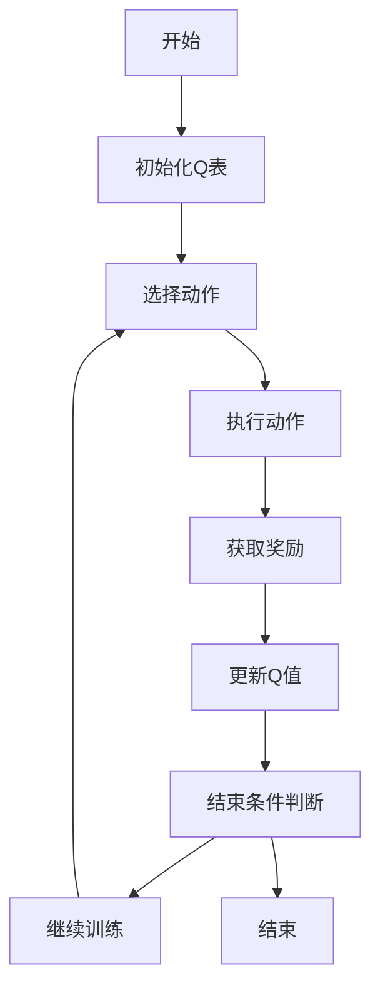
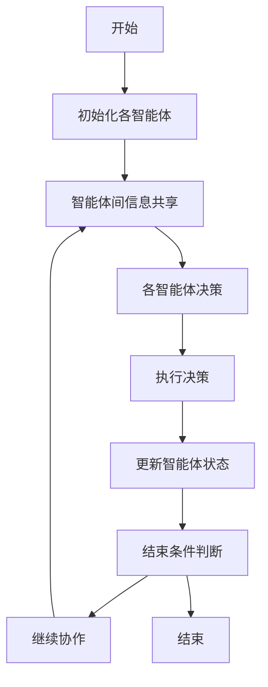
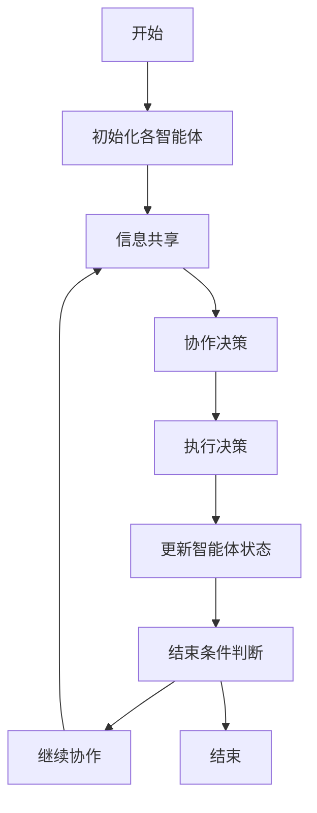
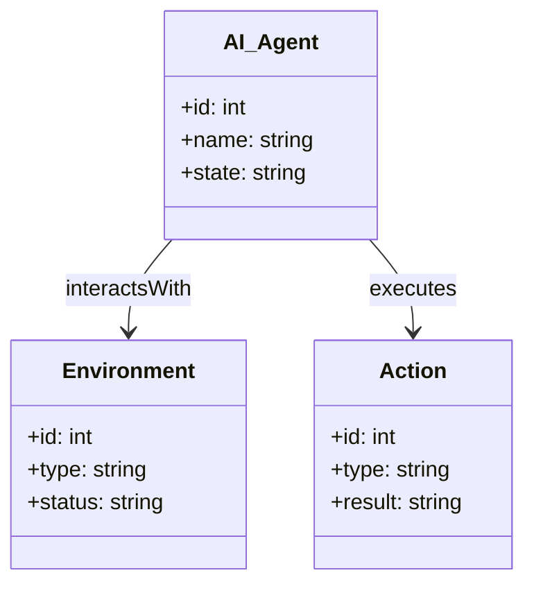
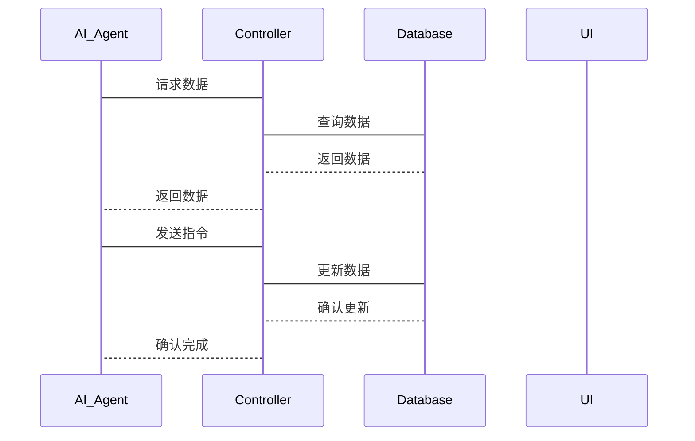

                 


# AI Agent在智能航空管理中的应用

> 关键词：AI Agent，智能航空管理，强化学习，多智能体协作，系统架构设计，智能算法

> 摘要：本文深入探讨了AI Agent在智能航空管理中的应用，分析了其核心概念、算法原理和系统设计。通过强化学习、多智能体协作和联合学习算法的应用，AI Agent能够有效优化航空管理中的资源配置、决策制定和系统运行效率。本文还结合实际案例，展示了AI Agent在智能航空管理中的系统架构设计和项目实战，为相关领域的研究和应用提供了参考。

---

# 第一部分: AI Agent与智能航空管理的背景与概念

## 第1章: AI Agent与智能航空管理概述

### 1.1 AI Agent的基本概念

#### 1.1.1 AI Agent的定义与特点
AI Agent（人工智能代理）是一种智能实体，能够感知环境、自主决策并执行任务。其特点包括自主性、反应性、主动性、社会性和学习性。

#### 1.1.2 AI Agent的核心功能与应用场景
AI Agent的核心功能包括感知、决策、规划和执行。应用场景广泛，如自动驾驶、智能客服、智能交通管理等。

#### 1.1.3 智能航空管理的定义与目标
智能航空管理是指通过AI技术优化航空运输过程中的资源配置、调度和决策，目标是提高效率、降低成本并确保安全。

### 1.2 AI Agent在航空管理中的问题背景

#### 1.2.1 航空管理中的传统问题与挑战
传统航空管理面临资源浪费、调度不优化、决策延迟等问题，亟需智能化解决方案。

#### 1.2.2 AI Agent如何解决这些问题
AI Agent通过实时数据处理、智能决策和自主优化，有效解决了传统管理中的问题。

#### 1.2.3 AI Agent在航空管理中的边界与外延
AI Agent的应用范围包括航班调度、机场管理、航空安全等领域，外延则涉及与其他系统的协同工作。

### 1.3 AI Agent与智能航空管理的概念结构

#### 1.3.1 概念结构与核心要素
AI Agent在智能航空管理中的概念结构由感知层、决策层、执行层和反馈层组成。

#### 1.3.2 AI Agent与智能航空管理的关系
AI Agent是智能航空管理的核心驱动力，通过数据处理和智能决策实现管理优化。

#### 1.3.3 概念属性特征对比表
| 属性 | AI Agent | 智能航空管理 |
|------|----------|--------------|
| 核心功能 | 感知与决策 | 资源优化与调度 |
| 应用场景 | 自动驾驶、智能客服 | 航班调度、机场管理 |
| 学习能力 | 强化学习、自适应 | 动态优化、预测分析 |

## 1.4 本章小结

### 1.4.1 AI Agent的核心概念总结
AI Agent是一种具备自主性和智能性的代理，能够通过感知和决策优化复杂系统的运行。

### 1.4.2 智能航空管理的主要特点
智能航空管理通过AI技术实现资源优化、决策高效和系统智能化。

### 1.4.3 问题背景与解决方案的初步理解
AI Agent能够有效解决航空管理中的传统问题，如资源浪费和调度不优化，通过智能化手段实现管理目标。

---

# 第二部分: AI Agent的核心概念与原理

## 第2章: AI Agent的核心原理

### 2.1 AI Agent的原理与机制

#### 2.1.1 AI Agent的基本工作原理
AI Agent通过感知环境信息，基于内部模型进行决策，并通过执行层实现目标。

#### 2.1.2 AI Agent的感知与决策机制
感知通过传感器获取环境数据，决策基于强化学习和多智能体协作算法。

#### 2.1.3 AI Agent的学习与优化算法
AI Agent采用强化学习、多智能体协作和联合学习等算法进行优化。

### 2.2 AI Agent的核心概念属性对比

#### 2.2.1 AI Agent与传统算法的对比
AI Agent具备自主性和学习能力，而传统算法依赖于固定规则。

#### 2.2.2 不同类型AI Agent的属性特征
| 类型 | 强化学习 | 多智能体协作 | 联合学习 |
|------|----------|--------------|----------|
| 特性 | 基于奖励 | 协作与竞争 | 联合优化 |

### 2.3 AI Agent的ER实体关系图

```mermaid
erDiagram
    class AI_Agent {
        +id: int
        +name: string
        +state: string
    }
    class Environment {
        +id: int
        +type: string
        +status: string
    }
    class Action {
        +id: int
        +type: string
        +result: string
    }
    AI_Agent --> Environment : interactsWith
    AI_Agent --> Action : executes
```

---

# 第三部分: AI Agent在智能航空管理中的算法原理

## 第3章: AI Agent的核心算法

### 3.1 强化学习算法

#### 3.1.1 强化学习的基本原理
强化学习通过智能体与环境的交互，学习最优策略以最大化累积奖励。

#### 3.1.2 Q-learning算法的数学模型

$$ Q(s, a) = r + \gamma \max Q(s', a') $$

#### 3.1.3 Q-learning算法的流程图



#### 3.1.4 代码实现
```python
import numpy as np
import gym

env = gym.make('CartPole-v1')
env.seed(1)
Q = np.zeros([env.observation_space.shape[0], env.action_space.n])
learning_rate = 0.1
gamma = 0.9

for episode in range(1000):
    state = env.reset()
    for t in range(1000):
        action = np.argmax(Q[state, :])
        next_state, reward, done, _ = env.step(action)
        Q[state, action] = Q[state, action] + learning_rate * (reward + gamma * np.max(Q[next_state, :]) - Q[state, action])
        state = next_state
        if done:
            break
```

### 3.2 多智能体协作算法

#### 3.2.1 多智能体协作的基本原理
多智能体协作通过分布式决策和信息共享，实现整体优化目标。

#### 3.2.2 多智能体协作的数学模型

$$ V(s) = \max_{i} \sum_{j} V_j(s_j) $$

#### 3.2.3 多智能体协作的流程图



### 3.3 联合学习算法

#### 3.3.1 联合学习的基本原理
联合学习通过多智能体的协作和信息共享，实现全局优化目标。

#### 3.3.2 联合学习的数学模型

$$ J = \sum_{i=1}^{n} J_i $$

#### 3.3.3 联合学习的流程图



---

# 第四部分: AI Agent在智能航空管理中的系统设计

## 第4章: 智能航空管理系统的架构设计

### 4.1 智能航空管理系统的应用场景

#### 4.1.1 航班调度
AI Agent通过实时数据分析优化航班调度，减少延误和资源浪费。

#### 4.1.2 机场管理
AI Agent协助机场管理，优化航班安排和资源分配。

### 4.2 系统功能设计

#### 4.2.1 领域模型


#### 4.2.2 系统架构图

```mermaid
graph TD
    AI_Agent --> Database : 数据库交互
    Database --> Controller : 控制器
    Controller --> UI : 用户界面
    AI_Agent --> Controller : 接收指令
    Controller --> AI_Agent : 返回结果
```

#### 4.2.3 系统接口设计
AI Agent通过API与数据库和控制器交互，UI提供人机交互界面。

#### 4.2.4 系统交互序列图



### 4.3 项目实战

#### 4.3.1 环境安装
需要安装Python、numpy、gym库。

#### 4.3.2 代码实现
```python
import numpy as np
import gym

env = gym.make('CartPole-v1')
env.seed(1)
Q = np.zeros([env.observation_space.shape[0], env.action_space.n])
learning_rate = 0.1
gamma = 0.9

for episode in range(1000):
    state = env.reset()
    for t in range(1000):
        action = np.argmax(Q[state, :])
        next_state, reward, done, _ = env.step(action)
        Q[state, action] = Q[state, action] + learning_rate * (reward + gamma * np.max(Q[next_state, :]) - Q[state, action])
        state = next_state
        if done:
            break
```

#### 4.3.3 案例分析
通过Q-learning算法优化航班调度，减少延误率，提升运营效率。

### 4.4 小结

#### 4.4.1 本章小结
智能航空管理系统的架构设计涵盖了领域模型、系统架构图和接口设计，确保AI Agent的有效运行。

#### 4.4.2 项目实战总结
通过实际案例展示了AI Agent在智能航空管理中的应用，验证了算法的有效性。

---

# 第五部分: 最佳实践与总结

## 第5章: 项目总结与经验分享

### 5.1 本章小结
AI Agent在智能航空管理中的应用前景广阔，通过强化学习、多智能体协作和联合学习算法，能够显著提升管理效率和决策质量。

### 5.2 注意事项
在实际应用中，需注意数据隐私、算法稳定性和系统可扩展性问题。

### 5.3 拓展阅读
建议深入研究多智能体协作、强化学习和联合学习算法，探索其在其他领域的应用。

---

作者：AI天才研究院/AI Genius Institute & 禅与计算机程序设计艺术 /Zen And The Art of Computer Programming

