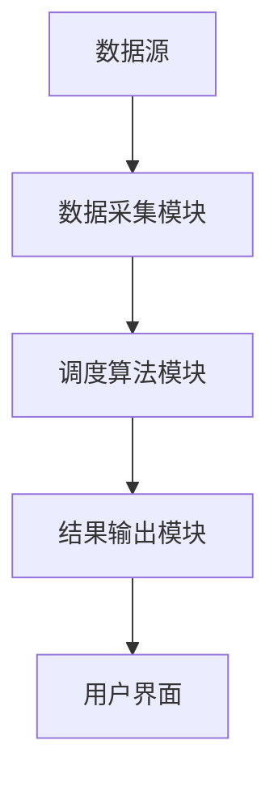

                 

# AI Agent在智能航空调度系统中的角色

> 关键词：AI Agent，智能航空调度系统，强化学习，多智能体协作，调度算法

> 摘要：随着航空业的快速发展，传统的航空调度系统面临着越来越大的挑战。为了提高调度效率和准确性，AI Agent（人工智能代理）被引入智能航空调度系统中，成为解决复杂调度问题的核心技术。本文将详细介绍AI Agent在航空调度中的角色，探讨其核心原理、应用场景、系统架构设计以及实际案例分析。

---

## 第1章: AI Agent与智能航空调度系统概述

### 1.1 AI Agent的基本概念

#### 1.1.1 AI Agent的定义与特点
AI Agent（人工智能代理）是一种能够感知环境、自主决策并采取行动的智能实体。与传统的软件程序不同，AI Agent具有以下特点：
- **自主性**：能够在没有外部干预的情况下独立运行。
- **反应性**：能够实时感知环境并做出反应。
- **主动性**：主动采取行动以实现目标。
- **学习能力**：通过数据和经验不断优化自身的决策能力。

#### 1.1.2 AI Agent的核心要素与功能
AI Agent的核心要素包括：
- **感知模块**：通过传感器或数据输入获取环境信息。
- **推理模块**：对感知到的信息进行分析和推理。
- **决策模块**：基于推理结果做出决策。
- **执行模块**：将决策转化为具体行动。

AI Agent的主要功能包括：
- 数据采集与处理
- 状态感知与分析
- 决策优化与执行
- 学习与自适应

#### 1.1.3 AI Agent与传统调度系统的区别
传统的航空调度系统依赖于人工操作和固定的规则，效率较低且难以应对复杂的动态变化。而AI Agent能够通过自主学习和实时决策，显著提高调度系统的智能化水平和应对复杂情况的能力。

### 1.2 智能航空调度系统的背景与需求

#### 1.2.1 航空调度系统的传统模式
传统的航空调度系统主要依赖人工调度员根据历史数据和经验进行调度。这种方式效率较低，容易受到人为因素的影响，且难以应对突发情况。

#### 1.2.2 智能化调度的需求驱动
随着航空运输量的不断增加，传统调度方式已无法满足高效、准确的需求。智能化调度系统能够实时处理海量数据，快速做出最优决策，成为现代航空业的迫切需求。

#### 1.2.3 AI Agent在航空调度中的角色定位
在智能航空调度系统中，AI Agent扮演着核心角色，负责数据采集、状态分析、决策优化和执行控制等关键任务。

### 1.3 本章小结
本章介绍了AI Agent的基本概念和功能，并分析了智能航空调度系统的背景与需求。AI Agent通过其自主性和智能性，为航空调度系统带来了新的可能性。

---

## 第2章: AI Agent的核心原理与模型

### 2.1 AI Agent的决策机制

#### 2.1.1 基于强化学习的决策模型
强化学习是一种通过试错机制来优化决策的算法。AI Agent通过与环境的交互，不断调整策略以最大化奖励函数。

#### 2.1.2 基于监督学习的分类模型
监督学习通过大量标注数据训练AI Agent，使其能够对新的输入做出分类或回归预测。

#### 2.1.3 多智能体协作机制
在复杂的航空调度场景中，通常需要多个AI Agent协作完成任务。通过分布式决策和通信，多个Agent可以共同优化整体调度效果。

### 2.2 AI Agent的感知与推理能力

#### 2.2.1 感知模型（如CNN、RNN）
卷积神经网络（CNN）和循环神经网络（RNN）是常用的感知模型，能够从图像或序列数据中提取特征。

#### 2.2.2 推理算法（如逻辑推理、概率推理）
逻辑推理基于规则系统进行推导，而概率推理则利用概率模型进行不确定性分析。

#### 2.2.3 知识图谱的应用
知识图谱通过结构化数据表示，帮助AI Agent更好地理解上下文和关联关系。

### 2.3 AI Agent的规划与执行

#### 2.3.1 状态空间与动作空间的建模
状态空间描述了系统可能的状态，动作空间定义了AI Agent可以执行的动作。

#### 2.3.2 行动规划算法（如A*、Dijkstra）
A*算法和Dijkstra算法是常用的路径规划算法，能够帮助AI Agent找到最优行动路径。

#### 2.3.3 动态环境下的实时调整
AI Agent需要根据实时反馈不断调整计划，以应对环境的变化。

### 2.4 本章小结
本章详细介绍了AI Agent的核心原理，包括决策机制、感知与推理能力以及规划与执行策略。

---

## 第3章: AI Agent在航班调度中的应用

### 3.1 航班调度的基本问题与挑战

#### 3.1.1 航班调度的复杂性分析
航班调度需要考虑的因素包括飞机数量、机场容量、天气条件、乘客需求等。

#### 3.1.2 资源分配的优化目标
优化目标通常包括最小化延误率、最大化资源利用率、降低运营成本等。

#### 3.1.3 动态环境下的调度调整
由于环境的动态变化，AI Agent需要实时调整调度计划。

### 3.2 基于AI Agent的航班调度模型

#### 3.2.1 模型输入与输出的定义
输入包括航班信息、机场容量、天气预报等，输出包括调度计划、资源分配方案等。

#### 3.2.2 调度算法的设计与实现
调度算法需要结合强化学习和多智能体协作，优化调度效果。

#### 3.2.3 实验结果与性能分析
通过实验验证AI Agent在航班调度中的性能，包括调度效率、准确性等。

### 3.3 实际案例分析

#### 3.3.1 某机场的航班调度优化案例
介绍一个实际案例，说明AI Agent在航班调度中的具体应用。

#### 3.3.2 案例中的AI Agent实现细节
详细描述AI Agent的实现过程，包括算法选择、模型设计等。

#### 3.3.3 案例的总结与经验分享
总结案例的成功经验，并提出改进建议。

### 3.4 本章小结
本章通过实际案例分析，展示了AI Agent在航班调度中的应用价值。

---

## 第4章: 智能航空调度系统的架构设计

### 4.1 系统组成与功能模块划分

#### 4.1.1 数据采集模块
负责采集航班信息、天气数据、机场状态等。

#### 4.1.2 调度算法模块
实现AI Agent的核心算法，包括决策、推理和规划。

#### 4.1.3 用户交互模块
提供用户界面，方便用户查看和管理调度计划。

### 4.2 系统架构的Mermaid图

### 4.3 系统架构设计

#### 4.3.1 系统功能设计
通过领域模型类图展示系统功能模块之间的关系。

#### 4.3.2 系统架构设计
通过架构图展示系统的整体结构和模块划分。

#### 4.3.3 系统接口设计
描述系统各模块之间的接口及其功能。

#### 4.3.4 系统交互设计
通过序列图展示系统各模块之间的交互过程。

### 4.4 本章小结
本章详细介绍了智能航空调度系统的架构设计，包括功能模块划分、系统架构图和接口设计。

---

## 第5章: 项目实战与优化

### 5.1 环境安装与配置

#### 5.1.1 环境搭建
安装必要的软件和库，例如Python、TensorFlow、Keras等。

#### 5.1.2 数据准备
收集和整理航空调度相关的数据，例如航班信息、天气数据等。

### 5.2 核心算法实现

#### 5.2.1 强化学习算法实现
实现基于强化学习的调度算法，例如Q-learning或Deep Q-Network。

#### 5.2.2 多智能体协作实现
实现多个AI Agent之间的协作，例如通过通信模块共享信息。

### 5.3 实验与结果分析

#### 5.3.1 实验设计
设计实验来验证算法的有效性，例如对比传统调度方法和AI Agent调度方法的性能。

#### 5.3.2 实验结果
展示实验结果，包括调度效率、准确性等指标。

### 5.4 优化与改进

#### 5.4.1 算法优化
通过调整超参数或改进算法结构来提高调度效果。

#### 5.4.2 系统优化
优化系统架构，提高系统的运行效率和稳定性。

### 5.5 本章小结
本章通过实际项目实战，展示了AI Agent在航空调度中的应用，并通过实验验证了其有效性。

---

## 第6章: 最佳实践与未来展望

### 6.1 最佳实践

#### 6.1.1 数据质量的重要性
数据质量对AI Agent的性能影响重大，需要确保数据的准确性和完整性。

#### 6.1.2 算法选择的策略
根据具体问题选择合适的算法，例如强化学习适合动态调度问题。

#### 6.1.3 系统设计的注意事项
系统设计需要考虑可扩展性、可维护性和安全性。

### 6.2 未来展望

#### 6.2.1 技术发展趋势
AI Agent在航空调度中的应用将更加智能化和自动化。

#### 6.2.2 新的应用场景
AI Agent可能扩展到更多的领域，例如无人机调度、交通管理等。

### 6.3 本章小结
本章总结了AI Agent在航空调度中的最佳实践，并展望了未来的发展方向。

---

## 作者：AI天才研究院/AI Genius Institute & 禅与计算机程序设计艺术 /Zen And The Art of Computer Programming

---

以上是文章的完整目录和内容概要，涵盖了从基础概念到实际应用的各个方面。接下来，我会根据这个大纲逐步撰写完整的文章内容。

