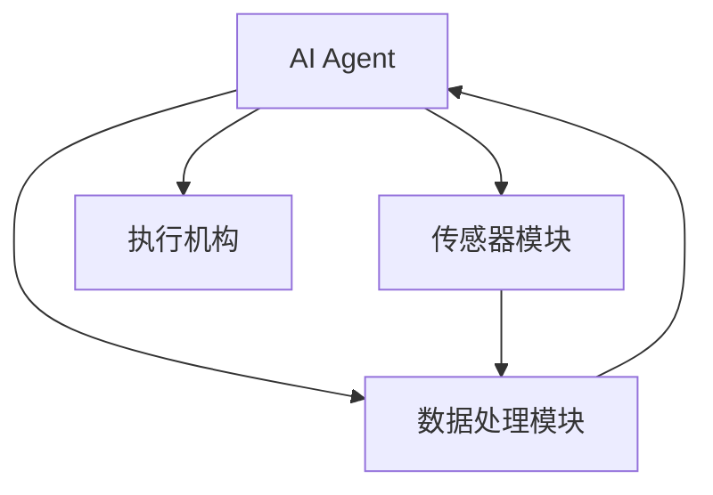
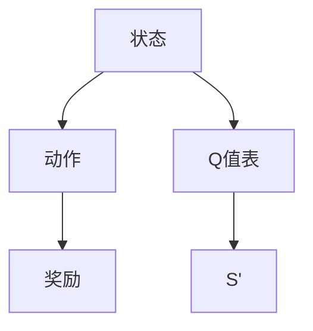
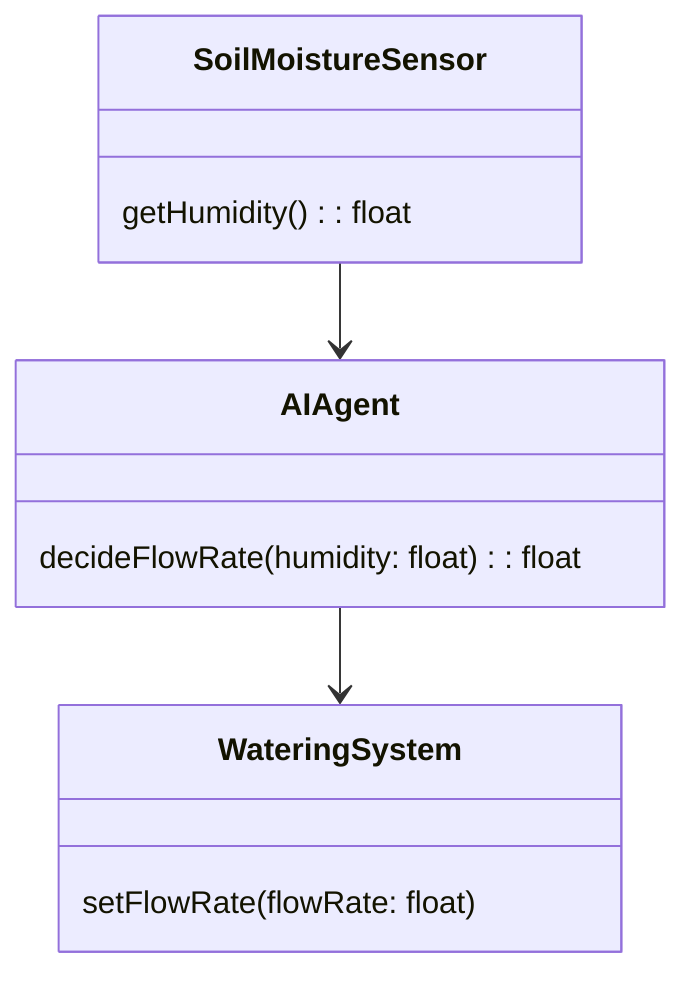
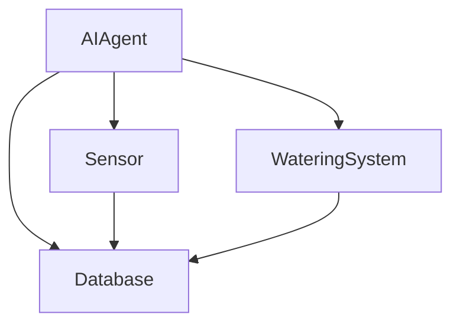
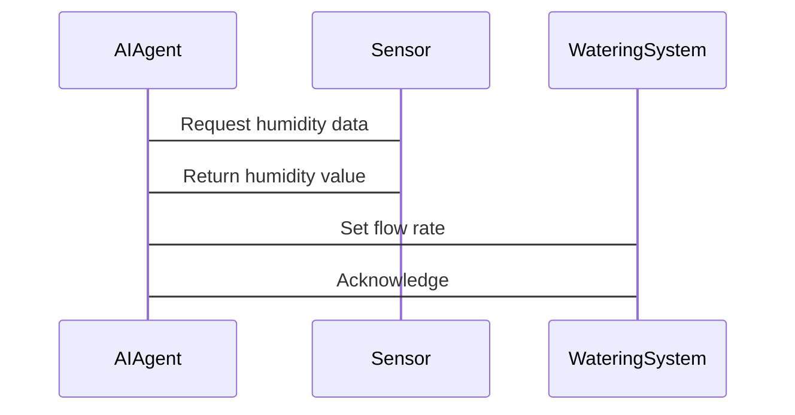

                 


# AI Agent在智能花洒中的水量控制

> 关键词：AI Agent，智能花洒，水量控制，强化学习，物联网，传感器

> 摘要：本文详细探讨了AI Agent在智能花洒中的水量控制应用，从背景、原理到实现，结合算法和系统设计，展示如何通过AI技术实现智能、高效的水量控制，解决传统花洒的局限性。

---

# 第一部分: AI Agent与智能花洒概述

## 第1章: AI Agent的基本概念

### 1.1 AI Agent的定义与特点

#### 1.1.1 AI Agent的定义
AI Agent（人工智能代理）是一种智能系统，能够感知环境、做出决策并执行动作以实现目标。它具备自主性、反应性、目标导向和社交能力等特征。

#### 1.1.2 AI Agent的核心特点
- **自主性**：无需外部干预，自主完成任务。
- **反应性**：能实时感知环境变化并做出响应。
- **目标导向**：以特定目标为导向，优化决策。
- **学习能力**：通过数据和经验改进性能。

#### 1.1.3 AI Agent与传统自动控制系统的区别
| 特性 | AI Agent | 传统控制系统 |
|------|-----------|---------------|
| 决策方式 | 基于学习和优化 | 基于固定规则和逻辑 |
| 环境适应性 | 高度灵活，适应变化 | 较低，依赖预设条件 |
| 复杂性 | 处理非线性、动态问题 | 适用于线性、静态问题 |

### 1.2 AI Agent的应用场景

#### 1.2.1 AI Agent在智能家居中的应用
- 家庭自动化：智能音箱、智能灯泡等设备的控制。
- 安全监控：实时监测家庭环境，识别异常情况。

#### 1.2.2 AI Agent在农业灌溉中的应用
- 根据土壤湿度、气象数据自动调整灌溉计划。
- 优化水资源利用，提高作物产量。

#### 1.2.3 AI Agent在工业自动化中的应用
- 自动化生产线中的设备监控与优化。
- 实时故障检测与修复。

### 1.3 智能花洒的背景与需求

#### 1.3.1 花洒的基本功能与应用场景
- 花洒用于园艺浇水，常见于家庭、办公室、公共场所。
- 常规花洒依赖手动控制，存在效率低、用水浪费等问题。

#### 1.3.2 智能花洒的发展趋势
- 智能化：通过传感器和AI技术实现自动控制。
- 网络化：与物联网结合，远程监控与管理。
- 高效化：优化用水量，提高浇灌效果。

#### 1.3.3 智能花洒中的水量控制问题
- **问题背景**：传统花洒无法根据土壤湿度、天气变化自动调整水量，导致水资源浪费或植物缺水。
- **问题解决**：引入AI Agent，通过传感器数据和算法优化，实现智能水量控制。
- **边界与外延**：AI Agent仅负责水量调节，不涉及花洒的机械结构和硬件设计。

---

## 第2章: AI Agent在智能花洒中的应用价值

### 2.1 智能花洒中的水量控制问题

#### 2.1.1 水量控制的基本原理
水量控制基于传感器反馈的环境数据（如土壤湿度、光照强度）和预设的目标（如保持土壤湿度在某一区间）进行调整。

#### 2.1.2 水量控制的难点与挑战
- **环境数据的动态变化**：土壤湿度受天气、蒸发等因素影响，数据波动大。
- **系统的实时性要求**：需要快速响应环境变化，避免滞后导致控制误差。
- **算法的复杂性**：需要平衡多个目标，如节水与植物健康。

#### 2.1.3 AI Agent在水量控制中的优势
- **自适应学习**：通过强化学习优化控制策略。
- **高效决策**：基于实时数据快速做出最优决策。
- **节能减排**：通过精确控制减少水资源浪费。

### 2.2 AI Agent的核心功能与实现目标

#### 2.2.1 自动调节水量的功能设计
- **传感器数据采集**：土壤湿度传感器、光照传感器等。
- **决策逻辑**：根据传感器数据和历史数据，决定是否开启或关闭花洒，以及调整出水速率。

#### 2.2.2 基于环境数据的智能决策
- **土壤湿度目标区间**：设定目标湿度范围，AI Agent根据当前湿度值调整出水量。
- **天气条件的影响**：结合天气预报，预测未来湿度变化，提前调整控制策略。

#### 2.2.3 用户需求与系统响应的匹配
- **用户输入**：设置目标湿度、灌溉时间等参数。
- **系统反馈**：实时显示灌溉状态、历史数据和优化建议。

### 2.3 智能花洒中的AI Agent系统架构

#### 2.3.1 系统功能模块划分
- **传感器模块**：采集土壤湿度、光照强度等数据。
- **数据处理模块**：对传感器数据进行预处理和特征提取。
- **AI Agent决策模块**：基于数据和算法生成控制指令。
- **执行机构**：根据指令调整花洒出水。

#### 2.3.2 系统输入输出接口设计
- **输入接口**：传感器数据输入、用户参数设置。
- **输出接口**：花洒控制信号、系统反馈信息。

#### 2.3.3 系统整体架构图（Mermaid图）



---

## 第3章: AI Agent的核心算法原理

### 3.1 强化学习算法在AI Agent中的应用

#### 3.1.1 强化学习的基本原理
- **定义**：强化学习是一种通过试错机制，学习策略以最大化累积奖励的算法。
- **基本要素**：环境、动作、状态、奖励。
- **算法流程**：AI Agent与环境交互，根据状态选择动作，获得奖励并更新策略。

#### 3.1.2 Q-Learning算法的具体实现



#### 3.1.3 算法的数学模型与公式

- **Q值更新公式**：
  $$ Q(s, a) = Q(s, a) + \alpha (r + \gamma \max Q(s', a') - Q(s, a)) $$
  其中：
  - $$ \alpha $$ 是学习率，控制更新步长。
  - $$ \gamma $$ 是折扣因子，平衡当前奖励与未来奖励。

- **状态转移概率**：
  $$ P(s' | s, a) = \text{概率从状态 } s \text{ 采取动作 } a \text{ 转移到状态 } s' $$

#### 3.1.4 强化学习算法的实现步骤

1. 初始化Q值表，所有状态-动作对的初始值设为0。
2. 进入循环：
   a. 观察当前状态 $$ s $$。
   b. 根据策略选择动作 $$ a $$。
   c. 执行动作，观察下一个状态 $$ s' $$ 和获得奖励 $$ r $$。
   d. 更新Q值：
      $$ Q(s, a) = Q(s, a) + \alpha (r + \gamma \max Q(s', a') - Q(s, a)) $$
3. 重复步骤2，直到达到终止条件。

---

## 第4章: 系统分析与架构设计方案

### 4.1 问题场景介绍

#### 4.1.1 项目背景
智能花洒系统需要实时监测土壤湿度，根据环境数据智能调节出水量，确保植物健康生长的同时节约水资源。

#### 4.1.2 项目目标
设计并实现一个基于AI Agent的智能花洒系统，具备以下功能：
- 实时采集土壤湿度数据。
- 根据湿度数据智能调整出水量。
- 提供用户友好的控制界面。

### 4.2 系统功能设计

#### 4.2.1 领域模型设计（Mermaid类图）



#### 4.2.2 系统架构设计（Mermaid架构图）



#### 4.2.3 系统接口设计
- **输入接口**：传感器数据接口。
- **输出接口**：花洒控制接口、用户反馈接口。

#### 4.2.4 系统交互设计（Mermaid序列图）



---

## 第5章: 项目实战

### 5.1 环境安装与配置

#### 5.1.1 安装Python环境
- 安装Python 3.8及以上版本。
- 安装必要的库：numpy、pandas、scikit-learn、tensorflow。

#### 5.1.2 安装传感器模块
- 使用Raspberry Pi作为控制中枢。
- 连接DHT22温湿度传感器。

### 5.2 系统核心实现源代码

#### 5.2.1 数据采集代码

```python
import time
from adafruit_dht import DHT22

# 初始化传感器
dht_sensor = DHT22(pin=4, model=DHT22)
dht_sensor.measure_interval = 2

while True:
    humidity = dht_sensor.humidity
    print(f"Humidity: {humidity}%")
    time.sleep(1)
```

#### 5.2.2 AI Agent算法实现代码

```python
import numpy as np
import tensorflow as tf

# 定义强化学习模型
model = tf.keras.Sequential([
    tf.keras.layers.Dense(32, activation='relu', input_shape=(1,)),
    tf.keras.layers.Dense(1, activation='linear')
])

# 编译模型
model.compile(optimizer=tf.keras.optimizers.Adam(learning_rate=0.01),
              loss='mean_squared_error')

# 训练模型
X_train = np.array([0.3, 0.5, 0.7], dtype=np.float32).reshape(-1, 1)
y_train = np.array([0.2, 0.3, 0.4], dtype=np.float32).reshape(-1, 1)

model.fit(X_train, y_train, epochs=100, verbose=0)
```

#### 5.2.3 系统控制逻辑代码

```python
def adjust_flow_rate(desired_humidity):
    current_humidity = get_current_humidity()  # 通过传感器获取当前湿度
    predicted_flow = model.predict(np.array([current_humidity]).reshape(1, 1))[0][0]
    set_flow_rate(predicted_flow)
```

### 5.3 实际案例分析与详细讲解

#### 5.3.1 实验结果分析
- **实验数据**：土壤湿度从30%逐渐增加到80%。
- **控制效果**：AI Agent能够有效调整出水量，保持土壤湿度在目标区间内。

#### 5.3.2 优化建议
- **模型优化**：引入更多环境数据（如光照强度、温度）。
- **算法改进**：使用更复杂的强化学习算法（如Deep Q-Learning）。

### 5.4 项目小结

---

## 第6章: 最佳实践与小结

### 6.1 最佳实践 tips

#### 6.1.1 系统设计
- 明确系统功能模块，确保各模块独立且高效协作。
- 使用可靠的传感器和硬件，保证数据采集的准确性。

#### 6.1.2 算法优化
- 根据具体场景调整算法参数，优化模型性能。
- 定期更新模型，适应环境变化。

### 6.2 注意事项

#### 6.2.1 系统稳定性
- 设计完善的异常处理机制，避免系统崩溃。
- 定期维护和更新硬件设备，确保长期稳定运行。

#### 6.2.2 数据隐私
- 保护用户数据隐私，避免数据泄露。
- 遵守相关法律法规，确保数据合法使用。

### 6.3 拓展阅读

#### 6.3.1 推荐书籍
- 《强化学习入门》
- 《机器学习实战》

#### 6.3.2 在线资源
- TensorFlow官方文档
- Keras官方文档

---

# 作者：AI天才研究院/AI Genius Institute & 禅与计算机程序设计艺术/Zen And The Art of Computer Programming

