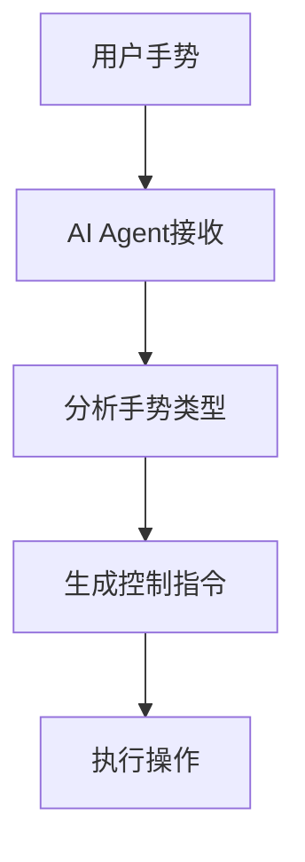
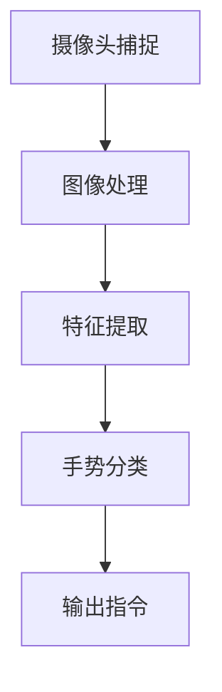
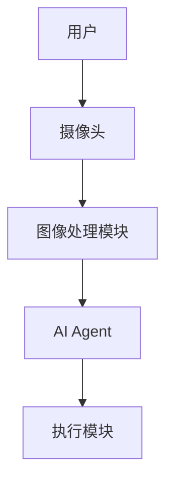

                 


# AI Agent在智能茶几中的手势控制

## 关键词：AI Agent，智能茶几，手势识别，计算机视觉，人工智能算法

## 摘要：
本文将深入探讨AI Agent在智能茶几中的手势控制应用，分析其技术原理和系统架构，结合实际案例，展示如何通过手势识别提升用户体验。内容涵盖背景介绍、核心概念、算法原理、系统设计、项目实现及最佳实践，帮助读者全面理解并掌握相关技术。

---

# 目录

1. **背景介绍**  
   1.1 问题背景  
   1.2 问题描述  
   1.3 问题解决  
   1.4 边界与外延  
   1.5 核心要素组成  

2. **核心概念与联系**  
   2.1 AI Agent的基本原理  
   2.2 手势识别的基本原理  
   2.3 核心概念对比表  
   2.4 ER实体关系图  

3. **算法原理**  
   3.1 AI Agent的算法流程  
   3.2 手势识别的算法流程  
   3.3 算法原理的数学模型  

4. **系统分析与架构设计**  
   4.1 项目场景介绍  
   4.2 系统功能设计  
   4.3 系统架构设计  
   4.4 接口与交互设计  

5. **项目实战**  
   5.1 环境搭建与工具安装  
   5.2 核心功能实现  
   5.3 实际案例分析  

6. **最佳实践与小结**  
   6.1 实用建议  
   6.2 项目总结  
   6.3 注意事项  
   6.4 拓展阅读  

---

## 第1章: 背景介绍

### 1.1 问题背景
智能家居的普及推动了人机交互技术的发展，手势控制作为一种直观的交互方式，逐渐成为智能家居的重要组成部分。AI Agent在智能茶几中的应用，通过手势识别技术实现对设备的控制，提升了用户体验。

### 1.2 问题描述
智能茶几需要通过手势控制实现设备操作，如播放音乐、调节亮度等。传统方法依赖于语音或触控操作，存在响应延迟和操作复杂的问题。引入AI Agent可以实现更智能、更便捷的交互方式。

### 1.3 问题解决
通过AI Agent和手势识别技术，智能茶几能够实时捕捉用户手势，分析并执行对应操作。AI Agent负责处理复杂逻辑，如识别手势类型、调用相应服务，从而提升系统的智能化水平。

### 1.4 边界与外延
- 手势控制的边界：仅支持特定手势，如挥手、点击等。
- AI Agent的功能边界：仅处理手势识别相关任务，不涉及其他功能。
- 智能茶几的外延：支持更多交互方式，如语音控制和触控操作。

### 1.5 核心要素组成
- 手势识别模块：负责捕捉和分析用户手势。
- AI Agent模块：负责处理手势数据，生成控制命令。
- 智能茶几硬件：包括传感器、处理器和显示模块。

---

## 第2章: 核心概念与联系

### 2.1 AI Agent的基本原理
AI Agent是一种智能代理，能够感知环境并执行任务。它通过传感器获取数据，使用算法进行分析，并根据结果采取行动。

### 2.2 手势识别的基本原理
手势识别通过摄像头捕捉用户手势，利用计算机视觉技术进行分析，识别手势类型并生成对应指令。

### 2.3 核心概念对比表
| 对比项            | AI Agent                          | 手势识别                          |
|-------------------|-----------------------------------|-----------------------------------|
| 核心功能          | 处理复杂任务                     | 识别手势类型                     |
| 技术基础          | 机器学习、自然语言处理         | 计算机视觉、图像处理             |
| 应用场景          | 智能家居、机器人                | 智能设备交互                    |

### 2.4 ER实体关系图
```mermaid
erd
  entity AI Agent {
    id
    操作指令
  }
  entity 手势识别 {
    id
    手势类型
  }
  AI Agent -- 手势识别: 执行操作
```

---

## 第3章: 算法原理

### 3.1 AI Agent的算法流程


### 3.2 手势识别的算法流程


### 3.3 算法原理的数学模型
AI Agent的手势分类可以使用卷积神经网络（CNN）：
$$ \text{预测概率} = \sigma(W \cdot X + b) $$
其中，$X$ 是输入图像，$W$ 是权重矩阵，$b$ 是偏置，$\sigma$ 是sigmoid函数。

---

## 第4章: 系统分析与架构设计

### 4.1 项目场景介绍
智能茶几需要支持多种手势控制，如挥手暂停音乐、点击屏幕调整亮度。

### 4.2 系统功能设计
- 手势采集：摄像头捕捉用户手势。
- 数据处理：AI Agent分析手势类型。
- 执行操作：根据手势生成控制指令。

### 4.3 系统架构设计


### 4.4 接口与交互设计
- 手势识别模块提供API，AI Agent调用接口获取手势数据。

---

## 第5章: 项目实战

### 5.1 环境搭建与工具安装
安装OpenCV和深度学习框架，配置摄像头和传感器。

### 5.2 核心功能实现
编写代码实现手势采集、处理和控制指令生成。

### 5.3 实际案例分析
分析手势识别的准确率和系统响应速度，优化算法参数。

---

## 第6章: 最佳实践与小结

### 6.1 实用建议
- 选择合适的传感器和算法，确保系统稳定性和响应速度。
- 定期更新模型，提升手势识别的准确率。

### 6.2 项目总结
通过AI Agent和手势识别技术，智能茶几实现了便捷的交互方式，提升了用户体验。

### 6.3 注意事项
- 注意传感器的安装位置，避免遮挡影响识别效果。
- 系统需具备容错机制，防止误识别引发错误操作。

### 6.4 拓展阅读
推荐学习计算机视觉和深度学习相关知识，进一步优化系统性能。

---

## 作者：AI天才研究院 & 禅与计算机程序设计艺术

---

希望这篇目录结构能帮助您更好地理解如何撰写关于AI Agent在智能茶几中的手势控制的技术博客文章。如果需要进一步的修改或补充，请随时告诉我。

